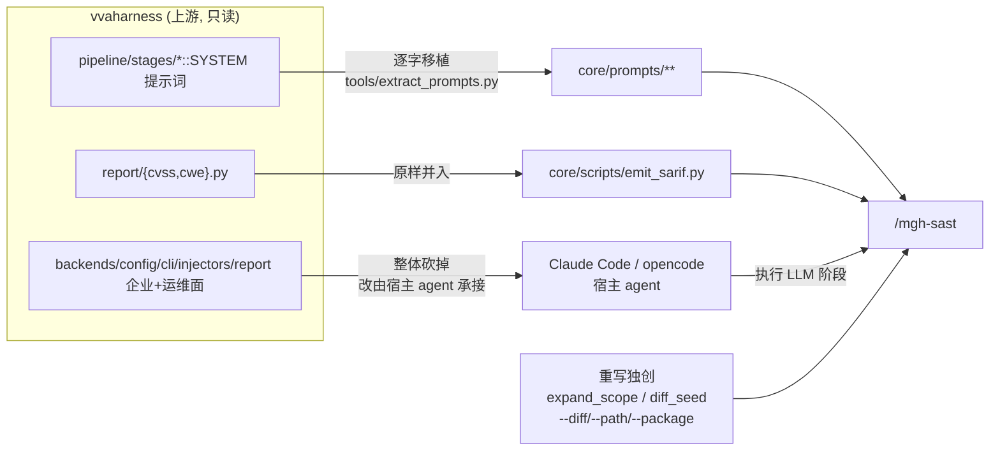

# AGENTS.md — m3g4h⊿rness 研发与运营手册

> **任何在本仓库做的事之前,先完整读本文件。** 它是 m3g4h⊿rness 的操作手册与研发铁律。
> 仓库根的 `README.md` 面向使用者;本文件面向**开发和维护者**。

## 这是什么

**m3g4h⊿rness**(读作 *megahorn-ness*;双重语义:宝可梦招式「超级角击 / Megahorn」,
隐喻渗透测试的角击;亦是 *mega-harness*)是一套面向 AI 编程 Agent(Claude Code /
opencode)的**安全工作流工具族**,所有命令共享前缀 `mgh-`。

| 命令          | 状态      | 说明                                                |
| ----------- | ------- | ------------------------------------------------- |
| `/mgh-sast` | ✅ 可用    | 9 阶段 agentic SAST。零运行时依赖地复刻 vvaharness 流水线(详见下节)。 |
| `/mgh-init` | ✅ 可用    | 发现存量安全控制 → 生成 Agent rules。隔离优先三层流水线(确定性发现 → T1 per-cluster 归纳 → T2 综合 → T3 per-category 出 rules → T4 一致性);产 `controls_inventory.json`(与 vvah `design_controls` schema 兼容)+ claude/opencode rules(二选一,结构不混)。详见 `openspec/changes/add-mgh-init/`。 |
| `/mgh-sra`  | 🚧 TODO | openspec `propose` 后补充 specs/tasks 安全设计内容。        |
| `/mgh-blst` | 🚧 TODO | 结合业务接口逻辑设计强耦合安全测试案例。                              |

> TODO 命令目前仅为**空骨架**,功能定义见仓库根 [`task.260630.md`](task.260630.md)。

## mgh-sast 与原项目 vvaharness 的关系(必读)

`/mgh-sast` 是 **vvaharness**(Visa / Project Glasswing,Apache-2.0)9 阶段 LLM SAST
流水线的**零运行时依赖重写**:

- **LLM 阶段**(s1/s2/s3/s4/s6/s8)由宿主 agent 的 subagent 执行,提示词**逐字移植**;
- **确定性阶段**(s5 prefilter / s7 dedup / s9 SARIF+CVSS+CWE)由 Python ≥3.10 标准库脚本执行;
- **不 import、不 bundle 任何 `vvaharness/` 代码**(install 时有零依赖自检)。



**逐项对应关系**(功能实现 + 提示词 + 保真度 + 未实现清单)记录在
[`docs/upstream-index.md`](docs/upstream-index.md),分文档在 `docs/upstream/`。

## 研发铁律

### R1 — 与上游的引用关系:非必要不改

- `docs/upstream-index.md` 与 `docs/upstream/*.md` 是与原项目的**同步锚点**,记录了
  「mgh-sast 条目 → vvaharness 来源 → 保真度/差异」的逐项映射。**非必要不改**。
  原项目更新需同步时,按 `docs/upstream-index.md` 末尾的「上游同步操作指引」执行。
- `core/prompts/**` 每个 `.md` 头部的溯源注释(`Source: vvaharness/...`)是有意保留的
  归属信息,**不要删**。重抽用 `tools/extract_prompts.py`,不要手改提示词正文。
- `core/docs/NOTICE`、`core/docs/prompt-provenance.md` 是 Apache-2.0 合规与保真度凭据,保留。

### R2 — 工具脚本:优先 Python 标准库

- **确定性脚本 / 工具脚本实现优先使用 Python 标准库**。当前 `core/scripts/` 与 `tools/`
  全部只用标准库(`argparse/ast/collections/datetime/json/math/pathlib/re/subprocess/sys`),
  经 AST 扫描与单测双重验证**无需 `pip install`**,内网可零联网运行。
- **需要引入/安装任何 pip 依赖时,必须先主动向维护者确认**(给出依赖名、用途、是否影响
  内网零联网分发)。未经确认不得新增 `requirements.txt` 或 import 第三方包。
- 现有「零运行时依赖」是产品特性(install 时有自检),**不得因为图方便而引入运行时依赖**。

### R3 — 文档输出规范:简练、面向 AI、索引化

**所有文档输出任务**遵守:

- **简练准确,面向 AI 阅读**。结论先行;不写废话与寒暄。
- **不保留长代码块**(最多 3–5 行内联片段)。让 AI 通过 **文件名 / 类名 / 方法名 / `文件:行号`**
  自行索引到具体实现,不要把实现贴进文档。
- 表格优先(映射、状态、清单用表格)。
- **仅对真正复杂的长逻辑用 mermaid 画图**(状态流转、多阶段流水线、调用关系等);简单逻辑
  不画。

### R4 — 改名/解耦后的路径规约

- 本仓库已从原 `visa-vulnerability-agentic-harness/vvah-sast/` **迁出为独立仓库**,
  磁盘目录名 `m3g4horness`(品牌显示名 `m3g4h⊿rness`,因 `⊿=U+22BF` 放进目录名会让
  bash/git/CI 脆弱,故磁盘用 ASCII)。
- 工具脚本(`tools/gen_*.py`)的路径常量**相对仓库根**(`releases/...`、`core/...`),
  从仓库根运行。
- `tools/extract_prompts.py` 默认 `--vvaharness = C:/DEV/visa-vulnerability-agentic-harness/vvaharness`
  (原项目位置),便于原项目更新时一键重抽。

## 目录布局

```
m3g4horness/
├── AGENTS.md                 # 本文件
├── README.md                 # 面向使用者
├── task.260630.md            # mgh-init/sra/blst 功能定义(下一阶段 proposal 输入)
├── core/                     # 平台中立的单一真相源
│   ├── prompts/              # 阶段 SYSTEM 提示词 + fragments + lenses + baselines(移植)
│   ├── scripts/              # diff_seed / expand_scope / prefilter / dedup / emit_sarif
│   ├── profiles/             # default / cli / full
│   ├── contracts/            # 阶段 I/O JSON 契约
│   └── docs/                 # prompt-provenance, NOTICE
├── releases/claude-code/     # Claude Code shell → 装入 .claude/
│   ├── commands/{mgh-sast,mgh-init,mgh-sra,mgh-blst}.md
│   ├── agents/sast-*.md
│   └── skills/sast-*/
├── releases/opencode/        # opencode shell → 装入 .opencode/
│   ├── command/{mgh-sast,mgh-init,mgh-sra,mgh-blst}.md
│   └── agent/sast-*.md
├── docs/                     # 分发指南 + upstream-index(原项目引用)
│   └── upstream/             # 逐功能分析分文档
├── tools/                    # 构建期工具(extract_prompts / gen_*),不随安装分发
└── tests/                    # 确定性阶段单测
```

## 快速命令

```bash
# 装入目标项目(Claude Code 默认 / opencode)
./install.sh --claude  .          # 或: ./install.sh --opencode .
./install.sh                       # 默认 claude,目标=当前目录

# 零依赖自检(应无输出)
grep -rnE "^[[:space:]]*(import[[:space:]]+vvaharness|from[[:space:]]+vvaharness[[:space:]]+import)" --include=*.py .

# 确定性阶段单测
py tests/test_deterministic.py

# 上游提示词重抽(原项目更新时)
py tools/extract_prompts.py --out ./core/prompts
```

## 诚实边界(写进每个对用户输出的总结)

- `/mgh-sast` 的发现是 **LLM 生成的待复核候选,不是已确认漏洞**;每次运行非确定性。
- 调用图是**文本/AST 级**,漏动态分派/反射/DI/**框架路由**(Spring `@*Mapping`/Feign/AOP/
  `@Autowired`/JPA);未解析项写进 `scope_manifest.unresolved[]` 供报告披露。
- **tree-sitter 调用链后端规划中、未接入**(当前纯文本 regex + 框架 allowlist)。
