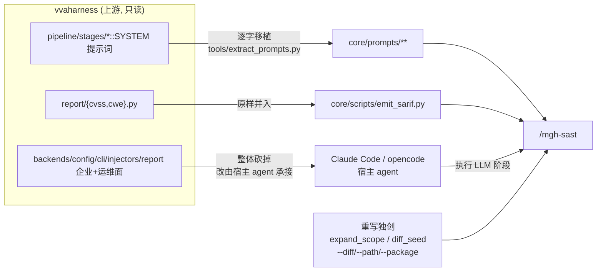

# AGENTS.md — m3g4h⊿rness 研发与运营手册

> **任何在本仓库做的事之前,先完整读本文件。** 它是 m3g4h⊿rness 的操作手册与研发铁律。
> 仓库根的 `README.md` 面向使用者;本文件面向**开发和维护者**。

## 这是什么

**m3g4h⊿rness**(读作 *megahorn-ness*;双重语义:宝可梦招式「超级角击 / Megahorn」,
隐喻渗透测试的角击;亦是 *mega-harness*)是一套面向 AI 编程 Agent(Claude Code /
opencode)的**安全工作流工具族**,所有命令共享前缀 `mgh-`。

| 命令          | 状态      | 说明                                                |
| ----------- | ------- | ------------------------------------------------- |
| `/mgh-sast` | ✅ 可用    | 9 阶段 agentic SAST。零运行时依赖地复刻 vvaharness 流水线(详见下节)。 |
| `/mgh-init` | ✅ 可用    | 发现存量安全控制 → 生成 Agent rules。隔离优先三层流水线(确定性发现 → T1 per-cluster 归纳 → T2 综合 → T3 per-category 出 rules → T4 一致性);产 `controls_inventory.json`(与 vvah `design_controls` schema 兼容)+ claude/opencode rules(二选一,结构不混)。详见 `openspec/changes/add-mgh-init/`。 |
| `/mgh-sra`  | 🚧 TODO | openspec `propose` 后补充 specs/tasks 安全设计内容。        |
| `/mgh-blst` | 🚧 TODO | 结合业务接口逻辑设计强耦合安全测试案例。                              |

> TODO 命令目前仅为**空骨架**,功能定义见仓库根 [`task.260630.md`](task.260630.md)。

## mgh-sast 与原项目 vvaharness 的关系(必读)

`/mgh-sast` 是 **vvaharness**(Visa / Project Glasswing,Apache-2.0)9 阶段 LLM SAST
流水线的**零运行时依赖重写**:

- **LLM 阶段**(s1/s2/s3/s4/s6/s8)由宿主 agent 的 subagent 执行,提示词**逐字移植**;
- **确定性阶段**(s5 prefilter / s7 dedup / s9 SARIF+CVSS+CWE)由 Python ≥3.10 标准库脚本执行;
- **不 import、不 bundle 任何 `vvaharness/` 代码**(install 时有零依赖自检)。



**逐项对应关系**(功能实现 + 提示词 + 保真度 + 未实现清单)记录在
[`docs/upstream-index.md`](docs/upstream-index.md),分文档在 `docs/upstream/`。

## 研发铁律

### R1 — 与上游的引用关系:非必要不改

- `docs/upstream-index.md` 与 `docs/upstream/*.md` 是与原项目的**同步锚点**,记录了
  「mgh-sast 条目 → vvaharness 来源 → 保真度/差异」的逐项映射。**非必要不改**。
  原项目更新需同步时,按 `docs/upstream-index.md` 末尾的「上游同步操作指引」执行。
- `core/prompts/**` 每个 `.md` 头部的溯源注释(`Source: vvaharness/...`)是有意保留的
  归属信息,**不要删**。重抽用 `tools/extract_prompts.py`,不要手改提示词正文。
- `core/docs/NOTICE`、`core/docs/prompt-provenance.md` 是 Apache-2.0 合规与保真度凭据,保留。

### R2 — 工具脚本:优先 Python 标准库

- **确定性脚本 / 工具脚本实现优先使用 Python 标准库**。当前 `core/scripts/` 与 `tools/`
  全部只用标准库(`argparse/ast/collections/datetime/json/math/pathlib/re/subprocess/sys`),
  经 AST 扫描与单测双重验证**无需 `pip install`**,内网可零联网运行。
- **需要引入/安装任何 pip 依赖时,必须先主动向维护者确认**(给出依赖名、用途、是否影响
  内网零联网分发)。未经确认不得新增 `requirements.txt` 或 import 第三方包。
- 现有「零运行时依赖」是产品特性(install 时有自检),**不得因为图方便而引入运行时依赖**。

### R3 — 文档输出规范:简练、面向 AI、索引化

**所有文档输出任务**遵守:

- **简练准确,面向 AI 阅读**。结论先行;不写废话与寒暄。
- **不保留长代码块**(最多 3–5 行内联片段)。让 AI 通过 **文件名 / 类名 / 方法名 / `文件:行号`**
  自行索引到具体实现,不要把实现贴进文档。
- 表格优先(映射、状态、清单用表格)。
- **仅对真正复杂的长逻辑用 mermaid 画图**(状态流转、多阶段流水线、调用关系等);简单逻辑
  不画。

### R4 — 改名/解耦后的路径规约

- 本仓库已从原 `visa-vulnerability-agentic-harness/vvah-sast/` **迁出为独立仓库**,
  磁盘目录名 `m3g4horness`(品牌显示名 `m3g4h⊿rness`,因 `⊿=U+22BF` 放进目录名会让
  bash/git/CI 脆弱,故磁盘用 ASCII)。
- 工具脚本(`tools/gen_*.py`)的路径常量**相对仓库根**(`releases/...`、`core/...`),
  从仓库根运行。
- `tools/extract_prompts.py` 默认 `--vvaharness = C:/DEV/visa-vulnerability-agentic-harness/vvaharness`
  (原项目位置),便于原项目更新时一键重抽。

### R5 — Agent 工具命令稳定性(作者期铁律)

> 管辖**新增/修改任何对外分发的 `mgh-*.md` 命令壳 + 其随 install 落地的 `core/scripts/*.py`**。
> mgh-* 性质 ≈ openspec `opsx:*`(装进别的项目当命令用),稳定性是产品特性,非可选优化。

- **R5.1 契约单一真相源 + 机械化 lint**:脚本 `argparse`/`Usage:` docstring 是 CLI **唯一契约**,
  命令壳调用示例**逐字镜像**,不得出现脚本未声明的 flag(agent 经 `--help` 学接口,故 `--help`
  即契约面,不读源码)。配 `tools/check_contracts.py`:提取双壳 MD 里所有 `*.py --flag`,对每个
  flag 跑 `py <script>.py --help` 断言存在。
- **R5.2 编排器即宿主 agent + 黑盒纪律(本仓库立规,非上游同步项)**:**编排器 = 宿主 agent 本身**
  (按命令 `.md` 用自身工具跑流水线,非写代码)——命令壳顶部须显式声明,并禁 agent 把它物化成脚本。
  三条硬边界(`NEVER`,命中**真实失败形状**,承 `harden-mgh-init-orchestration-discipline` FD1——
  真机首跑的失败全是一次性微脚本内省,非大编排器):
  - (a) **大编排器**:`Write` 任何 `.py` 编排器/包装器(实测反例:`mgh_init.py`);
  - (b) **一次性微脚本内省**:`Write` `py -c` 产物 / `_prep_*.py` / `_aggregate_*.py` / `<run>_helper.py`,
    以及经 `Bash: py -c|python -c` 内省/重派生产物(`import json`/`open(`/`load(` 读 `.mgh-init/**`);
  - (c) **读源码**:`Read` 叶子脚本 `.py` 源码进编排器上下文(报错看 stderr,不读源码)。
  合法出口(implementation-intention,正引导优先见 R5.5①):工作清单 → `list_clusters`/
  `list_scout_batches`/`list_rule_jobs`;瞄结构 → `describe_artifact.py`;派生量 → 产出者 stdout 字段。
  确定性脚本经 Bash 执行;细节规则下沉 `core/prompts/`,仅 subagent 按需读。理由〔省上下文 + 防 agent
  误改 + 平台无关〕须随规保留,勿软化。(`implement` 类 trigger 词易诱导 codegen,用「执行/跑」)。
- **R5.3 确定性脚本稳定性契约**:
  - (a) **runtime 自包含**——零运行时依赖(承 R2)、`sys.path.insert(0, dir-of-__file__)` 自定位
    兄弟导入、读源/文本一律 `encoding="utf-8"`、任意 cwd 可直接 `py`、禁需 `python -c exec` 绕行。
  - (b) **CLI I/O 契约**——`stdout`=结构化 JSON、`stderr`=诊断/进度**严格分流**;退出码 `0/1/2`
    (成功/通用错/误用);幂等(create-if-not-exists);禁交互式 TTY(只吃 flag/env/stdin);
    闭集参数拒歧义输入 + 可操作报错;破坏性操作带 `--dry-run`;大输出默认摘要 + `--offset` 分页。
    **扇出即脚本枚举**:所有 fan-out(tier)MUST 经 `list_*`/`describe_*` 脚本产 pending 清单
    (T1→`list_clusters`、scout→`list_scout_batches`、T3→`list_rule_jobs`),编排器对清单迭代,
    NEVER 直接挖 JSON / `py -c` 内省。
- **R5.4 大仓可观测 + 无静默截断**:单遍 I/O、每候选 O(1);进度走 `stderr`、产物 JSON 走 `stdout`
  (契约不变);扫描前廉价计数 + 命中阈值前置建议 `--scope`+`--merge`(取代「跑满再超时」);
  截断须显式告警并继续。
- **R5.5 指令性 MD 措辞**(给 subagent 的 SYSTEM 提示词 / 命令壳纪律段):
  - ① **shaping 失败用 recipe,不用 prohibition**——`Don't X` 类禁令改写为「该做什么」;**硬边界**
    (跨 format 产物不混、零依赖)才用 `NEVER`。
  - ② **禁 nuance/exemption 子句**(`Don't X unless…`、「此限制不适用代码块」)。
  - ③ 显式废对冲词 + RFC-2119 normative 动词(`MUST/SHALL` 取代 `should/may`,机器可检)。
  - ④ 验收用可证伪清单 + schema 示例(非散文);命令行示例逐字可执行;无长代码块(承 R3)。
- ⑤ **禁令清楚则不举例**:抽象规则醒目且无歧义时,枚举反例是冗余(承 R3);只在 agent 可能猜不到边界时才给最小反例。
- **R5.6 命令壳薄壳 + token 硬预算**:壳只放 编排流 + stage→组件表 + 确切确定性调用 + 边界披露;
  正文 ≤500 行 / ≤5000 tokens(Codex 硬上限 8KB;`description:` ≤1536 chars);详情移
  `core/prompts/`,只深一级;按域分文件;禁 `@` 强制内联(改用 `REQUIRED SUB-SKILL: Use X` 标记);
  `--help`/无参 → 打印 flag 表并 STOP(花 token 前先校验)。
- **R5.7 评估驱动 + TDD-for-docs**:改 `core/prompts/**` 前先建 baseline(无该提示词跑 ≥5 次 capture
  失败模式,variance 是指标)→ blind A/B 对比 pass rate/tokens → 新命令由 A 实例写、全新 B 实例
  大仓首跑、观察漂移 → 新失败模式回灌本节。**交付物(非倡议)**:能用 hook 做确定性闭环的,不写进 MD
  靠 agent 自觉——每个 `mgh-*` 命令的 #1 违例 MUST 配 PreToolUse hook(install 时注入目标仓);hook
  缺席 = CI fail(对齐 R5.8)。当前兑现:`block-adhoc-scripts.py`(/mgh-init #1 违例=微脚本内省)。
- **R5.8 安装自检 + 回归单测**:`install.sh` 镜像后校验脚本族同目录共存 + fail-soft(自检失败只
  warn 不阻断 install,CI 必 fail);任何 `.md`/脚本改动 bump 版本号;回归测覆盖 契约等价 / 导入
  鲁棒(非脚本目录 cwd 子进程)/ 性能不退化 / 零依赖 AST 扫描 / R5.1 CLI lint。
- **R5.9 边界校验泛化(承 openspec validate-at-boundary)**:每个 stage 产物的产出者 MUST 暴露
  `--check`(或独立 validator,如 `validate_inventory.py`);编排器跑完一步、进下一步前 MUST 运行之,
  失败 fail-loud(退出码 2)回退重跑,**不带着破损产物继续**。范式源头:`assemble_rules.py --check`。
  当前覆盖:`discover_controls`/`plan_scout`/`merge_scout` `--check` + `validate_inventory.py`。
- **R5.10 分发产物纯净性**:经 `install.sh` 装入目标项目的 md(命令壳 / agent 定义 / stage
  提示词 / I/O 契约 / skills)MUST 仅含对目标 agent 有用的操作性内容,NEVER 携带只在本仓研发语境
  才有意义的悬空引用——在目标项目里它们指向不存在的手册/编号/文件,浪费 token 且误导 agent
  (目标项目常有自带 `AGENTS.md` 与无关编号)。禁引完整八类:① 研发铁律编号(`R5.x`/`R3`/`R1–R4`);
  ② 失败/发现 ID(`FDn`);③ 设计决策 ID(`Dn`,含 `D9 = D12` 形态);④ openspec 变更夹名
  (`(add|fix|harden|improve|purify)-mgh-(init|sast|sra|blst)-…`);⑤ 内部上游文档(`glasswing_docs/`);
  ⑥ 仓根开发态文件指针(`task.*.md`,install 不分发);⑦ dev-meta 措辞(`承/兑现 R5.x`、`范式锚点`、
  指本研发仓时的「本仓」);⑧ 上游溯源行话作谱系归因(`vvah`/`design_controls` 当归因词,非操作性
  schema 字段)。按「删或嫁接」处理(design D8):目标不需要 → 删标记/引用句;目标必需 → 把最简 1–2 行
  内容内联到恰当位置再删指针(省 token 优先,NEVER 整段搬运)。**保留**操作语义与输出产物路径
  (`--check`/退出码 2/`<target>/AGENTS.md`/runtime 脚本调用 `.claude/mgh-core/scripts/*.py`/阶段标签
  `T1`/`s1`..`s9`)。**受保护归因**(`core/prompts/**` 头的 `Source: vvaharness/...`、skills Apache 归因、
  `core/docs/prompt-provenance.md`、操作性 `design_controls`、`CVE-*`)不在禁列,NEVER 当 dev-only 溯源剥除。
  理由〔省 token + 防目标项目误读 + 平台无关〕须随规保留。前 7 类 + dev-meta(`承/兑现`/`范式锚点`)由
  `tools/check_distributed_purity.py` 确定性强制(承 R5.7);第 8 类与「本仓」与受保护归因同形、机器难辨,
  由提示词护栏 + 人工清理覆盖(install 自检 fail-soft、CI 测 `tests/test_distributed_md_purity.py` 必 fail,承 R5.8)。

## 目录布局

```
m3g4horness/
├── AGENTS.md                 # 本文件
├── README.md                 # 面向使用者
├── task.260630.md            # mgh-init/sra/blst 功能定义(下一阶段 proposal 输入)
├── core/                     # 平台中立的单一真相源
│   ├── prompts/              # 阶段 SYSTEM 提示词 + fragments + lenses + baselines(移植)
│   ├── scripts/              # diff_seed / expand_scope / prefilter / dedup / emit_sarif
│   ├── profiles/             # default / cli / full
│   ├── contracts/            # 阶段 I/O JSON 契约
│   └── docs/                 # prompt-provenance, NOTICE
├── releases/claude-code/     # Claude Code shell → 装入 .claude/
│   ├── commands/{mgh-sast,mgh-init,mgh-sra,mgh-blst}.md
│   ├── agents/sast-*.md
│   └── skills/sast-*/
├── releases/opencode/        # opencode shell → 装入 .opencode/
│   ├── command/{mgh-sast,mgh-init,mgh-sra,mgh-blst}.md
│   └── agent/sast-*.md
├── docs/                     # 分发指南 + upstream-index(原项目引用)
│   └── upstream/             # 逐功能分析分文档
├── tools/                    # 构建期工具(extract_prompts / gen_*),不随安装分发
└── tests/                    # 确定性阶段单测
```

## 快速命令

```bash
# 装入目标项目(Claude Code 默认 / opencode)
./install.sh --claude  .          # 或: ./install.sh --opencode .
./install.sh                       # 默认 claude,目标=当前目录

# 零依赖自检(应无输出)
grep -rnE "^[[:space:]]*(import[[:space:]]+vvaharness|from[[:space:]]+vvaharness[[:space:]]+import)" --include=*.py .

# 确定性阶段单测
py tests/test_deterministic.py

# 上游提示词重抽(原项目更新时)
py tools/extract_prompts.py --out ./core/prompts
```

## 诚实边界(写进每个对用户输出的总结)

- `/mgh-sast` 的发现是 **LLM 生成的待复核候选,不是已确认漏洞**;每次运行非确定性。
- 调用图是**文本/AST 级**,漏动态分派/反射/DI/**框架路由**(Spring `@*Mapping`/Feign/AOP/
  `@Autowired`/JPA);未解析项写进 `scope_manifest.unresolved[]` 供报告披露。
- **tree-sitter 调用链后端规划中、未接入**(当前纯文本 regex + 框架 allowlist)。
- `/mgh-init` 规则产物的**纯净性 lint 仅覆盖高精度工具内部 token**(工具名 + 特征脚本名 +
  内部路径);裸层级词(`T1`/`T2`/`scout`)与通用脚本名泄漏由提示词护栏覆盖、非确定性可测。

## 可参考项目
本项目部分实现方式、实现理念可参考如下已拉取到本地的项目代码仓
1. C:\DEV\superpowers
2. C:\DEV\OpenSpec
