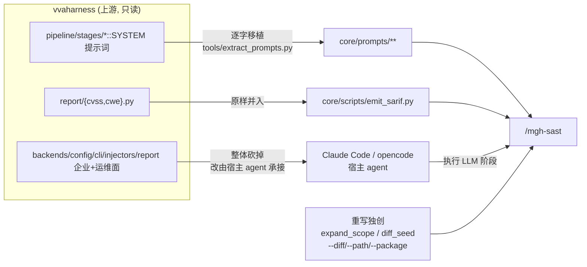

# AGENTS.md — m3g4h⊿rness 研发与运营手册

> **任何在本仓库做的事之前,先完整读本文件。** 它是 m3g4h⊿rness 的操作手册与研发铁律。
> 仓库根的 `README.md` 面向使用者;本文件面向**开发和维护者**。

## 项目调研开发阶段最高优先级约束
**CRITICAL**: 本项目研发过程，有需要和人类沟通确认的会话内容，以及所有面向人类读者的项目说明类文档产出，严格要求：假定是在面向完全不了解该主题的人进行讲解，通过举例、mermaid图等方式说明、待拍板事项还要通过对比优缺点的方式陈述供我选择，不允许出现"02 §7.3 的"xxx""这样的引用，文档稍微修改引用就失效，必须使用简短总结式说明而不是让人类到处去翻引用来源，如果确实由于内容过长需要跨文档翻阅，指明文档名与章节全名，并使用markdown引用跳转方式。

## 这是什么

**m3g4h⊿rness**(读作 *megahorn-ness*;双重语义:宝可梦招式「超级角击 / Megahorn」,
隐喻渗透测试的角击;亦是 *mega-harness*)是一套面向 AI 编程 Agent(Claude Code /
opencode)的**安全工作流工具族**,所有命令共享前缀 `mgh-`。

| 命令          | 状态      | 说明                                                |
| ----------- | ------- | ------------------------------------------------- |
| `/mgh-sast` | ✅ 可用    | 9 阶段 agentic SAST。零运行时依赖地复刻 vvaharness 流水线(详见下节)。 |
| `/mgh-init` | ✅ 可用    | 发现存量安全控制 → 生成 Agent rules。隔离优先三层流水线(确定性发现 → T1 per-cluster 归纳 → T2 综合 → T3 per-category 出 rules → T4 一致性);产 `controls_inventory.json`(与 vvah `design_controls` schema 兼容)+ claude/opencode rules(二选一,结构不混)。详见 `openspec/changes/add-mgh-init/`。 |
| `/mgh-sra`  | ✅ 可用    | openspec `propose` 后、`apply` 前对变更 specs/tasks 做**维度驱动安全缺口分析 + 三信号语义匹配存量控制**(维度契合 / 业务域相似 / 业务事实)+ **批量澄清问答**沉淀跨迭代项目级业务记忆。确定性 prepare/merge + LLM 隔离扇出(a2 clarify 单上下文 / a3 augment per-capability / a4 consistency)+ 幂等非破坏性受管块合并。原创(无 vvah 源)。详见 `openspec/changes/add-mgh-sra/`。 |
| `/mgh-srr` | ✅ 可用    | **无 openspec** 的自由文本需求(word/txt/md/excel/透传)安全评审。端口-适配器:确定性 intake 适配器(`ingest_requirements.py`)产出 sra 同 shape 上下文 → **逐字复用 sra 中间引擎**(clarify/augment/consistency 零新增提示词)→ 确定性 render 适配器(`render_report.py`)产**普通报告 + 台账**(NEVER 触 openspec)。docx/xlsx 走标准库尽力抽 + 降级标注 + `--text` 透传兜底;与 sra 共享 `business_context.json`。原创(无 vvah 源)。详见 `openspec/changes/add-mgh-srr/`。 |
| `/mgh-sdr` | ✅ 可用    | **需求分支代码 diff 的存量安全设计符合性复核**(merge 前关卡)。`git diff base..branch` → 接口维度注解启发式分组 + standalone 簇(`diff_group.py`)→ 存量设计基线投影 + 外部前端仓主流程受控检索(`sdr_context.py`,结论物化 + 哨兵 `read_roots[]`)→ fan-out 6 维度复核(垂直/横向/其他权限、SQL 注入、敏感信息、输入校验;`fanout_runner --tier sdr`)→ 项目根中文报告(`render_sdr_report.py`)。launcher `mgh_sdr_launch.py` 一条命令拉起(外部仓检索在 launcher 进程,宿主会话零权限打断);敏感目录缺省回退默认模板(与 sra/srr 显式分歧)。详见 `openspec/changes/add-mgh-sdr/`。 |
| `/mgh-blst` | 🚧 TODO | 结合业务接口逻辑设计强耦合安全测试案例。                              |

> TODO 命令目前仅为**空骨架**,功能定义见仓库根 [`task.260630.md`](task.260630.md)。`/mgh-sra` 与 `/mgh-srr` 产出的项目级 `business_context.json`(`roles[]`/`interface_authz[]`/`sensitive_fields[]`)为未来 `/mgh-blst` 预留消费口。

## mgh-sast 与原项目 vvaharness 的关系(必读)

`/mgh-sast` 是 **vvaharness**(Visa / Project Glasswing,Apache-2.0)9 阶段 LLM SAST
流水线的**零运行时依赖重写**:

- **LLM 阶段**(s1/s2/s3/s4/s6/s8)由宿主 agent 的 subagent 执行,提示词**逐字移植**;
- **确定性阶段**(s5 prefilter / s7 dedup / s9 SARIF+CVSS+CWE)由 Python ≥3.10 标准库脚本执行;
- **不 import、不 bundle 任何 `vvaharness/` 代码**(install 时有零依赖自检)。


```mermaid
flowchart LR
    subgraph 原项目["vvaharness (上游, 只读)"]
        A1["pipeline/stages/*::SYSTEM 提示词"]
        A2["report/{cvss,cwe}.py"]
        A3["backends/config/cli/injectors/report 企业+运维面"]
    end
    A1 -- "逐字移植<br/>tools/extract_prompts.py" --> P1["core/prompts/**"]
    A2 -- "原样并入" --> P2["core/scripts/emit_sarif.py"]
    A3 -- "整体砍掉<br/>改由宿主 agent 承接" --> H["Claude Code / opencode<br/>宿主 agent"]
    P1 --> SAST["/mgh-sast"]
    P2 --> SAST
    H -- "执行 LLM 阶段" --> SAST
    NEW["重写独创<br/>expand_scope / diff_seed<br/>--diff/--path/--package"] --> SAST
```

**逐项对应关系**(功能实现 + 提示词 + 保真度 + 未实现清单)记录在
[`docs/upstream-index.md`](docs/upstream-index.md),分文档在 `docs/upstream/`。

## 研发铁律

### R1 — 与上游的引用关系:非必要不改

- `docs/upstream-index.md` 与 `docs/upstream/*.md` 是与原项目的**同步锚点**,记录了
  「mgh-sast 条目 → vvaharness 来源 → 保真度/差异」的逐项映射。**非必要不改**。
  原项目更新需同步时,按 `docs/upstream-index.md` 末尾的「上游同步操作指引」执行。
- `core/prompts/**` 每个 `.md` 头部的溯源注释(`Source: vvaharness/...`)是有意保留的
  归属信息,**不要删**。重抽用 `tools/extract_prompts.py`,不要手改提示词正文。
- `core/docs/NOTICE`、`core/docs/prompt-provenance.md` 是 Apache-2.0 合规与保真度凭据,保留。

### R2 — 工具脚本:优先 Python 标准库

- **确定性脚本 / 工具脚本实现优先使用 Python 标准库**。当前 `core/scripts/` 与 `tools/`
  全部只用标准库(`argparse/ast/collections/datetime/json/math/pathlib/re/subprocess/sys`),
  经 AST 扫描与单测双重验证**无需 `pip install`**,内网可零联网运行。
- **需要引入/安装任何 pip 依赖时,必须先主动向维护者确认**(给出依赖名、用途、是否影响
  内网零联网分发)。未经确认不得新增 `requirements.txt` 或 import 第三方包。
- 现有「零运行时依赖」是产品特性(install 时有自检),**不得因为图方便而引入运行时依赖**。

### R3 — 文档输出规范:简练、索引化、受众声明制

**所有文档输出任务**遵守:

- **简练准确,按受众声明写作**。agent 面产物面向 AI 阅读:结论先行;不写废话与寒暄。人类面
  产物面向人:现象→原因→改法叙事,术语首现给一句解释,允许同义复述(冗余是读者的锚点)。
- **受众声明制**:每份产物声明受众 ∈ {人类 / agent / 双受众},按下表归类;R5.5 措辞纪律
  (RFC-2119 动词、`NEVER` 链、recipe)只辖 agent 操作面,SHALL NOT 蔓延到人类面。`proposal.md`
  是唯一双受众文件(人话序对维护者讲 why,对 apply agent 亦提供背景)。
- **人类面用词前词典必有**:`docs/glossary.md` 缺条目则先补词典再使用;词典自由增补,不设准入审批。
- **不保留长代码块**(最多 3–5 行内联片段)。让 AI 通过 **文件名 / 类名 / 方法名 / `文件:行号`**
  自行索引到具体实现,不要把实现贴进文档。
- 表格优先(映射、状态、清单用表格)。
- **仅对真正复杂的长逻辑用 mermaid 画图**(状态流转、多阶段流水线、调用关系等);简单逻辑
  不画。

**受众分类表**(防人话化蔓延 / 防 agent 面被软化):

| 受众 | 文件 |
| --- | --- |
| 人类·随包分发 | 终端报告(`report.md`/详述文件);proposal 人话序 |
| 人类·仅研发仓 | `docs/man/**`、`docs/glossary.md` —— 本仓根 `docs/` 是开发者私人资料,装进用户项目时**不落地**,故其中的文件**不得被任何分发内容引用**(详见下方 R5.10 第 ⑨ 类) |
| agent | 命令壳纪律段、stage 提示词、`core/contracts/**`、JSON schema、`NEVER` 链、flag 表 |
| 双受众 | `proposal.md`(人话序 + 结构化 why/what/capabilities/impact) |

**proposal 人话序约定**:每份 `proposal.md` SHALL 以 `> **人话序**` 起始的 blockquote 开场
(~200–300 字,四要素:现象→根因→改什么→怎么验证),先写人话再展开规格。**人工闸门**:维护者
只读人话序 + `tasks.md` SHALL 能复述本 change 在解决什么、改什么、如何验证;做不到 = 未就绪。
机器可检子集(人话序存在性 / 术语黑名单 / 英文原子密度)由 `tools/check_plain_language.py`
代理(存在性 fail-loud 退出码 2;黑名单与密度 WARN 退出码 0,仅扫人类面文件)。

### R4 — 改名/解耦后的路径规约

- 本仓库已从原 `visa-vulnerability-agentic-harness/vvah-sast/` **迁出为独立仓库**,
  磁盘目录名 `m3g4horness`(品牌显示名 `m3g4h⊿rness`,因 `⊿=U+22BF` 放进目录名会让
  bash/git/CI 脆弱,故磁盘用 ASCII)。
- 工具脚本(`tools/gen_*.py`)的路径常量**相对仓库根**(`releases/...`、`core/...`),
  从仓库根运行。
- `tools/extract_prompts.py` 默认 `--vvaharness = C:/DEV/visa-vulnerability-agentic-harness/vvaharness`
  (原项目位置),便于原项目更新时一键重抽。

### R5 — Agent 工具命令稳定性(作者期铁律)

> 管辖**新增/修改任何对外分发的 `mgh-*.md` 命令壳 + 其随 install 落地的 `core/scripts/*.py`**。
> mgh-* 性质 ≈ openspec `opsx:*`(装进别的项目当命令用),稳定性是产品特性,非可选优化。
> 各子规则的 `理由〔…〕` 括号是承重教训,**MUST 随规保留、NEVER 软化**。

**强制面索引**(哪条规则由什么兜底):

| 规则 | 强制机制 | 入口 |
| --- | --- | --- |
| R5.1 契约 lint | 机械化 flag 存在断言 | `tools/check_contracts.py` |
| R5.2 黑盒纪律 | runtime hook 阻断越权 Write/微脚本 | `block_adhoc_scripts.py` + `MGH_*_ACTIVE` |
| R5.3 脚本稳定性 | 自包含 + I/O 契约(脚本自验) | 回归测 `tests/` |
| R5.4 长跑可观测 | per-call `timeout` + `--resume` 重派 | 编排器 Bash 纪律 |
| R5.7 hook 闭环 | 双端 runtime hook(env-or-哨兵激活)+ CI | `block_adhoc_scripts.py` + `<run-root>/.active` 哨兵 + CI |
| R5.8 自检 + 回归 | install 自检 + 回归测 | `install.sh` + `tests/` |
| R5.9 边界校验 | `--check` fail-loud(退出码 2) | 各产出者 `--check` |
| R5.10 分发纯净 | purity lint | `tools/check_distributed_purity.py` |
| R5.11 SDD 产物不指私档 | 同一 purity lint 的 SDD 扫描面 | `tools/check_distributed_purity.py` |

- **R5.1 契约单一真相源 + 机械化 lint**:脚本 `argparse`/`Usage:` docstring 是 CLI **唯一契约**,
  命令壳调用示例**逐字镜像**,不得出现脚本未声明的 flag(agent 经 `--help` 学接口,故 `--help`
  即契约面,不读源码)。配 `tools/check_contracts.py`:提取双壳 MD 里所有 `*.py --flag`,对每个
  flag 跑 `py <script>.py --help` 断言存在。
- **R5.2 编排器即宿主 agent + 黑盒纪律(本仓库立规,非上游同步项)**:**编排器 = 宿主 agent 本身**
  (按命令 `.md` 用自身工具跑流水线,非写代码)——命令壳顶部须显式声明,并禁 agent 把它物化成脚本。
  三条硬边界(`NEVER`,命中**真实失败形状**,承 `harden-mgh-init-orchestration-discipline` FD1——
  真机首跑的失败全是一次性微脚本内省,非大编排器):
  - (a) **大编排器**:`Write` 任何脚本扩展名(`.py`/`.ps1`/`.sh`/`.ts`/…)编排器/包装器(实测反例:`mgh_init.py`);
  - (b) **一次性微脚本内省**:`Write` `py -c` 产物 / `_prep_*.py` / `_aggregate_*.py` / `<run>_helper.py` /
    `process_*.ps1` / `_*.sh`(脚本扩展名集,不只 `.py`),
    以及经 `Bash: py -c|python -c` 内省/重派生产物(`import json`/`open(`/`load(` 读 `.mgh-init/**`);
  - (c) **读源码**:`Read` 叶子脚本 `.py` 源码进编排器上下文(报错看 stderr,不读源码)。
  运行域内 (a)+(b) 由 `block-adhoc-scripts` 守卫**确定性兜底**(激活 = env 或磁盘哨兵;叶脚本 read-only、
  **无** `core/scripts` 白名单豁免;契约 `core/contracts/hooks/runtime-enforcement.md`)。
  合法出口(implementation-intention,正引导优先见 R5.5①):工作清单 → `list_clusters`/
  `list_scout_batches`/`list_rule_jobs`;瞄结构 → `describe_artifact.py`;派生量 → 产出者 stdout 字段。
  确定性脚本经 Bash 执行;细节规则下沉 `core/prompts/`,仅 subagent 按需读。理由〔省上下文 + 防 agent
  误改 + 平台无关〕。(`implement` 类 trigger 词易诱导 codegen,用「执行/跑」。)fan-out 清单的产出契约见 R5.3(b)「扇出与路径」。
- **R5.3 确定性脚本稳定性契约**:
  - (a) **runtime 自包含**——零运行时依赖(承 R2)、`sys.path.insert(0, dir-of-__file__)` 自定位
    兄弟导入、读源/文本一律 `encoding="utf-8"`、任意 cwd 可直接 `py`、禁需 `python -c exec` 绕行。
  - (b) **CLI I/O 契约**——`stdout`=结构化 JSON、`stderr`=诊断/进度**严格分流**;退出码 `0/1/2`
    (成功/通用错/误用);幂等(create-if-not-exists);禁交互式 TTY(只吃 flag/env/stdin);
    闭集参数拒歧义输入 + 可操作报错;破坏性操作带 `--dry-run`;大输出默认摘要 + `--offset` 分页。
    - **扇出与路径**(fan-out 即脚本枚举):所有 fan-out(tier)MUST 经 `list_*`/`describe_*` 脚本产 pending 清单
    (T1→`list_clusters`、scout→`list_scout_batches`、T3→`list_rule_jobs`),编排器对清单迭代,
    NEVER 直接挖 JSON / `py -c` 内省。**枚举脚本亦产每个待跑单元的确切绝对输出路径**——`pending[]`
    每项 MUST 含 `checkpoint_path`(scout/T1)/ `rule_path`(T3)+ `done_marker`,均 `Path.resolve()` 绝对
    (对 subagent 任意 cwd 安全,含 Windows 盘符相对);编排器**逐字透传**、subagent **逐字写**,
    NEVER 拼路径 / NEVER 占位符(`<target>`/`<id>`)/ NEVER 相对路径。`MGH_TARGET`(= discover `repo`
    绝对根)供 PreToolUse hook 判树:运行域内 `Write`/`Edit` resolved 目标不在其子树 → fail-loud
    (退出码 2)。承 `harden-mgh-init-fanout-output-paths`(治「输出路径漂到盘符根」)。
  - (c) **可恢复性** → 见 R5.4(长跑可恢复机制**权威处**;脚本侧 cache / 续点 / `--time-budget-ms` / `partial:true`
    契约统一在那里)。
- **R5.4 大仓可观测 + 长跑可恢复**(长跑可恢复机制**权威处**):单遍 I/O、每候选 O(1);进度走 `stderr`、
  产物 JSON 走 `stdout`(契约不变);扫描前廉价计数 + 命中阈值前置建议 `--scope`+`--merge`(取代「跑满再超时」);
  截断须显式告警并继续。**长跑确定性 Bash SHALL 传 per-call `timeout`**(claude Bash / opencode
  shell 工具均接受毫秒级 `timeout`,会话内即时生效;opencode `OPENCODE_EXPERIMENTAL_BASH_DEFAULT_TIMEOUT_MS`
  默认 120000 但须启动前就绪——env 继承边界见 R5.7 段 B)。确定性长跑脚本(`discover_controls.py`)SHALL
  支持 callgraph 缓存(`<out>/cache/`,按源 mtime/size 失效)+ scan 续点 + 软时限 `--time-budget-ms`
  干净早退(**退出码 0** + stdout `partial:true`),跨多次编排器调用零全损推进;discover 不假设单次调用跑完,
  编排器 **Bash 重派 `--resume`** 推进直至 `partial:false`(**NEVER** 写 wrapper `.py` 循环)。理由〔跨宿主 +
  零全损 + 不依赖单次调用跑完〕。**编排器级 re-entrant resume state**(治「上下文过大停止 + 难恢复」,跨
  compact / crash / 新 session 三态):`resume_state.py` 把「我在哪 / 下一步」下沉为**磁盘查询**——读
  `<target>/.mgh-init/` 全产物 + 跨 tier `.done` + `run_config.json` 重派生 `step`/`next_action`/`tiers`,
  三态坍缩为同一 resume 路径(读磁盘 → 继续);对话记忆**只是缓存、不是进度真相源**,故 compaction 是否丢
  编排纪律提示词**无关紧要**(新 session 重灌命令壳 = 完整提示词,进度由磁盘重派生)。`run_config.json`(step 0
  原子写,`write_runconfig.py`)作**起始态意图**(使 `--resume` 免重输 flag)、`init_manifest.json` 作**终态**,
  二者边界清晰、磁盘 schema 不变;`run_config` 缺失 → `resume_state.py` fail-loud(退出码 2)+ recipe,**NEVER**
  静默猜步骤图。配 `--check` 校验磁盘状态自洽(承 R5.9)。理由〔状态磁盘化 = 结构性免疫对话记忆丢失〕。
- **R5.5 指令性 MD 措辞**(给 subagent 的 SYSTEM 提示词 / 命令壳纪律段):
  - ① **shaping 失败用 recipe,不用 prohibition**——`Don't X` 类禁令改写为「该做什么」;**硬边界**
    (跨 format 产物不混、零依赖)才用 `NEVER`。**fan-out 路径 recipe**:「需某单元输出路径 → 读 `list_*`
    stdout `pending[].checkpoint_path`/`rule_path`(绝对,逐字透传给 subagent);NEVER 自拼 `<target>/<id>`、
    NEVER `py -c` 算路径、NEVER 写相对路径」——硬边界(`NEVER`)因路径拼装命中真实失败(盘符根漂移)。理由
    〔省拼装 + 对任意 cwd 安全 + 防 D 盘根漂移〕。**步骤查询 recipe**:「需知当前步骤 / 下一步 → 读
    `resume_state.py` stdout `step`/`next_action`/`tiers`(进度纯从磁盘 `<target>/.mgh-init/` 重派生);
    NEVER 靠对话记忆判步骤、NEVER `py -c` 重算、NEVER `Read` 整份聚合 JSON 倒推进度」——`--resume` 或任何
    压缩事件后**第一步**调之。理由〔省上下文 + 防路径偏离 + 跨宿主〕。
  - ② **禁 nuance/exemption 子句**(`Don't X unless…`、「此限制不适用代码块」)。
  - ③ 显式废对冲词 + RFC-2119 normative 动词(`MUST/SHALL` 取代 `should/may`,机器可检)。
  - ④ 验收用可证伪清单 + schema 示例(非散文);命令行示例逐字可执行;无长代码块(承 R3)。
  - ⑤ **禁令清楚则不举例**:抽象规则醒目且无歧义时,枚举反例是冗余(承 R3);只在 agent 可能猜不到边界时才给最小反例。
- **R5.6 命令壳薄壳 + token 硬预算(防回归硬上限)**:壳只放 编排流骨架 + stage→组件表 + 确切确定性调用 + 边界披露;
  详情移 `core/prompts/`,只深一级;按域分文件;禁 `@` 强制内联(改用 `REQUIRED SUB-SKILL: Use X` 标记,opencode 无跨文件自动内联,该标记纯模型解释 = lazy `Read`);
  `--help`/无参 → 打印 flag 表并 STOP(花 token 前先校验);`description:` ≤1536 chars。
  - **token 硬上限(强制性,lint fail-loud 防回归)**:编排器壳正文 **≤ 5,000 tok**;编排器加载的 fragments **逐个评估单次 Read 轮尺寸是否结构良好**(无硬求和上限;三者磁盘 `mid_tokens` 合计 ≤ ~10,000 作**防漂移** lint,标注根据 = 磁盘大小防漂移、**非**运行时叠加占用);子 agent 有效系统(agent def + stage prompt + 其加载的 fragments)≤ 5,000 tok。理由〔硬上限不是来自上下文算术,而是承重观察:opencode 无平台命令体尺寸上限(已核实 `packages/core/src/v1/config/command.ts`)、命令体作为触发消息仅一次性进 USER 历史(非每轮 system)、fragment 经 `REQUIRED SUB-SKILL` 仅为模型 lazy `Read` 产出的单次 USER 历史项(非每轮 system 税),故**压缩阈值不绑定壳/fragment 尺寸**(完整机制 + 源码行号见 [`docs/opencode-context-mechanics.md`](docs/opencode-context-mechanics.md),开发涉及压缩/加载时**先读**);但壳常驻历史 + 是弱模型唯一可靠的行为指令源,经验上结构良好的 mgh-* 壳(mgh-sast/ut-init)自然落在 ~4.5–5K,超 ~2×(mgh-init 9.4K)即冗余信号 + 注意力/执行忠实度衰减——硬上限 = 防松散迭代再膨胀回本次优化前〕(原「fragments 合计 ≤ 3,000 tok」求和上限已废,据 opencode 运行时模型重接地,见 `harden-mgh-init-shell-budget` design D6 + 报告 §9)。落地方式 = **保真度优先**裁剪(删冗余/重复/R5.10 dev-meta,迁可分片细节进按需 fragment;**MUST NOT** 删承重处理流程节点与已修 bug 防线,见报告「⚠ 裁剪前提:保真度优先」);超尺寸壳 SHALL **shard-to-fit**(抽子流程进 lazy fragment),NEVER 靠删承重内容硬凑达标。`description:` 简练(便于命令选择器;opencode 源码**未**强制 maxLength,约束由本规自管)。
  - **行数非硬约束(已废 500 行)**:zh-dense 承载比 ~25–35 tok/line → 5K tok 对应 ~145–200 行,原「500 行」上限松 2.5–3.5×。LINE 仅作 drafting 指引,**TOKEN 是约束维度**。
  - **lint 强制(防回归,承 R5.8)**:`tools/measure_prompts.py` 已存在(stdlib,`mid_tokens` 工作值 + 高/低区间);新增 `tools/check_distributed_prompt_budget.py`(或并入 `tools/check_contracts.py`)对每个 mgh-* 壳 + 子 agent 有效系统断言 ≤ 上限,失败 exit 2 + 接 CI。**回归语义**:lint 也 flag 增量(相对上次 release 基线的字节/token 增长超阈值)→ review,防慢漂移积累成突破。
- **R5.7 评估驱动 + hook 强制闭环**(同号两段;**段 A 评估方法论** + **段 B hook 强制闭环**):
  **段 A 评估方法论(TDD-for-docs)**:改 `core/prompts/**` 前先建 baseline(无该提示词跑 ≥5 次 capture
  失败模式,variance 是指标)→ blind A/B 对比 pass rate/tokens → 新命令由 A 实例写、全新 B 实例
  大仓首跑、观察漂移 → 新失败模式回灌本节。
  **段 B hook 强制闭环**:**交付物(非倡议)**——能用 hook 做确定性闭环的,不写进 MD 靠 agent 自觉:
  每个 `mgh-*` 命令的 #1 违例 MUST 配运行时 hook(install 时注入目标仓,**双端对等**)——
  claude = `.claude/settings.json` 的 PreToolUse 命令;**opencode = `.opencode/plugins/` 的 `tool.execute.before`
  `.ts` 插件**(opencode 的 hook 面即 JS/TS 插件,等价事件 `tool.execute.before`/`tool.execute.after`;
  **移植缺口非能力缺口**)。hook 缺席 = CI fail(对齐 R5.8)。**R2 定性**:`.ts` 插件是 opencode 宿主原生胶水
  (由 opencode 自带 Bun 运行、非 `pip` 依赖,类比 claude 的 `settings.json` hook 配置),仅做事件归一化 + 管道
  + 据退出码阻断;**判定逻辑单一来源在 Python 标准库守卫 `block_adhoc_scripts.py`**(双端字节级 parity 守卫,
  `tests/test_opencode_hook_parity.py`;零依赖 AST 扫描只扫 `*.py`,`.ts` 不在扫描集)。当前兑现:`block-adhoc-scripts`
  (双端:claude PreToolUse + opencode `.ts` 插件;同一守卫不改;`/mgh-init`+`/mgh-sast`+`/mgh-sra`+`/mgh-srr` #1 违例=微脚本内省
  + 越权 `*.py`/`.ps1`/`.ts`/… + 越树写 / init 树内根污染 / **越树读**(`Read`/`Glob`/`Grep` + Bash 直接 `rg`/`grep`/`find`/… 越出 `MGH_TARGET` 子树;读侧是写侧越树判定的同形扩展,target 缺失降级、`pattern` 不解析;扇出 `targets[].file` 物化绝对路径,承 `harden-mgh-read-confinement`)+ **Bash 面双层判定 = 动词枚举 + 路径允许集净网**(承 `harden-mgh-bash-path-allowlist`):五张动词表(搜索/写/删/列目录/解释器)降为**精化层**(供写/删专属 recipe、cwd 漂移、init/ut-init P1 根污染),其下垫**与动词无关的 catch-all 净网**(规则 m,链末)——命令中任一路径 token(盘符绝对/UNC/POSIX 绝对/`..` 引导〔对守卫 cwd resolve〕/`~/` 引导;引号剥离、含 `://` 排除、裸 `~`/`..` 不判)resolve 后不在**统一读允许集** → 拦(退出码 2 + recipe 列三类允许根);治「表外动词携带树外路径直接放行」(`robocopy`/`Get-Content`/`curl -o`/`Expand-Archive`/…,每发现一个词补一个词的线性维护)+ **读允许集三源并集、双面同集**:`MGH_TARGET` ∪ 哨兵 `read_roots[]` ∪ 项目配置 `<target>/.mgh/read-roots.json`(schema `{"v":1,"read_roots":["<abs>…]}`;手工可编辑;缺文件=零变化,坏 JSON/错型=fail-closed 零授权不崩;条目「存在 ∧ 是目录」才生效;未知字段忽略)——**语义反转**:已声明只读根现在 Bash 面同样可读(凡允许读的目录,用什么工具读都放行);写侧**不变**仍判 `MGH_TARGET` 单独(声明根永不可写,叶源码/`py -c`/temp/file-assoc 拦截不放宽))+ **写/删/重定向侧越树拦截**(Bash 写动词 `New-Item`/`Set-Content`/`tee`/`mkdir`/`Copy-Item`/`Move-Item`/… + 破坏性删 `Remove-Item`/`del`/`rm`/`rmdir` + `>`/`>>` 重定向 + `py -c` 写形态(`write(`/`makedirs`/`shutil.copy`/`shutil.rmtree`/…) 的越树目标 → fail-loud;init/ut-init 树内写亦须落受信子树 P1;工具面 claude `MultiEdit`/`NotebookEdit` + opencode `apply_patch`(patchText 标记提取为 glue)入写侧越树判定;删侧 recipe 标不可逆;承 `harden-mgh-write-confinement`,读侧三层不动);五运行域 `MGH_{INIT,SAST,SRA,SRR,UT_INIT}_ACTIVE`)。**激活 = env 或磁盘哨兵(最优锚点起有界向上发现)**
  ——守卫激活当且仅当 `MGH_*_ACTIVE=1` env **或** 锚到盘根链上任一级 `<dir>/<run-root>/.active` 哨兵存在;锚 = hook payload `cwd`(claude)?? 守卫进程 cwd(opencode),向上 walk ≤16 级/盘根,每级查哨兵;哨兵 JSON
  `{domain,target,out_roots[],v}` init/ut-init 域由 `write_runconfig.py` **确定性副作用** co-write(非编排器 `printf`;脚本一跑哨兵必在)+ `resume_state.py --check` 存在性校验(进行中缺哨兵 = 守卫休眠 = 退出码 2 + re-arm recipe)+ `--rearm-sentinel` 确定性重写(据 `run_config.target`);其它域由编排器 step 0 经 `Bash` 写;run 完成/干净停止移除(契约 `core/contracts/hooks/runtime-enforcement.md`)。**读侧叶源码拦截**:`Read` 已安装 `mgh-core/scripts/` 下叶脚本源码(脚本扩展名 ∧ `mgh-core/scripts` 路径段双条件)→ 退出码 2 + recipe(报错看 stderr,NEVER Read 叶子源码)——「叶脚本只读」的读侧对偶,治「拉叶源码进上下文 debug」的 token 膨胀;目标项目自身 `.py` 与非脚本产物不误伤(承 `harden-mgh-init-deterministic-enforcement`)。
  **可靠性边界(opencode)由哨兵关闭**:opencode 插件进程**不继承** mid-session bash 导出的 env(`shell.ts::shellEnv` 只读
  `process.env` 不回写)——env-only 激活在 opencode 上整 run 休眠;**磁盘哨兵绕开该边界**,经磁盘对 opencode 插件进程可见,
  使脚本只读 / 受信子树守卫双端可靠激活。哨兵携 `target`(取自 Python leaf stdout,Windows 原生;**NEVER** bash `pwd` 的 MSYS
  `/c/…`),`MGH_TARGET` 取值优先级 = env > 哨兵.`target` > 降级(均缺则子树检查降级放行、不误伤)。运行域脚本只读:取消既有
  `core/scripts`/`tests`/`tools`/`hooks` 白名单,扩为脚本扩展名集 `{.py,.ps1,.sh,.bash,.zsh,.bat,.cmd,.ts,.js,.mjs,.cjs}`;
  init 域 `Write`/`Edit` 须落入受信子树(`<target>/.mgh-init`/`.claude/rules`/`docs/security-controls`/`AGENTS.md` ∪ 哨兵 `out_roots[]`)。
  **matcher 全工具面 + 接线覆盖 CI 不变量**:claude install matcher `_DEFAULT_MATCHER` 含守卫全分派工具
  (`Bash|Write|Edit|MultiEdit|NotebookEdit|ApplyPatch|Read|Glob|Grep`;旧 `Bash|Write|Edit` 子集幂等演进、非子集不动 +
  stderr 提示、`--matcher` 显式传值跳过);opencode `.ts` shim `HANDLED` 同全工具面;回归测 `TestWiringCoverage` 断言
  守卫分派集 ⊆ matcher ∧ ⊆ HANDLED——新增守卫分支忘扩任一接线面 = CI fail(双宿主一不变量,结构性关闭「死分支」缺口类)。
- **R5.8 安装自检 + 回归单测**:`install.sh` 镜像后校验脚本族同目录共存 + fail-soft(自检失败只
  warn 不阻断 install,CI 必 fail);任何 `.md`/脚本改动 bump 版本号;回归测覆盖 契约等价 / 导入
  鲁棒(非脚本目录 cwd 子进程)/ 性能不退化 / 零依赖 AST 扫描 / R5.1 CLI lint。
  - **定向跑优先,全量是闸门**:改哪面跑哪面(「改动面 → 测试文件」映射表见
    [快速命令](#快速命令));`tests/` 全量(1223 测 / ~185s)SHALL 仅在发布前或**跨面改动**
    (碰 `core/contracts/`、`install.sh`、hook 双端接线、跨脚本公共 helper)时跑。理由〔全量耗时
    集中在 3 个真·I/O 面(`test_diff_group` 真建 git 仓 / `test_fanout_runner` 真子进程与计时器 /
    `test_sdr_context` 真 codegraph 探针),其余 54 个文件均 <10s;把它当每次改动的习惯会挤掉
    真正该做的实机验证〕。
  - **回归测 NEVER 吃 300s 级墙钟默认值**:in-process harness 跑 `fanout_runner.main()` MUST 显式
    传 `--cooldown-s 0`——理由〔`--cooldown-s` 默认 300 是**真实等待**,harness 漏传 = 单测静默
    挂 5 分钟(实测:单测 300.8s → 1.0s);`test_fanout_stale.py::_Env.main` 与
    `test_fanout_runner.py::_FakeDispatchBase` 均在 harness 层设该缺省,新增 tier 测试同此约〕。
- **R5.9 边界校验泛化(承 openspec validate-at-boundary)**:每个 stage 产物的产出者 MUST 暴露
  `--check`(或独立 validator,如 `validate_inventory.py`);编排器跑完一步、进下一步前 MUST 运行之,
  失败 fail-loud(退出码 2)回退重跑,**不带着破损产物继续**。范式源头:`assemble_rules.py --check`。
  当前覆盖:`discover_controls`/`plan_scout`/`merge_scout` `--check` + `validate_inventory.py` + `prefilter`/`dedup`/`emit_sarif` `--check`(/mgh-sast 确定性阶段)+ `prepare_augment`/`merge_augment`/`merge_memory` `--check`(/mgh-sra)+ `ingest_requirements`/`render_report` `--check`(/mgh-srr)。
- **R5.10 分发产物纯净性**:经 `install.sh` 装入目标项目的 md(命令壳 / agent 定义 / stage
  提示词 / I/O 契约 / skills)MUST 仅含对目标 agent 有用的操作性内容,NEVER 携带只在本仓研发语境
  才有意义的悬空引用——在目标项目里它们指向不存在的手册/编号/文件,浪费 token 且误导 agent
  (目标项目常有自带 `AGENTS.md` 与无关编号)。禁引完整八类:① 研发铁律编号(`R5.x`/`R3`/`R1–R4`);
  ② 失败/发现 ID(`FDn`);③ 设计决策 ID(`Dn`,含 `D9 = D12` 形态);④ openspec 变更夹名
  (`(add|fix|harden|improve|purify)-mgh-(init|sast|sra|blst|srr|ut-init)-…`);⑤ 内部上游文档(`glasswing_docs/`);
  ⑥ 仓根开发态文件指针(`task.*.md`,install 不分发);⑦ dev-meta 措辞(`承/兑现 R5.x`、`范式锚点`、
  指本研发仓时的「本仓」);⑧ 上游溯源行话作谱系归因(`vvah`/`design_controls` 当归因词,非操作性
  schema 字段);⑨ **本仓根 `docs/` 指针**(`docs/man/**`、`docs/glossary.md`、`docs/upstream-index.md`、
  `docs/upstream/**` 及各类分析与 review 笔记)——该目录是开发者私人资料,`install.sh` **不**把它拷进
  目标项目,故分发内容里指向它的每一处都是死链,且会让目标 agent 去找一个根本不存在的目录。
  **豁免面(与禁引同形,机器须放行)**:目标项目里由工具**运行时生成**的 `docs/security-controls/`、
  `docs/test-conventions/`(mgh-init / mgh-ut-init 的输出目录),以及 `core/docs/NOTICE`、
  `core/docs/prompt-provenance.md`(Apache-2.0 归属,随 `core/` 落到 `<dest>/mgh-core/docs/`)。按「删或嫁接」处理(design D8):目标不需要 → 删标记/引用句;目标必需 → 把最简 1–2 行
  内容内联到恰当位置再删指针(省 token 优先,NEVER 整段搬运)。**保留**操作语义与输出产物路径
  (`--check`/退出码 2/`<target>/AGENTS.md`/runtime 脚本调用 `.claude/mgh-core/scripts/*.py`/阶段标签
  `T1`/`s1`..`s9`)。**受保护归因**(`core/prompts/**` 头的 `Source: vvaharness/...`、skills Apache 归因、
  `core/docs/prompt-provenance.md`、操作性 `design_controls`、`CVE-*`)不在禁列,NEVER 当 dev-only 溯源剥除。
  理由〔省 token + 防目标项目误读 + 平台无关〕。第 ①②③④⑤⑥⑦ 类 + dev-meta(`承/兑现`/`范式锚点`)
  + 第 ⑨ 类(本仓根 `docs/`)由 `tools/check_distributed_purity.py` 确定性强制,扫描面 = **分发的
  全部文件**(md 命令壳/agent/提示词/契约 + 分发脚本 `.py`/`.ts` + 敏感词模板 json),不只是 md;
  第 8 类与「本仓」与受保护归因同形、机器难辨,由提示词护栏 + 人工清理覆盖。
  第 ⑨ 类的反向守卫承 `tests/test_distributed_md_purity.py`(install 自检 fail-soft,承 R5.8)。
- **R5.11 SDD 产物不得指向本仓 `docs/`**:用 openspec 等规格驱动工具做设计/研发时产出的**全部
  产物**(`proposal.md` / `design.md` / `tasks.md` / `specs/**` / delta spec),SHALL NOT 出现
  本仓根 `docs/` 下的任何路径或文件名 —— **连「本文档定义了一个住在 `docs/` 下的产物」这种主题
  性命名也不行**。理由〔该目录是维护者私人资料:是否 git 跟踪由维护者自定,别人 clone 到的可能
  根本没有;SDD 产物是**被跟踪、会被未来 agent 读**的共享记录,一份写着「去 `docs/xxx` 看」的
  spec/任务清单会把每一个后来者引向一个可能不存在的文件;把私有目录的名字从共享记录里摘干净,
  规则才不依赖「谁的机器上有什么」〕。**替代写法**:按**角色**称呼,不按路径 —— 「维护者私有
  文档区里的命令人话说明」「术语词典」「fan-out 运行手册」「上游对照表」。**唯一豁免**:
  需求本身就是「在 `docs/` 下写文件」的那份 change(此时路径是交付物本身);`openspec/changes/archive/**`
  是冻结历史记录,不回溯改写。**范围**:上面 R5.10 那八类禁用词(**研发铁律编号 / 失败 ID /
  决策 ID / 变更夹名 / 上游文档路径 / 开发态文件指针 / dev-meta / 上游行话归因**)在这里**不适用**
  —— spec 本来就逐条引用规则编号,那是合法的。R5.11 只禁**一件事**:本仓 `docs/` 下的路径或
  文件名。**强制**:由 `tools/check_distributed_purity.py` 的 SDD 扫描面确定性强制(扫
  `openspec/specs/**` 与 `openspec/changes/**`,跳过 archive 与上述豁免 change),回归测在
  `tests/test_distributed_md_purity.py`。

## 目录布局

```
m3g4horness/
├── AGENTS.md                 # 本文件
├── README.md                 # 面向使用者
├── task.260630.md            # mgh-init/sra/blst 功能定义(下一阶段 proposal 输入)
├── core/                     # 平台中立的单一真相源
│   ├── prompts/              # 阶段 SYSTEM 提示词 + fragments + lenses + baselines(移植)
│   ├── scripts/              # diff_seed / expand_scope / prefilter / dedup / emit_sarif
│   ├── profiles/             # default / cli / full
│   ├── contracts/            # 阶段 I/O JSON 契约
│   └── docs/                 # prompt-provenance, NOTICE
├── releases/claude-code/     # Claude Code shell → 装入 .claude/
│   ├── commands/{mgh-sast,mgh-init,mgh-sra,mgh-blst}.md
│   ├── agents/sast-*.md
│   └── skills/sast-*/
├── releases/opencode/        # opencode shell → 装入 .opencode/
│   ├── command/{mgh-sast,mgh-init,mgh-sra,mgh-blst}.md
│   └── agent/sast-*.md
├── docs/                     # 开发者私人资料:man 页 / 术语表 / 上游对照 / 分析与 review 笔记
│   ├── man/                  #   给维护者本人读的命令通俗说明(不随包分发,见 R5.10 第 ⑨ 类)
│   ├── upstream/             #   逐功能分析分文档
│   └── opencode-context-mechanics.md  # opencode 上下文/压缩机制(开发涉及压缩时先读)
├── tools/                    # 构建期工具(extract_prompts / gen_*),不随安装分发
└── tests/                    # 确定性阶段单测
```

## 快速命令

```bash
# 装入目标项目(Claude Code 默认 / opencode)
./install.sh --claude  .          # 或: ./install.sh --opencode .
./install.sh                       # 默认 claude,目标=当前目录

# 零依赖自检(应无输出)
grep -rnE "^[[:space:]]*(import[[:space:]]+vvaharness|from[[:space:]]+vvaharness[[:space:]]+import)" --include=*.py .

# 定向回归测(默认姿势:改哪面跑哪面,见下表)
py tests/test_fanout_runner.py    # 单一文件 = 一套测试;多文件逐个跑

# 全量回归测(仅发布前 / 跨面改动时)
for f in tests/test_*.py; do py "$f" || exit 1; done

# 上游提示词重抽(原项目更新时)
py tools/extract_prompts.py --out ./core/prompts
```

### 改动面 → 测试文件(定向跑映射表)

**默认只跑命中行**;跨面改动(碰 `core/contracts/`、`install.sh`、hook 双端接线、跨脚本公共
helper)或发布前才跑全量。

| 改动面 | 跑这些测试文件 |
| --- | --- |
| `fanout_runner.py`(全 tier 调度/杀树/breaker/cooldown/storm) | `test_fanout_runner` `test_fanout_stale` |
| `resume_state.py` / `list_steps.py` / 中止自愈 | `test_resume_state` `test_list_steps` `test_stuck_run_selfheal` |
| `block_adhoc_scripts.py` / hook 双端接线 | `test_block_adhoc_scripts` `test_opencode_hook_parity` `test_install_hook` `test_install_opencode_plugin` |
| init 发现面 `discover_controls.py` / 分簇 / 骨架 | `test_init_discover` `test_init_clusters` `test_skeleton` `test_discover_resilience` `test_init_runtime` |
| init 扇出面 `plan_scout` / `merge_scout` / `list_*` 枚举 / `describe_artifact` | `test_scout_plan` `test_merge_scout` `test_list_clusters` `test_scout_batches` `test_list_scout_batches` `test_describe_artifact` |
| init 归纳与出 rules `plan_aggregate` / `assemble_rules` / T1 记录 | `test_plan_aggregate` `test_assemble_rules` `test_validate_t1_records` |
| init 起始态 `write_runconfig.py` / ack 契约 | `test_write_runconfig` `test_init_ack_contract` |
| sdr 面(`diff_group` / `sdr_context` / 报告 / launcher / 读根 / 敏感目录) | `test_diff_group` `test_sdr_context` `test_render_sdr_report` `test_mgh_sdr_launch` `test_read_roots_config` `test_sensitive_catalog` |
| sra / srr 面 | `test_sra_prepare` `test_sra_merge` `test_sra_memory` `test_srr_ingest` `test_srr_report` |
| ut-init 面 | `test_ut_init_runtime` `test_ut_init_ack_contract` `test_resume_ut_init_state` `test_write_ut_runconfig` `test_classify_tests` `test_test_rules_purity` |
| sast 确定性阶段 | `test_deterministic` `test_sast_runtime` `test_chunk_sources` `test_list_chunks` `test_list_verify_jobs` `test_stage_check` `test_load_controls` `test_focus_scope` |
| 命令壳 / 提示词 / 分发产物 | `test_distributed_md_purity` `test_plain_language` `test_mgh_init_codegraph_parity` `test_mgh_sra_codegraph_parity` `test_mgh_srr_codegraph_parity` + `py tools/check_contracts.py` |
| 任意 `core/scripts/*.py` / `tools/*.py` | `test_zero_deps` `test_no_compile_warnings`(各 ~0.5s,建议顺手带上) |

### 慢测清单(真·墙钟等待;非必要不单独跑)

除下表外,全仓无长等待测试;**文件级慢**是量的堆积不是等待——`test_diff_group`(44s/37 测,
每测真建一次 git 仓)、`test_sdr_context`(18s)、`test_fanout_runner`(41s/107 测)。

| 测试 | ~秒 | 为什么慢 |
| --- | --- | --- |
| `test_ut_init_ack_contract::test_shell_flags_all_declared_in_help` | 7.1 | 对每个脚本真跑一次 `py <script> --help`(~40 次子进程) |
| `test_fanout_runner::TestFastFailCooldown::test_in_flight_units_keep_harvesting_during_cooldown` | 5.0 | 显式 `time.sleep(2.5)` 必须活过 cooldown 窗口 |
| `test_fanout_runner::TestRateLimitStorm::test_signature_drift_degrades_to_cooldown_path` | 2.7 | `--cooldown-s 1` 真实计时器 |
| `test_fanout_runner::TestRateLimitStorm::test_mixed_unknown_crash_blocks_truncation` | 2.6 | 同上 |
| `test_fanout_runner::TestFastFailCooldown::test_third_requeue_triggers_cooldown_then_bounded_backoff` | 2.6 | 同上 + 一次退避 |
| `test_fanout_runner::TestRunUnitTreeKill::test_stall_silence_kills_child_and_writes_run_log` | 2.5 | 真起子进程 + 2s 静默阈值 + 真树杀/回收 |
| `test_fanout_runner::TestRunUnitTreeKill::test_call_timeout_kills_child` | 2.5 | 真起子进程 + 2s call timeout + 真杀/回收 |

> **陷阱(已修,勿重犯)**:in-process harness 调 `fanout_runner.main()` 若漏传 `--cooldown-s 0`,
> 会吃到默认 300s 真实等待——`test_fanout_stale.py::test_children_registered_at_spawn_removed_at_terminal`
> 曾因此单测挂 300.8s(占全套 62%)。新增 tier 测试 MUST 在 harness 层设该缺省,见 R5.8。

## 诚实边界(写进每个对用户输出的总结)

- `/mgh-sast` 的发现是 **LLM 生成的待复核候选,不是已确认漏洞**;每次运行非确定性。
- 调用图是**文本/AST 级**,漏动态分派/反射/DI/**框架路由**(Spring `@*Mapping`/Feign/AOP/
  `@Autowired`/JPA);未解析项写进 `scope_manifest.unresolved[]` 供报告披露。
- **tree-sitter 调用链后端规划中、未接入**(当前纯文本 regex + 框架 allowlist)。
- `/mgh-init` 规则产物的**纯净性 lint 覆盖高精度形状**:工具内部 token(工具名 + 特征脚本名 +
  内部路径)+ inventory schema 字段(`found_controls`/`evidence_count`)+ opencode YAML 围栏(`---`)+
  特征过程散文短语(`扫描器模式定义` 等);裸通用词(`category`/`缺失`/泛指 `锚点`)与裸层级词
  (`T1`/`T2`/`scout`)、通用脚本名仍仅提示词护栏覆盖、非确定性可测。
- `/mgh-init --format opencode` 输出为根 `AGENTS.md` 简洁**惰性索引块** + 每 category 一个
  `docs/security-controls/<cat>.md` 详述文件;opencode 无路径作用域,按需加载是**语义性**的
  (索引块指令驱动,非路径自动触发)——**非确定性可测**:agent 若跳过对应 Read 可能漏掉可复用
  控制。claude 侧 `paths:` 路径作用域为确定性触发(已天然 lazy)。
- `/mgh-sdr` 的发现是 **LLM 候选,非确认漏洞**;接口分组是**注解启发式**(Spring/JAX-RS/Servlet 常用注解),漏分组接口退入独立变更单元(粒度粗、覆盖不丢),非 java web 项目整体退化为 standalone 模式;外部仓结论是**检索时点快照**(不保证前端分支同步);基线经字节预算投影(低优先级细节可能未全量投影);敏感目录来源为 project 或 default-template 回退(目录外字段仅按回退规则识别)。
- 守卫 Bash 面路径净网是 **regex-over-string 提取、非 shell 解析器**(与全部 Bash 规则同立场),已知残余:① **未知写动词把数据写进已声明只读根**——token 在读允许集内放行、变异规则又不认得该动词 → 漏(sdr 审批流 change 落地后声明根全部经用户拍板,风险受控);② **别名/变量间接**(`$p='D:\out'; cp x $p`)提取不到裸路径 → 漏;③ 接受的新拦截(原放行→现拦,救济=配置声明或非运行会话):`> /tmp/x` 单写、`--flag=<树外路径>` 取值、`git -C <树外>`、无害提及树外路径。

## 可参考项目
本项目部分实现方式、实现理念、工具使用可参考如下已拉取到本地的项目代码仓
1. C:\DEV\superpowers
2. C:\DEV\OpenSpec
3. C:\DEV\codegraph
