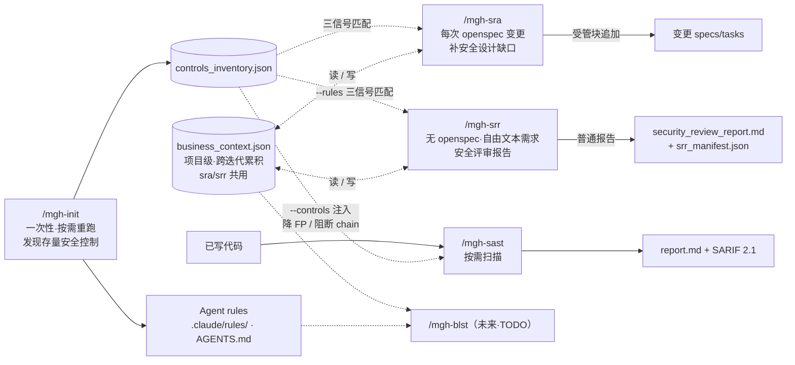

# m3g4h⊿rness — 面向 Claude Code / opencode 的安全工作流工具族

**m3g4h⊿rness**（读作 *megahorn-ness*；双重语义：宝可梦招式「超级角击 / Megahorn」，
隐喻渗透测试的角击；亦是 *mega-harness* 之意）是一套面向 AI 编程 Agent 的安全工作流
工具族。所有命令共享前缀 **`mgh-`**，确定性脚本零第三方依赖（仅 Python ≥3.10 标准库）。

## 工具

| 命令          | 状态      | 用途                                                                                                                                                                                                     |
| ----------- | ------- | ------------------------------------------------------------------------------------------------------------------------------------------------------------------------------------------------------ |
| `/mgh-sast` | ✅ 可用    | 9 阶段 agentic SAST（survey → threat-model → decompose → deep-dive → prefilter → verify → dedup → chain → SARIF）。零运行时依赖地复刻 vvaharness 流水线。                                                                |
| `/mgh-init` | ✅ 可用    | 发现存量安全控制（输入校验/脱敏/鉴权/加密等）→ 生成 Agent rules（Claude Code `.claude/rules/` 或 opencode `AGENTS.md`，二选一不混用）。隔离优先流水线；产出 `controls_inventory.json`（与 vvah `design_controls` schema 兼容）。                         |
| `/mgh-sra`  | ✅ 可用    | openspec `propose` 后、`apply` 前对变更 specs/tasks 做**维度驱动安全缺口分析**（敏感数据/注入/横纵越权等 9 维度）+ **三信号语义匹配存量控制**（维度契合 / 业务域相似 / 业务事实）+ **批量澄清问答**沉淀跨迭代项目级业务记忆。确定性 prepare/merge + LLM 隔离扇出；幂等非破坏性受管块合并。原创（无 vvah 源）。 |
| `/mgh-srr`  | ✅ 可用    | **无 openspec** 的自由文本需求（word/txt/md/excel/透传）安全评审。端口-适配器：确定性 intake 抽取 → **逐字复用 sra 中间引擎**（零新增提示词）→ 确定性 render 产**普通报告 + 台账**（NEVER 触 openspec）。docx/xlsx 走标准库尽力抽 + 降级标注 + `--text` 透传兜底；与 sra 共享 `business_context.json`。原创（无 vvah 源）。 |
| `/mgh-blst` | 🚧 TODO | 结合业务接口逻辑与 mgh-init 的 rules，设计与业务强耦合的安全测试案例（如换账户/auth 检验越权）。                                                                                                                                            |

## 命令如何配合

mgh-* 命令覆盖「设计 → 编码 → 扫描」全周期的安全工作流，共享 `controls_inventory.json`
这条控制流主线，互相衔接而非孤立（`/mgh-sra` 与 `/mgh-srr` 同属设计阶段：sra 管 openspec 变更、
srr 管无 openspec 的自由文本需求）：



- **`/mgh-init`** 回答「项目**已有什么**安全设计」→ 一次性跑（大仓可分块），产 inventory + rules。
- **`/mgh-sra`** 在**设计阶段**（openspec `propose` 后）回答「变更**漏了什么」→ 接存量控制 + 累积业务记忆。
- **`/mgh-srr`** 是 sra 的「无 openspec」孪生入口 → 只有原始需求文档（word/txt/md/excel）时，在编码前回答「需求**漏了什么**」，产出普通报告（不碰 openspec）。
- **`/mgh-sast`** 在**编码后**回答「代码**哪里有问题**」→ 注入存量控制降误报、产 SARIF。

## `/mgh-sast` — 9 阶段 agentic SAST

把 vvaharness 的 9 阶段 LLM SAST 流水线作为原生 agent 命令、**零运行时依赖**重写。它扫描
代码库 → 威胁建模 → 分解 → 逐块深潜 → 对抗式验证发现 → 去重 → 构建利用链，最终产出
Markdown 报告 + SARIF 2.1.0。

> **对原项目保真。** 提示词与工作流逐字移植自 `vvaharness/`（Visa / Project Glasswing，
> Apache-2.0）——见 `core/docs/prompt-provenance.md` 与 `core/docs/NOTICE`。本包**不** import、
> 不调用任何 `vvaharness/` 代码。功能实现/提示词与原项目的逐项对应关系见
> [`docs/upstream-index.md`](docs/upstream-index.md)（非必要不改，便于上游更新同步）。

```
/mgh-sast --repo <path>                                 # 全仓扫描
/mgh-sast --repo . --diff origin/main                   # 增量(git diff)+ 调用链
/mgh-sast --repo . --path src/payment                   # 目录范围 + 调用链
/mgh-sast --repo . --package com.bank.payment           # 包范围 + 调用链
/mgh-sast --repo . --controls .mgh-init                 # 注入 mgh-init 存量控制降 FP
/mgh-sast --repo-file repos.csv --group-by-app          # 批量,每个 app 一份报告
/mgh-sast --repo . --estimate                           # 范围/成本预览(无 LLM 花费)
```

### Flags（`/mgh-sast`）

| Flag | 作用 |
|---|---|
| `--repo <path>` | 单个本地目标（与 `--repo-file` 互斥）。 |
| `--repo-file <f>` | 批量：`.csv`（`AppId,RepoName[,Path]`）或 `.txt`。 |
| `--workspace <dir>` | 批量克隆仓的目录（默认 `./batch-workspace`）。 |
| `--group-by-app` | 批量：每个 AppId 扫一次（每个应用一份报告）。 |
| `--keep-clones` | 扫描后保留克隆仓（批量）。 |
| `--diff <ref>` | 增量：种子 = 相对 `ref` 变更的文件，按调用链扩展。 |
| `--path <dir>` | 范围：种子 = `dir` 下文件，按调用链扩展。 |
| `--package <pkg>` | 范围：种子 = `pkg` 的文件，按调用链扩展。 |
| `--controls <path>` | 可选：消费 `/mgh-init` 的 `controls_inventory.json`，按 scope 投影后注入 s2/s3/s4/s6/s8——降低威胁 likelihood、判上游中和型 FP、阻断被控制覆盖的 chain。省略 = 不注入（旧行为）。 |
| `--config <profile>` | `default` / `cli` / `full`。 |
| `--application-id <id>` | 资产 id → SARIF `run.properties.applicationId`。 |
| `--stop-after <stage>` | 在 `s1`…`s9` 后停止（调试/成本）。 |
| `--budget <usd>` | 每阶段预算上限。 |
| `--scope-depth <N>` | 调用链扩展深度（默认 2）。 |
| `--scope-direction` | `callers` / `callees` / `both`（默认 `both`）。 |
| `--models role=id` | 覆盖某个角色的模型。 |
| `--resume` | 复用 checkpoint。 |
| `--estimate` | 范围/成本预览，无 LLM 花费。 |

**产物**（落 `<repo>/security-scan/`）：`report.md`、`report.sarif`（SARIF 2.1.0）、
`checkpoints/**`（供 `--resume`）、`run_manifest.json`（含控制来源/scope 投影实数）。

## `/mgh-init` — 发现存量安全控制 → Agent rules

在已有代码库里**发现可复用的安全控制**（输入校验 / 数据脱敏 / 鉴权 / 授权 / 加密 / 限流 /
CSRF / 审计日志），并产出 Agent 可消费的 rules——让后续写新功能的 Agent 知道「本项目已有哪些
安全设计可复用，别重复造」。隔离优先流水线（确定性 discover + LLM 隔离扇出，编排器 = 宿主 agent）：

```
i1 discover(确定性·regex 扫源)
  → 3b scout 扇出(LLM 找 regex 闸门漏掉的自研控制,按字节预算切批)
  → T1 per-cluster 归纳 → T2 综合 → T3 per-category 出 rules → T4 一致性
```

- **`--format` 必填且互斥**：`claude`（产 `<target>/.claude/rules/security-<cat>.md`）与
  `opencode`（产单个 `<target>/AGENTS.md` 受管块），结构不混。
- 产 `controls_inventory.json`（与 vvah `design_controls` schema 兼容）——是 `/mgh-sra`
  （三信号匹配）与 `/mgh-sast --controls`（注入降 FP）的**共享输入**。
- 大仓友好：`--scope` 按模块切片 + `--merge` 合并；`--resume` 续跑；`--rebuild-cache` 重建调用图。
- **(可选) codegraph 富化**：目标项目已建 `.codegraph/` 索引时，自动启用一个 `init-resolve` 阶段——用
  codegraph 的框架路由图解析文本/AST 调用图漏掉的 DI/AOP/反射/`@PreAuthorize` 类控制（落在 `unresolved[]`
  里的），作为 `source:"codegraph"` 候选**增量**并入下游归纳。零新增运行时依赖（codegraph 是宿主 MCP/CLI，
  不被任何 `.py` import）；`--no-codegraph` 关闭、行为等价引入前。`init_manifest.json` 记 `codegraph.{available,
  used, resolved_count, unresolved_residual}`。

```
# Claude Code:产 .claude/rules/security-*.md
/mgh-init --target . --format claude
# opencode:产 AGENTS.md 单个受管块
/mgh-init --target . --format opencode

# 大仓:按模块切片跑、再合并(超 ~1.5M 行推荐)
/mgh-init --target . --format claude --scope path:src/payment
/mgh-init --target . --format claude --scope package:com.bank.auth
/mgh-init --target . --format claude --merge ./.mgh-init-partials

# 调优 / 续跑
/mgh-init --target . --format claude --no-scout      # 跳过 LLM scout,纯 regex(旧行为)
/mgh-init --target . --format claude --resume        # 续跑(跳过已 .done 单元)
```

### Flags（`/mgh-init`）

| Flag | 作用 |
|---|---|
| `--target <dir>` | 待扫描项目根（默认 `.`）。 |
| `--format claude\|opencode` | **必填**（互斥）：决定 rules 产物结构与落位。 |
| `--out <path>` | rules 输出位置（claude 默认 `<target>/.claude/rules`；opencode 默认 `<target>/AGENTS.md`）。 |
| `--scope path:<dir>\|package:<pkg>\|file:<glob>` | 仅扫指定范围（大仓分块）；配 `--scope-mode defined\|applicable`（默认 `defined`）。 |
| `--language <lang>` | 限定语言（默认自动探测）。 |
| `--merge <partials-dir>` | 合并多次 `--scope` 分块跑的部分 inventory 后 STOP。 |
| `--resume` | 跳过已 `.done` 的工作单元（scout 批 / T1 簇 / T3 类别）。 |
| `--rebuild-cache` | 强制重建调用图（默认按 mtime 跳过）。 |
| `--skip-consistency` | 跳过 T4 一致性校验。 |
| `--no-scout` | 跳过 LLM scout 发现（纯 regex，旧行为）。 |
| `--no-codegraph` | 跳过可选 codegraph 富化（默认 `auto`：仅当 `<target>/.codegraph/` 存在**且** PATH 有 `codegraph` 才启用 `init-resolve` 阶段；关闭 = 行为等价引入前）。 |
| `--config <profile>` | 角色配置（默认 `init`）。 |
| `--max-files` / `--big-file-bytes` / `--sample` / `--large-repo-threshold` | 大仓 / 大文件调优（默认值与细节见命令 `--help`）。 |
| `--scout-budget` / `--scout-batch-bytes` / `--scout-batch-cap` / `--scout-audit-pct` | scout 批次规划调优（见命令 `--help`）。 |

**产物**（落 `<target>/.mgh-init/`）：`controls_inventory.json`（主产物）、
`controls_candidates.json` + `scout_candidates.json`（审计轨迹，每条带 `source`）、
`clusters.json`、`init_manifest.json`、`report.md`；rules 落 `.claude/rules/security-*.md`
（claude）或 `AGENTS.md`（opencode），均经 `assemble_rules.py` 纯净性 lint。

## `/mgh-sra` — openspec 安全设计补充（security requirements augmentation）

接在 openspec `propose` 之后、`apply` 之前。回答真问题:**这个变更的 specs/tasks 里,安全维度
上漏了什么?每个漏缺该接哪个存量设计?**

- **维度驱动缺口发现**：用安全维度目录（敏感数据 / 注入 / 横向越权·IDOR / 纵向越权 / 认证 /
  完整性 / 审计 / 限流 / 密钥配置）逐维度扫变更，产出**具体、可锚定**的缺口（非泛泛 OWASP 清单）。
- **三信号匹配存量控制**：① 维度契合（确定性预筛 `category`）② 业务域相似（控制 `entry_points`/
  `protects`）③ 业务事实（记忆 / 问答）→ 准确接「该用哪个既有设计」，含业务理解层。
- **(可选) codegraph 结构确认**：目标项目已建 `.codegraph/` 索引时，a3 对**已三信号命中**的推荐控制额外做
  **请求路径结构确认**——用 codegraph 的框架路由图查"该控制是否真接在这条缺口接口的请求路径上"，把信号②
  从语义猜测升级为结构证据，记为 advisory `recommended_control.call_path:{confirmed,path[],source:"codegraph",
  note}`（外加 data-flow/liveness/domain-sibling 三个改善 `risk`/`note`/`reason` 的辅助侧面）。有界 + 失败软降
  （超预算只查每缺口 top-1 控制、`confirmed` 绝不伪造、不覆盖代码/用户断言）；`--no-codegraph` 关闭、行为等价
  引入前。`sra_manifest.json` 记 `call_path_confirmed`/`call_path_residual` + 第 5 条边界。
- **批量澄清问答 + 跨迭代业务记忆**：判不出的业务事实（角色 / 业务域 / 必屏蔽字段 / 已知越权
  范式）→ 批量一次问用户（带默认猜测，可秒批/改/跳过）→ 沉淀为项目级
  `<project>/.mgh-sra/business_context.json`，下轮迭代问得更少、匹配更准。
- **幂等非破坏性**：增补以受管块 `<!-- mgh-sra:begin --> … <!-- mgh-sra:end -->` 追加进变更
  `specs/<cap>/spec.md` + `tasks.md`，块外用户内容字节不变；可重跑。

```
/mgh-sra --change <change-name>                  # 扫最近/指定 openspec 变更
/mgh-sra --change <name> --rules .mgh-init       # 接入 mgh-init inventory 做三信号匹配
/mgh-sra --change <name> --no-interactive        # 澄清问用默认猜测、不暂停问用户
/mgh-sra --change <name> --dry-run               # 仅解析产 change_context.json，不写 specs/tasks/记忆
```

> `--rules` 接受 mgh-init 的 `controls_inventory.json` 文件**或**其输出目录（如 `.mgh-init/`）。
> 无 `--rules` 时 sra 仍跑（仅产通用增补，不做存量控制匹配）。其余 flag：`--skip-consistency`
> 跳过跨类去重、`--no-codegraph` 关闭可选 codegraph 结构确认（默认 `auto`：仅当
> `<target>/.codegraph/` 存在**且** PATH 有 `codegraph` 才启用）、`--config <profile>`（默认 `sra`）。

**产物**（落 `<change-root>/.mgh-sra/`）：`change_context.json`、`clarifications.json`、
`drafts/<cap>.md`、`sra_manifest.json`；受管块追加进变更 `specs/<cap>/spec.md` + `tasks.md`。
项目级跨变更：`<project>/.mgh-sra/business_context.json`（roles/domains/sensitive_fields/
interface_authz/business_rules）。

## `/mgh-srr` — 自由文本安全需求评审（无 openspec）

`/mgh-sra` 的能力**绑死在 openspec 上**，但真实世界大量需求是 word/txt/md/excel 的原始文字描述——
既无 openspec 结构，也可能根本没有具体接口/字段。`/mgh-srr`（Security Requirements Review）就是给这类
需求开的**并列入口**：读一份自由文本文档 → 过一遍 9 个安全维度 → 产出一份**普通、简要的评审报告**，
**不需要 openspec、也不碰任何 openspec 内容**。

它是 `/mgh-sra` 中间引擎的**端口-适配器**——只换两个"转换头"，中间引擎（9 维度查缺口 + 三信号配对存量 +
批量澄清 + 项目记忆）**逐字复用、零新增提示词**：

```
intake 适配器(ingest_requirements.py)  →  复用 sra 引擎(clarify/augment/consistency)  →  render 适配器(render_report.py)
自由文本需求(word/txt/md/excel/透传)        同一套安全分析能力                         普通报告 + 台账(绝不写 openspec)
```

- **混合三层格式接入**：`.txt/.md/.csv/.json` 原生读（完美）；`.docx`/`.xlsx` 用**标准库** `zipfile`+
  `xml.etree` 尽力抽（跨 run 拼接防断词）+ **降级如实标注**（日期/格式/列表损失）；**永远留 `--text`/stdin
  透传兜底**（抽不好就贴文本，零损失）。`.doc`/`.xls`/扫描 PDF/加密 → 报错给转换 recipe，不产半成品。
- **接口/字段/角色降级为可选 hint**：自由文本可能根本没有；AI 直接读全文找缺口并锚到段落标题。
- **与 sra 共享项目记忆**：读写同一个 `<project>/.mgh-sra/business_context.json`，跨 sra/srr 累积一份。
- **(可选) codegraph 富化**：目标已建 `.codegraph/` 索引时，复用的 a3 对已推荐控制做请求路径结构确认
  （advisory）；`--no-codegraph` 关闭，行为等价引入前。

```
/mgh-srr --doc 需求.docx                       # 评审一份 word 需求(默认整篇 1 单元)
/mgh-srr --doc 需求.md --rules .mgh-init       # 接入 mgh-init inventory 做三信号复用匹配
/mgh-srr --doc 需求.md --split                 # 按 markdown 大标题切成多单元并行评审
/mgh-srr --text "粘贴的需求文字"               # 透传(无抽取损失,兜底口)
/mgh-srr --doc 需求.docx --no-interactive      # 澄清问全用默认猜测、不暂停问用户
```

**产物**（落 `<project>/.mgh-srr/`）：`change_context.json`、`clarifications.json`、`drafts/<unit>.md`、
`security_review_report.md`（简体中文·简要·面向人读）、`srr_manifest.json`（counts + 6 条 boundaries）。
**NEVER 触 `openspec/`**。项目级跨 sra/srr 共用：`<project>/.mgh-sra/business_context.json`。

## 安装

**工具包与目标仓分离**：`m3g4horness/` 是独立工具包（放在自己的路径）；install.sh 把
运行时载荷**注入到你的业务仓**的 `.claude/` 或 `.opencode/`，不会把整个工具包拷进业务仓。

```bash
# 在「业务仓根目录」里执行，把 m3g4horness 指过去（默认 Claude Code）：
bash /PATH/TO/m3g4horness/install.sh --claude .        # → 本仓/.claude/
bash /PATH/TO/m3g4horness/install.sh --opencode .      # → 本仓/.opencode/
# Windows PowerShell：
.\PATH\TO\m3g4horness\install.ps1 -Platform claude -Target .
```

install.sh 会：(1) 自检零运行时依赖（不 import `vvaharness`）；(2) 把所选 shell + `core/`
拷进目标仓的 `.claude/` 或 `.opencode/`（`core/` 以 `mgh-core/` 名义；**不**拷 `tools/`、
`tests/`、`openspec/`、`docs/`）；(3) **双端对等**注入运行时纪律守卫 `block-adhoc-scripts`
（拦 `py -c` 内省 / 越权 `Write *.py` / 子树外写，命中阻断 + recipe）——claude 走 `.claude/settings.json`
的 PreToolUse 命令，opencode 走 `.opencode/plugins/` 的 `tool.execute.before` `.ts` 插件，两端管道喂
**同一** Python 守卫。`--no-enforce-hook` 可 opt-out（纪律仍由命令壳铁律 + 各 `--check` 边界校验兜底）。
多个业务仓可共用同一个工具包，各自安装、互不污染。

> **企业内网分发？** 多业务系统、Claude Code 与 opencode 混用环境的完整安装/使用/分发说明见
> [`docs/分发与使用指南.md`](docs/分发与使用指南.md)。

## 依赖（无需 pip）

**确定性脚本零第三方依赖**——全部只用 Python ≥3.10 标准库（`argparse / ast /
collections / datetime / json / math / pathlib / re / subprocess / sys`）。
经 AST 扫描与单测双重验证，**不需要 `pip install` 任何包**，因此：

- 内网**无需访问 PyPI / 无需联网**装依赖；
- 同事只需本机有 Python ≥3.10（Win 用 `py`，Mac/Linux 用 `python3`）即可。

> 唯一的"依赖"是你自己的 AI 编程 Agent（Claude Code 或 opencode）——LLM 阶段由它执行。
> 若未来接入可选的 tree-sitter 调用链后端以提精度，届时再新增 `requirements.txt`
>（当前未接入，故无此需求）。

## 目录布局

```
m3g4horness/
├── AGENTS.md                 # 研发规则 + mgh-sast 与原项目关系(必读)
├── core/                     # 平台中立的单一真相源
│   ├── prompts/              # 阶段 SYSTEM 提示词 + fragments + lenses + baselines(移植)
│   ├── scripts/              # 确定性脚本(diff_seed / prefilter / dedup / emit_sarif / load_controls / sra-* 等)
│   ├── profiles/             # default / cli / full / sra / init
│   ├── contracts/            # 阶段 I/O JSON 契约
│   └── docs/                 # prompt-provenance, NOTICE
├── releases/claude-code/     # Claude Code 壳 → 镜像进 .claude/
│   ├── commands/{mgh-sast,mgh-init,mgh-sra,mgh-srr,mgh-blst}.md
│   ├── agents/{sast-*,sra-*}.md
│   └── hooks/block_adhoc_scripts.py        # 运行时纪律守卫(PreToolUse 命令调)
├── releases/opencode/        # opencode 壳 → 镜像进 .opencode/
│   ├── command/{mgh-sast,mgh-init,mgh-sra,mgh-srr,mgh-blst}.md
│   ├── agent/{sast-*,sra-*}.md
│   ├── hooks/block_adhoc_scripts.py        # 同一守卫(与 claude 端字节级 parity)
│   └── plugins/block_adhoc_scripts.ts      # tool.execute.before 插件 → 归一化后管道喂守卫
├── docs/                     # 分发指南 + upstream-index(原项目引用)
├── tests/                    # 确定性阶段单测
└── tools/                    # 构建期工具(extract_prompts / gen_*)，不随安装分发
```

## 诚实边界

每个 mgh-* 命令的产物都是 **LLM 生成、需人工复核**，不是已确认结论；每次运行非确定性。

**`/mgh-sast`**
- 发现是 LLM 生成的**待复核候选**，非已确认漏洞。
- 调用图是**文本/AST 级**的，漏动态分派、反射、DI、以及**框架路由**（Spring `@RequestMapping`/
  Feign / AOP / `@Autowired` 构造注入 / JPA·Spring Data）；未解析项写进 `scope_manifest.unresolved[]`。
- `--controls` 注入的控制断言**存在不断言有效**（CVE-2025-41248：`@PreAuthorize` 在参数化类型上被绕过）。

**`/mgh-init`**
- 控制为 LLM **归纳候选**，需人工复核；**存在≠有效**（同 CVE-2025-41248）。
- 调用图文本/AST 级，漏 AOP/反射/DI/框架路由；残留写进 `unresolved[]`。
- **(可选) codegraph `init-resolve`** 解析缩小但**不归零** `unresolved[]`（反射 / DI 容器 / 运行时分派残留）；
  resolved = LLM+codegraph 候选，需人工复核、**不声称全解析**。`--no-codegraph` 回退纯文本调用图行为。
- scout 覆盖是**部分非全仓**（`init_manifest.json` 记真实审视/深读/自检数，**不声称全仓覆盖**）；
  scout 非确定，簇数 run-to-run 可能变化。
- ≥1.5M 行大仓：优先 `--scope` 按模块 + `--merge`，勿单次全仓跑。

**`/mgh-sra`**
- 增补为 LLM **候选**，需人工复核；覆盖**取决于变更声明 + 已记业务事实**（未声明/未记的看不到）。
- 引用控制**断言存在不断言有效**；业务记忆为**用户断言，非代码真相**
  （显式代码/proposal 声明 > 用户记忆 > 默认猜测；冲突时代码为准）。
- **(可选) codegraph 结构确认是辅助意见非定论**：它自己也解不动反射 / DI / 运行时分派，故 `call_path`
  缩小但**不归零**「误接」；台账如实披露 `call_path_confirmed` / `call_path_residual`、**不声称全确认**，
  `--no-codegraph` 可关。

**`/mgh-srr`**
- 评审为 LLM **候选**，需人工复核；**报告质量受输入完整度上界约束**——含糊的需求文档只能产锚点稀疏的泛化缺口。
- **输入抽取对 `.docx`/`.xlsx` 是尽力而为**（日期/格式/列表降级，报告标注）；`--text`/stdin 透传无降级。
- 引用控制**断言存在不断言有效**；业务记忆为**用户断言，非代码真相**（与 sra 同一条记忆、同样的优先级）。
- (可选) codegraph 同 sra：advisory 非定论，`--no-codegraph` 可关。

**运行时纪律 hook（opencode 端边界）**
- claude 与 opencode 现已**对等**注入 `block-adhoc-scripts` 守卫（同一 Python 判定逻辑、零漂移）。
- **可靠性边界**：opencode 的插件进程**不继承**会话中途用 `bash` 导出的环境变量，故编排器
  `export MGH_*_ACTIVE=1` 不保证到达守卫——运行域门控仅在 opencode **启动时**该 env 已就绪
  才激活（如 `MGH_INIT_ACTIVE=1 opencode run`）。未激活时纪律由命令壳铁律 + 各 producer `--check`
  边界校验兜底（fail-soft）。已据 opencode v1.17.15 源码核验。

耗 token。善用成本控制 flag：sast 的 `--estimate` / `--stop-after` / `--budget`；sra/srr 的
`--dry-run` / `--no-interactive`；init 的 `--scope` / `--no-scout`。详见 `core/docs/`。
