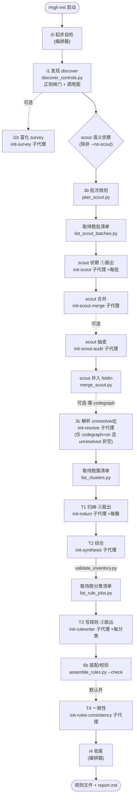

# `/mgh-init` 工作流程详解(宣导培训版)

> 面向第一次接触本工具的同事。读完这篇你能回答三件事:**它解决什么问题、
> 整条流水线怎么走、每一步由谁用什么干出什么**。
>
> 本文是对工具**功能设计**的人话讲解,不复述研发纪律(那是 `AGENTS.md` R5 系列的事)。

---

## 1. 一句话:它解决什么问题

`/mgh-init` 自动发现一个项目里**已经存在的、可复用的安全控制**(输入校验、脱敏、
鉴权、加密、限流、防 CSRF、审计日志等),并把它们整理成 AI 编程 Agent(Claude Code /
opencode)能直接读懂的**规则文件**。

**目的**:让 Agent 写新代码时,知道项目里已有哪些"现成轮子",优先复用,而不是各写各的、
重复造一套又不一致的安全实现。

**诚实边界**(任何对外总结都要写明):

- 产出是 **LLM 归纳的候选,不是已确认结论**,必须人工复核;
- 发现"**存在**" ≠ 这个控制真的"**有效**"(例如鉴权注解可能被绕过);
- 调用图是**文本/AST 级别**的,看不懂反射 / 依赖注入 / 框架路由;解析不了的会写进
  `unresolved[]` 如实披露;**当目标项目已建 codegraph 索引时**,会有一个可选步骤去"补解析"其中
  一部分(见后文「可选增强:codegraph」),但 codegraph 自己也解不动反射 / DI 容器 / 运行时分派,
  所以 `unresolved[]` 只会缩小、不会清零;
- scout(语义侦察)是**部分覆盖**,只声称实际"审视 / 深读"过的文件数,不声称全仓扫遍。

---

## 2. 核心设计:三种角色分工 + 隔离优先

整条流水线里只有三类"干活的角色",理解了这三类,后面的节点都是它们的组合:

| 角色 | 是谁 | 擅长 | 干什么活 |
|---|---|---|---|
| **确定性脚本** | `core/scripts/*.py`(纯 Python 标准库) | 机械、可重复、零成本 | 扫描、切批、取清单、合并、校验、装配规则 |
| **LLM subagent** | 各 `init-*.md` 定义的子代理 | 读得懂代码语义 | 判断"这是不是安全控制"、归纳用法、写规则 |
| **编排器** | 宿主 Agent 自己(运行命令的人/会话) | 串流程 | 按步骤调脚本、派发 subagent、收尾出报告 |

**关键约定**:

- **编排器不写代码**。它只是按命令文档的步骤,用 `Bash` 调脚本、用 `Agent` 派子代理。
- **隔离优先**:大仓库一次塞给 LLM 会超 token、还会互相干扰。做法是把工作切成小块
  ——每个簇、每个侦察批、每个分类各开一个**独立上下文**的 subagent。它们彼此看不见对方
  的活(刻意如此),只把结构化小结交给下一步。这样既能并行,又不污染判断。
- **"只看结构化小结,不看原始代码"**:跨单元的汇总层(T2 综合、scout-merge)刻意只读
  上一步产出的 JSON 记录,**不看源码**,避免把整个仓库又读一遍。

---

## 3. 整体流水线(一张图)



读图三件事:

- **实线箭头 = 主流程**,**虚线 = 可选步骤**(可被参数跳过,不跳过时才跑);
- **①②③ 三个扇出标记**:这些节点会**拆成多个子代理并行跑**(每批 / 每簇 / 每分类各一个);
- 菱形是判断分叉,矩形是实打实干活的节点。

---

## 4. 节点总览大表(一表看完全部 18 个节点)

> 列含义:**主流程** = 默认会跑(✅),可被参数跳过(⚙️),纯编排器动作(—);
> **扇出** = 是否拆多个子代理(✅拆 / —单个或脚本)。

| #         | 节点          | 主流程                            | 扇出          | 角色提示词(md)                                                            | 用到的 py 脚本                                                          | 功能(人话)                                                                | 产出                                                                                 |
| --------- | ----------- | ------------------------------ | ----------- | -------------------------------------------------------------------- | ------------------------------------------------------------------ | --------------------------------------------------------------------- | ---------------------------------------------------------------------------------- |
| i0        | 起步自检        | —(编排器)                         | —           | 无(编排器自身)                                                             | 复用 `discover_controls` 计数                                          | 校验参数(`--format` 必填)、检查子代理模型可用、统计源文件、大仓前置建议、声明运行域;**检测 codegraph**(`test -d <target>/.codegraph && command -v codegraph`)置 `codegraph=on|off` 信号透传 subagent | 无文件;stderr 进度 + 大仓建议                                                               |
| i1        | 发现 discover | ✅                              | —           | 无(脚本)                                                                | `discover_controls.py`(+`expand_scope.py`);大文件用 `chunk_sources.py` | 正则闸门扫存量控制 + 文本/AST 调用图,机械产出候选/聚类/骨架                                   | `controls_candidates.json`、`clusters.json`、`skeleton.json`                         |
| i1b       | 富化 survey   | ⚙️ 可选                          | 单个          | `init-survey.md`                                                     | 无(只读脚本产物)                                                          | 对确定性输出做轻量人工式富化:纠正错分类、给明显误报降置信                                         | `i1_enriched.json`(仅审计参考,**非** T1 输入;缺失不阻断)                                        |
| 3b-plan   | 侦察批次规划      | ✅(非 `--no-scout`)              | —           | 无(脚本)                                                                | `plan_scout.py`                                                    | 按字节预算 + 包内聚,把"regex 没覆盖的目标"切成多个批                                      | `scout_plan.json`(batches[])                                                       |
| 3b-enum   | 取待跑批清单      | ✅                              | —           | 无(脚本)                                                                | `list_scout_batches.py`                                            | 扫 `.done` 产出**可续跑**的 pending 清单(禁手挖 JSON)                             | stdout `{total,done,pending[]}`                                                    |
| 3b-fanout | 侦察 reader   | ✅                              | ✅ **每批一个**  | `init-scout.md`                                                      | `chunk_sources.py`(仅大文件)                                           | 读 regex 跳过的代码,靠**语义**找出漏掉的自研控制(精准优先)                                  | `checkpoints/scout/<batch_id>.json` + `.done`                                      |
| 3b-merge  | 侦察合并        | ✅                              | 单个          | `init-scout-merge.md`                                                | 无                                                                  | 跨批去重 / 归一化(只看结构化记录,不看源码)                                              | `scout_candidates.json`                                                            |
| 3b-audit  | 侦察抽查        | ⚙️ 可选                          | 单个          | `init-scout-audit.md`                                                | 无                                                                  | 怀疑式抽样复查 reader 判定"无控制"的目标,找回漏报                                        | `checkpoints/scout/audit.json`                                                     |
| 3b-foldin | 侦察并入        | ✅                              | —           | 无(脚本)                                                                | `merge_scout.py`                                                   | 把 scout 候选并入候选集、clusters 追加 scout 簇;**合并后即终态**                        | 改写 `controls_candidates.json`(加 `source:scout`)+ 追加 `clusters.json`                |
| 3c-resolve | 解析 unresolved | ⚙️ 可选                          | 单个          | `init-resolve.md` + `fragments/codegraph-hint.md`                    | 无(经 `describe_artifact.py` 取 `unresolved[]` 清单)                 | 仅 `codegraph=on` 且 `unresolved[]` 非空时跑:用 codegraph 把文本图漏掉的框架路由/DI/AOP 控制解析成 `source:codegraph` 附加候选并入 | `resolved.json` + `checkpoints/resolve/.done`(跳过/缺失不阻断)                    |
| T1-enum   | 取待跑簇清单      | ✅                              | —           | 无(脚本)                                                                | `list_clusters.py`                                                 | 扫 `.done` 产出 pending 簇清单(`total` = 真簇数,避开包装字典陷阱)                      | stdout `{repo,total,done,pending[]}`                                               |
| T1        | 归纳          | ✅                              | ✅ **每簇一个**  | `init-induct.md`                                                     | `chunk_sources.py`(大文件)                                            | 隔离上下文归纳"这个簇代表什么控制、该怎么用"                                               | `checkpoints/t1/<cluster_id>.json` + `.done`                                       |
| T2        | 综合          | ✅                              | 单个          | `init-synthesis.md`                                                  | 无(产出后由 `validate_inventory.py` 校验)                                 | 跨簇聚类竞品、分配角色(canonical/competing/duplicate/possibly-dead)、去重归一         | `controls_inventory.json`                                                          |
| T3-enum   | 取待跑分类清单     | ✅                              | —           | 无(脚本)                                                                | `list_rule_jobs.py`                                                | 按 category 扫 `.done` 产出 pending 清单(禁手挖 inventory)                     | stdout `{total,done,pending[]}`(含 `rule_path`)                                     |
| T3        | 写规则         | ✅                              | ✅ **每分类一个** | `init-rulewriter.md`(+`fragments/rules-format-{claude,opencode}.md`) | 无                                                                  | 按 `--format` 把每个分类的控制写成 Agent 规则(二选一,结构不混)                            | claude:`.claude/rules/security-<cat>.md`;opencode:`.mgh-init/rules-parts/<cat>.md` |
| 6b        | 装配 / 校验     | ✅                              | —           | 无(脚本)                                                                | `assemble_rules.py --format --check`                               | opencode:片段合并进 `AGENTS.md` 单受管块(幂等 + 迁移旧块);claude:仅做纯净性 lint;命中禁用词即报错 | opencode:`<target>/AGENTS.md` 受管块;claude:lint 结果                                   |
| T4        | 一致性         | ⚙️(默认开,`--skip-consistency` 关) | 单个          | `init-rules-consistency.md`                                          | 无                                                                  | 全规则**语义校订**(命名一致、锚点有效、跨分类去重、格式纯净);只校订不装配                              | 就地改规则文件 + `checkpoints/t4/consistency.json`                                        |
| i4        | 收尾          | —(编排器)                         | —           | 无(编排器自身)                                                             | 无                                                                  | 写清单 + 报告,打印产物路径 + 披露项(含 codegraph 辅助解析了多少、残留多少未解析)                                 | `init_manifest.json`(含 `codegraph:` 段)、`report.md`                                                 |

---

## 5. 节点逐个细讲(按流水线顺序)

> 下面每个节点说五件事:**它干什么 / 是不是主流程 / 拆不拆子代理 / 用哪个 md 当提示词 /
> 用哪些 py 脚本 / 产出什么**。和上表内容一致,只是说得更细。

### i0 — 起步自检(编排器)

- **干什么**:花 token 之前先校验。`--format claude|opencode` 不填直接报错停下;检查
  子代理模型是否可用;统计源文件数,超过阈值(`--large-repo-threshold`,默认 15000)就建议
  改用 `--scope` 分模块 + `--merge` 合并,而不是硬跑全仓。**同时检测 codegraph**:项目根有
  `.codegraph/` **且** PATH 上能找到 `codegraph` 命令,二者都满足才置 `codegraph=on`,否则 `off`;
  该信号逐字透传给后续 subagent(决定要不要启用 codegraph 富化)。`--no-codegraph` 可手动关掉。
- **主流程**:编排器动作,无产物。
- **扇出**:否。
- **角色提示词**:无。
- **脚本**:复用发现脚本的计数能力。
- **产出**:只有 stderr 的进度和大仓建议。

### i1 — 发现 discover(确定性脚本,主流程的机械地基)

- **干什么**:这一步**不用 LLM**,纯靠正则。用一份固定的安全词汇表(约 120 个 token:
  Spring / JCA / 常见安全词)当"闸门",扫出名字撞上的存量控制;再用文本/AST 级的调用图
  把它们聚成"簇"(cluster)。同时无损抽取每个文件的元数据骨架,供后面的侦察用。
- **主流程**:✅ 是(`--resume` 时已存在则跳过,除非 `--rebuild-cache`)。
- **扇出**:否(脚本)。
- **角色提示词**:无。
- **脚本**:`discover_controls.py`(主);`expand_scope.py` 复用做 scope 展开;大文件用
  `chunk_sources.py` 切片。跑完用 `discover_controls.py --check` 校验结构。
- **产出**:`controls_candidates.json`(正则命中,每条带 `source:regex`)、
  `clusters.json`(簇 = T1 的隔离单元)、`skeleton.json`(逐文件元数据)。

### i1b — 富化 survey(可选子代理)

- **干什么**:可选的轻量人工式富化——对确定性输出里分类可疑或形状不清的簇,读一两份
  证据文件,纠正分类、给明显误报(如 `mask` 出现在位掩码常量里)降置信。
- **主流程**:⚙️ 可选。**产出仅作审计/T2 参考,不是 T1 的输入**(T1 读 `clusters.json`);
  缺失它**不阻断**流程,也不会报致命错。
- **扇出**:单个子代理。
- **角色提示词**:`init-survey.md`。
- **脚本**:无(只读脚本产物)。
- **产出**:`i1_enriched.json`(advisory)。

### 3b — scout 语义侦察(找回 regex 漏掉的自研控制)

正则闸门只能抓住"名字撞固定词表"的控制。项目自研的、不在词表里的(比如 `PermGuard`、
`TokenInterceptor`、`TraceLogger`)正则完全看不见。scout 这一段就是放 LLM 去读"正则跳过的
代码",靠语义把它们捞回来。它分五小步:

- **3b-plan 批次规划**(`plan_scout.py`,脚本):把待侦察目标按**字节预算**(`--scout-batch-bytes`)
  和**包内聚**(同一包尽量同批)切成多个批;`plan_scout.py --check` 校验批次合法。
  产出 `scout_plan.json`。
- **3b-enum 取待跑批清单**(`list_scout_batches.py`,脚本):扫 `.done` 产出**可续跑**的
  pending 批清单(编排器只对它迭代,**禁止手挖 JSON 或写小脚本**)。
- **3b-fanout 侦察 reader**(`init-scout.md`,**扇出——每批一个子代理**):每个子代理在
  隔离上下文里只看自己那一批,自由 Read/Glob/Grep,甚至自创搜索词去找控制。**精准优先于
  召回**——拿不准就不报,"这批没有控制"是合法且常见的结局。大文件用 `chunk_sources.py`
  切片,绝不整文件喂。产出 `checkpoints/scout/<batch_id>.json`。
- **3b-merge 侦察合并**(`init-scout-merge.md`,单个子代理):**唯一**能看到全部侦察批
  结构化记录(不看源码)的层,做跨批去重 / 归一化。产出 `scout_candidates.json`;
  `merge_scout.py --check` 校验。
- **3b-audit 侦察抽查**(`init-scout-audit.md`,可选单个子代理):怀疑式抽样(约
  `--scout-audit-pct`,默认 15%)复查 reader 判"无控制"的目标,把漏报捞回来。产出
  `checkpoints/scout/audit.json`。
- **3b-foldin 并入**(`merge_scout.py`,脚本,复用 `form_clusters`):把侦察候选并入候选集
  (加 `source:scout`)、`clusters.json` 追加侦察簇。**合并后这三份产物即终态**,不再二次
  聚合或重切批。

### 3c — 解析 unresolved(可选,仅 `codegraph=on` 时)

> 这一节整段**可选**,没建 codegraph 索引的项目完全跳过,流水线一字不变。详见后文「可选增强:codegraph」。

- **干什么**:确定性调用图是文本/AST 级,看不懂框架路由 / DI / AOP / interface→impl / 反射,
  这类控制会被明文丢进 `unresolved[]`。当 `codegraph=on` **且** `unresolved[]` 非空时,这一个
  子代理在**单个上下文**里(不扇出)用 codegraph 把它们"补解析"出来——查到真实的 `file:line`
  和调用路径(请求入口 → … → 这个控制),作为 `source:"codegraph"` 的**附加候选**并入候选集,
  和 regex/scout 候选走同一条后续聚类路。**只往里加料,不改已有的 regex/scout 候选**。
- **主流程**:⚙️ 可选。codegraph off / `unresolved[]` 为空 / 清单过大 → 整步跳过并在摘要里说明,
  流水线不阻断。
- **扇出**:否(单个子代理,一次性吃下整个 `unresolved[]` 清单;清单过大时按 bounded fail-soft 跳过)。
- **角色提示词**:`init-resolve.md` + `fragments/codegraph-hint.md`。
- **脚本**:无(只做 codegraph 解析 + 结构化记录);`unresolved[]` 清单由编排器经合法出口
  `describe_artifact.py` 取得(禁 `py -c` 内省、禁 Read 整份大 JSON)。
- **诚实约束**:解析不出的(纯运行时反射 / DI 容器分派)老实留在 `unresolved_residual[]`,
  **绝不伪造**;codegraph 解出来的 `confidence` 不高于 regex/scout 证据等级——存在 ≠ 有效。
- **产出**:`resolved.json` + `checkpoints/resolve/.done`(缺失或跳过都不阻断 T1)。

### T1 — 归纳(扇出——每簇一个子代理)

- **干什么**:每个簇在一个隔离上下文里,由子代理读它的证据文件(+ 分布式形状的几处用法),
  归纳出"这个控制**是什么 / 开发者该怎么复用 / 有什么覆盖缺口**"的一条结构化记录。`codegraph=on`
  时,子代理还可拿 codegraph 的 blast radius(谁依赖这个控制、它是否真在请求路径上 vs 死代码)
  作**辅助证据**,强化"存在 ≠ 有效"的判断——但只是辅助意见,不替代语义判断。
- **主流程**:✅。先经 `list_clusters.py` 取 pending 簇清单(`clusters.json` 是包装字典,
  对它顶层取 `len()` 得到 3 **不是**簇数——必须用脚本取 `total` 字段)。
- **扇出**:✅ 每簇一个 `init-induct` 子代理;大文件用 `chunk_sources.py` 切片。
- **角色提示词**:`init-induct.md`。
- **产出**:`checkpoints/t1/<cluster_id>.json` + `.done`。

### T2 — 综合(单个子代理,唯一看全部 T1 记录的层)

- **干什么**:跨簇聚类——把同一个分类下"互相竞争"的多套实现(老项目常有 2+ 套鉴权或脱敏)
  分组,并给每个分配角色:`canonical`(框架背书 / 高扇入 / 在 security·common·config 包 /
  注解式)、`competing`、`duplicate`、`possibly-dead`(几乎没人用)。**只打标,不删除**。
  同时按证据锚点去重、归一化命名。
- **主流程**:✅。
- **扇出**:单个子代理(只读 T1 的结构化记录,不看源码)。
- **角色提示词**:`init-synthesis.md`。
- **脚本**:产出后由 `validate_inventory.py` 做边界校验(`design_controls` 兼容字段 +
  每条 evidence 锚点 + category→kind 归一;失败退出码 2 → 回退重跑)。
- **产出**:`controls_inventory.json`(下游 `/mgh-sra` / `/mgh-blst` / 未来 mgh-sast 的输入)。

### T3 — 写规则(扇出——每分类一个子代理)

- **干什么**:按 `--format` 把每个分类的控制写成 Agent 能直接加载的规则。结构由格式片段
  严格规定,**二选一、绝不混**(混了 Agent 加载不到):
  - `--format claude` → 每个 `<分类>` 一个 `.claude/rules/security-<分类>.md`,带 `paths:` 前言;
  - `--format opencode` → 每个 `<分类>` 一个暂存片段 `.mgh-init/rules-parts/<分类>.md`(中性、
    不带哨兵,由装配步骤合并)。
  规则正文只写**目标项目**的控制本身(严禁出现本工具的脚本名 / 层级 / 内部路径)。
- **主流程**:✅。先经 `list_rule_jobs.py` 取按分类的 pending 清单(禁手挖 inventory)。
- **扇出**:✅ 每分类一个 `init-rulewriter` 子代理。
- **角色提示词**:`init-rulewriter.md` + `fragments/rules-format-{claude,opencode}.md`。
- **脚本**:无(产规则文本)。
- **产出**:对应格式的规则文件 / 片段 + `.done`。

### 6b — 装配 / 纯净性校验(确定性脚本)

- **干什么**:
  - **opencode**:把全部暂存片段合并进 `<target>/AGENTS.md` 的**单个中性受管块**(幂等替换、
    迁移旧块、不动用户其它内容);
  - **claude**:T3 已直写文件,本步只做**纯净性 lint**;
  - 命中禁用 token(工具名 / 脚本名 / 层级词 / 内部路径)= 规则正文泄漏,**fail-loud**(退出码 2),
    回 T3 修正后重跑。
- **主流程**:✅。
- **扇出**:否(脚本)。
- **脚本**:`assemble_rules.py --format <fmt> --check`(范式源头)。
- **产出**:opencode 的受管块;claude 的 lint 结果。

### T4 — 一致性(可选子代理,默认开)

- **干什么**:对全部已写规则做**纯语义校订**:命名一致(同一个控制在各分类里同名)、
  锚点有效(无悬空引用)、跨分类去重(重复出现的指向同一个规范锚点互链)、格式纯净。
  只标不改装配(`AGENTS.md` 装配是 6b 的活,T4 不碰)。
- **主流程**:⚙️ 默认开,`--skip-consistency` 可关。
- **扇出**:单个子代理。
- **角色提示词**:`init-rules-consistency.md`。
- **脚本**:无。
- **产出**:就地改规则文件 + `checkpoints/t4/consistency.json`。

### i4 — 收尾(编排器)

- **干什么**:写清单与报告,打印产物路径 + 必须披露的边界项(LLM 候选需复核、存在≠有效、
  调用图是文本级、scout 是部分覆盖……)。codegraph 辅助过的运行,清单里会多一个 `codegraph` 段
  (`available` / `used` / `resolved_count` / `unresolved_residual`),报告里也写明"codegraph
  解析了 N 条、残留 M 条未解析",**不声称全部解析**。
- **主流程**:编排器动作。
- **扇出**:否。
- **产出**:`init_manifest.json`(版本 / 格式 / 计数 / provenance / unresolved[] /
  out_of_scope[] / boundaries[])、`report.md`(人读摘要,含"竞品控制"小节)。

---

## 5½. 可选增强:codegraph(项目已建索引时,自动启用)

> 这一节整段都是**可选的**。没建 codegraph 索引的项目完全跳过,整条流水线一字不变。建了索引才自动启用,
> 想关掉就加 `--no-codegraph`。

**codegraph 是什么**:一个外部工具(宿主能力,**不是**要你 `pip install` 的依赖,所以不破坏"零运行时依赖"
这条产品特性)。它给目标项目预计算了一张"知识图谱"——每个符号、谁调用谁、**框架是怎么把控制织进去的**
(Spring `@*Mapping` / Feign / AOP 切面 / `@Autowired` / JPA / interface→impl 这类),都提前画好了,
放在项目的 `.codegraph/` 目录里。i0 起步时会检测:项目根有没有 `.codegraph/` **且** PATH 上能找到
`codegraph` 命令——两个都满足才置 `codegraph=on`,否则 `off`(行为跟以前一模一样)。

**它补的是哪个盲区**:正则发现 + 文本调用图**结构性解不动**框架路由 / DI / AOP / interface→impl / 反射
——这些控制没有"文本调用边",于是被丢进 `unresolved[]`(就是工具自己承认的诚实盲区)。codegraph 的
预计算图谱正好提前把这些边画好了。

**`codegraph=on` 时多干两类事:**

1. **外科式上下文(省 token)**:scout / induct / survey 子代理**优先**一次 `codegraph_explore`
   取"符号源码 + 调用路径 + blast radius",只对 codegraph 没覆盖的文件(非索引语言 / 超大文件 /
   索引未含 / codegraph 自己标了 `⚠️ pending` 的)才回退 `Read`。大仓上收益最明显(本该逐文件爬的活
   一次调用就拿到了)。措辞是**硬要求**("SHALL 优先 codegraph,仅回退 Read"),不是"你可用可不用"——
   后者会让子代理还是自己 Read,codegraph 就白搭了。

2. **★ 新增 `init-resolve` 步骤:补解析 `unresolved[]`(本增强最独特、最高价值的地方)**:在 scout
   合并完、进 T1 之前,插一个子代理(单个上下文、不扇出),用 codegraph 把 `unresolved[]` 里那些
   框架路由 / DI / AOP 控制重新解析出来,每条带真实 `file:line` + 解析出的调用路径,作为
   `source:"codegraph"` 的**附加候选**并入候选集,和 regex/scout 候选走同一条 T1→T2→T3 路。它
   **只加料、不删改**已有候选。

**三条保证**:

- **不改确定性脚本契约 / 不新增依赖**:codegraph 在 LLM 层经 MCP / Bash 消费,绝不被任何 `.py`
  `import` 或 `subprocess` 调;`discover_controls` / `plan_scout` / `merge_scout` 的接口一字不动。
- **存在 ≠ 有效 仍然成立**:codegraph 解析出一条控制 = 它确实被框架接进去了(wiring),**不等于**它
  真的挡得住攻击(比如参数化类型上的 `@PreAuthorize` 仍可能被绕过)。所以解析候选的置信度**不高于**
  regex/scout,blast radius 只作辅助证据。
- **缩小不归零、如实披露**:codegraph 自己也解不动纯运行时反射 / DI 容器分派 / 动态代理,所以
  `unresolved[]` 只会变小、不会清空。台账如实记"解析了 N 条、残留 M 条",报告里写明,**绝不声称全部
  解析**。`--no-codegraph` 一键回到没有 codegraph 的行为。

---

## 6. 名词扫盲(培训速查)

| 名词 | 通俗解释 |
|---|---|
| **候选 candidate** | 一个"疑似安全控制"的发现,带分类、锚点、证据片段、置信度、来源(`regex`/`scout`/`codegraph`) |
| **簇 cluster** | 把零散候选按调用关系聚成的"一个控制单元",是 T1 的隔离单元 |
| **清单 inventory** | T2 综合后的最终结构化清单(`controls_inventory.json`),下游工具的输入 |
| **category / kind** | `category` = 控制领域(鉴权 / 脱敏 / 加密…);`kind` = 6 值枚举(auth / input-validation / sandbox / aslr / cfi / other) |
| **canonical / competing / duplicate / possibly-dead** | T2 给竞品组里的控制分配的"角色":规范主力 / 竞争替代 / 重复 / 疑似废弃 |
| **fan-out 扇出** | 把一项工作切成 N 份,各开一个隔离子代理并行跑(侦察按批、T1 按簇、T3 按分类) |
| **checkpoint / resume** | 每个单元跑完写 `.done` 标记;`--resume` 跳过已完成的,断点续跑 |
| **确定性 vs LLM** | 前者 = 脚本,可重复零成本(扫描/切批/合并/校验);后者 = 子代理,读得懂语义(判断/归纳/写规则) |
| **纯净性 lint** | 规则正文只允许写目标项目的控制本身,禁止混入本工具的脚本名 / 层级词 / 内部路径 |
| **codegraph(可选)** | 外部工具给项目预计算的知识图谱(符号 + 调用边 + **框架路由**)。项目有 `.codegraph/` 才启用;没建索引时整个增强不存在、行为不变,`--no-codegraph` 可手动关 |
| **`unresolved[]` / `resolved.json`** | `unresolved[]` = 文本调用图解不动的控制(诚实盲区);`codegraph=on` 时 `init-resolve` 把其中能解的解析进 `resolved.json`(附加 `source:"codegraph"` 候选),解不动的留在 `unresolved_residual[]` |

---

## 7. 最终产出哪些文件(在 `<target>/.mgh-init/` 下)

| 文件 | 内容 | 谁产出 |
|---|---|---|
| `controls_candidates.json` | 全部候选(正则命中 + scout + 可选 codegraph 解析),每条带 `source` | i1 + 3b-foldin(+3c-resolve) |
| `skeleton.json` | 逐文件元数据骨架(scout 输入,纯机械抽取) | i1 |
| `scout_plan.json` | 侦察批次规划(字节预算 + 包内聚) | 3b-plan |
| `scout_candidates.json` | 合并后的 scout 候选(`source:scout`)+ `unresolved[]` | 3b-merge |
| `clusters.json` | T1 隔离单元(正则簇 + 追加的 scout 簇) | i1 + 3b-foldin |
| `resolved.json`(可选) | codegraph 解析 `unresolved[]` 得到的附加候选(`source:"codegraph"`)+ 残留 `unresolved_residual[]`;仅 `codegraph=on` 时产 | 3c-resolve |
| `controls_inventory.json` | 最终结构化清单(`design_controls` 兼容) | T2 |
| `checkpoints/**` | 每个单元的产物(用于 resume) | 各扇出层 |
| `init_manifest.json` | 版本 / 格式 / 计数 / provenance / unresolved[] / `codegraph:` 段 / boundaries[] | i4 |
| `report.md` | 人读摘要(含"竞品控制"小节) | i4 |
| **规则产物** | claude → `<target>/.claude/rules/security-*.md`;opencode → `<target>/AGENTS.md` 单个中性受管块 | T3(+6b 装配) |

---

## 8. 怎么跑(最常用场景)

```bash
# 装进目标项目(install 后,核心文件落到 .claude/mgh-core/)
./install.sh --claude .          # 或 --opencode .

# 在目标项目里跑(二选一格式;大仓用 --scope 分模块 + --merge 合并)
/mgh-init --format claude        # 或 --format opencode

# 断点续跑(跳过已 .done 的单元)
/mgh-init --format claude --resume
```

关键参数速查:`--scope path:<dir>|package:<pkg>|file:<glob>` 限定范围;`--merge <partials-dir>`
合并多次范围运行后停止;`--no-scout` 关掉语义侦察(回退纯正则);`--no-codegraph` 关掉可选的 codegraph
富化(默认 `auto`——项目有 `.codegraph/` 且能找到 `codegraph` 工具才启用,关掉 = 行为跟没有 codegraph
时一模一样);`--skip-consistency` 关掉 T4;`--no-enforce-hook` 安装时不注入运行时纪律 hook。

---

## 附:给讲师的一页讲解提纲

1. **痛点**:Agent 不知道项目已有安全控制 → 重复造轮子、实现不一致。
2. **解法**:自动发现存量控制 → 生成 Agent 规则,让 Agent"先查再写"。
3. **怎么保证质量**:确定性脚本打地基(可重复)+ LLM 子代理补语义(看得懂自研控制),
   两者隔离分工。
4. **怎么扛大仓**:隔离优先——侦察按批、T1 按簇、T3 按分类扇出;checkpoint + resume 续跑;
   超阈值建议分模块 `--scope` + `--merge`。
5. **诚实**:候选需复核、存在≠有效、调用图是文本级、scout 是部分覆盖——这些必须如实披露。
6. **(可选)codegraph**:项目建了索引时,mgh-init 会用 codegraph 把文本调用图漏掉的框架路由 / DI / AOP
   控制补解析进候选集(还能给子代理省 token)。它**缩小但不归零**盲区、解析候选仍是"待复核"非定论、
   `--no-codegraph` 可关——没建索引的项目完全无感。
