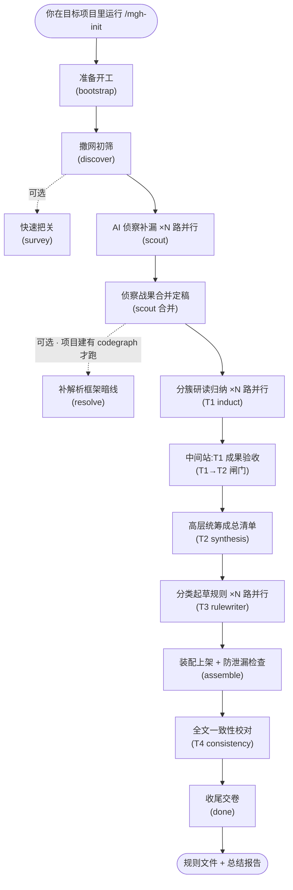

# `/mgh-init` 工作流程详解(宣导培训版)

> 受众:**人类**(第一次接触本工具的同事,不需要任何背景知识)。
> 三兄弟文档分工:[`docs/man/mgh-init.md`](man/mgh-init.md) 讲**怎么用**、
> [`docs/man/mgh-init-artifacts.md`](man/mgh-init-artifacts.md) 讲**产物字段**,
> 本文讲**这条流水线内部是怎么一步一步干活的**。
>
> 本文讲功能设计,不复述研发纪律(那是 `AGENTS.md` 的事);提到的具体脚本/文件名仅在
> 文末「想再深一层」给出索引,正文一律用人话描述。

---

## 1. 它解决什么问题

你的项目里**已经**有很多安全防御措施:参数校验、鉴权、脱敏、加密、限流、审计日志……但
帮 AI 写代码的助手(Claude Code / opencode)**并不知道**这些轮子的存在,于是要么视而不见、
要么自己另造一套跟项目不一致的实现。

`/mgh-init` 干的事:把项目里已有的安全控制**找出来**、整理成清单,**写成助手能自动读懂的
规则文件**。以后 AI 写新代码时会照着项目的现成做法复用。

**诚实边界**(必须了解的四条):

- 结果是 **AI 归纳的候选,不是结论**,要人复核;
- "发现它**存在**" ≠ "它真的**有效**"(比如某个鉴权注解可能实际挡不住攻击);
- 第一步画的调用关系图是**文本级别**的,看不穿框架"魔法"(注解路由、依赖注入、切面),
  这些盲区会如实列出来,不会假装扫干净了;
- 让 AI 读代码的那步是**部分覆盖**(只声称真正读过的地方),两次运行的结果可能有细微差别。

---

## 2. 先认识三类干活的角色

后面每个步骤都是这三类角色的排列组合:

| 角色 | 是谁 | 擅长 |
|---|---|---|
| **确定性脚本** | 纯 Python 小工具 | 机械、便宜、每次结果一样:扫描、排班、合并、核对、组装 |
| **AI 子代理** | 由一套"岗位说明书"提示词临时雇来的 AI | 读得懂代码语义:判断、归纳、写规则 |
| **编排器** | 你发起命令时的那个 AI 会话本身 | 领班:按剧本调脚本、派 AI、汇总 |

关键约定两条:

- **拆活并行(行话"扇出")**:大仓库一次性喂给 AI 会撑爆上下文、还会互相干扰。所以凡是
  能拆的活都切成小份,**每一份开一个彼此看不见的独立 AI**去干,干完只上交结构化的小结。
- **进度记在硬盘上,不靠 AI 的记忆**:每个小活干完就在磁盘上盖一枚"完成章"。中断、崩溃、
  甚至关掉会话明天再来,工具先问磁盘"我干到哪了",从断点继续。

---

## 3. 整条流水线(一张图)


```mermaid
flowchart TD
    Start(["你在目标项目里运行 /mgh-init"]) --> N0["准备开工<br/>(bootstrap)"]
    N0 --> N1["撒网初筛<br/>(discover)"]
    N1 -. 可选 .-> N2["快速把关<br/>(survey)"]
    N1 --> N3["AI 侦察补漏 ×N 路并行<br/>(scout)"]
    N3 --> N3b["侦察战果合并定稿<br/>(scout 合并)"]
    N3b -. 可选 · 项目建有 codegraph 才跑 .-> N4["补解析框架暗线<br/>(resolve)"]
    N3b --> N5["分簇研读归纳 ×N 路并行<br/>(T1 induct)"]
    N5 --> N5b["中间站:T1 成果验收<br/>(T1→T2 闸门)"]
    N5b --> N6["高层统筹成总清单<br/>(T2 synthesis)"]
    N6 --> N7["分类起草规则 ×N 路并行<br/>(T3 rulewriter)"]
    N7 --> N8["装配上架 + 防泄漏检查<br/>(assemble)"]
    N8 --> N9["全文一致性校对<br/>(T4 consistency)"]
    N9 --> N10["收尾交卷<br/>(done)"]
    N10 --> Out(["规则文件 + 总结报告"])
```

读图三句话:

- 实线是默认必经之路;**虚线是可跳过的**(可能因为条件不满足被自动跳过,也可能被参数关掉);
- 标了 **"×N 路并行"** 的节点会把活拆成很多小份、每份一个独立 AI 同时干;
- 圆角框是起点终点,矩形是真正干活的步骤,括号里是这套工具内部的阶段名(查资料时对号入座)。

---

## 4. 每个节点是干嘛的

> 每步都回答三个问题:**干了什么 / 谁来干 / 产出什么**。

### 0. 准备开工(bootstrap)

花大钱之前先办手续:检查 AI 助手可用;数一数项目有多少源文件(超大仓库此时就会建议你
改用"分模块扫、再合并"的跑法,别硬来);把你这次的所有选项**写进一张开工登记表**
——以后断点续跑全靠查这张表,不用你再输一遍参数;同时立起一块"施工中"的警示牌,
激活一套保护机制,防止过程中误写误删项目里不该动的文件;顺便探一下项目有没有装
codegraph(一种预先生成的代码知识地图,见第 5 节)。

谁来干:全是脚本和编排器的机械动作,没有 AI 参与判断。产出:只有磁盘上的登记表、警示牌
和一些屏幕上的提醒。

### 1. 撒网初筛(discover)

**不用 AI、纯机械**的第一遍粗筛。拿一份固定的"安全常用词表"(校验、鉴权、加密之类约一百来个
特征词)当筛子,飞快过一遍源码:名字或代码形状撞上的,记作"疑似安全控制"。接着顺着代码里的
函数调用关系,把这些散落的疑似点**聚成一团一团**(一团 ≈ 一个控制的完整实现,下称"簇"),
顺手画一张"谁调用谁"的关系草图。还给每个文件抄了一张"档案卡"(路径、大小等),供后面侦察
排计划用。

产出三份地基账本:疑似控制名单、簇划分、文件档案——后面所有步骤都建在这上面。这里还会做
一次自我核对(结构不对立刻报错重来)。

### 2. 快速把关(survey,可选)

请一个 AI 助理把初筛结果翻一遍:明显分错类的纠正好、明显误报的降置信(比如关键词
"mask" 其实只是位掩码运算)。它的产出只是**参考意见**,不改主线流程;这一步可有可无,
不做也不影响后续。

### 3. AI 侦察补漏(scout,×N 路并行)

词表有个天生缺陷:只能抓"名字撞车"的控制,自研名字的轮子(比如项目自己写的
`PermGuard` 权限守卫)它完全看不见。这一步就是放 AI 去**读初筛没碰过的代码**,靠理解力
把漏网的控制捞回来。内部分四小步:

1. **排班**:脚本按体量把待读文件切成一小批一小批,同一模块的尽量排在同一批;
2. **并行侦察**:每批派一名独立 AI 侦察兵,在自己的封闭上下文里自由翻阅、搜索。原则是
   **精准第一**:拿不准就不报,"这批没有控制"是完全正常的结论。太大的文件先切片再读,
   绝不整篇硬灌;
3. **合并**:一名"班长"只看各侦察兵上交的**结构化战报**(刻意不看源码),负责跨批去重;
4. **定稿并入**:脚本把查实无重复的战果并进总名单、追加进簇划分。加上一道可选的
   "怀疑式抽查":随机抽几个侦察兵说"这里没有"的地方复查,再捞一层漏网之鱼。

这一步结束,名单和簇划分就是**定稿**,后面不再改动。新版的并行派工由一个确定性的
"派工总管"脚本包办:它拿着每个人的确切任务单,一波一波地把 AI 放出去、收回成果、盖章;
限时到了没干完就如实上报"未完待续",上层把同一条命令再跑一遍就能无缝接着干。

### 4. 补解析框架暗线(resolve,可选)

第一层关系草图看不穿框架的"隐形接线":Spring 的注解路由、依赖注入、切面……这类控制
在初筛时会被老实列入"未解之谜"清单。如果项目建有 codegraph 图谱(提前算好的
"谁接到谁"的地图),这一步就让一个 AI 拿着图谱逐条破案:找到真实文件行号、还原调用链,
当作**新增线索**并入候选(只加料,绝不改前面已有结论)。实在破不了的(比如纯运行时反射)
继续挂着,绝不编造。项目没建图谱的话,这一整步自动不存在,流程一字不变。

### 5. 分簇研读归纳(T1 induct,×N 路并行)

到这里为止都还只是"疑似"。现在每个簇派一名独立 AI 分析员:细读本簇的证据文件加几处真实
用法,写一份规整的小结——**这是什么控制、开发者该怎么正确复用、覆盖了哪些场景、有什么缺口**。
有 codegraph 时还能参考"影响半径"(多少地方依赖它、是不是没人用的死代码)来支撑
"存在 ≠ 有效"的判断。全部分析员交卷后有一道**铁面门禁**:脚本逐份验收小结的格式是否
标准划一(内容乱了就定位到具体哪份、推倒那份重做),合格才放行进入下一步。

### 6. 高层统筹成总清单(T2 synthesis)

一名"总监"看完全部分析员的小结(只看小结,不看源码),干三件事:同类归并;同一功能出现
好几套实现的老项目常见病,给它们发**角色牌**——谁是主力(canonical)、谁是替代方案、
谁是重复、谁疑似废弃没人用(只贴牌,不删东西);统一命名口径。

产出一部机器可读的《存量安全控制总清单》——这是整个流程的核心产物,下游其他工具
也要吃它。出稿后再由一个独立校对脚本核一遍字段完整性,坏档打回重跑。

### 7. 分类起草规则(T3 rulewriter,×N 路并行)

把总清单按类别(鉴权、输入校验、加密……)分发,每类一个独立 AI 写手,按你开局选的平台
把这类控制写成助手能直接加载的规则:正文只写**你项目里的控制本身**——是哪个注解、
哪个工具类、示范怎么调,附带真实文件的出处锚点,严禁夹带本工具自身的行话。
claude 平台:每类一个带"改哪些文件才生效"声明的规则文件;opencode 平台:每类一篇
独立的详述文档。

### 8. 装配上架(assemble)

opencode 跑法:脚本把全部类别文档收拢,在你项目的 `AGENTS.md` 里安放一个**简短的分类目录**
(行话"惰性索引块")——平时只占几十行,写着"想要鉴权类规则 → 去读某文件",助手按需取读,
不占常驻空间。它是幂等的:重复跑只替换目录块自身,你自己写的其他内容一个字不动。
claude 跑法:文件在上一站已直写到位,这里只做收尾检查。两种跑法最后都会过一遍**防泄漏
安检**:规则正文混入工具内部术语立即响警报、退回上一步整改。

### 9. 全文一致性校对(T4 consistency,默认开、可关)

一名"终审编辑"通读全部成品规则:同一个控制在各类别里的叫法统一、没有指空的引用、
跨类别重复的内容改成互相链接、整体格式干净。它只在语义上润色,不再动装配。赶时间可用
参数关掉。

### 10. 收尾交卷(done)

写两份收官产物:一份**给人看的总结报告**(发现了哪些类别、有哪些"多套实现打架"、
哪些批次失败了需要人跟进、全部边界如实披露),一份机器可读的**总台账**。在屏幕上列出
全部产物路径,然后撤掉"施工中"警示牌,收工。

---

## 5. 可选增强:codegraph(项目建过索引才会启用)

codegraph 是一个外部工具,能给代码库预先算好一张"知识图谱":每个符号是谁、谁调用谁、
**框架是怎么把控制织进请求链路的**。它不是本项目要安装的依赖,而是一种宿主机能力——
项目根有 `.codegraph/` 目录且机器上有这个命令,准备开工那步就会探测到并自动启用;
想关掉传一个 `--no-codegraph` 参数即可,行为跟完全没有它时一模一样。

| 它带来的 | 说明 |
|---|---|
| 省 token | AI 角色 (侦察兵/分析员/助理) 优先问图谱"一次拿全源码+调用链",读文件次数大幅下降 |
| 破案盲区 | 上面的 resolve 步骤:把文本图看不穿的框架接线控制补解析进候选 |

三条保证:**不改**任何确定性脚本的接口;解析出来的东西依然"存在 ≠ 有效"、同样需要人复核;
盲区只会缩小不会清零——它能解多少、还剩多少,都在报告里如实记账。

---

## 6. 名词速查

| 名词 | 通俗解释 |
|---|---|
| 疑似控制(candidate) | 一条"看起来像安全控制"的发现,带出处文件:行号、证据片段、来源(词表/侦察/图谱) |
| 簇(cluster) | 一团相关的疑似点 = 一个控制的完整实现,是"分簇研读"步的隔离单位 |
| 总清单(inventory) | T2 统筹后的正式产物,机器可读;下游其它工具也消费它 |
| 角色牌 | 多套实现并存时 T2 发的身份标识:主力 / 替代 / 重复 / 疑似废弃 |
| 扇出(fan-out) | 把一项工作切成 N 份,每份一个互不相通的独立 AI 并行去干 |
| 检查点 / 断点续跑 | 每个小活完工即落盘成果 + 盖"完成章";重跑时已盖章的直接跳过,只补缺口 |
| 惰性索引块 | opencode 产物形态:`AGENTS.md` 里的简短目录块,助手用到哪类规则再按指引去读对应详文 |
| 未解之谜(unresolved) | 文本级调用图看不穿的框架接线控制;有 codegraph 时尽力破案,剩余挂账如实披露 |
| 纯净性检查 | 成品规则里禁止混入本工具自身的术语/路径;查出即拦截返工 |
| codegraph | 外部图谱工具(可选):预计算符号、调用边与框架路由;建了索引才自动启用 |

---

## 7. 最终产出在哪

| 位置 | 内容 |
|---|---|
| `<项目>/.mgh-init/` | 过程工作区:各步底账、每簇/每批小结、总清单 `controls_inventory.json`、总结 `report.md`、总台账。建议加入 gitignore |
| `<项目>/AGENTS.md` | (opencode)被安放的**简短分类目录块**——块外你的原文一动不动 |
| `<项目>/docs/security-controls/` | (opencode)每个类别一篇详述文档 |
| `<项目>/.claude/rules/` | (claude)每个类别一个带路径作用域的规则文件 |

---

## 8. 怎么跑

```bash
./install.sh --opencode .     # 装进目标项目(--claude 对应另一平台)
/mgh-init                   # 目标项目里运行,默认 opencode 产物
/mgh-init --format opencode   # 指定 opencode 产物
/mgh-init --resume          # 中断后从断点继续
```

常见情境速查:

| 情境 | 做法 |
|---|---|
| 仓库超大 | 加 `--scope 只扫某模块`,跑几次后用 `--merge 目录` 合并(开工时会主动建议) |
| 不想要 AI 侦察 | `--no-scout`,回到纯词表快筛(省时但只抓"名字撞车"的) |
| 关闭图谱增强 | `--no-codegraph`(没建过索引的项目本来就不会启用) |
| 跳过终审校对 | `--skip-consistency` |

---

## 附:给讲师的一页提纲

1. **痛点**:AI 不知道项目已有安全轮子 → 重复造轮子、实现不一致。
2. **思路**:机械初筛打底(便宜可重复)+ AI 侦察补语义盲区(看得懂自研实现),然后
   逐簇归纳、统筹去重、分类写规则——机械与智能各干擅长的半场。
3. **两大法宝**:拆活并行(每个小份一个隔离 AI,防干扰防超载)+ 进度落盘(断点续跑,
   中途崩了也不用从头来)。
4. **质量线**:几乎每步都有自动核对,坏档就地打回,不带病前进;成品还要过防泄漏安检。
5. **诚实**:候选须人复核、"存在 ≠ 有效"、盲区如实披露——这些话术要求贯穿每一次对外汇报。
