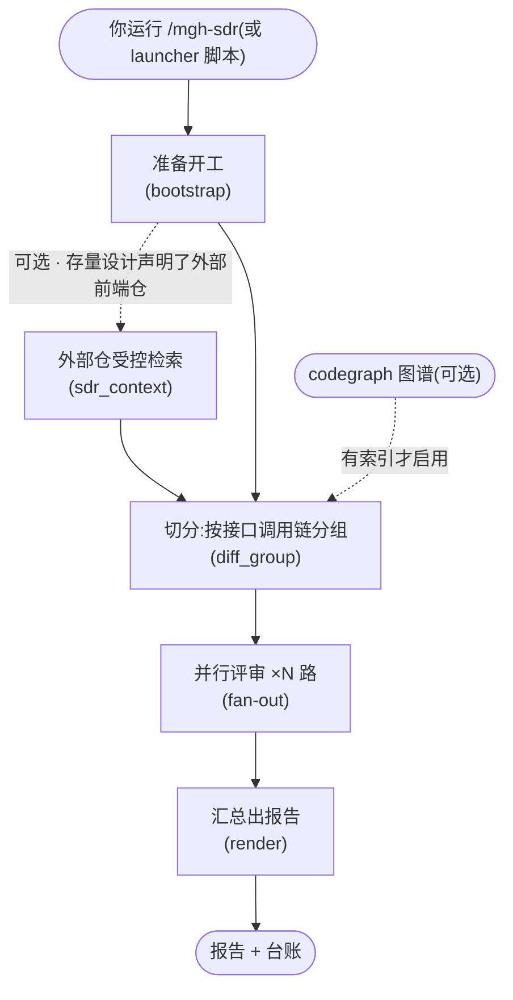

# `/mgh-sdr` 工作流程详解(宣导培训版)

> 受众:**人类**(第一次接触本工具的同事,不需要任何背景知识)。
> 本文讲**这条流水线内部是怎么一步一步干活的**,不复述研发纪律,也不复述命令手册的安装/配置
> 细节;提到的具体脚本/文件名仅在「最终产出在哪」和「怎么跑」两节给出,正文一律用人话描述。

---

## 1. 它解决什么问题

需求分支研发完了,代码马上要合并(merge)进版本分支。但合之前,通常没有人系统地核对过一件事:
项目里**早就定好**的一堆安全规矩——哪些接口要鉴权、SQL 必须参数化、敏感字段要脱敏……**这次
改动到底有没有照着做**。靠人工逐个接口核对,又慢又容易漏。

`/mgh-sdr`(security design review,安全设计符合性复核)干的事:把这次需求的代码改动(在 git
上从基准分支到当前分支的差异,下称 diff)拉出来,按**接口**切成一块块,再**机械地对照项目里
已经定好的安全设计**逐块问一句:「这里该做的,做了吗?」最后给你一份简体中文报告,列出每处
疑似漏按规矩的地方,留给你人工拍板。

它和几个兄弟命令要分清(都是 mgh 工具族的一员):

| 命令 | 干什么 | 输入 |
|---|---|---|
| `/mgh-init` | 把项目里已有的安全规矩**找出来、写成规则** | 整个代码库 |
| `/mgh-sra` / `/mgh-srr` | 回答「**新需求**该怎么设计」 | 需求文本 |
| `/mgh-sast` | **漏洞扫描**:不运行代码、分析源码找安全漏洞 | 代码 |
| `/mgh-sdr` | **设计符合性复核**:对照已有规矩,查这次改动漏没漏做 | 代码 diff |

一句话:`/mgh-sast` 是「有没有漏洞」,`/mgh-sdr` 是「你自己定的规矩,这次漏没漏」。

**诚实边界**(必须了解的四条):

- 结果是 **AI 生成的候选,不是确认漏洞**,每一处都要人复核拍板;
- 分组是**启发式**的:漏分组**不会漏检查**(那部分会并进"独立变更"单元继续被看),只是分析
  粒度粗一点;
- codegraph(见第 5 节)的调用关系是**静态分析**,看不穿反射、依赖注入这些运行时"魔法",
  判不穿的会老实拆成独立单元,绝不硬塞;
- 引用外部前端仓时,拿到的结论是**检索那一刻的快照**,不保证前端分支已经同步到最新。

---

## 2. 先认识三类干活的角色

后面每个步骤都是这三类角色的排列组合:

| 角色 | 是谁 | 擅长 |
|---|---|---|
| **确定性脚本** | 纯 Python 小工具 | 机械、便宜、每次结果一样:拉 diff、分组、派工、汇总、核对 |
| **AI 子代理** | 由一套"岗位说明书"提示词临时雇来的 AI | 读得懂代码语义:对照设计、判断「这处漏没漏做」 |
| **编排器** | 你发起命令时的那个 AI 会话本身 | 领班:按剧本调脚本、派 AI、汇总 |

关键约定两条:

- **拆活并行(行话"扇出")**:一次大 diff 整个喂给一个 AI 会撑爆上下文、还会互相干扰。所以把
  评审切成一个个小单元,**每一单元开一个彼此看不见的独立 AI**去干,干完只上交结构化的问题记录。
- **进度记在硬盘上,不靠 AI 的记忆**:每个小活干完就在磁盘上盖一枚"完成章"。中断、崩溃、甚至
  关掉会话明天再来,工具先问磁盘"我干到哪了",从断点继续。

---

## 3. 整条流水线(一张图)



读图三句话:

- 实线是默认必经之路;**虚线是可跳过的**(条件不满足就被自动跳过,或被你用参数关掉);
- 标了 **"×N 路并行"** 的节点会把评审拆成很多小单元、每单元一个独立 AI 同时干;
- 圆角框是起点终点,矩形是真正干活的步骤,括号里是这套工具内部的阶段名(查资料时对号入座)。

---

## 4. 每个节点是干嘛的

> 每步都回答三个问题:**干了什么 / 谁来干 / 产出什么**。

### 0. 准备开工(bootstrap)

两种方式进入(见「怎么跑」):一条 launcher 脚本命令拉起,或在宿主会话里直接敲 `/mgh-sdr`。
这步先立起一块"施工中"的警示牌(行话哨兵),激活一套保护机制,防止过程里误读误写项目之外
不该碰的东西;然后跑一个确定性脚本 `sdr_context.py`,干两件事:

1. **投影检查基线**:从项目里已有的安全设计(规则文件里的安全章节 + 分类详述文档 + 项目记忆)
   提炼出一份「检查基线摘要」——这次评审要对照哪些规矩。这份摘要有字节预算,太长就按
   「接口授权 > SQL > 输入校验 > 敏感数据」的优先级砍到预算内,并如实披露砍了多少;
2. **外部仓受控检索(可选)**:如果存量设计里声明了「本项目还有个外部前端仓」,就在 launcher
   进程内(不是子代理)对这个外部仓做一次受控检索——查权限配置文件里有没有命中这次新增的
   路由、接口在前端出现了多少次,把结论物化成本仓内一份只读小文件。子代理永远不直接读外部
   仓,所以正常跑起来**零权限打断**。

产出:哨兵文件 + 检查基线摘要(外加可选的外部仓结论文件)。

### 1. 切分(diff_group)

确定性脚本 `diff_group.py` 拉 diff(`git diff <base>..<branch>`),按**接口调用链**分组。思路是:
一次接口请求会从 controller 一路打到 service、再到 dao,同一链上的改动得放进一个单元里看,像
越权、SQL 注入这种"跨层"的判断才完整。做法分四小步:

1. **提取变更符号**:把 diff 里每个改动块映射到"包住它的方法";
2. **建调用链**:有 codegraph 时,用它的调用边(谁调用谁)把落在同一条接口调用链上的变更
   合并成一个单元;
3. **判不穿就拆开**:反射、依赖注入这些判不穿的,或没装 codegraph 的,落成**独立单元**,
   拆多个也不硬塞;
4. **物化切片**:每个单元产出一份只读 slice 文件,并给出一份 `pending[]` 清单(每个单元的确切
   绝对路径)。

一个 service 同时被多个接口调用?不硬并成一个单元,而是让它的改动在每个引用它的接口单元里
各带一份(仍在单单元字节预算内),重复的发现交给最后汇总去重。

### 2. 并行评审(fan-out)

派工总管脚本 `fanout_runner.py` 一波一波地派发:每个单元一个独立的 AI 子代理,拿着"岗位说明书"
提示词 + 该单元的 slice + 基线摘要,对照一组检查维度查这个接口有没有漏按设计做。默认检查维度
(可开关、可参数化):

| 维度 | 通俗解释 |
|---|---|
| 垂直越权 | 低权限用户调到高权限接口 |
| 横向越权 | 用户 A 拿到用户 B 的数据 |
| 其他权限 | 鉴权/授权相关的其它缺口(如漏了鉴权注解) |
| SQL 注入 | 拼接 SQL、缺少参数化查询 |
| 输入校验 | 漏了参数校验注解或校验逻辑 |
| 敏感信息 | 敏感字段(手机号、身份证、卡号等)没脱敏/屏蔽 |

每个子代理写一份统一格式的问题记录 + 盖一个"完成章"。限时没干完就如实报"未完待续",上层把
同一条命令再跑一遍就能无缝接着干。

### 3. 汇总出报告(render)

确定性脚本 `render_sdr_report.py` 收全部子代理的问题记录,做三元组去重合并(同一处改动因为被
多个单元引用而审了多次,不会在报告里重复出现),渲染一份简体中文报告落到项目根,文件名含工具名
+ 分支名 + 秒级时间戳,方便跨分支、跨次追溯。同时留一份机器台账,记各类计数和边界披露。

---

## 5. 可选增强:codegraph(项目建过索引才会启用)

codegraph 是一个外部工具,能给代码库预先算好一张"知识图谱":每个符号是谁、谁调用谁、框架是
怎么把接口织进请求链路的。它不是本项目要安装的依赖,而是一种宿主机能力——项目根有 `.codegraph/`
目录且机器上有这个命令,才会自动启用;想关掉传 `--no-codegraph` 即可,行为跟完全没有它时一模一样。

在本流程里,它的角色是**分组阶段的一个确定性输入**:让切分那步能按"谁调用谁"来并单元,而且全程
在脚本侧完成、不占主壳上下文,所以大 diff 也不怕。没建索引,就退化成"按注解 + 目录"分组,
行为不变、不报错。

| 它带来的 | 说明 |
|---|---|
| 分组更准 | 同一条接口调用链上的改动并进一个单元,跨层判断(鉴权 + SQL + 校验)完整可见 |
| 确定性 | 分组在脚本侧完成,结果可复现;主壳上下文不随 diff 大小增长 |

三条保证:**不改**任何确定性脚本的对外接口;分组结果依旧确定性、可复现;codegraph 是静态分析,
看不穿反射/依赖注入,这些会如实落成独立单元、并在报告里披露覆盖上限。

---

## 6. 名词速查

| 名词 | 通俗解释 |
|---|---|
| diff | git 对两个分支做比较、列出的全部改动;本工具的输入就是它 |
| 存量安全设计 | 项目里已定好、写进规则文件的安全做法;本工具拿它当检查基准 |
| 检查基线摘要(baseline) | 开工时按字节预算投影出的「这次要对照哪些规矩」摘要 |
| 变更符号 | diff 里改动的代码所归属的方法/接口,分组以它为节点 |
| 接口调用链 | 一次请求从 controller 到 service 到 dao 的完整路径 |
| 单元(unit) | 一个待评审的小包 = 一条接口调用链(或一块独立变更),是并行评审的隔离单位 |
| slice 文件(只读切片) | 每个单元从 diff 切出的一份只读小文件;子代理只读它,不读全量 diff |
| 外部仓(外部前端仓) | 与后端主仓分开存放的前端项目;存量设计可能引用它 |
| 受控检索 | 在编排器主流程内对外部仓做预算内的检索,结论物化成小文件;子代理永不直读 |
| 越权(垂直/横向) | 垂直 = 低权限调高权限接口;横向 = 拿到别人的数据 |
| 扇出(fan-out) | 把评审切成 N 个单元,每单元一个互不相通的独立 AI 并行去干 |
| 完成章 / 断点续跑 | 每个小活完工即落盘成果 + 盖章;重跑时已盖章的直接跳过,只补缺口 |
| 三元组去重 | 按「维度 + 接口 + 问题描述」合并重复发现 |
| 台账(manifest) | 机器可读汇总文件,记计数与边界披露 |
| codegraph | 外部图谱工具(可选):预计算符号、调用边、框架路由;建了索引才自动启用 |

---

## 7. 最终产出在哪

| 位置 | 内容 |
|---|---|
| `<项目>/mgh-sdr-<分支名>-<时间戳>.md` | 给人看的最终报告(简体中文,按严重度 + 接口分组) |
| `<项目>/.mgh-sdr/runs/<时间戳>/` | 过程工作区:各单元 slice、问题记录、外部仓结论、机器台账。建议加入 gitignore |

---

## 8. 怎么跑

```bash
# 先装进目标项目(用 install 脚本),然后二选一启动:

# 方式一:launcher 脚本一条命令拉起(人 / 定时任务的首选入口,零权限打断)
py mgh_sdr_launch.py --repo <项目绝对路径>                 # 复核当前分支(默认)
py mgh_sdr_launch.py --repo <路径> --branch feature         # 指定分支
py mgh_sdr_launch.py --repo <路径> --multi-branch 分支清单.txt   # 多分支逐个扫

# 方式二:在宿主会话里直接敲命令(功能等价)
/mgh-sdr
```

常见情境速查:

| 情境 | 做法 |
|---|---|
| 复核指定分支 | `--branch <分支名>`(不填默认当前分支) |
| 一批版本分支逐个扫 | `--multi-branch <文本文件>`(每行一个分支名,`#` 注释) |
| 关闭图谱增强 | `--no-codegraph`(没建索引的项目本来就不会启用) |
| 调整检查维度 | 按命令 `--help` 里的维度参数开关 / 增删检查项 |
| 中途断了接着跑 | 再跑一遍同一条命令即可,已盖章的单元自动跳过 |

---

## 附:给讲师的一页提纲

1. **痛点**:需求分支合并前,没人机械地核对「项目自己定的安全规矩,这次改动漏没漏做」;人工逐
   接口核对又慢又漏。
2. **思路**:把代码 diff 按接口调用链切成一个个单元,机械地对照存量安全设计逐单元问「该做的做了
   吗」——确定性脚本承重(拉 diff、分组、派工、汇总),AI 只做每单元的判断,各干擅长的半场。
3. **两大法宝**:拆活并行(每单元一个隔离 AI,防干扰防超载)+ 进度落盘(断点续跑,中途崩了也不
   用从头来)。
4. **分组心法**:同一接口调用链上的改动并进一个单元,跨层判断(鉴权 + SQL + 校验)才完整;判不穿
   的(反射/DI)老实拆独立单元,不漏检只粗一点;共享下游交三元组去重,不产生报告噪声。
5. **诚实**:候选须人复核、分组是启发式、codegraph 看不穿运行时魔法、外部仓结论是快照——这些
   话术要求贯穿每一次对外汇报。
