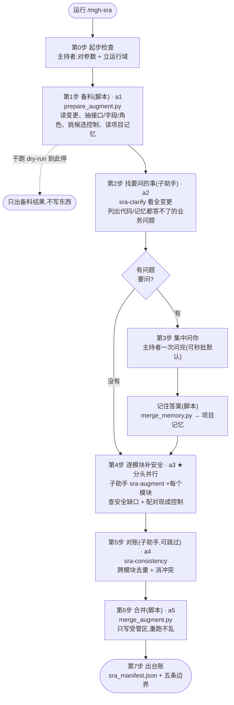

# `/mgh-sra` 工作流程详解(宣导培训版)

> 面向第一次接触本工具的同事。读完这篇你能回答三件事:**它解决什么问题、
> 整条流水线怎么走、每一步由谁用什么干出什么**。
>
> 本文是对工具**功能设计**的人话讲解,不复述研发纪律(那是 `AGENTS.md` 的事)。
> 用词上尽量说人话,不堆翻译腔的术语(比如不说"增广""网关"这种容易把人带偏的词)。

---

## 1. 一句话:它解决什么问题

你用 openspec 写完一个新功能的变更方案(`proposal.md` / `design.md` / `specs/` / `tasks.md`)
之后,跑 `/mgh-sra`。它会**审一遍你的设计,帮你补上漏掉的安全点**,比如:

- "这个新接口没说要不要登录/谁能调" → 补一条鉴权要求;
- "这个新字段是身份证号,没说要脱敏" → 补一条脱敏要求;
- 更关键的是:**如果你项目里已经有过这类安全控制(被 `/mgh-init` 找出来的)**,它会告诉你
  "这个缺口别重新造,**直接复用项目已有的 `X`**",并把"复用 `X`"写进你的变更。

**目的**:新功能的安全设计不要漏、不要各写各的,能复用的存量控制优先复用。

**诚实边界**(任何对外总结都要写明):

- 产出是 **AI 看着你的方案猜出来的候选,不是已确认结论**,必须人工复核;
- 它**只能看到你写进变更的内容 + 你之前回答过的业务事实**——你没声明、也没记过的,它看不到;
- 它推荐你复用的某个控制,**只敢说"这个控制存在",不敢保证它"真管用"**(存在 ≠ 有效);
- 记进项目记忆的那些业务事实(比如"哪些角色能用退款接口"),是**你说的**,不是它从代码里
  钻出来的真相;真跟代码对不上时,以代码为准。
- **(可选)codegraph 结构确认是"辅助意见",不是定论**:仅当目标项目已建 codegraph 索引时,sra 会用它
  **额外**确认"推荐的控制是否真接在这条接口的请求路径上"。但 codegraph 自己也解不动反射 / DI 容器 /
  运行时分派,所以它**缩小但不归零**"误接"的可能;这条确认是"AI + codegraph 的辅助意见",仍需人工核验,
  **不会被声称成"已全部确认"**。没建索引的项目这条整条不存在,行为跟以前一模一样(详见后文「可选增强」)。

---

## 2. 核心设计:三种角色分工 + 隔离优先

整条流水线里只有三类"干活的角色",理解了这三类,后面的步骤都是它们的组合:

| 角色 | 是谁 | 擅长 | 干什么活 |
|---|---|---|---|
| **确定性脚本** | `core/scripts/*.py`(纯 Python 标准库) | 机械、可重复、零成本 | 读变更、抽接口/字段、挑候选控制、记答案、合并、校验 |
| **AI 子助手** | 各 `sra-*.md` 定义的子代理 | 读得懂业务语义 | 判断"哪里漏了安全点"、"该不该复用某个现成控制"、对账去重 |
| **主持者** | 跑命令的那个会话(你自己) | 串流程、问你问题 | 按步骤调脚本、派子助手、把问题集中起来问你、收尾出报告 |

**关键约定(说人话)**:

- **主持者不写代码**。它只是照着命令文档的步骤,用 `Bash` 调脚本、用 `Agent` 派子助手。
- **不偷看源码、不手挖大文件**:需要看某个产物的结构时,有专门的"瞄一眼"脚本
  (`describe_artifact.py`),不许自己写临时小脚本去翻 JSON。这既是纪律,也省 token。
- **隔离优先**:一个大变更一次塞给 AI 会超 token、还会互相干扰。做法是把工作切成小块——
  **每个模块( capability )各开一个独立子助手**去做安全增补,它们彼此看不见对方的活(刻意如此),
  只把结构化小结交给下一步。最后由一个"对账"步骤把它们汇总。
- **路径全用绝对路径,逐字照抄**:主持者从脚本输出里拿到"该写到哪个绝对路径",原样转告给子助手,
  子助手就写那个路径。谁都不许自己拼路径、不许用相对路径(Windows 上容易写错盘符根目录)。

---

## 3. 整体流程(一张图)



读图三件事:

- **实线 = 主流程**,**虚线 = 可走可不走**(干跑、或没有要问的事);
- **★ 分头并行**:第 4 步会**拆成多个子助手同时跑**(每个模块一个);
- **第 3 步"集中问你"是 sra 特有的**——它会暂停,把你这变更里所有需要你拍板的业务问题**一次性问完**,
  不会问一个停一下、问一个停一下。
- **(可选)codegraph 增强**:仅当目标项目已建 codegraph 索引时,第 2 步会**少问你几个问题**、第 4 步会
  **多确认一件事**(见后文「可选增强:codegraph」)。没建索引时这条整条不存在,七步流程本身不变。

---

## 4. 步骤总览大表(一表看完全部 7 步)

> 列含义:**主流程** = 默认会跑(✅),可被参数跳过(⚙️),纯主持者动作(—);
> **并行** = 是否拆多个子助手(★拆 / —单个)。
> **阶段名(a1–a5)** = LLM/脚本 stage 名(对齐命令壳编排流);第 0/3/7 步为编排器原生胶水,无 a 名。

| 步骤 | 名字 | 主流程 | 并行 | 子助手提示词 | 脚本 | 干什么(人话) | 产出 |
|---|---|---|---|---|---|---|---|
| 第0步 | 起步检查 | —(主持者) | — | 无 | 无 | 对参数、立运行域(激活纪律 hook)、确认目标变更 | 无文件;只有进度 |
| 第1步 | 备料 · a1 | ✅ | — | 无 | `prepare_augment.py` | 读你的变更,机械抽出接口/字段/角色,从 mgh-init 清单里挑候选控制,读项目记忆,列出"每个模块要干一份活" | `change_context.json` |
| 第2步 | 找要问的事 · a2 | ✅ | —(单个) | `sra-clarify.md` | 无 | 看全变更,找出"分析必需、但代码/方案/记忆都答不上"的业务问题,跨模块去重 | `clarifications.json` |
| 第3步 | 集中问你 + 记答案 | ✅(有问题才问) | —(主持者) | 无(主持者原生提问) | `merge_memory.py` | 把所有问题**一次问完**,你答完(或秒批默认)写回项目记忆 | `<项目>/.mgh-sra/business_context.json` |
| 第4步 | 逐模块补安全 · a3 | ✅ | ★ **每模块一个** | `sra-augment.md` | 无 | 每个模块独立查 9 类安全缺口,每个缺口试着配对一个现成控制(三个条件都满足才配) | `drafts/<模块>.md` |
| 第5步 | 对账 · a4 | ⚙️(默认开,可跳) | —(单个) | `sra-consistency.md` | 无 | 跨模块去重、消冲突、同一个控制多处引用统一说法 | 就地改各 draft |
| 第6步 | 合并 · a5 | ✅ | — | 无 | `merge_augment.py` | 把增补写回你变更的 specs / tasks,**只写受管区、重跑不乱** | 改 `specs/<模块>/spec.md` + `tasks.md` |
| 第7步 | 出台账 | —(主持者) | — | 无 | 无 | 写台账 + 报告,打印产物路径 + 四条必须披露的边界 | `sra_manifest.json` |

---

## 5. 步骤逐个细讲(按流程顺序)

> 每步说几件事:**干什么 / 是不是主流程 / 拆不拆子助手 / 用哪个提示词或脚本 / 产出什么**。

### 第0步 — 起步检查(主持者)

- **干什么**:花 token 之前先校验。确认目标变更(默认取 `openspec/changes/` 下最新的一个还没归档的);
  立运行域(告诉纪律 hook"现在在跑 sra",拦截违规操作);没传可执行参数或传 `--help` 时,
  **只打印参数表就停下**,不消耗 token。
- **并行**:否。
- **脚本/提示词**:无(主持者自身)。
- **产出**:无文件,只有进度。

### 第1步 — 备料(确定性脚本,主流程的机械地基) · a1

- **干什么**:**这一步不用 AI**,纯脚本。读你的变更(`proposal/design/specs/tasks`),
  用正则机械抽出变更里提到的**接口**(如 `POST /api/transfer`)、**字段**(如 `bankCardNo`)、
  **角色提示**(如代码里的 `hasRole('customer')`)。如果你给了 `--rules`(指向 mgh-init 产出的
  安全清单),它会按"安全关注点对得上"做一次**初筛**,给每个现成控制标上能治哪些维度、跟变更里提到
  的文件有没有重叠——**只标不删**,真正配不配对留给第 4 步判断。同时读项目记忆,并列出
  "这个变更触及的每个模块,各要干一份活"。
- **并行**:否(脚本)。
- **脚本**:`prepare_augment.py`。给清单时跑 `--check` 校验清单格式没坏;`--dry-run` 到此步就停
  (只出备料结果,不往下、不写东西)。
- **产出**:`change_context.json`(整份结构化上下文,后面所有步骤的输入)。

### 第2步 — 找要问的事(子助手,看全变更) · a2

- **干什么**:派**一个**子助手把整个变更看一遍,对照 9 类安全关注点,挑出"分析必需、但代码/方案/
  记忆都答不上"的**业务问题**——典型如"这个接口哪些角色在用""这个字段算不算敏感""你们这个业务域
  以前类似接口的鉴权是怎么做的"。每条带一个**默认猜测**(方便你秒批)。已经记进项目记忆的问题
  **不重问**;跨模块共性的问题(比如"系统有哪些角色"多个接口都要用)**只问一次**。
  - **(可选)codegraph 减问**:仅当项目已建 codegraph 索引时,子助手可以先从代码图谱里**预解析**一些
    能从代码派生的事实(谁调用这个接口→可能的角色、某字段是否真被这个接口流转→是否敏感、同域接口
    既有的鉴权范式),从而**少问你几个问题**。但代码派生的事实优先级**低于**你的回答和代码声明——
    对不上时仍以你的回答 / 代码为准;而且它**只减问、不替你往记忆里写**代码钻出来的条目。
- **并行**:否(单个子助手,刻意如此——它要看全变更才能跨模块去重)。
- **提示词**:`sra-clarify.md`。
- **产出**:`clarifications.json`(要问的问题清单;没问题就写空集,空集是合法结果)。

### 第3步 — 集中问你 + 记答案(主持者 + 脚本)

- **干什么**:主持者读上一步的问题清单,**暂停一次、把所有问题一次性摆给你**(每条带默认猜测,
  你可以秒批、改、或跳过)。你答完(或 `--no-interactive` 全用默认),答案写进项目级业务记忆,
  按"问题键"**累积、不重复**——下次再跑 sra,这些事实就自动用上了。
- **并行**:否(主持者原生提问)。
- **脚本**:`merge_memory.py`(把答案幂等写回记忆)。
- **产出**:`<项目>/.mgh-sra/business_context.json`(跨变更存活的项目级业务记忆)。
- **没有要问的**:第 2 步没产出问题 → 这步直接跳过。

### 第4步 — 逐模块补安全(★ 分头并行——每模块一个子助手) · a3

- **干什么**:这是核心。变更触及的**每个模块各开一个独立子助手**,干两件事:
  1. **查安全缺口**:对着 9 类安全关注点(敏感数据 / 注入 / 横向越权·IDOR / 纵向越权 / 认证 /
     完整性·关键操作 / 审计 / 限流·滥用 / 密钥·配置)逐条过,找出**具体**缺口——每条必须钉死在
     一个具体的"需求 / 接口 / 字段"上(说清它保护什么)。**钉不上的泛泛口号**(比如干巴巴一句
     "要防 SQL 注入"却不指向任何接口)**直接扔掉**。
  2. **配对现成控制(仅当你给了 `--rules`)**:对每个缺口,用**三个条件**判断能不能用项目里某个
     已有的控制来挡(三个**同时**满足才推荐):
     - **① 关注点对得上**:这个控制治的就是这类问题(比如它管鉴权,缺口正好是越权);
     - **② 同业务域**:这个控制守的是**同一类业务场景的相似接口**(比如都管"退款"类接口);
     - **③ 业务事实对得上**:从项目记忆知道这个接口归谁、谁能用。
     三个都中 → 推荐"复用这个控制,别另起炉灶"。**只凭文件碰巧路径重叠,不算数**(那只是相关性,
     不是真配对)。没给 `--rules` 时跳过配对,缺口照样产出,只是不带"复用某个控制"的锚点。
- **并行**:✅ 每个模块一个 `sra-augment` 子助手(彼此隔离,互不可见)。
- **提示词**:`sra-augment.md` + `fragments/security-dimensions.md`(9 维度目录)。
- **产出**:`drafts/<模块>.md`(结构化草稿:缺口、配对的控制、要补的安全要求/任务)。

### 第5步 — 对账(子助手,默认开、可跳) · a4

- **干什么**:第 4 步各模块是隔离跑的,彼此看不见。这一步是**唯一能看见全部草稿**的层,做三件事:
  跨模块**去重**(同一个安全要求被多个模块各写了一条 → 合并)、**消冲突**(两条对同一处给矛盾建议 →
  取更显式、证据更硬的那条)、**同一个控制被多处引用时统一说法**。只改草稿、不碰你的 specs/tasks
  (写回是第 6 步的事)。
- **并行**:否(单个子助手)。`--skip-consistency` 可跳过这步。
- **提示词**:`sra-consistency.md`。
- **产出**:就地改各 draft 为定稿。

### 第6步 — 合并(确定性脚本) · a5

- **干什么**:把定稿的增补写回**你的变更本身**——进 `specs/<模块>/spec.md`(在 `## ADDED Requirements`
  下面追加)和 `tasks.md`。关键是**只动"受管区"**:用两行特殊标记
  (`<!-- mgh-sra:begin -->` … `<!-- mgh-sra:end -->`)包起来的一块,工具重跑只替换这一块,
  **绝不改动你手写的其它内容**。变更没有 capability specs 时,自动建一个
  `specs/security-augmentation/spec.md`。
- **并行**:否(脚本)。
- **脚本**:`merge_augment.py`(写完跑 `--check` 确认只动了受管区、块外字节不变)。
- **产出**:改后的 `specs/<模块>/spec.md` + `tasks.md`。

### 第7步 — 出台账(主持者)

- **干什么**:写台账和报告,打印产物路径 + **五条**必须披露的边界。
- **并行**:否。
- **产出**:`sra_manifest.json`(变更名 / 清单来源 / 记忆来源 / 各项计数 / 五条边界)。计数里含 codegraph
  相关的两项(`call_path_confirmed` / `call_path_residual`,没建索引时都是 0);第 5 条边界专门披露
  codegraph 辅助了多少、残留多少未确认。

---

## 5½. 可选增强:codegraph(项目已建索引时,自动启用)

> 这一节整段都是**可选的**。没建 codegraph 索引的项目完全跳过,七步流程一字不变。建了索引才自动启用,
> 想关掉就加 `--no-codegraph`。

**codegraph 是什么**:一个外部工具(宿主能力,不是要你 `pip install` 的依赖)。它给目标项目预计算了一张
"知识图谱"——每个符号、谁调用谁、**框架是怎么把控制织进去的**(`@PreAuthorize` / AOP 切面 / DI 注入 /
Feign 路由表这类),都提前画好了,放在项目的 `.codegraph/` 目录里。sra 启动时会检测:项目根有没有
`.codegraph/` **且** 命令行能找到 `codegraph` 这个工具——两个都满足才置 `codegraph=on`,否则 `off`。

**它补的是哪个盲区**:第 4 步配对现成控制时,信号"② 同业务域"本质是**猜**——靠接口路径文本像不像 +
文件碰巧重叠,推断"这条控制守护的是同类接口"。但它回答不了一个**结构性**问题:**这条控制到底接没接到
你这条缺口的接口的请求路径上?** 而这恰恰由框架路由决定,文本/AST 解不动(跟 mgh-init 文本调用图的
同一个盲点)。结果:一个仅"文件重叠"的控制可能被猜成"可复用",其实它根本不在这条请求链上——对这条
缺口近乎死代码。这正是 sra 自己写的诚实边界"控制只敢说存在、不敢说有效"。

**codegraph=on 时,a3 多干一件事 —— ★ 请求路径结构确认**(这是本增强最独特、最高价值的地方):对每条
**已经三信号命中、已经推荐了控制**的缺口,子助手用 codegraph 去查"这个控制是不是真接在这条接口的请求
路径上(从请求入口到受保护资源)",把结果记成一条 **advisory(辅助意见)**字段 `call_path`:

| `call_path.confirmed` | 含义 | 对推荐措辞的影响 |
|---|---|---|
| `true` | 控制确实接在这条接口的请求路径上 | 强化措辞:"复用,经确认接入此接口请求路径" |
| `false` | 控制存在,但没确认接在这条接口上 | 降级置信 + 注明"控制存在但未确认接入此接口"(不删推荐,但标 caveat) |
| `null` | codegraph 也判不动(反射 / DI 容器 / 运行时分派)或被预算裁剪 | 计入"残留未确认",**绝不**伪造成 `true` |

外加三个**只改善文字、不加新字段**的辅助侧面(预算紧张时先被砍):(2) 数据流可达性——缺口的敏感字段
是不是真被这个接口流向/返回/落日志,治"字段根本不可达"的伪缺口;(3) 控制存活——推荐的控制有没有人调用,
还是近乎死代码(强化"存在≠有效");(4) 同域兄弟——枚举同业务域的兄弟接口及其守卫,把信号②从"文本像不像"
升级成"结构上是不是一类"。

**三条硬规矩**(记住这三条就够了):
- **有界 + 失败软降**:只对**已经推荐了控制**的缺口做(不是所有候选);(缺口×控制)太多超预算时,每条缺口
  只查**排第一**的那个推荐控制的路径,其余标 `null` + 草稿注明"部分未确认",**流程不中断**。
- **绝不覆盖你和代码**:`call_path` 是辅助意见,优先级**低于**代码证据和你在 `business_context.json` 里断言
  的事实;对不上时以代码/你的断言为准,它只作标注。
- **不声称"全部确认"**:codegraph 自己也解不动反射/DI/运行时分派,所以台账如实记"确认了 N 条、残留 M 条未确认",
  第 5 条诚实边界专门说清这点。`--no-codegraph` 一键回到没有 codegraph 的行为。

---

## 6. 名词扫盲(培训速查,说人话版)

| 名词 | 通俗解释 |
|---|---|
| **模块 / capability** | 你这个变更触及的一块功能(对应 `specs/<名字>/spec.md`)。第 4 步按它分头并行 |
| **安全关注点 / 维度** | 9 类要查的安全面(下面 9 行逐个展开):敏感数据、注入、横向越权·IDOR、纵向越权、认证、完整性·关键操作、审计、限流·滥用、密钥·配置 |
| **敏感数据** | 9 维度之一:碰到隐私/金融数据(身份证、银行卡、手机、邮箱、密码、token)时,存/传/打日志/返回有没有声明脱敏。例:返回体带银行卡号却没脱敏 |
| **注入** | 9 维度之一:外部输入的入口有没有声明校验,防 SQL 注入 / XSS / 命令注入 / 路径穿越 / SSRF / 反序列化。例:动态 `ORDER BY` 直接拼接 |
| **横向越权·IDOR** | 9 维度之一:按 id/key 取资源时有没有校验归属/租户("这东西是不是你的")。例:`GET /order/{id}` 不查归属,能看别人订单 |
| **纵向越权** | 9 维度之一:有没有暴露管理员级操作、有没有校验角色。例:普通用户能调到管理接口 |
| **认证** | 9 维度之一:新接口/资源是不是放在登录之后、session/token 有没有。例:新增公开端点暴露了内部数据 |
| **完整性·关键操作** | 9 维度之一:金额/状态变更类操作有没有幂等、防重放、状态机防乱序。例:退款没幂等键,可重复退款 |
| **审计** | 9 维度之一:安全相关操作有没有记日志(还不能把敏感数据记进去)。例:登录失败没审计;日志里却写了明文卡号 |
| **限流·滥用** | 9 维度之一:高价值接口(登录/验证码/支付)有没有限流。例:短信验证码没频控,能被刷爆 |
| **密钥·配置** | 9 维度之一:有没有硬编码密钥、密钥轮换、配置里的敏感项。例:配置文件里硬编码了 API key |
| **维度聚焦 / focus** | 可选参数 `--focus`:只查这次关心的维度(甚至维度内某几个子项),**不传 = 查全 9 维度**(默认不动)。例:只查越权;或敏感数据里只查身份证 + 银行卡。聚焦后台账会显眼标注"范围外没查",免得误以为是全量。值清单见 `focus_scope.py --list` |
| **敏感数据目录 / sensitive_catalog** | 可选参数 `--sensitive-catalog`:声明本公司**必屏蔽**的字段类型 + 屏蔽级别(`full` 全屏蔽 / `partial` 部分屏蔽)+ 规则(如"保留后 4 位")。sra 据此对每个字段类型**逐项查脱敏缺口**(存 / 传 / 打日志 / 返回有没有按规则脱敏),缺口标 `catalog_key` 并试着配对 mgh-init 找出的脱敏控制(`data-masking` 类)。与 `--focus` **正交**(focus 收窄范围、目录声明必屏蔽策略,可同时用)。**不传 = 只认现行 6 项**(身份证/银行卡/手机/邮箱/密码/token),行为不变。默认模板见 `sensitive_catalog.py --list`(PIPL/GB-T 35273 共 37 项,install 落地为 `.mgh-sra/sensitive_catalog.json.example`,需手动启用) |
| **缺口 / gap** | 设计里漏掉的一个具体安全点,必须钉死在某个需求/接口/字段上,不然扔掉 |
| **候选控制 / candidate_controls** | 从 mgh-init 清单里初筛出的、可能能复用的现成安全控制(第 1 步只标不删) |
| **三个条件 / 三信号** | 判断一个缺口能不能用某现成控制来挡的三个判断(关注点对得上 + 同业务域 + 业务事实对得上),同时满足才推荐 |
| **codegraph(可选)** | 外部工具给项目预计算的知识图谱(符号 + 调用边 + **框架路由**)。项目有 `.codegraph/` 才启用;没建索引时整个增强不存在、行为不变,`--no-codegraph` 可手动关 |
| **call_path(可选)** | codegraph=on 时 a3 多记的一条辅助字段:推荐的控制**是否真接在这条接口的请求路径上**(`confirmed: true/false/null`)。是 advisory,不覆盖代码/你的断言,台账如实披露残留、不声称全确认 |
| **项目记忆 / business_context.json** | 跨变更存活的项目级业务记忆:角色、业务域、敏感字段、各接口的鉴权范式、问答日志。是**你说的**,不是代码真相 |
| **受管区 / managed block** | 用 `<!-- mgh-sra:begin/end -->` 包起来的一块,工具只动这块、重跑不乱、不碰你手写的其它内容 |
| **草稿 / draft** | 第 4 步每个模块产出的结构化增补草稿,第 5 步对账、第 6 步才合并进变更 |
| **台账 / manifest** | `sra_manifest.json`:这次跑了啥、补了多少、四条边界 |
| **主持者 / orchestrator** | 跑命令的那个会话——串流程、调脚本、派子助手、问你问题、收尾。**不写代码** |
| **确定性 vs AI** | 前者 = 脚本,可重复零成本(备料/记答案/合并/校验);后者 = 子助手,读得懂业务语义(找问题/配对/对账) |

---

## 7. 最终产出哪些文件

变更级产物(在 `<变更根>/.mgh-sra/` 下):

| 文件 | 内容 | 谁产出 |
|---|---|---|
| `change_context.json` | 备料结果:模块、需求、接口/字段/角色、候选控制、待干清单、记忆 | 第1步 |
| `clarifications.json` | 要问你的问题清单 | 第2步 |
| `drafts/<模块>.md` | 每个模块的增补草稿(缺口 + 配对控制 + 要求/任务) | 第4步 → 第5步定稿 |
| `merge_state.json` | 合并前的块外字节快照(供 `--check` 比对) | 第6步 |
| `sra_manifest.json` | 计数(含 `call_path_confirmed`/`call_path_residual`)+ 五条边界 | 第7步 |

写回你变更本身的(这才是最终交付):

| 文件 | 内容 | 谁产出 |
|---|---|---|
| `specs/<模块>/spec.md` | 受管区里追加的 `### Requirement:` 安全要求 | 第6步 |
| `tasks.md` | 受管区里追加的安全任务条目 | 第6步 |

项目级产物(在 `<项目>/.mgh-sra/`,跨变更存活):

| 文件 | 内容 | 谁产出 |
|---|---|---|
| `business_context.json` | 角色 / 业务域 / 敏感字段 / 接口鉴权范式 / 业务规则 / 问答日志 | 第3步 |

---

## 8. 怎么跑(最常用场景)

> 前提:`install.sh` 已把核心文件装进目标项目(`.claude/mgh-core/` 或 `.opencode/`)。

```bash
# 在 openspec 写完一个变更方案后(propose 之后、apply 之前)
/mgh-sra --change <变更名>

# 想让它顺带配对项目里已有的安全控制(推荐,要先跑过 /mgh-init)
/mgh-sra --change <变更名> --rules .mgh-init

# 这次只查越权(横向+纵向),其余维度不查(台账会标注"范围外未覆盖")
/mgh-sra --change <变更名> --focus '{"dimensions":["horizontal-authz","vertical-authz"]}'

# 敏感数据里只查身份证 + 银行卡(维度内再收窄到 facet)
/mgh-sra --change <变更名> --focus '{"dimensions":["sensitive-data"],"facets":{"sensitive-data":["id-card","bank-card"]}}'

# 声明公司必屏蔽清单(如生物识别/金融/位置等 PIPL 37 项),逐项查脱敏缺口
/mgh-sra --change <变更名> --sensitive-catalog .mgh-sra/sensitive_catalog.json

# 不想被打断问问题,全部用默认猜测(产物标注"未确认·默认")
/mgh-sra --change <变更名> --no-interactive

# 只想看看它会怎么分析,不真改我的变更
/mgh-sra --change <变更名> --dry-run
```

关键参数速查:

- `--change <名字>`:目标变更(不填 = 最新的未归档变更);
- `--rules <路径>`:mgh-init 的安全清单或其输出目录(给了才会做"配对现成控制");
- `--focus <JSON|路径>`:维度聚焦,只查指定维度(及维度内指定 facet);不传 = 全 9 维度。值以 `{` 起首是
  inline JSON,否则是 JSON 文件路径(`@` 可选)。可用值见 `focus_scope.py --list`;
- `--sensitive-catalog <JSON|@路径|->`:公司强制脱敏目录,声明必屏蔽字段类型 + 屏蔽级别 + 规则;sra 据此
  逐项查脱敏缺口(并配对 mgh-init 脱敏控制)。不传 = 仅现行 6 项(身份证/银行卡/手机/邮箱/密码/token),
  行为不变。与 `--focus` 正交,可同时传。默认 37 项模板见 `sensitive_catalog.py --list`;
- `--no-interactive`:澄清问全用默认,不暂停问你;
- `--dry-run`:只出备料结果,不写 specs/tasks/记忆;
- `--skip-consistency`:跳过第 5 步对账;
- `--no-codegraph`:关掉可选的 codegraph 增强(默认 `auto`——项目有 `.codegraph/` 且能找到 `codegraph`
  工具才启用)。关掉 = 行为跟没有 codegraph 时一模一样;
- `--config <profile>`:配置档(默认 `sra`)。

---

## 附:给讲师的一页讲解提纲

1. **痛点**:新功能的安全设计容易漏;能复用的存量控制没人记得,各写各的。
2. **解法**:openspec 写完方案后跑 sra → 审一遍补上漏的安全点,能复用现成控制就点名复用。
3. **怎么保证质量**:脚本打地基(备料/记答案/合并,可重复)+ AI 子助手补语义(找缺口/配对/对账),
   两者隔离分工。
4. **怎么少打扰你**:第 2 步把要问的业务问题**集中起来一次问完**,答案记进项目记忆,下次自动复用。
5. **诚实**:候选需复核、只看到你声明+记过的、复用的控制只敢说存在不敢说有效、记忆是你说的非代码真相——
   这些必须如实披露。
6. **(可选)codegraph**:项目建了索引时,sra 会顺带确认"推荐的控制是否真接到这条接口的请求路径上"
   (把"同业务域"从猜测升级成结构证据),还能少问你几个问题。它**缩小但不归零**误接、是辅助意见非定论、
   `--no-codegraph` 可关——没建索引的项目完全无感。
