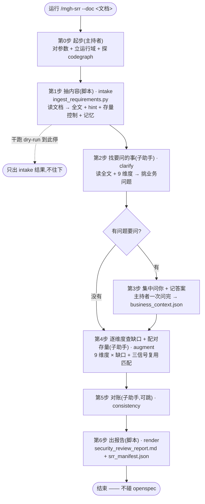

# `/mgh-srr` 工作流程详解(宣导培训版)

> 面向第一次接触本工具的同事。读完这篇你能回答四件事:**它解决什么问题、跟 `/mgh-sra`
> 啥关系、整条流水线怎么走、每一步由谁用什么干出什么**。
>
> 本文是对工具**功能设计**的人话讲解,不复述研发纪律(那是 `AGENTS.md` 的事)。用词上说人话,
> 不堆翻译腔术语。

---

## 1. 一句话:它解决什么问题

你手里有一份**需求描述**(word / txt / md / excel 都行,甚至直接糊一段文字),可能写得很含糊、
**可能一句接口、一个字段名都没有**。你想在动手写代码**之前**,先让人(或 AI)帮你过一遍:**这需求
里有哪些安全点该想到但没写?哪些能直接复用项目里已有的安全设计,别重新造?**

`/mgh-sra` 也能干这事,但它**绑死在 openspec 上**——必须有结构化的变更文件、得能抽出接口/字段,
否则抓瞎。`/mgh-srr`(Security Requirements Review)就是给**没有 openspec、只有一堆原始需求文字**
的场景准备的。它读你的需求文档,过一遍 9 个安全维度,产出一份**普通、简要的报告提醒**——
**不碰任何 openspec 内容,也不要求文档里有接口/字段**。

**目的**:让纯文字需求,在编码前就能拿到一份"安全点清单 + 部分设计提醒",该复用的存量控制点名复用。

**诚实边界**(任何对外总结都要写明):

- 产出是 **AI 看着你的需求猜出来的候选,不是已确认结论**,必须人工复核;
- 它**只看得到你写进需求的内容 + 你以前回答过/记过的业务事实**——你没写、也没记过的,它看不到;
- **它不读你的源码**(那是 `/mgh-sast` 的活)。"结合存量"靠的是你喂的 mgh-init 控制清单(可选)
  + codegraph(可选),不是扫代码;
- 它推荐你复用的某个控制,**只敢说"这控制存在",不敢保证它"真管用"**(存在 ≠ 有效);
- 记进项目记忆的业务事实是**你说的**,不是它从代码里钻出来的;真跟代码对不上时,以代码为准;
- 需求含糊 → 报告也只能泛泛且锚点稀疏。**报告质量受输入完整度上界约束。**

---

## 2. 跟 `/mgh-sra` 是什么关系(必读,最容易混)

`/mgh-sra` 和 `/mgh-srr` **共用同一个"中间引擎"**,只是**入口和出口不一样**:

| | `/mgh-sra`(现状) | `/mgh-srr`(本文) |
|---|---|---|
| **入口(输入)** | 解析 openspec 变更文件,正则抽接口/字段/角色 | 读自由文本需求(word/txt/md/excel/糊文本) |
| **中间引擎** | 9 维度查缺口 + 三信号配对存量 + 批量澄清记忆 | **完全一样,逐字复用** |
| **出口(输出)** | 写回 openspec 的 specs/tasks | **普通报告,绝不碰 openspec** |
| **适用场景** | 已用 openspec 写了变更方案 | 没有 openspec / 只有原始需求文字 |

记一句话:**sra 是"openspec 设计补充",srr 是"无 openspec 的需求安全评审"**。中间那套安全分析能力是同一套。

---

## 3. 一个贯穿全文的例子

后面每一步都拿这个例子讲。它故意长成 SRR 最该治的样子——**有安全意义,但没接口、没字段名**:

> 需求(写在 `实名认证需求.md` 里的一段话):
> 「做个实名认证功能。用户在 App 上传身份证正反面照片提交,进入审核。后台审核员登录后台
> 查看照片,核对后点『通过/驳回』。通过后用户实名状态变成『已认证』。」

注意:这里没有 `POST /xxx`、没有 `idCardNo` 这种字段——sra 抓瞎,SRR 照样能分析。

---

## 4. 核心设计:三种角色分工 + 隔离优先

整条流水线里只有三类"干活的角色":

| 角色 | 是谁 | 擅长 | 干什么活 |
|---|---|---|---|
| **确定性脚本** | `core/scripts/*.py`(纯 Python 标准库) | 机械、可重复、零成本 | 读需求文档抽全文、记答案、出报告、校验 |
| **AI 子助手** | 复用 sra 的 `sra-*.md` 子代理 | 读得懂业务语义 | 判断"哪里漏了安全点""该不该复用某个现成控制" |
| **主持者** | 跑命令的那个会话(你自己) | 串流程、问你问题 | 调脚本、派子助手、把问题集中起来问你、收尾出报告 |

**关键约定(说人话)**:

- **主持者不写代码**。照着命令文档的步骤,用 `Bash` 调脚本、用 `Agent` 派子助手。
- **不偷看源码、不手挖大文件**。要看产物结构有专门的"瞄一眼"脚本,不许自己写临时小脚本翻 JSON。
- **路径全用绝对路径,逐字照抄**:从脚本输出里拿到"写到哪个绝对路径",原样转告子助手。谁都不许自己拼路径。
- **整篇需求默认当一个整体**交给一个子助手分析(需求文档通常不大);特大文档可选 `--split` 按标题切开分头并行。

---

## 5. 整体流程(一张图)



读图三件事:

- **实线 = 主流程**,**虚线 = 可走可不走**(干跑、或没有要问的事);
- **第 3 步"集中问你"是这套工具的招牌**——把所有需要你拍板的业务问题**一次性问完**,不一个个打断你;
- **全流程不碰 openspec**:产物是独立报告,写在你指定的输出目录。

---

## 6. 步骤总览大表

| 步骤 | 名字 | 主流程 | 并行 | 子助手提示词 | 脚本 | 干什么(人话) | 产出 |
|---|---|---|---|---|---|---|---|
| 第0步 | 起步 | —(主持者) | — | 无 | 无 | 对参数、立运行域、探 codegraph | 无文件;进度 |
| 第1步 | 抽内容 · intake | ✅ | — | 无 | `ingest_requirements.py` | 读需求文档,拿全文 + 顺手捞 hint(接口/字段/角色)+ 载入存量控制 + 读记忆 | `change_context.json` |
| 第2步 | 找要问的事 · clarify | ✅ | —(单个) | `sra-clarify.md` | 无 | 读全文,挑"分析必需但文档/记忆都答不上"的业务问题 | `clarifications.json` |
| 第3步 | 集中问你 + 记答案 | ✅(有问题才问) | —(主持者) | 无 | `merge_memory.py` | 一次问完,答案写进项目记忆 | `<项目>/.mgh-sra/business_context.json` |
| 第4步 | 查缺口 + 配对存量 · augment | ✅ | —(默认单助手) | `sra-augment.md` | 无 | 逐维度查具体缺口,每个试着配对已有控制 | `drafts/<单元>.md` |
| 第5步 | 对账 · consistency | ⚙️(默认开,可跳) | — | `sra-consistency.md` | 无 | 去重、消冲突 | 就地改 draft |
| 第6步 | 出报告 · render | ✅ | — | 无 | `render_report.py` | 把缺口渲染成普通报告 + 台账 | `security_review_report.md` + `srr_manifest.json` |

> 子助手提示词 `sra-clarify.md` / `sra-augment.md` / `sra-consistency.md` 和 `merge_memory.py`
> **全部复用自 `/mgh-sra`,零新增**——这就是"共用中间引擎"。

---

## 7. 步骤逐个细讲(拿"身份证实名认证"串起来)

### 第0步 — 起步(主持者)

- **干什么**:`/mgh-srr --doc 实名认证需求.md`,确认文档在、立运行域(告诉纪律 hook"现在跑 srr")、
  探测项目有没有建 codegraph 索引。没传可执行参数或 `--help` → 只打印参数表就停,不烧 token。

### 第1步 — 抽内容(脚本,不用 AI)

- **干什么**:这是你问的"脚本怎么从文档抽内容"。`ingest_requirements.py` 干三件事:
  1. **看格式拿全文**:`.txt/.md/.csv/.json` 直接读(完美);`.docx` 当 zip 解开读 `word/document.xml`,
     **按段落把散落的文字碎片拼回完整句子**(防 token 碎裂);`.xlsx` 读单元格。抽不好?`--text "..."` 直接糊文本跳过抽取。
  2. **顺手捞 hint**:整段需求**全文保留**(LLM 等下要读)。同时用正则顺手捞"可能有用的小线索"——
     接口(如 `POST /api/x`)、疑似敏感字段(如 `idCardNo`)、角色提示(如 `hasRole('customer')`)。
     **注意:正则只认 ASCII 标识符**——纯中文需求文档可能一条都捞不到,但**全文已保留**,LLM 照样读得懂。
     **这些 hint 可有可无**(非承重:真正干活的是 LLM 读全文,不是这些线索)。
  3. **吐结构化清单** `change_context.json`:全文 + hint + 你给的存量控制(若 `--rules`)+ 项目记忆
     + 降级标注(`degraded`:docx/xlsx 抽取丢了哪些保真度;文本原生/透传为空)。
- **例子产出**:那段需求**全文**(最值钱的部分)+ hint(这份纯中文文档正则捞不到 ASCII 字段/角色 → 空;
  但 LLM 读全文照样认得出"身份证照片"是敏感数据)+ 存量控制(假设传了 `--rules .mgh-init`)
  + 记忆(第一次跑,空)+ 降级标注(`[]`,因为 `.md` 是文本原生、无降级)。
- **关键认知**:脚本**不读源码、不做安全判断**,只负责"把文档变成结构化清单"。抽取的接口/字段
  只是**锦上添花的线索**,真正干活的是 LLM 读全文。
- **`--dry-run`**:到此停,只出清单不往下。

### 第2步 — 找要问的事(1 个子助手,读全文)

- **干什么**:派一个子助手,给它**需求全文 + 9 维度清单 + 已记记忆**。提示词人话版:

  > 「你是安全需求评审员。读这份需求。对照这 9 个安全面,挑出**做安全分析必需、但文档和记忆都答不上**
  > 的业务问题。每条给个默认猜测方便用户秒批。已经记过的事别再问。」

- **例子产出**(几个**业务问题**,不是缺口本身):
  - "审核员是不是只有一个角色?有没有分级?" → 默认猜"单一审核员角色"
  - "身份证照片保留多久?审核完删不删?" → 默认猜"长期保留"
  - "后台查看照片,所有审核员都能看全部用户的吗?" → 默认猜"都能看全部"

  这些文档没写,但**直接影响**后面安全判断(比如"都能看全部"就是越权隐患)。

### 第3步 — 集中问你 + 记答案(主持者 + 脚本)

- **干什么**:主持者**暂停一次**,把所有问题一次性摆给你,每条带默认猜测——秒批/改/跳过
  (`--no-interactive` 全用默认)。答完,`merge_memory.py` 写进**项目级业务记忆**。
- **重点**:这份记忆 `business_context.json` **跟 `/mgh-sra` 共用同一个文件**,跨工具、跨次累积。
  今天记了"审核员单一角色",下次跑 sra 或 srr 直接用,**不再问**。没要问的问题就跳过这步。

### 第4步 — 查缺口 + 配对存量(核心,1 个子助手)

- **干什么**:默认整篇需求当一个整体,派**一个**子助手(`sra-augment.md`,复用)。给它:
  **全文 + hint + 存量控制 + 你刚答的记忆 + 9 维度目录 + 一个绝对写路径**。提示词人话版:

  > 「你是安全需求评审员。对着这 9 个维度逐条检查这份需求,**找出具体的安全缺口**。规矩:每条缺口
  > **必须钉死在一个具体的需求点/接口/字段上**(说清它保护什么),钉不上的泛泛口号(比如干巴巴一句
  > 『要防注入』却不指向任何地方)**直接扔掉**。如果你拿到了项目已有控制清单:对每个缺口,判断**能不能
  > 复用某个现成控制**——三个条件**同时**满足才推荐:① 它治的就是这类问题;② 它守的是同类业务场景;
  > ③ 业务事实对得上。只凭名字/路径碰巧像,**不算**。」

- **例子产出**(每条**钉在具体点上**):

  | 维度 | 缺口(钉在哪) | 风险 | 复用建议(假设清单里有) |
  |---|---|---|---|
  | 敏感数据 | 「上传身份证照片」+「后台查看照片」 | 照片可能明文存储/返回/落日志,极度敏感 PII | 清单有 `data-masking`?→「**复用它脱敏**,别另造」 |
  | 横向越权 | 「审核员查看照片」 | 审核员 A 能不能看审核员 B 负责的?没校验归属 | 清单 `authorization` 是管「退款归属」的?同域不同业务,**不推荐** |
  | 纵向越权 | 「后台查看」 | 普通用户能不能摸到后台查看接口? | — |
  | 认证 | 「审核员登录后台」 | 后台查看接口在不在登录后? | — |
  | 审计 | 「点通过/驳回」 | 关键操作有没有审计日志(且不记照片)? | 清单有 `audit-logging` →「**复用**」 |
  | 完整性 | 「状态变更已认证」 | 状态变更有幂等/防重放吗? | — |
  | 限流 | 「上传照片」 | 上传接口有没有限流(防刷)? | — |

- **"怎么结合存量"的机制**(老实讲清楚):
  - SRR **不读源码**(那是 `/mgh-sast`)。它在**需求文字**上分析。
  - "结合存量"靠两样**你主动喂**的:① `--rules` 指 mgh-init 控制清单(项目已有安全控制的摘要),
    子助手用它做"三信号"配对,推荐复用别重造;②(可选)codegraph,额外确认"推荐的控制真接没接到这条
    功能的请求路径上"。两者都没喂?这步照样产缺口,只是不带"复用某个控制"的建议——纯安全属性提醒。

### 第5步 — 对账(子助手,默认开、可跳)

- **干什么**:SRR 默认整篇一个单元,这步去重的活不多,但逻辑复用:重复缺口合并、矛盾建议取证据
  更硬的那条。`--skip-consistency` 可跳。

### 第6步 — 出报告(脚本,**不碰 openspec**)

- **干什么**:`render_report.py` 读定稿缺口 → 写一份**普通、简要的报告** `security_review_report.md`
  (简体中文,给人看:像上表按维度/锚点列缺口 + 复用建议 + 问过你的事 + 诚实边界)+ 机器台账
  `srr_manifest.json`。产物落你指定的输出目录(默认 `<项目>/.mgh-srr/`),**绝不会动 openspec 文件**。
- **跟 sra 的关键区别**:① 产物是独立报告,不写进 openspec;② **不要求**输入有接口/字段——
  例子一个 `POST` 都没有,照样产上表那些钉在需求点上的缺口。

---

## 8. 可选增强:存量控制配对(`--rules`)与 codegraph

> 这一节都是**可选的**。不传 `--rules`、项目没建 codegraph,主流程照样跑、照样出报告。

- **`--rules <mgh-init 清单>`**:给了才会做"配对存量控制"。子助手拿清单里的已有控制,对每个缺口做
  三信号判断,推荐你**复用已有控制别重造**。不给就纯产安全属性提醒。注意 SRR **不扫源码**,清单是你
  事先用 `/mgh-init` 从代码里找出来的存量控制摘要。
- **codegraph(项目已建 `.codegraph/` 索引才自动启用)**:子助手额外确认"推荐的控制真接没接到这条功能
  的请求路径上",把"同业务域"从猜测升级成结构证据,还能少问你几个问题。但 codegraph 解不动反射/DI,
  所以是**辅助意见不是定论**;`--no-codegraph` 一键关掉。

---

## 9. 名词扫盲(说人话版)

| 名词 | 通俗解释 |
|---|---|
| **需求文档 / doc** | 你喂进来的一份原始需求(word/txt/md/excel/糊的文本),SRR 分析的对象 |
| **全文 vs hint** | 全文 = 文档的完整文字(LLM 读这个);hint = 脚本顺手捞的接口/字段/角色线索(可选,可空) |
| **安全维度** | 9 类要查的安全面:敏感数据、注入、横向越权·IDOR、纵向越权、认证、完整性·关键操作、审计、限流·滥用、密钥·配置 |
| **缺口 / gap** | 需求里漏掉的一个具体安全点,必须钉死在某个需求点/接口/字段上,不然扔掉 |
| **三信号** | 判断一个缺口能不能用某现成控制来挡的三个条件(关注点对得上 + 同业务域 + 业务事实),同时满足才推荐复用 |
| **存量控制 / `--rules`** | mgh-init 从代码里找出来的项目已有安全控制清单;给了才会做"复用别重造"配对 |
| **codegraph(可选)** | 外部工具给项目预计算的知识图谱。项目有 `.codegraph/` 才启用;`--no-codegraph` 可关 |
| **项目记忆 / business_context.json** | 跨工具(sra/srr)、跨次存活的项目级业务记忆:角色、业务域、敏感字段、问答日志。是**你说的**,不是代码真相 |
| **主持者 / orchestrator** | 跑命令的那个会话——串流程、调脚本、派子助手、问你问题、收尾。**不写代码** |
| **确定性 vs AI** | 前者 = 脚本,可重复零成本(抽内容/记答案/出报告);后者 = 子助手,读得懂业务语义(找问题/配对/对账) |

---

## 10. 最终产出哪些文件

运行级产物(在你指定的输出目录,默认 `<项目>/.mgh-srr/`):

| 文件 | 内容 | 谁产出 |
|---|---|---|
| `change_context.json` | 抽内容结果:全文、hint、存量控制、记忆、待干清单、降级标注(`degraded`) | 第1步 |
| `clarifications.json` | 要问你的问题清单 | 第2步 |
| `drafts/<单元>.md` | 查出的缺口草稿(缺口 + 配对控制 + 建议) | 第4步 → 第5步定稿 |
| `security_review_report.md` | **给人看的普通报告**(简体中文·简要·按维度/锚点列缺口 + 复用建议 + 边界) | 第6步 |
| `srr_manifest.json` | 台账:counts + 诚实边界 | 第6步 |

项目级产物(跨工具/跨次存活,在 `<项目>/.mgh-sra/`,**与 sra 共用**):

| 文件 | 内容 | 谁产出 |
|---|---|---|
| `business_context.json` | 角色 / 业务域 / 敏感字段 / 业务规则 / 问答日志 | 第3步 |

> **注意**:SRR **不写任何 openspec 文件**。报告是独立交付物。

---

## 11. 怎么跑(最常用场景)

> 前提:`install.sh` 已把核心文件装进目标项目。

```bash
# 最简单:给一份需求文档,出报告
/mgh-srr --doc 实名认证需求.md

# 想让它顺带配对项目已有的安全控制(推荐,要先跑过 /mgh-init)
/mgh-srr --doc 实名认证需求.md --rules .mgh-init

# 文档是 word/excel
/mgh-srr --doc 需求.docx

# 干脆直接糊一段文字
/mgh-srr --text "做个转账功能,用户输金额和对方账号……"

# 不想被打断问问题,全用默认(产物标"未确认·默认")
/mgh-srr --doc 实名认证需求.md --no-interactive

# 只想看它怎么分析,不真出报告
/mgh-srr --doc 实名认证需求.md --dry-run
```

关键参数速查:

- `--doc <路径>`:需求文档(.txt/.md/.csv/.json/.docx/.xlsx);
- `--text "<文字>"` / stdin:直接糊文本,跳过文件抽取;
- `--rules <路径>`:mgh-init 安全清单(给了才做"配对存量控制");
- `--no-interactive`:澄清问全用默认,不暂停问你;
- `--dry-run`:只出抽内容结果,不往下、不出报告;
- `--skip-consistency`:跳过第 5 步对账;
- `--split`:大文档按标题切开分头并行(默认整篇一个单元);
- `--out <目录>`:报告输出目录(默认 `<项目>/.mgh-srr/`);
- `--no-codegraph`:关掉可选 codegraph 增强。

---

## 12. 附:给讲师的一页讲解提纲

1. **痛点**:纯文字需求(没 openspec、没接口字段)在编码前没人系统想过安全;sra 又用不了。
2. **解法**:SRR 读需求文档 → 过 9 维度 → 出一份普通报告,该复用存量控制就点名复用。**不碰 openspec**。
3. **跟 sra 的关系**:共用同一套中间引擎(9 维度 + 三信号 + 澄清记忆),只是入口(自由文本)
   和出口(普通报告)不同。
4. **怎么保证质量**:脚本打地基(抽内容/记答案/出报告,可重复)+ AI 子助手补语义(找缺口/配对),
   两者隔离分工。
5. **怎么少打扰你**:把要问的业务问题集中一次问完,答案记进项目记忆,下次自动复用。
6. **诚实**:候选需复核、只看到你声明 + 记过的、不读源码(扫代码是 sast)、复用控制只敢说存在不敢说有效、
   记忆是你说的非代码真相、报告质量受输入完整度上界约束——这些必须如实披露。
