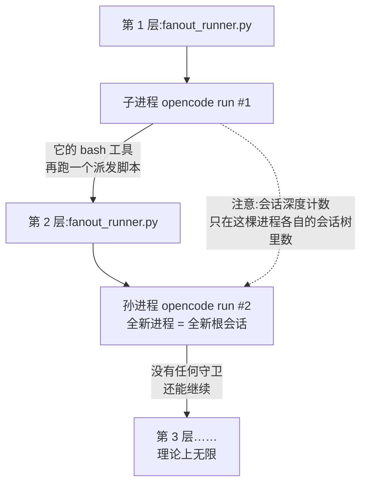
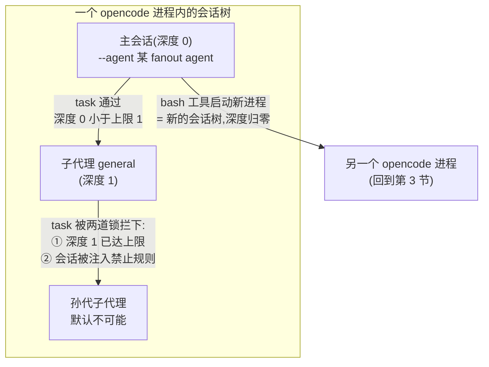

# opencode 嵌套派发分析:能套几层?

> **受众**:人类(维护者开发参考)。人话叙事,源码细节集中在文末速查表。
> **背景**:2026-09-10 探索会话产物。前置阅读:[`opencode-subagent-fanout-analysis.md`](opencode-subagent-fanout-analysis.md)——那篇回答「怎么用脚本批量派发 opencode 子进程」(也就是今天 `fanout_runner.py` 的由来);本篇回答它的自然追问:**这条路能套几层?**
> **源码基线**:本地 `C:\DEV\opencode` checkout(与前置篇同期,v1.18.x 源码树);行号以该树为准,升级后需复核。

---

## 1. 结论先行

两个问题,两个答案:

| 问题 | 答案 | 一句话原因 |
| --- | --- | --- |
| 派发脚本启动的 opencode 子进程,能再跑一个同样的派发脚本、启动孙代 opencode 进程吗? | **能,没有层数上限** | opencode 对「进程树里还有别的 opencode」毫无感知、毫无拦截;每次 `opencode run` 都是一个全新进程、全新会话 |
| 这个子进程能派 opencode 自带的子代理(subagent)吗? | **能。但它派出的子代理默认不能再派孙代** | 自带子代理有两道明确的锁:配置项 `subagent_depth` 默认 1 + 子会话被动态注入「禁止再派」规则 |

**最关键的一个反直觉结论**:这两条「嵌套」走的是**两棵互相独立的树**——

- **进程树**:派发脚本一层层启动的操作系统进程(词典:「嵌套派发」);
- **会话树**:同一个 opencode 进程里,主会话和子代理会话的父子关系(词典:「会话」)。

自带子代理的深度限制数的是**会话树**;而进程每换一层,会话就重新从零开始。换句话说:**用进程嵌套可以绕开会话深度上限**。想给总嵌套层数设限,必须两棵树都管。

## 2. 现状一分钟

`/mgh-init`、`/mgh-sdr` 现在的批量派发是三层结构:


本篇要回答的就是:图里的 C(子进程)能不能当 B(再套一层派发),以及 C 能不能不用脚本、直接派 opencode 自带的子代理。

## 3. 问题一:进程能套几层?

**答案:理论无限。** opencode 没有任何「禁止自我繁殖」的检查。三个源码事实拼起来就是结论:

1. **bash 工具就是普通本地子进程**,没有沙箱,环境变量全量继承(`shell.ts:342,484`)。子进程里跑 `py 某脚本.py`、脚本里再 spawn `opencode`,和你在终端里手动做没有任何区别。
2. **会话存在本地数据库里,进程之间互相独立**。同一台机器并发跑多个 `opencode run` 早就是现状(派发脚本一波就是好几个),再加一层不改变任何前提。
3. **没有入口检查**:无论 `opencode run` 是被人、被脚本、还是被另一个 opencode 的 bash 工具拉起来的,走的是同一条代码路径。opencode 甚至不知道「我是由另一个 opencode 启动的」这件事。

于是每一层嵌套长这样:



虚线是重点:**孙进程的会话是一棵新的树,深度从 0 重新数起**(每个 `opencode run` 的主会话都没有父会话)。第 3 节会看到,子代理的深度限制只数自己进程里的那棵会话树——所以进程嵌套每加深一层,深度限制就被「重置」一次。

## 4. 问题二:子进程能派自带的子代理吗?

**答案:能。** 无界面(headless,词典有)的 `opencode run` 主会话要过三道门,门门都开:

| 门 | 检查什么 | 我们的现状 |
| --- | --- | --- |
| ① 工具存在 | `task` 工具(派子代理的那个工具)有没有注册给这个会话 | 所有会话无条件注册,没有按 agent 剔除的逻辑(`registry.ts:216-243`) |
| ② 权限放行 | 调 `task` 会不会触发权限询问 | agent 权限有一条默认规则「其余全放行」,task 落在里面(`agent.ts:119-136`);本仓各 fanout agent 的 frontmatter 只显式禁了 edit,不碰 task |
| ③ 深度检查 | 当前会话离根会话几层 | 主会话深度 = 0,上限默认 1,`0 < 1` 通过(`task.ts:104-117`) |

还有一个前提本仓已经满足:`opencode run --agent` **拒绝用「子代理模式」的 agent 当主 agent**(`run.ts:610-615`)——这正是本仓所有 fanout agent 的 frontmatter 都写 `mode: primary` 的原因(前置篇定下的,不是巧合)。

**但它派出来的子代理,默认是「绝孙」的。** 两道锁:

1. **深度锁**:子代理会话深度 = 1,`1 >= 上限 1` 直接拒绝(`task.ts:104-117`)。上限来自配置项 `subagent_depth`(词典有),默认 1。
2. **规则锁**:派子代理时,opencode 会给子会话动态注入一条「禁止调用 task」的规则——**除非**这个子代理自己的配置里显式写了 task 权限(`task.ts:143-155`)。

想打开原生多层嵌套,两道锁**必须同时**解:

```json
{
  "subagent_depth": 3,
  "agent": { "general": { "permission": { "task": { "*": "allow" } } } }
}
```

只调大深度、不给中间层子代理配 task 权限,第二道锁照样拦;只配权限、不调深度,第一道锁照样拦。机制本身是完整支持的——子代理会话同样拿得到派子代理所需的全部通道(`prompt.ts:1224-1233`),锁是策略,不是能力缺失。



## 5. 如果真要做:四个工程边界

前两节说的是「能不能」;真要往流水线里加嵌套,「疼不疼」在这四件事:

1. **时间预算逐层相乘**。每层的「软时限必须早于宿主硬超时」不变量各自独立成立,但第 1 层派发脚本对单个子进程的超时,必须罩住这个子进程内部整个第 2 层的最坏耗时。层数每加一,预算规划是乘法不是加法;子进程被硬杀时,里面整个第 2 层一起死。
2. **死掉的语义反而是干净的**。Windows 上派发脚本杀的是整棵进程树(`fanout_runner.py:793-806`);孙代没写完的检查点就是没写完——没有完成标记 = 待跑,重派自然续上。现有检查点语义对嵌套是意外地友好。
3. **纪律守卫每层都生效**。hook 插件靠磁盘上的 `.active` 标记文件激活(词典:「哨兵文件」),每个 opencode 进程——包括孙代——都会读到它。「不许乱写脚本、不许越目录」的纪律在所有层一致生效,这是设计时没有特意追求的红利。
4. **可观测性逐层衰减**。进度心跳走 stderr,只有直接父进程看得见;卡死断路器(`--stall-waves`)只统计本层的进展。第 2 层卡死不会变成第 1 层的卡死信号,只能靠第 1 层的超时把它带出来。层数越深,「哪一层慢了」越难回答。

## 6. 值不值得用

- **原生子代理(第 4 节)有现成的现实用途**:评审单元内部的再并行。比如 `/mgh-sdr` 一个评审单元里 6 个维度,可以在同一个进程内用 `task` 并发派子代理,省掉一层 Python 派发脚本和进程启动开销。前置篇已核实:同一条消息里的多个 `task` 调用是并发执行的。注意两点:前台的 `task` 会等子代理跑完才继续;后台模式要开实验开关(`task.ts:98`)。
- **进程嵌套(第 3 节)几乎总有更便宜的替代**:加波次、调单元粒度、改分组脚本。只有「单元要跑起来才知道还得再拆」的场景才真正需要它——而那更像是分组脚本的职责该扩展,不是流水线该加深。如果有一天真要用,请先回答第 5 节的第 1 和第 4 条。

## 7. 源码依据速查表

| # | 结论 | 位置 |
| --- | --- | --- |
| 1 | `task` 工具对所有会话无条件注册 | `packages/opencode/src/tool/registry.ts:216-243` |
| 2 | 深度检查:沿会话父链数层,达到 `subagent_depth` 即拒绝(默认 1) | `packages/opencode/src/tool/task.ts:104-117` |
| 3 | 子会话被动态注入 task/todowrite 禁止规则;agent 配置显式写了 task 权限则不注入 | `packages/opencode/src/tool/task.ts:143-155` |
| 4 | `subagent_depth` 配置定义,默认 1,注释原话「防止子代理再派子代理」 | `packages/core/src/v1/config/config.ts:84-87` |
| 5 | `opencode run` 拒绝子代理模式的 agent 当主 agent(回退默认 agent) | `packages/opencode/src/cli/cmd/run.ts:610-615` |
| 6 | 子代理会话同样拿得到派子代理所需的 prompt 通道(机制支持原生多层) | `packages/opencode/src/session/prompt.ts:1224-1233` |
| 7 | bash 工具 = 普通本地子进程,无沙箱,环境变量全量继承 | `packages/opencode/src/tool/shell.ts:342,484` |
| 8 | 无界面模式从管道 stdin 读任务消息 | `packages/opencode/src/cli/cmd/run.ts:416` |
| 9 | 默认权限「其余全放行」,task 落在其中 | `packages/opencode/src/agent/agent.ts:119-136` |
| 10 | 后台子代理需要实验开关 | `packages/opencode/src/tool/task.ts:98-102` |
| 11 | 同一条消息多个 task 调用并发执行 | 前置篇 §2 事实 2(已核实,不重复展开) |
| 12 | 本仓派发脚本的启动形状 / 杀整棵进程树 | `core/scripts/fanout_runner.py:498-514` / `:793-806` |
