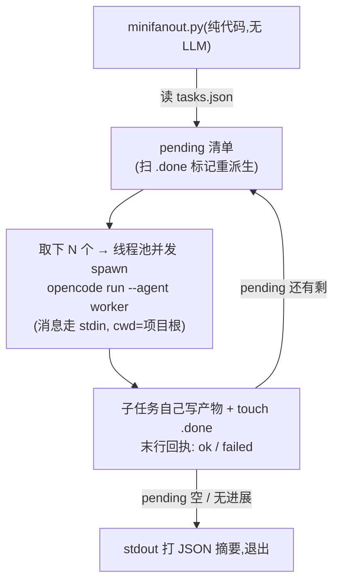

# opencode fan-out runner:一个 py 脚本并行跑多个 opencode 任务

> **受众**:人类(教学向,看完就能动手)。本文是「怎么回事 + 能不能一个脚本搞定 + 极简可用版」
> 的一站式说明;深度论证见文末索引。

## 0. 一句话结论

**可以。** 在 opencode 里并行跑 N 个子任务,本质上就是**同时启动 N 个 `opencode run` 子进程**,
每个进程的任务消息经 **stdin** 递入。这件事完全不需要 LLM 参与调度——一个只用 Python 标准库的
脚本就能做完「派发 → 收尾 → 断点续跑」的完整循环。双宿主真机已实证(5 个并发 `opencode run`
同仓跑,互不干扰、无 SQLite 锁冲突),并已在 `/mgh-init` scout 层产品化
(`core/scripts/fanout_runner.py`)。

## 1. opencode 派子任务有三条路,为什么选「子进程」

| 路                                                  | 怎么派                | 并行                              | 结论                                                   |
| -------------------------------------------------- | ------------------ | ------------------------------- | ---------------------------------------------------- |
| ① 交互会话里模型发 `task` 工具调用                             | 主 agent(LLM)每回合亲手派 | ✅ 同回合多调用并发                      | ❌ 每波之间必经一次 LLM 回合(看结果→决定下一批),几千批时白烧 token 且弱模型会漂     |
| ② HTTP API / 消息里注入 `subtask` part                  | 外部程序直接喂 prompt     | ❌ **串行**(源码每轮只 pop 一个、逐个 await) | ❌ 并行性直接出局                                            |
| ③ **CLI 子进程:`opencode run --agent <名>`,消息走 stdin** | 任意脚本 spawn 子进程     | ✅ 线程池起 N 个进程                    | ✅ **本方案**。subagent 的创建本就不需要 LLM——「派谁、喂什么消息」可以全部由代码决定 |

路 ③ 的关键事实(均已在本仓 spike 真机实证,源码锚点为本地 `C:\DEV\opencode` checkout v1.18.x):

| # | 事实 | 锚点 |
| --- | --- | --- |
| 1 | `opencode run --agent X` 的 X **必须是 `mode: primary`**;给 `mode: subagent` 的 agent 会打警告并**静默退回默认 agent**(任务照跑,但 agent 定义/权限全丢) | `packages/opencode/src/cli/cmd/run.ts:610-617` |
| 2 | 任务消息可经 **stdin** 递入:stdin 非 TTY 时 `run` 主动读 `Bun.stdin.text()` 当消息 | `run.ts:416` |
| 3 | 默认输出格式下,**stdout 末行 = 最终回传消息**(恰好可当回执解析) | spike 实证 |
| 4 | 5 个并发 `opencode run` 同仓同 cwd:全部 exit=0,无 SQLite 锁死 | spike 实证 |
| 5 | 子进程 cwd 设为目标项目根,则它加载该项目的 agent 定义/插件,与手跑无异 | spike 实证 |

## 2. fan-out runner 的最小闭环 = 四件事



1. **任务清单从哪来**:一个 JSON 数组,每项 `{id, message}`。哪些还没做完?**扫磁盘标记**——
   `<id>.done` 文件存在 = 完成。清单永远从磁盘重派生,所以脚本被杀再跑就是天然的断点续跑。
2. **怎么并发**:`ThreadPoolExecutor` + `subprocess.run`,一个 worker 一个 `opencode run` 子进程。
3. **怎么算完成**:子任务在消息里被约定「干完活 touch `.done`,最终回复单行回执」。回执解析不出
   来也没关系——**磁盘标记是唯一真相源**,有 `.done` 即完成。
4. **怎么收敛**:一波跑完重扫标记 → 还有 pending 就派下一波;pending 空 = 全部完成;连续一波
   零进展 = 熔断停下(防死循环),剩下的留给下次重跑。

## 3. 四个必踩的坑(Windows / 双宿主真机实证,全部踩过)

| # | 坑 | 现象 | 解法 |
| --- | --- | --- | --- |
| 1 | npm 装的 CLI 在 Windows 是 `.cmd` 转发脚本 | `subprocess.run(["opencode", ...])` 直接 WinError 2 | 用 `shutil.which("opencode")` 解析成绝对路径再 spawn |
| 2 | 多行消息放 argv 会被 `.cmd` 转发脚本截断 | 子任务只收到第一行(实测只收到 `<!--`) | 消息走 **stdin 管道**(`input=...`),两个宿主都支持 |
| 3 | `--agent` 给了 `mode: subagent` 的定义 | 警告后静默换默认 agent,权限/提示词全丢 | 给 fanout 用的 agent 定义写 `mode: primary` |
| 4 | 三层超时嵌套关系错 | 被宿主 Bash 硬杀,在飞的一波全丢,退化成「杀→重派→再杀」循环 | 自内向外:**单进程超时 < 脚本软时限 < 宿主 per-call 超时**,每级留 ≥20% 余量;软时限到了就停发新波、等在飞的跑完、干净退出(下次重派续跑) |

## 4. 极简可用版(标准库,可直接抄跑)

三样东西:① 一个 worker agent 定义(也可以不要,见下);② `tasks.json`;③ `minifanout.py`。

**① worker agent(可选)**:不指定 `--agent` 就用默认 agent,最简演示可以跳过。要专用 worker
就在目标项目 `.opencode/agent/worker.md` 放(`mode: primary` 是硬要求,见坑 3):

```yaml
---
description: fanout worker
mode: primary
---
你是并行子任务执行者:严格按任务消息办事,最终只回一行结论。
```

**② `tasks.json`**(消息里约定好 `.done` 标记与单行回执,这是整个断点续跑机制的根基;
`<项目根>` 是给你抄写时替换成**绝对路径**的——子任务不信任相对路径,任意 cwd 都安全):

```json
[
  {"id": "t1", "message": "任务:数 README.md 里有几个二级标题。完成约定:用 bash 执行 `touch <项目根>/.minifanout/done/t1.done`(路径按此原样),然后最终只回一行:`ok t1 <数量>`。"},
  {"id": "t2", "message": "任务:数 src/ 下有几个 .py 文件。完成约定:用 bash 执行 `touch <项目根>/.minifanout/done/t2.done`(路径按此原样),然后最终只回一行:`ok t2 <数量>`。"}
]
```

**③ `minifanout.py`**——完整闭环 ~50 行,零第三方依赖:

```python
#!/usr/bin/env python3
"""minifanout.py — 极简 opencode 并行派发(纯标准库)。
用法: py minifanout.py tasks.json   (在目标项目根运行)
约定: 子任务完成时自己 touch .minifanout/done/<id>.done(写进任务消息);
      被杀/超时的子任务没有 .done → 下次重跑自动重派。"""
import json, shutil, subprocess, sys
from concurrent.futures import ThreadPoolExecutor
from pathlib import Path

WAVE, CALL_TIMEOUT_S = 5, 7200
REPO = Path.cwd()                       # 子进程 cwd = 目标项目根
DONE = REPO / ".minifanout" / "done"

def spawn(task):
    exe = shutil.which("opencode") or "opencode"     # 坑1: Windows .cmd 解析绝对路径
    try:
        r = subprocess.run([exe, "run", "--agent", "worker"],   # 坑3: agent 须 mode: primary
                           input=task["message"],                # 坑2: 消息走 stdin
                           cwd=str(REPO), capture_output=True, text=True,
                           encoding="utf-8", errors="replace",
                           timeout=CALL_TIMEOUT_S)
        last = (r.stdout or "").strip().splitlines()[-1:] or ["<no output>"]
        print(f"[{task['id']}] exit={r.returncode} ack={last[0][:120]}", file=sys.stderr)
    except (subprocess.TimeoutExpired, OSError) as e:
        print(f"[{task['id']}] crash/timeout: {e} -> 留 pending, 重跑即重派", file=sys.stderr)

def pending(tasks):
    return [t for t in tasks if not (DONE / f"{t['id']}.done").exists()]

def main():
    tasks = json.loads(Path(sys.argv[1]).read_text(encoding="utf-8"))
    DONE.mkdir(parents=True, exist_ok=True)
    while (pend := pending(tasks)):
        print(f"wave: {[t['id'] for t in pend[:WAVE]]}", file=sys.stderr)
        with ThreadPoolExecutor(max_workers=min(WAVE, len(pend))) as pool:
            list(pool.map(spawn, pend[:WAVE]))
        if len(pending(tasks)) == len(pend):          # 零进展熔断,防死循环
            print("no forward progress; stop (剩下的重跑本脚本即续)", file=sys.stderr)
            break
    print(json.dumps({"total": len(tasks), "pending": len(pending(tasks))}))
    return 0

if __name__ == "__main__":
    sys.exit(main())
```

跑起来:

```bash
py minifanout.py tasks.json        # 进度看 stderr,摘要看 stdout(JSON)
```

中途 Ctrl-C / 超时 / 断电都不丢进度:重跑同一命令,已 `.done` 的自动跳过,剩下的继续派。

## 5. 极简版 → 产品版的差距(为什么 `fanout_runner.py` 有千余行)

极简版保留了**骨架闭环**(波次循环 / stdin 消息 / 标记断点续跑 / 零进展熔断),产品版
`core/scripts/fanout_runner.py` 在骨架之上补的都是真机跑大仓才暴露的承重件:

| 能力 | 极简版 | 产品版做法 |
| --- | --- | --- |
| 任务消息来源 | 手写 JSON | **固定模板 + 逐字字段替换**(`core/prompts/fragments/fanout/scout-task.md`),路径拼写错误类失败从根上消失 |
| pending 清单来源 | 静态 tasks.json | 消费枚举脚本 `list_scout_batches.py` stdout(分页/预算/物化绝对路径) |
| 路径安全 | 无 | 派发前 `resolve()` 锚树校验,越树单元直接记失败、绝不 spawn(防「输出漂到盘符根」) |
| 失败语义 | 只认 `.done` | `failed` 回执 → 写 `.failed` 终态标记(不重试);crash 无标记 → 留 pending 重派(crash ≠ 确认失败) |
| 软时限 | 无 | `--time-budget-ms` 停发新波、等在飞收敛、退出码 0 + `partial:true` 干净早退(坑 4 的完整解) |
| 可观测 | stderr 行 | 人类面进度 sidecar `fanout_progress.json`(第二终端 `Get-Content -Wait` 盯)+ 每单元审计副本 `<batch_id>.task.md`(复盘「子任务到底收到了什么」) |
| 宿主适配 | 仅 opencode | `--host` 自动探测 opencode/claude(`claude -p --agents <JSON>` 等价映射),都缺则 fail-loud + 回退手派 |
| 回归保障 | 无 | 单测 `tests/test_fanout_runner.py` + 契约 lint + token lint |

## 6. 调度设计的血泪经验(2026-09 T1 真机事故复盘)

> 事故催生的加固正由 openspec change `harden-mgh-fanout-stall-containment` 落地;落地前产品版
> 现状 = 波次屏障 + 仅绝对兜底超时。以下按「现象→原因→改法」沉淀,极简版照抄同样适用。

**事故一句话**:T1 resume 连续两波各卡死 1 个子代理(换单元、输入才几 KB——不是任务太大),
其余 4 个槽位全程陪等,宿主 15/60 分钟硬超时把整棵进程树杀掉;卡死单元没写完成标记,重派,
下一波再卡,每波净推进 4/5。opencode 源码核实根因:子进程对 LLM 流**没有任何超时**
(`timeout: false`),内网接口流一停,子进程零输出永久挂死。结论:**挂死不可消除,调度器必须自己兜住**。

**经验 1 — 波次屏障是故障放大器,要槽位补位。**「全波收完才派下一波」意味着 1 个卡死 =
4 个槽位陪葬、整 run 停摆。改成槽位补位(谁到终态谁腾坑、立刻补新人)后,卡死的代价从
「整波陪葬」降为「占一个坑」,其余槽位照常推进。

**经验 2 — 每个子任务挂两块表,先到先杀。**只有一块绝对总长表是不够的:事故里兜底 7200s
比宿主超时还大,永远轮不到它生效。两块表分工:

| 表 | 参数(示例取值,宿主 15min 时) | 杀谁 |
| --- | --- | --- |
| 静默表 | `--stall-timeout-s`(5min) | 连续 5 分钟**零字节输出**的单元——大概率挂死 |
| 总长表 | `--call-timeout-s`(9min) | 启动起 9 分钟没干完的单元——**哪怕一直在正常输出**也杀,防「活得很欢但没完没了」无限占坑 |

慢 ≠ 挂:静默表只杀不说话的,总长表管说话但跑不完的。被杀单元没写标记 → 留待办 → 重派
重新起算(偶发卡死重派一次就好,事故实证:卡死单元 A 重派后正常完成)。

**经验 3 — 所有时钟嵌套,留 ~20% 余量,spawn 前校验。**

```
静默 5min < 单元总长 9min < 收工闹钟 12min < 宿主硬超时 15min
```

单元表每次重派重新起算;收工闹钟(`--time-budget-ms`)和宿主刀是**整次调用**的,永不刷新。
收工闹钟的意义:软时限一到就停派新任务、等在飞的收敛、退出码 0 + `partial:true` 干净早退,
下次重跑从磁盘续——**永远赶在宿主动刀之前体面收工,绝不体验硬杀**。且必须在 spawn 任何
单元**之前**校验嵌套关系:默认值组合(兜底 2 小时)对小时级宿主预算必然违例,静默错配 =
把同一事故原样重演。

**经验 4 — Windows 上杀子进程必须树杀,`proc.kill()` 是假的。**npm 装的 CLI 在 Windows
是 `.cmd` 转发脚本,`proc.kill()` 只杀转发层,真进程成孤儿继续烧 token。必须
`taskkill /pid <pid> /T /F` 杀整棵树(POSIX 用进程组)。

**经验 5 — 重试不数次数,熔断盯磁盘进度。**卡死单元重派几次没有固定上限,上限是进度判据:
观察点从磁盘重派生 done+failed 计数,连续 2 个观察点零增长且队列还有活 → 停,退出码 2,
点名卡住单元。观察点必须包含「队列只剩坏单元」的尾巴形态(队列耗尽重列),否则单个确定性
坏死单元永远凑不满统计窗口、无限重派烧钱。

**经验 6 — 事后定位靠证据,不靠猜。**每个单元的 stdout/stderr 尾部落盘 `*.run.log`(非 ok
终态必写),stderr 诊断行附路径——没有它,复盘只能靠猜。再加心跳:每分钟一行在飞单元 +
距其上次输出的秒数,人从 TUI 实时区分「正常慢」和「卡死了」,不再有 57 分钟零输出不可判读。

**经验 7 — headless 子代理的权限问询 = 挂死面,agent 定义里显式钉扎 deny。**opencode
默认权限表有 ask 类(`external_directory`/`doom_loop` 等);run 无头模式下 ask 在旧版 =
无应答者**永久挂**。agent frontmatter 显式 `deny`(工具报错、agent 适配后继续)与版本无关
地消除问询面——不要赌装机版本的行为。

## 7. 参考索引

| 材料 | 位置 |
| --- | --- |
| 可行性分析(subagent 创建机制、三路对比、源码锚点) | [`docs/opencode-subagent-fanout-analysis.md`](opencode-subagent-fanout-analysis.md) |
| change 提案 / 设计(含 spike 实证回填) | `openspec/changes/archive/2026-08-18-add-mgh-init-scout-fanout-runner/{proposal,design}.md` |
| 已 sync 的能力规格 | `openspec/specs/fanout-dispatch/spec.md` |
| 卡死围堵加固(槽位补位/失活检测/树杀/run.log/熔断重锚) | `openspec/changes/harden-mgh-fanout-stall-containment/{proposal,design,tasks}.md` |
| 产品版调度器 | `core/scripts/fanout_runner.py` |
| fanout 专用 agent 定义(`mode: primary` 克隆) | `releases/opencode/agent/init-scout-fanout.md` |
| 任务消息模板 | `core/prompts/fragments/fanout/scout-task.md` |
| opencode 源码锚点 | `C:\DEV\opencode` `packages/opencode/src/cli/cmd/run.ts:416`(stdin)、`:610-617`(拒 subagent) |
