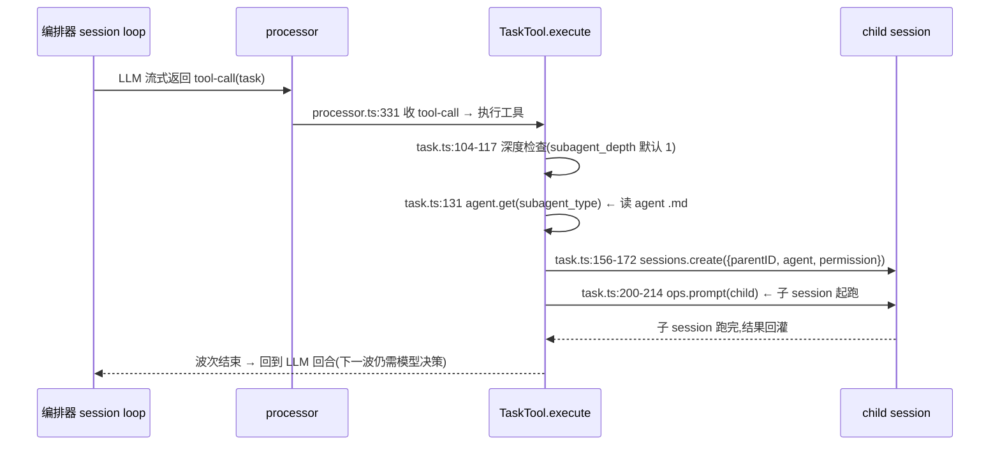
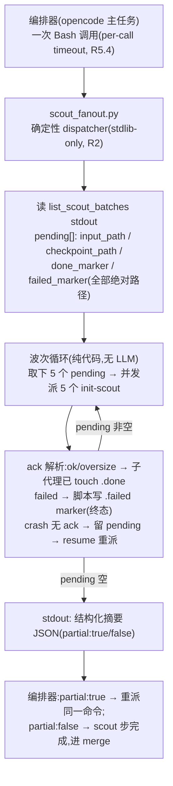

# opencode subagent 创建机制与零介入批量派发可行性分析

> **受众**:agent(开发参考;与 [`opencode-context-mechanics.md`](opencode-context-mechanics.md) 同类)
> **背景**:探索会话产物(2026-08-17)。以 `/mgh-init` scout 为例,解剖 opencode 源码中 subagent 的实际创建路径,论证「固定脚本波次派发、编排器 LLM 零介入」的可行性。
> **源码基线**:本地 `C:\DEV\opencode` checkout(v1.18.x 源码树);行号以该树为准,升级后需复核。

---

## 1. 结论先行

1. opencode 的 subagent = **独立 child session**(`sessions.create({parentID, agent, permission})`),不是线程;子 agent 的 system prompt 来自 agent 定义 `.md`(如 `init-scout.md`),天然满足「每批同一系统提示」。
2. 同一条 assistant 消息里的多个 `task` tool-call **并发执行**;但**每一波之间必然经过编排器 LLM 回合**(看 ack → 重跑 list → 决定下批 → 再发 task 调用)——这是现状波次边界 token 浪费与弱模型漂移的根源。
3. **subagent 的创建本就不需要 LLM 参与**:prompt 输入 schema 公开暴露 `SubtaskPartInput`(HTTP `POST /session/:id/message` 直接吃),「派哪个 subagent、喂什么 prompt」可完全由外部确定性输入决定。
4. 推荐方案:把波次循环下沉为 **stdlib dispatcher 脚本 spawn `opencode run --agent init-scout`**(下文路径 D),编排器一次 Bash + `--resume` 重派跑完全程;`.done`/`.failed` marker / resume / hook 哨兵契约全部原样承接。

## 2. opencode 创建 subagent 的两条通道

### 通道 1:模型驱动的 `task` 工具(LLM 发起;mgh-init scout 现状)

关键事实(均已在源码核实):

| # | 事实 | 源码锚点 |
| --- | --- | --- |
| 1 | 每次 `task` 调用创建独立 child session,继承 parentID + agent 定义 + 派生 permission(deny 嵌套 task/todowrite) | `packages/opencode/src/tool/task.ts:156-172` |
| 2 | 同一 assistant 消息多个 tool-call **并发**:native 路径每 call 经 `ToolRuntime.dispatch` + `FiberSet.run` fork,流末 `awaitEmpty`;ai-sdk 路径由 SDK 并发 execute、step 末统一 await | `packages/opencode/src/session/llm/native-runtime.ts:118-127`、`packages/llm/src/tool-runtime.ts:23`、`packages/opencode/src/session/llm.ts:280` |
| 3 | 波次边界必经编排器 LLM 回合:结果回灌后循环回到模型,由模型重跑 list、决定下一批 | `packages/opencode/src/session/prompt.ts:1088-1339`(runLoop) |
| 4 | 子 session 权限:父 permission + agent 定义 + 工具 deny 规则合并 | `packages/opencode/src/tool/task.ts:139-155`、`packages/opencode/src/agent/subagent-permissions.ts` |

### 通道 2:确定性注入的 `subtask` part(不经 LLM 决策)

- schema:`SubtaskPartInput {type:"subtask", prompt, description, agent, model?, command?}` — `packages/schema/src/v1/session.ts:437-451`
- `PromptInput.parts` 联合类型含它 — `packages/opencode/src/session/prompt.ts:1499-1520`
- 消费:runLoop 里 `tasks.pop()` 取出 subtask part → `handleSubtask` → **同一 TaskTool.execute 路径**(`tool.execute.before/after` hook 照常触发、child session 照常创建)— `packages/opencode/src/session/prompt.ts:1142-1147`、`:255`
- HTTP 面:`POST /session/:id/message` 的 `PromptPayload` 直接吃 parts 数组 — `packages/opencode/src/server/routes/instance/httpapi/groups/session.ts:70,95`
- opencode 自用例:`@agent` 提及被转成指令让模型调 task 工具(绕路)— `packages/opencode/src/session/prompt.ts:974-990`

**坑**:`prompt.ts:1142` 每次循环只 pop **一个** subtask part 并 await 完才继续——同一消息注入 N 个 subtask part 是**串行**执行。并行仍需通道 1 的多 tool-call,或外部并发驱动。

## 3. 目标形态:脚本化波次派发,编排器零介入

编排器在整个 scout tier 的 token 消耗 = **1 次 Bash 调用 + 若干次 resume 重派 + 1 次读摘要**。没有波次边界的 LLM 回合,「还剩多少/下批哪五个/谁失败」全部变成脚本内确定性逻辑;`.failed` 终态 / crash≠确认失败 语义不变(marker 仍是磁盘真相源)。

## 4. 实现路径对比

| | A. 纯提示词增强(现状) | **D. 脚本 spawn `opencode run`(推荐)** | B. 脚本驱动 `opencode serve` HTTP API | C. 插件注入 subtask parts |
| --- | --- | --- | --- | --- |
| 机制 | 壳指示「每回合发 5 个 task 调用」 | dispatcher 线程池并发 `opencode run --agent init-scout --format json "<固定模板+batch json>"` | dispatcher 用 stdlib `urllib` 打 `POST /session/:id/message`(parts 含 subtask) | `.opencode/plugins/*.ts` 的 `chat.message` hook 注入 N 个 subtask part |
| 并行 5 | ✅(同回合多 tool-call) | ✅(线程池) | ✅(并发请求) | ❌ **串行**(tasks.pop 逐个 await) |
| 编排器 token/波 | ~1-3K(ack 内省+决策) | **0** | **0** | **0** |
| 零依赖(R2) | ✅ | ✅ subprocess+threads | ✅ urllib+threads | ⚠ 插件是 TS,但属宿主原生胶水(R5.7 已定性) |
| 运维面 | 无 | 无新面(CLI 本就存在;auth 走盘上 `auth.json`) | 须管理 server 生命周期/端口发现(4096→free port,`server.ts:120-121`)/鉴权 | 无,但强耦合插件 API 版本 |
| 主要风险 | 弱模型波次漂移(既有 FD 形状) | 进程 spawn 开销 ~1-2s/批;并发多进程 SQLite 锁 **需 spike** | server 端口/鉴权握手 **需 spike**;API churn(pre-1.0) | chat.message hook 能否注入 subtask part **需 spike**(schema 允许,hook 语义是改 output.parts) |

**推荐 D 为主、B 为备选**。D 本质 = 把「派发循环」从 LLM 回合下沉为 R5.3 确定性脚本,与 `discover_controls.py` 的 `--time-budget-ms`/`partial:true`/`--resume` 长跑契约(R5.4)完全同构。C 的串行性使它直接出局,除非依赖 `OPENCODE_EXPERIMENTAL_BACKGROUND_SUBAGENTS` 实验 flag(不做产品依赖)。

## 5. 与既有架构的接缝

- **R5.2 不冲突**:NEVER 禁的是编排器**运行时临场写**派发脚本;dispatcher 是产品自带的确定性叶脚本(dev 时写好、install 分发、`--help` 即契约),与 `list_scout_batches.py` 同类。编排器只是 `Bash` 调它。
- **hook 域不变**:spawn 出的子 `opencode run` 进程加载目标项目插件;`MGH_INIT_ACTIVE` env 不跨进程,但磁盘哨兵 `<target>/.mgh-init/.active` 恰为这种边界设计(R5.7)——子进程守卫照常激活、越树写照拦。
- **subagent 系统提示不变**:仍走 `init-scout.md` agent 定义(`--agent init-scout`),prompt = 固定模板 + 逐字透传 `pending[]` 绝对路径字段(R5.3b 扇出路径契约)——「同一系统提示、同格式任务内容」由构造保证,不靠模型自觉。
- **T1/T3/sra 同构可复制**:`list_clusters`/`list_rule_jobs` 产出同 shape pending 清单,dispatcher 泛化为 `fanout_runner.py --tier scout|t1|t3 --wave 5` 即可服务全部 fan-out tier(mgh-sra a3 augment 扇出同理)。

## 6. 待 spike 验证的开放问题

| # | 问题 | 判定影响 |
| --- | --- | --- |
| 1 | 并发 `opencode run` 的 SQLite 行为:5 个并发进程写各自 session 是否被锁拒绝 | D 路径承重假设;失败则转 B |
| 2 | `opencode run --agent <mode:subagent 的 agent>` 是否接受显式指定(`run.ts:170` 有 `--agent`,subagent 模式是否被过滤需实测) | D 路径入口可行性 |
| 3 | B 路径的 server 端口发现/鉴权握手 | 仅当 D 失败再投入 |
| 4 | ack 解析边界:子代理最终消息格式已是契约(`ok/oversize/failed`,见 `releases/opencode/agent/init-scout.md`);需定 stdout 拿不到最终消息时的降级(只信 `.done` marker,pending 留给 resume) | dispatcher 状态机完备性 |

## 7. 后续

若 spike 1、2 通过,建议以 openspec change 立项(候选名 `harden-mgh-init-deterministic-scout-fanout` 或泛化 `add-fanout-runner`);属跨命令基础设施(scout/T1/T3/sra-augment 共用),按惯例拆 foundation + per-command adoption。
