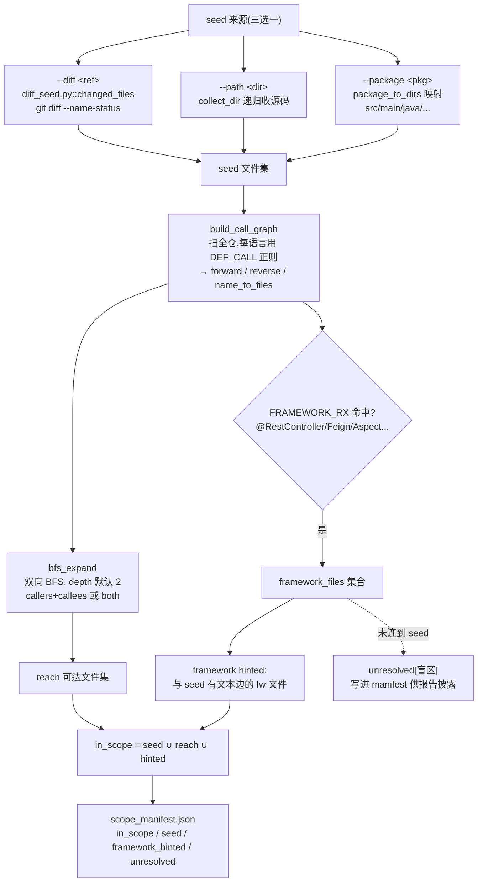

# 确定性引擎与调用链映射

> 路径规约:移植侧用相对 `m3g4horness` 根的路径;原项目侧 `vvaharness/...`
> (绝对位置 `C:/DEV/visa-vulnerability-agentic-harness/vvaharness/`)。

**结论先行:** mgh-sast 的 5 个确定性脚本分两类——`dedup / prefilter / emit_sarif`
是 vvaharness 对应阶段的**保真度有取舍的纯 Python 移植**(剥离所有 LLM 调用,改纯
启发式);`expand_scope / diff_seed` 是**全新逻辑,vvaharness 无对应物**(原项目没有
增量/diff/作用域展开引擎)。上游真正的"确定性调用图"逻辑在
`s1_preprocess._supplement_call_graph`,它和 `expand_scope.build_call_graph` 是**两套
独立实现**(用途不同:前者补全 LLM 调用图喂给 s3/s4,后者做 BFS 作用域展开)。
**tree-sitter 在重写版确认未接入**(代码、依赖、测试均无,README 与注释一致声明 optional)。

### 确定性脚本映射总表

| 重写版 (`core/scripts/`) | 原项目来源 (`vvaharness/`) | 保真度 | 被简化 / 差异 |
|---|---|---|---|
| `prefilter.py::run/evaluate` | `pipeline/stages/s5_prefilter.py::run` | 部分 (~60%) | 删 `_is_secret_class`(test 路径硬编码密钥白名单)、`_EXCLUDE_PATH_RE`(换更宽 `NOISE_RX`)、**hallucinated-path 校验**(`f.file not in ctx.all_files`,重写版无 inventory)、调 `s7_dedup.prefilter` 的 trivial-dup 预合并、**阈值触发的语义 dedup**(`pre_verify_threshold`,LLM)。新增**行号正则校验**(`:\d+`)与 **scope 门**(`--scope-file`,增量扫描新概念)。门控默认值不同:重写 `min_conf=0.40` 且 `require_evidence` 默认开;原项目从 `cfg.step5_prefilter` 读(legacy fallback `step6_verify`)。 |
| `dedup.py::run` | `pipeline/stages/s7_dedup.py::run` + `::prefilter` + `::_collapse_trivial` | 部分 (~55%) | **7a 确定性 pass 改造**:原项目按 `file+vuln_class+\|Δline\|≤tol`+**行范围重叠**判重;重写版用 `(file, CWE, line//window)` 分桶再 Jaccard 标题去重(≥0.6)。**7b 语义 pass(LLM)整体删除**——用标题 token 重叠近似。原 `_attach_duplicates` 传递链/transitive 解析/`DupLocation` 快照(带 source_ref/sink_ref 进 SARIF relatedLocations)**未移植**;重写版 `duplicates[]` 只存 id/title/file/line。 |
| `emit_sarif.py::cvss_base / parse_vector / roundup / severity_band` | `report/cvss.py::score / rating` + `_roundup1` | **高 (~95%)** | CVSS 3.1 系数表、roundup、scope-changed 公式逐行对应;唯一差异:重写 `severity_band(0.0)="Info"`、`None="Info"`,原项目 `rating(0.0)="None"`、`None="Unknown"`。解析方式不同:原项目单一严格正则 `_VECTOR_RE`,重写版按 `/` split 容错(缺字段→score=None)。测试确认 `C:H/I:H/A:H`=9.8 与 scope-changed 两端一致。 |
| `emit_sarif.py::emit`(SARIF 结构) | `report/enrich.py::generate_sarif` | **低 (~35%)** | 大幅精简。**删除**:从 MD 反解析 findings 的 `parse_findings`、`_driver_rules` 按 category 分 rule、`_cwe_taxonomy`+`supportedTaxonomies`+GUID、`relatedLocations`(来自 dedup 的 `also_at`)、`result.rank`(CVSS×10)、`invocations`/scan-health 降级标记、`redact_tree` 脱敏、`vsvs_`(VulContextSeverity)、`offensivePriority`。重写 ruleId 直接用 CWE id(`cwe-89`)而非 category;`partialFingerprints.primaryLocationLineHash` 是重写版自创。severity→level 映射两端都对(Critical/High→error,Medium→warning,Low→note)。 |
| `emit_sarif.py::CWE_NAMES` | `report/cwe.py::CWE_NAMES` + `cwe_name` | 部分 (~20 条 vs 65 条) | 原表小子集,**且有重复键 bug**:`CWE-79` 在 dict 里出现两次(第 88/93 行),后者覆盖前者为 "Cross-site Scripting"。原项目用 `cwe_name`/`cwe_label` helper;重写版直接 `dict.get`。 |
| `expand_scope.py::build_call_graph / bfs_expand` | `pipeline/stages/s1_preprocess.py::_supplement_call_graph` | **新增(非移植)** | 见下节。两套实现,设计目的不同。 |
| `expand_scope.py::package_to_dirs / collect_dir` | (无对应) | 全新 | 原项目无 package/dir scope 概念。 |
| `diff_seed.py::changed_files` | (无对应) | 全新 | 原项目无增量/diff 扫描。`git diff --name-status` 解析 + R/C 重命名处理 + D 删除单独记录,均为重写版原创。 |

### 调用链引擎对比(重点)

`expand_scope.py` 与上游 `_supplement_call_graph` 是**两套独立实现**,不可视为"移植":

| 维度 | 上游 `s1_preprocess._supplement_call_graph` | 重写 `expand_scope.build_call_graph` |
|---|---|---|
| 目的 | **补全/校验 LLM 猜的 call_graph**,喂 s3/s4 taint chunk 邻居 + 连通分量分组 | **文件级 BFS 作用域展开**,决定增量/定向扫描扫哪些文件 |
| 节点粒度 | `rel/path/File.java::method`(函数级,文件限定) | 文件级(caller_file → callee_file,聚合权重) |
| 输入 | 既有 LLM `call_graph` dict + entry_points/unsafe_sinks 种子 | 仅仓库源码(纯文本扫描,无 LLM 输入) |
| 核心循环 | 先验证 LLM 边、再 regex 补充(多轮 BFS,`call_graph_rounds=3`) | 一次性扫全仓 def/call site,构建 forward+reverse+name_to_files |
| 多义解析 | `_resolve_callee_files`:same-file > unique > longest-common-dir-prefix,`max_targets=3` | 无歧义解析,bare name → 所有 def 文件全连边 |
| tree-sitter | **无**(纯 regex,`_DEF_RXS`/`_CALL_TOKEN_RX`) | **声称 optional,实际未接入**;`DEF_CALL` 表是手写正则,无 `tree_sitter`/`ts_`/AST import |
| 框架提示 | 无 | 有:`FRAMEWORK_RX`(@RestController/FeignClient/Aspect 等)把 route/Feign/AOP 文件拉入 scope(为银行 Spring 环境加) |
| 盲区披露 | 无(产物是 call_graph 本身) | 有:`unresolved[]` 列出无法文本连到 seed 的框架文件,写进 manifest 供报告披露 |

**关键确认:** 重写版 `expand_scope.py` 顶部注释写 "Optional tree-sitter backend (auto
fallback to the text graph)",但**全文件无 tree-sitter 代码路径**——`build_call_graph`
只用 `re.compile`,无 import、无 try/except 探测 grammar。README 第 58-59 行明确"当前
未接入"。**结论:tree-sitter 是规划中的占位,未实际接入;当前调用图 = 纯文本 regex +
框架 allowlist。**

### 作用域展开流程

> `--diff` 与 `build_call_graph` 之间**无 tree-sitter 分支**——当前实现恒走文本路径。

### 同步建议(给未来开发者)
- **几乎无脑 pull**:`cvss.py` 的系数表/roundup/rating 公式(重写 `emit_sarif.cvss_base` 是其等价实现;上游 CVSS 公式修订时,直接同步 `_AV/_AC/_PR_*/_UI/_CIA` 五张表 + `_roundup1`)。
- **不要直接同步**:`generate_sarif` 的结构(原项目深度耦合 MD 解析 + CMDB + VulContextSeverity + redact,重写版刻意砍掉以保零依赖;同步需逐字段判断是否在重写数据模型里存在)。
- **上游无、重写独有,无需反向同步**:`expand_scope` / `diff_seed` 全套增量逻辑。**接入 tree-sitter 的正确位置是 `expand_scope.build_call_graph` 的 DEF_CALL 表替换处**(注释已留好 "auto fallback" 语义),不要动上游 `s1_preprocess`——两者用途不同。
- **建议修**:`emit_sarif.CWE_NAMES` 的 `CWE-79` 重复键 bug(第 88/93 行);同步时可从 `cwe.py::CWE_NAMES` 取全量 65 条替换。

### 参考文件
- 重写脚本:`core/scripts/{dedup,prefilter,emit_sarif,expand_scope,diff_seed}.py`
- 重写测试:`tests/test_deterministic.py`
- 上游 dedup/prefilter:`vvaharness/pipeline/stages/{s5_prefilter,s7_dedup}.py`
- 上游 CVSS/CWE:`vvaharness/report/{cvss,cwe}.py`
- 上游 SARIF:`vvaharness/report/enrich.py:859`(`generate_sarif`)
- 上游调用图(非移植源):`vvaharness/pipeline/stages/s1_preprocess.py:554`(`_supplement_call_graph`)
