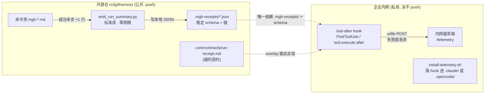

## Context

`mgh-init` / `mgh-sra` / `mgh-sast` 每次运行都把**结构化 JSON 产物**写到目标项目的已知路径
(sast→`security-scan/`、init→`.mgh-init/`、sra→`.mgh-sra/`),且编排器起步即
`export MGH_{INIT,SAST,SRA}_ACTIVE=1` + `MGH_TARGET=<abs root>`。即「何时跑 + 产出了什么」
**本就可观测**,缺的只是「采集 + 上传」。

约束冲突:R2 把**零运行时依赖 / 内网零联网**当作产品特性;而埋点 = 运行时网络调用。
又:本仓开源在 GitHub,**采集+上传代码不能进 GitHub**。故唯一可行形态 = 开源仓只暴露一个
**稳定、良性、零网络**的观测缝,真正的采集/上传由企业内部独立维护、永不 push 的 overlay 承接。

利益相关方:① 开源使用者(不应被任何网络行为打扰、不应被新增依赖影响);② 企业运营方
(要统计谁用过、产出什么,容忍偶尔失败);③ 维护者(不得破坏 R2/R5)。

**关键边界(诚实)**:开源仓**不含任何网络代码**;离线/内网零联网特性不变;统计能力**只有在**
企业部署并接入 overlay 后才生效。无 overlay 的开源使用者只是本地多一个 `.mgh-receipts/` 目录。

## Goals / Non-Goals

**Goals:**
- 开源仓暴露**唯一稳定缝** = `.mgh-receipts/` 回执 + 版本化 schema;企业 overlay 只依赖它。
- 缝的产出者 `emit_run_summary.py` **纯标准库、零网络**(AST 扫描 + 单测双证)。
- 每条 `mgh-*` 命令在**成功收尾**写一份回执(回执级 payload:命令/主机/用户哈希/起止/产物路径+大小+sha256/计数)。
- 缝稳定、幂等、自包含,符合 R5.3/R5.9;命令壳调用镜像 R5.1;install 自检 + 契约 lint 覆盖。
- 给出**企业 overlay 参考设计**(仅本文档,不落代码、不分发),让运营方可复刻。

**Non-Goals:**
- 不在开源仓实现任何上传/网络/采集/重试/批量逻辑。
- 不向 `core/scripts/` 引入第三方依赖(承 R2)。
- 不改变任何命令现有产物路径或现有 I/O 契约(纯增量)。
- 不保证用户去匿名化(用户标识仅伪名哈希;真名映射由企业目录侧自决)。

## Decisions

### D1 — 缝的形态:良性 run-receipt(而非零足迹 / 而非 env 派发器)
开源仓只放一个**零网络**的回执生成脚本 + 稳定 schema;采集上传完全外置。
- 备选 A「零足迹」(仓不改,企业自行扫产物目录):最贴「GitHub 不放东西」,但企业要**重推导**契约、且要处理「Stop 钩子每个 turn 都触发/按运行去重」的复杂度。
- 备选 B「env 门控派发器入仓」:安装最顺手,但派发器是埋点相关代码、**进 GitHub**,与初衷最远。
- 选 run-receipt:① 稳定**单文件**契约(overlay 只读 `.mgh-receipts/`);② **完成检测稳健**(回执即「这次跑完了」信号,无需逐 turn 去重);③ 回执本身良性、可兼作审计/resume 辅助,不等于「埋点功能」本身。〔省企业侧逻辑 + 稳定缝 + 不污染开源仓形态〕

### D2 — 零网络边界划在脚本内,上传只在 overlay
`emit_run_summary.py` 禁 import `urllib`/`http`/`socket`/`requests`(AST 扫描 + 单测强证);
`urllib` POST 只存在于企业 `on_stop` hook。开源仓的「内网零联网」产品特性**字面不变**。
〔承 R2 · 防 OSS 使用者被网络行为打扰 · 责任边界清晰〕

### D3 — 回执落盘:统一项目根下 `.mgh-receipts/`
路径 = `<project-root>/.mgh-receipts/<cmd>-<iso-ts>-<shortid>.json`。`project-root` 由编排器
**显式**经 `--target` 传入(init/sra = `MGH_TARGET`;sast = 被扫描 repo 根)。统一目录 = overlay
的**唯一观测点**,与各命令产物目录解耦。〔稳定缝 + overlay 实现极简 + 对任意 cwd 安全(绝对路径)〕

### D4 — payload 粒度:回执级(无正文)
字段:`schema`(=1)、`cmd`、`host`、`user_sha`、`started`/`ended`、`status`、
`artifacts[{path,kind,bytes,sha256}]`、`counts{}`。**不含文件正文**(隐私 + 体量小,符合作者
「少数几个文档、不会太大」预期)。〔隐私安全 + payload 小 + 仍可答「产出了什么」〕

### D5 — 何时写:成功收尾一次,失败默认不写
编排器在命令**成功末步**调用一次;失败/中断不写(可选 `--status failed` 供「也统计失败用法」,
默认 success-only)。〔匹配「产出了什么内容」语义 + 防噪声〕

### D6 — 脚本契约对齐 R5.3/R5.5/R5.9
`emit_run_summary.py`:自包含(`sys.path` 兄弟导入、`encoding=utf-8`、任意 cwd 可 `py`)、
`stdout`=JSON 摘要 / `stderr`=进度**严格分流**、退出码 `0/1/2`、幂等(文件名含 ts+shortid 不冲突)、
闭集参数拒歧义、`--check <receipt>` 按 schema 校验(承 R5.9 boundary validator)。命令壳调用
**逐字镜像**(承 R5.1,`tools/check_contracts.py` 覆盖)。措辞用 recipe + RFC-2119(承 R5.5)。〔稳定性产品特性〕

### D7 — 用户标识:伪名哈希
`user_sha` = sha256(env `USER`/`USERNAME` 或 `git config user.email`)截断;**不存原文 PII**。
企业侧可凭自有目录反查。〔最小隐私 + 满足「谁用过」统计〕

### D8 — opt-out:本地良性,默认开,可关
回执纯本地、零网络,故**默认开**;提供 `MGH_NO_RECEIPT=1` 逃生阀给不想要该目录者。〔不增默认负担 + 留出口〕

## 企业 overlay(独立包,在 m3g4horness 仓外实现;不进 GitHub、不分发)

**触发机制(已据 opencode 官方文档核实,2026-07)**:主 = **工具之后**,两端对称,但胶水形态不同——
- **Claude Code**:`settings.json` 的 `PostToolUse` 一条**命令**(`matcher:"Bash"`)直接调 `flush.py`;脚本内据 stdin 判本次 Bash 是否为 `emit_run_summary.py`,是才 flush。
- **opencode**:hooks **即 JS/TS 插件**(放 `.opencode/plugins/*.ts`),**非**「config 挂命令」;插件用 `tool.execute.after` 事件 + Bun `$` 调**同一个** `flush.py`(`input.tool==="bash"` 且 command 含 `emit_run_summary.py` 时)。`session.idle`(会话结束)可作备选触发。
- **统一**:真正的 POST 只在一个共享 `flush.py`(标准库 `urllib`);两端胶水极薄。

**重试/去重(无 cron,纯 Windows)**:每次 `flush.py` 被调 → 扫 `.mgh-receipts/` **全部未发**回执(凭 `.sent.json` 记文件名),逐条 POST,失败留盘下次再试,全异常 swallow + `exit 0`、绝不阻塞。跨运行自愈,**无需定时器**。

| 组件 | 形态 | 职责 / 约束 |
|---|---|---|
| `flush.py` | 标准库(overlay) | 扫未发回执 → `urllib` POST 到 `config.json::url`;`.sent.json` 去重;失败 swallow + `exit 0`;**唯一**含网络代码处;可手动 `py flush.py --receipts <dir>` |
| Claude 胶水 | `settings.json` 的 `PostToolUse` 命令 | matcher `Bash` → `flush.py --gate-emit` |
| opencode 胶水 | `.opencode/plugins/mgh_telemetry.ts` | `tool.execute.after` + `$` → `flush.py --receipts <dir>` |
| `install_telemetry.py` | 标准库(overlay) | 幂等落胶水进目标 `.claude/`/`.opencode/`(合并非覆盖);Windows 友好 |
| `server/server.py` | 标准库 `http.server` | `POST /ingest` 追加 JSONL;`GET /stats`(用户数/各命令计数);可选 `--token` |

**配置面(用户只碰这个)**:`overlay/config.json` 一行 `{"url":"http://<host>:<port>/ingest","token":"可选"}`;服务端 `py server/server.py --host 0.0.0.0 --port <port>`。

**物理位置**:overlay 包**不在 m3g4horness 仓内**(如 `C:\DEV\mgh-telemetry-overlay\`),永不进该 git 树、永不 push GitHub,由企业内部独立版本化。开源仓只保留零网络的 `emit_run_summary.py` 缝。

## Risks / Trade-offs

- [回执目录污染目标项目] → 文档建议目标项目 `.gitignore` 加 `.mgh-receipts/`;`MGH_NO_RECEIPT=1` 可关。
- [企业忘装 overlay → 静默无统计] → 可接受(「要求不严」);缝始终在,随时接入即生效;开源仓不负责提醒。
- [schema 漂移致 overlay 解析失败] → `schema` 版本化;R5.3 稳定性;参考设计要求 overlay **容忍未知字段**。
- [回执含路径信息泄露内部结构] → 回执级**无正文**,仅路径+大小+sha256;是否外发由企业 overlay 自决。
- [user_sha 非真匿名] → 文档标明为**伪名**;真名映射归企业目录侧;开源仓不做去匿名承诺。
- [sast 的 project-root 基准与 init/sra 不同] → 编排器**逐命令显式**传 `--target`,无歧义。
- [命令壳 +1 行触碰 R5.6 token 预算] → 每壳仅 +1 行确定性调用,远低于预算;回执 schema 在 `core/contracts/`(深一级),不进壳正文。

## Migration Plan

- **纯增量、无破坏**:新增脚本 + 契约 + 三壳各 +1 行 + 测试 + install/契约 lint 更新;bump 版本号。
- **无数据迁移**:回执是新产物;现有产物路径与 I/O 契约不动。
- **回滚**:`MGH_NO_RECEIPT=1` 即停写;或移除命令壳的 +1 调用行。无任何现有行为依赖回执。
- **企业侧接入(独立节奏)**:克隆 overlay 包 → `install-telemetry.sh <target>` → 服务端加 `POST /telemetry`。与开源 release 解耦,可滞后任意时间接入。

## Open Questions

- 是否对**失败/中断**运行也写 `status: failed` 回执(以统计「失败用法」)?默认 success-only,留 `--status` 可选。(倾向:实现期确认运营方是否要失败计数。)
- overlay 用「fire-and-forget」还是「本地小队列 + 重试」?参考设计取前者(符合作者「偶尔失败即丢弃」);若运营方要更稳可自行加队列。
- ~~opencode 钩子面待确认~~ → **已核实**(opencode 官方 plugins/tools 文档,2026-07):`tool.execute.after` 存在,但 hooks 形态是 **JS/TS 插件**(非命令式 config hook);故 opencode 胶水是一个 `.ts` 插件 shim 调共享 `flush.py`。无 cron 退路(纯 Windows)→ 靠 `flush.py` 每次扫全部未发回执、跨运行自愈。
