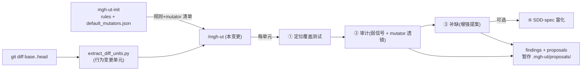

## Context

`/mgh-ut` 是 mgh-族**第二纵向(测试质量)**的第二条命令,定位为 **openspec apply 之后、archive 之前的
测试质量门**(也适用于其它 SDD 工具同等流程 + 无 SDD 的普通 diff)。消费 `mgh-ut-init` 产出的测试约定
rules + pitest 派生默认 mutator 清单;`extract-ut-shared-helpers`(上一变更)抽出的 `runconfig_core`/
`resume_core` 为其提供 run-config/resume 基座。

对 **当前分支 vs 基线 diff 中新增/改方法行为**的单元,**无条件**(不管有无未归档 SDD spec、不管是否已有
存量测试)做:① 审计既有测试质量 + ② 补缺/增强 + ③ 变异硬化。核心原则(决策 A/Q1/Q3):**变异硬化 =
生成时把 mutator 清单喂 LLM 写「足以杀死变异」的测试,不实跑 pitest**;SDD spec 只是**可选富化输入**、
非模式开关;测试增强是 **LLM 候选、需人评**,故补缺产出**暂存 `.mgh-ut/proposals/`** 供人/apply 评审,
**不直写 `src/test`**。

利益相关方:① 维护者(要质量门、复用共享基座、不破坏既有命令);② 既有命令使用者(零感知,新第 6
hook 域只增不改);③ openspec apply 之后的实现者(要一个「归档前」的质量门);④ `mgh-ut-init` 产物的
消费方。

## Goals / Non-Goals

**Goals:**
- `/mgh-ut`(claude + opencode 双壳)交付「diff → 行为变更单元 → 逐单元审计 + 补缺 + 变异硬化」流水线。
- **无条件审计 + 补缺**:不管有无未归档 SDD spec、不管变更方法是否已有存量测试;SDD spec 只是可选富化
  输入(openspec 优先),非模式开关。
- **补缺产出暂存 `.mgh-ut/proposals/`**,供人/apply 评审;`src/test` **不**被直写。
- **生成的测试 MUST 按发现的 mock 约定 mock 协作者**(DB / HTTP / 外部服务 / 静态依赖 / 时间等);存量
  「mock 不全 / 不做 mock」既是弱信号也是 gap-fill 必须修正项。
- mutator 透镜复用 pitest 分类法(生成目标 + 弱测试审计透镜一物两用);清单默认取 `default_mutators.json`,
  `--mutators` 覆盖。
- 第 6 个 hook 运行域,双端对等 + 测试覆盖。
- 无 ut-init rules 时优雅降级:从 diff 邻近测试惰性发现约定。
- 既有回归测全绿;新产物过三项检查(CLI 契约 / 分发纯净 / 零依赖);版本号 bump。

**Non-Goals:**
- **不**实跑 pitest 验证变异杀死(决策 A;实跑 = opt-in 路2,后续变更)。
- **不**支持 JVM 以外语言(本版 JVM-only,承决策 B)。
- **不**直写 `src/test`(补缺产物是 LLM 候选,须人评;`proposals/` 是暂存评审面)。
- **不**追求全仓测试完备(只处理 diff 中行为变更单元,耗时不依赖全仓大小)。
- **不**改 mgh-init/ut-init/sast/sra/srr 任何既有行为(hook 域表加行是新增)。
- **不**新增任何 pip 依赖。

## Decisions

### 决策 1 — 补缺产出暂存 `.mgh-ut/proposals/`,不直写 `src/test`(遗留点①)

- **选择**:每单元审计 + 补缺产出为**暂存提案**(`.mgh-ut/proposals/<unit>.proposal.json` + 人读
  `.md`),供人/`apply` 评审后决定是否合入 `src/test`;`/mgh-ut` **不**直写 `src/test`。
- **理由**:补缺测试是 **LLM 生成候选、非已确认正确**(与 `mgh-sast` findings / `mgh-init` rules 同哲学);
  直写 `src/test` 会未经人评污染测试家法。暂存面让「评审 → 合入」是人审流程。任务文档 §七 已倾向暂存。
- **备选(否决)**:直写 `src/test`——否决:LLM 候选未人评即进家法,与全族「需人评」纪律冲突。

### 决策 2 — mutator 清单优先级链(遗留点②)

- **选择**:`--mutators` 优先级 = **显式 `--mutators <file-or-list>` > 目标仓
  `default_mutators.json`(ut-init 派生,`source:"pitest-config"` 或 `"builtin-fallback"`) > 内置 pitest
  标准集**。`--mutators` 接受:内联逗号清单 **或** 配置文件路径(`<name>.json` 读 `mutators[]`;路径以
  `.json`/`.txt` 结尾判文件,否则判内联清单)。
- **理由**:ut-init 派生的默认清单是「项目真实 pitest 配置」的最优代理;显式覆盖给用户自由度;无任何
  清单时内置标准集兜底 + 披露。优先级链清晰、可测。
- **备选(否决)**:只认 `default_mutators.json`——否决:用户无法覆盖(如临时扩 mutator 集)。

### 决策 3 — diff 单元判定:确定性启发式(遗留点③)

- **选择**:`extract_diff_units.py` 经 `git diff --unified=3 <base>..<head> -- <src>`,**方法级优先**
  (codegraph 增强;缺席时降级到类/文件级);行为变更判定 = 方法体 diff 的非空白/非注释字符超阈值
  (默认 **>20 字符**)+ 排除纯 cosmetic(空白/注释/import 重排)。delete/move/rename 不触发。
- **理由**:决策 E 已定「只对新增/改方法行为做测试工作」;阈值化是确定性可测的启发式(超阈值即行为
  变更,触发审计 + 补缺)。
- **备选(否决)**:全量逐方法比较——否决:耗时不依赖全仓大小是硬约束(百万行仓也要快),只处理 diff
  触及的方法。
- **实现时 pin**:确切阈值(默认 >20 非空白非注释字符)、rename/move 检测(相似度阈值)、codegraph 缺席
  降级路径。

### 决策 4 — SDD-spec 富化:openspec 优先,MVP 只 openspec(遗留点④)

- **选择**:富化输入从**未归档 openspec change**(`openspec/changes/` 最新未归档的 `proposal.md` +
  `design.md`)取需求意图;`--change <name>` 显式指定;无 openspec(或指定名称不存在)→ 跳过富化、按
  无 spec 路径审计补缺。**MVP 只接 openspec**(适配器边界即 openspec 目录扫描);后续可插拔其它 SDD 工具。
- **理由**:任务 §七 倾向「MVP 是否只 openspec」→ 是。串行交接:apply 已结束、`/mgh-ut` 只读未归档
  change,无「两 agent 抢写」竞争(决策 Q3)。
- **备选(否决)**:MVP 即支持多 SDD 工具——否决:无消费方验证、过度设计;openspec 是首个适配器。

### 决策 5 — 变异硬化 = 生成时提要求,不实跑 pitest(决策 A 承接;路2 不进本版)

- **选择**:mutator 清单**喂 LLM 写「足以杀死变异」的测试**(生成时硬化);**不实跑 pitest**。是否真杀死
  变异不可知,如实跑验证 = opt-in 路2,**本版不做**(后续独立变更)。
- **理由**:决策 A(承 `task.260805.md`):R2 合规(不引依赖)+ 快 + 贴「LLM 候选需人评」哲学;实跑
  pitest 经 Bash 驱动目标项目工具链合规,但属增强非 MVP。
- **备选(否决)**:本版实跑 pitest——否决:引目标仓工具链依赖 + 慢 + 超 MVP 范围。

### 决策 6 — 逐单元流水线:subagent 三角色 + 确定性编排

- **选择**:每行为变更单元跑 `ut-audit`(定位覆盖测试 + 弱信号 + mutator 透镜 → findings)→ `ut-generate`
  (据 findings + rules + mutator 清单生成增强提案,暂存 `proposals/`)→ 一致性 `ut-consistency`(可选 pass)。
  编排器 = 宿主 agent,确定性脚本经 Bash(照 orchestration-discipline fragment)。
- **理由**:决策 C3-lite(新命令 + 共享基座);三角色职责单一、上下文隔离、可分别演进;与 ut-init 的
  stage-subagent 体例一致。
- **备选(否决)**:单 subagent 全程——否决:审计与生成上下文混、无职责边界,一致性难保证。

## Risks / Trade-offs

- **[LLM 生成的测试可能不完全 kill 变异]** → 决策 A 已声明「设计上抗变异、非已验证杀死」;诚实边界 +
  opt-in 路2 后续。
- **[行为变更启发式误判(漏判 refactor / 误判 cosmetic)]** → 诚实边界声明;codegraph 增强方法级定位;
  误判成本 = 多审计一个单元或漏一个,不破坏产物。
- **[无 ut-init rules 时约定发现降级]** → 从 diff 邻近测试惰性发现(读邻近 `*Test.java` 提取 mock/断言
  惯例);rules 缺失不阻断流水线,诚实边界披露。
- **[hook 第 6 域加行影响既有 5 域]** → 域表加行是**新增**(不改既有域 env/run-root/受信树);parity 测 +
  `test_block_adhoc_scripts.py` 扩第 6 域;既有域回归由既有测试兜底。
- **[proposals 暂存面被绕过直写 src/test]** → 壳 `NEVER` 硬边界声明 + 受信子树守卫(proposals 落在
  `.mgh-ut/**` 受信树内;`src/test` 在树外 → 越树写 fail-loud)。
- **[变异透镜作为弱测试审计指标漏判语义类弱测试]** → 透镜只作**一个**信号(mutator 一物两用),其余
  弱信号(零断言/mock 不足/仅 happy-path)在审计 prompt 的可证伪 checklist 覆盖;诚实边界:信号是启发式。

## Migration Plan

1. 新确定性脚本:`core/scripts/extract_diff_units.py`(git diff → 行为变更单元,`--repo`/`--base`/`--head`/
   `--out`/`--check`;method-level + codegraph 增强;阈值 pin)。
2. mgh-ut run-config/resume:挂 `runconfig_core`/`resume_core`(`--run-root .mgh-ut`),`resume_ut_state.py`
   步骤图 = extract→audit→generate→consistency→done。
3. 新壳(claude + opencode):薄壳,`REQUIRED SUB-SKILL` 引用 orchestrator-discipline;stage 流 + 确切脚本
   调用行 + `MGH_UT_ACTIVE`/哨兵 + 边界披露。
4. 新 subagent 提示词 + agent 定义:`ut-audit`/`ut-generate`/`ut-consistency`(claude `agents/` + opencode
   `agent/`)。
5. 契约:`core/contracts/ut/*.md`(diff-units / findings / proposals / mutators / resume-state)。
6. 第 6 hook 域:守卫域表 + run-root 表 + 受信子树(`.mgh-ut/**` + 哨兵 out_roots)加行;扩
   `test_block_adhoc_scripts.py` + `test_opencode_hook_parity.py`。
7. 工具 + 自检:`tools/check_contracts.py` 加 ut 断言;`install.sh` 自检清单加 ut 脚本族。
8. 测试:`test_extract_diff_units.py`、`test_ut_runtime.py`、`test_resume_ut_state.py`;扩分发纯净测。
9. bump 版本号;跑全套回归 + 三项检查;`install.sh` 自检 fail-soft。
10. **回滚**:纯新增文件 + 守卫域表一行 + 自检清单一行;git revert 单变更即可,无数据/产物 schema 变化
    (新命令新产物目录)。

## Open Questions

- **行为变更阈值 pin**:默认 >20 非空白非注释字符;rename/move 检测相似度阈值;codegraph 缺席降级
  (方法级 → 类级/文件级)——实现 `extract_diff_units.py` 时按真实 diff 形状校准。
- **proposals 文件格式**:JSON 主文件(`.proposal.json`) + 人读 `.md`(含 findings/proposed tests/mutators
  覆盖/mock 约定出处)——实现 step 1/2 pin。
- **`--change` 默认取最新未归档 openspec**:多个未归档 change 时取最新(按目录 mtime/名排序)——实现
  pin;显式 `--change <name>` 优先。
- **一致性 pass 是否默认开**:`ut-consistency` 与 ut-init 的 `--skip-consistency` 同形——实现时按价值
  裁默认。
- **是否保留「审计型 survey」整体步骤**:类比 ut-init 的可选 survey——倾向不保留(决策 6 已逐单元化),
  实现时按价值裁。
