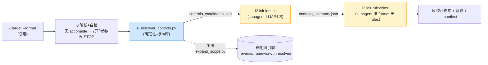
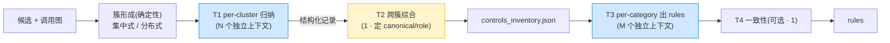
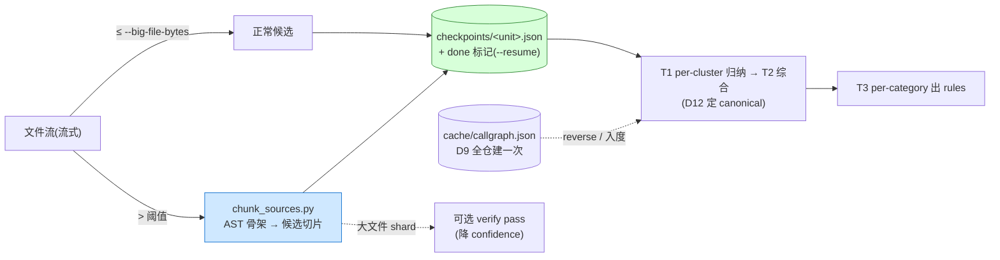

## Context

`/mgh-init` 是安全工作流链的起点(`init` → `sra` → `blst`)。它要回答的问题是
doc 09 §1 的 **Q1「从存量代码识别既有安全控制」**——这是 Glasswing/Anthropic 公开
材料**没有**覆盖、上游 vvaharness 仅**手工声明**(`design_controls.yaml`)、而
**mgh-sast 重写时整体未移植**的一块缺口。

现状约束:

- `releases/{claude-code/commands,opencode/command}/mgh-init.md` 仅为 TODO 骨架。
- mgh-sast 的 `core/scripts/expand_scope.py` 已有成熟的**文本/AST 调用图引擎**
  (`build_call_graph` / `bfs_expand` / `FRAMEWORK_RX` / `name_to_files` /
  `framework_files` / `unresolved`)——init「分析控制被谁调用 / 接入哪些入口」的需求
  与之同构,可直接复用。
- vvah `design_controls` 的 schema(`Control{name, kind∈{auth,sandbox,input-validation,
  aslr,cfi,other}, protects: fnmatch globs, notes}`)及其消费方式(s2 降 likelihood、
  s3 门控 specialist、s6 判 FP「须证明绕过」、s8 重排严重度 + `blocked_by_controls`)
  是 init 产物的**目标兼容形态**——`controls_inventory.json` 应能让未来 mgh-sast 控制
  入口、`mgh-sra`、`mgh-blst` 以同一语义消费。
- **R2 硬约束**:零运行时依赖。doc 09 §1.3 推荐的 Semgrep / CodeQL `barrierModel`
  均需外部工具/联网,**不引入**——采用与 `expand_scope.py` 相同的「文本规则 + AST +
  框架 allowlist」取舍,并显式披露。

利益相关方:产物消费方 = `/mgh-sra`(读 rules 引导 specs/tasks)、`/mgh-blst`(据
inventory 找「未走统一校验」的接口)、未来 mgh-sast 控制入口;rules 直接消费方 =
宿主 Claude Code / opencode agent。

## Goals / Non-Goals

**Goals:**
- 自动发现存量代码中的可复用安全控制(输入校验 / 脱敏 / 鉴权认证 / 鉴权 / 加密 /
  限流防重放 / CSRF / 审计),并关联其调用 wiring(谁调用、接入哪些入口)。
- 产出与 vvah `design_controls` **schema 兼容**的结构化 inventory,作为下游统一输入。
- 产出**目标 Agent 真正会加载**的 rules:Claude Code `.claude/rules/*.md`
  (path-scoped)或 opencode 根目录 `AGENTS.md`,`--format` 必选、结构严格不混用。
- 全程零运行时依赖(R2);产物带诚实边界披露。
- **适配超大/老旧不规范项目**:可 `--resume`(按工作单元 checkpoint)、可 `--scope`
  (path/package/file)局部分析并可 `--merge` 拼合全仓;**大文件分片**(AST 骨架 +
  候选切片 + 可选 verify pass)保 LLM 分析稳定准确;**多套竞争实现自动聚类**并定
  canonical(详见「Scale & Large-Repo Adaptation」)。

**Non-Goals:**
- **不**判定控制「**有效**」(只断言「**存在**」;CVE-2025-41248 类绕过留给未来
  mgh-sast s6 对抗验证)。
- **不**实现 `/mgh-sra`、`/mgh-blst`(独立变更,本变更仅产出它们消费的产物)。
- **不**反向把 controls 喂回 mgh-sast 流水线(本变更只产 inventory 文件;接入是未来事)。
- **不**支持 tree-sitter 调用链后端(与 mgh-sast 一致,规划中未接入)。
- **不**生成测试用例(那是 `/mgh-blst`)。

## Decisions

### D1 — 三层混合流水线(确定性 → 调用图 wiring → LLM 归纳)

`i0 解析参数/自检 → i1 确定性发现(`discover_controls.py`)→ i2 LLM 归纳
(`init-induct`)→ i3 LLM 出 rules(`init-rulewriter`)→ i4 校验+落盘+manifest`。

| 层 | 做什么 | 为什么这样(而非替代) |
|---|---|---|
| i1 确定性 | 文件名/扩展 + 内容模式/注解特征按 kind 扫候选 | 纯 LLM 会幻觉、漏结构化注解;纯规则又归纳不出「这是什么、怎么用」。doc 09 §1.4 明确推荐「确定性快扫 + LLM 语义补全」 |
| i1 调用图 | 复用 `expand_scope.py` 求 `reverse`(控制被谁调用)、`framework_files`、`unresolved` | 「控制接入哪些入口」是 init 与 sast 共有需求;复用同一引擎 = 单一调用图真相源 |
| i2 LLM 归纳 | **T1 每簇独立 subagent 扇出 → T2 跨簇综合**(D12) | 每个控制设计在**独立 LLM 上下文**归纳,准确率高于一个大上下文吞全部;canonical/竞争由 T2 综合(隔离单元看不到别簇) |
| i3 LLM 出 rules | **T3 每 category 独立 subagent 扇出 → T4 一致性**(D12) | 每 category 独立上下文出 rule;rules 结构强版本相关、必须按目标 Agent 实际格式 |

**替代方案(否决)**:① 纯 Semgrep/CodeQL——违反 R2。② 纯 LLM 全仓扫描——不可索引、
易幻觉、成本高。③ 完全照搬 vvah 手工 YAML——门槛高、易过期,正是要取代的。

### D2 — 复用 `expand_scope.py`,**导入而非改写**

`discover_controls.py` 与 `expand_scope.py` 同处 `core/scripts/`(安装后镜像到
`.claude/mgh-core/scripts/`)。`py` 运行脚本时会自动把脚本所在目录加入 `sys.path[0]`,
故 `discover_controls.py` 直接:

```python
from expand_scope import build_call_graph, walk_sources, FRAMEWORK_RX, SOURCE_EXT
```

复用 `build_call_graph` 的 `reverse`(控制文件的调用方集合)、`framework_files`
(Spring Security 配置等)、`name_to_files`(把注解/方法名解析到定义文件)。

**为何不改写 expand_scope(否决因子 `_callgraph.py` 共享模块)**:R1「非必要不改」+
避免触碰已在工作的 mgh-sast 脚本。导入复用 = 零改动 expand_scope、行为零回归
(现有 `tests/` 保护)。若日后第三处也需调用图,再抽 `_callgraph.py`(记入 Open Questions)。

> **注(init 侧参数,不改 expand_scope 默认行为)**:`walk_sources` 的 20000 静默上限
> 在 ≥1.5M 行的老仓会**静默截断**——init 必须关闭它,改用显式 `--max-files`(超限**告警
> 并继续**,绝不静默丢)。见 D11。

### D3 — `controls_inventory.json`:vvah `design_controls` schema 兼容 + 扩展

每条控制同时带两个分类字段,兼顾**下游兼容**与**人类/rules 可读**:

| 字段 | 取值 | 用途 |
|---|---|---|
| `kind` | vvah 6 枚举之一:`auth` / `sandbox` / `input-validation` / `aslr` / `cfi` / `other`(+ 别名归一,如 `authz`/`rbac`→`auth`、`waf`/`sanitization`→`input-validation`) | 未来 mgh-sast 控制入口直接消费(s2/s6/s8 语义不变) |
| `category` | 更细:`input-validation` / `data-masking` / `authentication` / `authorization` / `crypto` / `rate-limiting` / `csrf` / `audit-logging` | rules 分文件组织 + 人读 |

`category → kind` 归一映射写死在 `discover_controls.py`(确定性、可测)。其余扩展字段:
`name`(slug)、`description`、`usage`(该怎么调用)、`evidence`(`file:class:method`
锚点,可索引)、`entry_points`(经调用图关联到的入口)、`protects`(fnmatch globs,
vvah 兼容)、`gaps`(覆盖缺口/未解析项)、`confidence`。

**为何兼容 vvah schema**:用户明确要求「与 design_controls 做好功能引用/复用」;
doc 09 §1.2 指出 mgh-sast 未移植 design_controls——init 产出的 inventory 正好闭合
该缺口,使「自动发现」可平滑替换「手工 YAML」。

### D4 — Rules 格式分裂:Claude `.claude/rules/` vs opencode 根 `AGENTS.md`

实地核验(2026-06)结论写入 `rules-emission` spec:

| Agent | 机制 | path-scoping | dot-dir 支持 |
|---|---|---|---|
| Claude Code | `.claude/rules/**/*.md`,递归发现;YAML frontmatter `paths:` 做**路径作用域**自动加载 | ✅ | ✅(`.claude/`) |
| opencode | 项目根 `AGENTS.md`(向上遍历父目录) | ❌ | ❌(`.opencode/AGENTS.md` 不加载,issue #11454) |

- **claude**:每个 `category` 一个 `.claude/rules/security-<category>.md`,带 `paths:`
  frontmatter(按控制的 `protects` glob 生成),让 rule 仅在编辑相关路径时加载、省上下文。
- **opencode**:单文件根 `AGENTS.md`,内含按 category 分节的安全规则块(无 path-scoping)。
- 二者**严格不混用**;`--format` 必选;格式不符 Agent 不加载 = 功能失效(硬要求)。
- **非破坏性**:已有目标文件时,以**哨兵标记的受管块**追加/原地替换
  (`<!-- mgh-init:begin --> … <!-- mgh-init:end -->`),幂等可重跑,绝不覆盖用户手写内容。

### D5 — 零运行时依赖(不引入 Semgrep / CodeQL)

`discover_controls.py` 仅标准库(`argparse/ast/collections/json/pathlib/re/sys`)。
doc 09 §1.3 的 Semgrep 正面规则 / CodeQL `barrierModel` 思想**降级为内置文本/AST 模式**:
- 「缺防护即告警」(Semgrep `pattern-not-inside`)→ 由 i2 归纳阶段提示「指出未走统一
  控制的入口」(供 mgh-blst),不在 i1 强求。
- 「登记 sanitize/validate 为屏障」(CodeQL barrier)→ inventory 的 `evidence` + `kind`
  即等价的「屏障登记表」。

边界在 `report.md` / `init_manifest.json` 显式披露。

### D6 — 产物布局(per `<target>/.mgh-init/` + rules 落目标位)

```
<target>/.mgh-init/
├── controls_candidates.json   # i1 确定性原始命中 + 调用图 wiring(审计轨迹)
├── controls_inventory.json    # i2 归纳后结构化(下游统一输入,vvah 兼容)
├── init_manifest.json         # 版本/format/控制数/provenance/unresolved[]/边界声明
└── report.md                  # 人读摘要
# rules 落「Agent 真正会加载」的位置:
<target>/.claude/rules/security-*.md   # --format claude
<target>/AGENTS.md                      # --format opencode
```

## Pipeline



## Scale & Large-Repo Adaptation

> 前提:**不考虑扫描/分析成本**(可多遍、可加校验 pass)。优化目标四条——可恢复、
> 可局部并合并、大文件 LLM 分析稳定准确、多套竞争实现可识别。针对 ≥1.5M 行 / 多套
> 鉴权与脱敏并存 / 单文件 >200KB 的老旧不规范项目。

### D7 — 大文件分片:AST 骨架 + 候选切片(稳定性核心)

单文件 >`--big-file-bytes`(默认 200KB)整喂 LLM → 上下文挤占、lost-in-the-middle、
结果漂移。改为**确定性前置 + 切片喂模型**:

1. **AST 骨架**(零 LLM):`chunk_sources.py` 解析文件结构(imports / 顶层 class /
   method 签名 / 注解)→ 产出「目录」,并标出含控制候选的函数。
2. **候选切片**:只把「候选函数体 ± 上下文窗口」喂 induct,**不喂整文件**;非 AST 语言
   回退到「带重叠的行窗口」。
3. **可选 verify pass**(大文件专属):对大文件 shard 的归纳再跑一道 verify subagent
   对照切片交叉核验(对标 mgh-sast s6),不一致则降 `confidence`。

新增 `core/scripts/chunk_sources.py`(标准库 AST;复用 `expand_scope.DEF_CALL` 的语言
分派;未来 mgh-sast s3/s4 亦可复用)。**替代(否决)**:整文件塞 LLM(不稳定) /
固定行数硬切(切断函数语义)。

### D8 — 竞争实现聚类 + canonical 选定(多套鉴权/脱敏)

老旧项目常 2+ 套并存鉴权/脱敏。**T2 跨簇综合层**(D12;**非** T1 隔离单元——T1 只看本簇,
无法判全项目 canonical)SHALL 对同 `category` 候选聚类,按 **canonicality 加权**定主实现,
其余标竞争/重复/疑似废弃:

| canonicality 信号 | 权重方向 |
|---|---|
| 框架背书(Spring `SecurityConfig` 过滤器链 / `@EnableMethodSecurity`) | 高 |
| 调用图入度(被更多入口调用 = 更中心,复用 D2 `reverse`) | 高 |
| 位于 `security`/`common`/`config` 包 | 中 |
| 注解化 vs 散落 `if` 判断 | 注解化高 |

inventory 增字段:`cluster_id`、`role∈{canonical,competing,duplicate,possibly-dead}`。
report 增「竞争控制」专节——**直接喂 `/mgh-blst`**(找未走 canonical 的接口)。非
canonical **只标 role、不删**,保留全貌供人工裁决。

### D9 — 可恢复:按工作单元 checkpoint

工作单元粒度:`i1` 按**文件**(大文件按 shard)、`i2` 按**聚类**、`i3` 按 **category**。
每单元落 `<target>/.mgh-init/checkpoints/<unit>.json` + done 标记;`--resume` 跳过已完成、
合并 parts。调用图缓存到 `<target>/.mgh-init/cache/callgraph.json`(**全仓建一次**,
`--rebuild-cache` 或源文件 mtime 失效),避免 ≥1.5M 行的重复全图构建。

### D10 — 可局部:`--scope` + 局部产物可合并

`--scope path:<dir>|package:<pkg>|file:<glob>` 限定种子;`--scope-mode`:

- `defined`(默认):控制**定义点**在 scope 内;
- `applicable`:控制**调用方/入口**触及 scope(含跨模块、被 scope 内代码使用的控制)。

跨模块但定义点在 scope 外的控制 → `out_of_scope[]`(**披露,非丢弃**)。多次局部运行 →
`mgh-init --merge <partials-dir>`:按 `evidence`(`file:class:method`)去重合并、跨模块
重算 cluster role。服务「分模块渐进拼出全仓 inventory」。

### D11 — 确定性扫描流式 + 无静默截断

`discover_controls.py` 流式逐文件处理、增量写 candidates(内存有界)。**关闭**
`walk_sources` 的 20000 静默上限,改显式 `--max-files`(超限**告警并继续**)。全仓
≥1.5M 行时优先建议 `--scope` 分模块 + `--merge`(而非一次性全仓)。

### D12 — 隔离优先 fan-out:每个「控制设计」一个独立 LLM 上下文

> 评审点:init 一般每项目只跑一次,可不计成本 → 应**最大化任务隔离**:每个控制设计在
> **独立 LLM 上下文**归纳,远胜「一个大上下文吞全部候选」。原 D1/D8 未显式规定 i2/i3
> 的上下文边界,有「一个 subagent 读全仓候选」的退化风险;本决策显式化,并对标 mgh-sast
> 的 s3 分解 → s4 per-chunk 扇出 → s8 综合 拓扑。

**四层拓扑:**

| 层 | 上下文 | 输入 | 产出 | 隔离度 |
|---|---|---|---|---|
| **T1** per-cluster 归纳 | **每簇 1 个独立 subagent**(扇出 N) | 该簇文件集 + 候选元数据(大文件先 D7 切片) | 结构化控制记录(`name/category/kind/usage/evidence/entry_points/gaps/confidence`),**不做 canonical 判定** | 高·只读本簇 |
| **T2** 跨簇综合 | **1 subagent + 确定性** | 全部 T1 记录(小 JSON,**无原始码**) | 跨模块聚类、D8 canonical/role 选定、去重、命名归一 → 最终 inventory | 中·只读结构化 |
| **T3** per-category 出 rules | **每 category 1 个独立 subagent**(扇出 M) | 该 category 最终 inventory 条目 | 单条 rules 草稿(claude/opencode 格式) | 高·只读本类 |
| **T4** rules 一致性 | **1 subagent**(可选) | 全部 T3 草稿(小) | 跨类一致性、引用去重 | 中·只读草稿 |

**关键洞察 — 隔离带来协调问题:** T1 每个独立上下文**只看本簇**,无法判断「这在全项目是否
canonical」→ 故 **D8 的 canonical/competing 选定必须上移到 T2**(看全部结构化记录),不能
在 T1 做。这是「最大化隔离」的必然代价,用一层轻量综合兜底(输入是结构化 JSON,非原始码,
上下文极小)。

**簇的形成(确定性,决定 T1 的隔离单元):**

| 控制形态 | 簇 = | 喂 T1 的文件 |
|---|---|---|
| 集中式(util / filter / interceptor / config 类) | 定义点 + 调用图邻居(D2 `reverse`) | 定义文件 + 代表性调用方(抽样) |
| 分布式(注解 `@PreAuthorize`/`@Valid` 散落多文件) | 启用它的配置类(`SecurityConfig`)+ **抽样**使用点 | 配置类 + 抽样站点(非全量,防爆上下文) |

**为何如此(否决替代)**:① 一个 subagent 读全仓候选 → 上下文挤占、丢失中间、准确率下降
(正是评审反对的)。② 纯确定性无 LLM → 归纳不出语义。T1/T2 分离 =「深度局部归纳 + 全局
轻量综合」,与 mgh-sast s4(扇出)/s8(综合)同构。隔离单元 = D9 checkpoint 单元(同一边界
同时服务质量与可恢复)。



### 工作单元 / 数据流(大文件与可恢复)



## 输出语言(D13)

> 评审补充:工具面向人读的非代码内容优先用**简体中文**。

所有面向人读输出(rules 正文、T1/T2 的 `description`/`usage`/`gaps`、`report.md`、
`init_manifest.json` 的 `boundaries[]`/文案)用简体中文;**保持原样不译**的是:代码、文件路径、
`file:class:method` 锚点、标识符、`name`/枚举值、YAML `paths:` frontmatter。落地:5 个阶段
提示词(`init-survey/induct/synthesis/rulewriter/rules-consistency.md`)+ 2 个 format
fragment + 2 命令壳 + 2 contract(`inventory/manifest.md`)各加「输出语言」规则;详见
`specs/rules-emission` 对应 requirement。本规则不影响 schema 键名、枚举与确定性脚本输出。

## Risks / Trade-offs

| 风险 | 缓解 |
|---|---|
| 静态调用图漏 AOP / 反射 / DI / 框架路由(Spring `@*Mapping`/Feign/AOP advice) | 写进 `unresolved[]` + `report.md`;与 mgh-sast 同一盲点,诚实披露 |
| 「控制存在 ≠ 控制有效」(CVE-2025-41248:`@PreAuthorize` 在参数化类型上可绕过) | inventory 仅断言存在;`report.md`/manifest 显式声明;有效性判定留未来 mgh-sast s6 |
| LLM 归纳幻觉 / 错误归因控制 | 每条控制**必须**带 `file:class:method` 证据;低证据候选降 `confidence` 或丢弃;全产物带「需人工复核」声明 |
| Claude/opencode rules 格式随版本漂移 | 格式核验是 spec 化要求;manifest 记「核验于 2026-06 行为」;`--format` 必选前置校验 |
| 复用 expand_scope 的内部函数耦合 | 导入不改写;若其签名变更,`tests/test_init_discover.py` + `tests/test_deterministic.py` 双重保护 |
| 大仓吞吐/内存(≥1.5M 行) | 流式逐文件(D11);调用图缓存建一次(D9);优先 `--scope`+`--merge` 分模块;`--max-files` 显式告警**非静默截断** |
| 大文件 LLM 漂移(>200KB) | AST 骨架 + 候选切片 + 可选 verify pass(D7);shard 级 checkpoint |
| 竞争实现误判 canonical | canonicality 多信号加权(D8);非 canonical **只标 role 不删**;全产物带「需人工复核」 |

## Migration Plan

1. 按 tasks 落地脚本 / 提示词 / subagent / 契约 / 单测 / install.sh 清单。
2. `./install.sh --claude .` 与 `--opencode .` 验证 mgh-init 各资产就位。
3. 零依赖自检:`grep -rnE "import vvaharness|from vvaharness" --include=*.py .` 应空;
   `py tests/test_init_discover.py` + `tests/test_deterministic.py` 全绿。
4. 在一个样例 Spring 仓验证两种 `--format` 各产一份可加载 rules,人工抽查锚点准确性。
5. 回滚:纯新增 + 骨架替换;回滚 = 还原两个 `mgh-init.md` 骨架 + 删新增资产,无数据迁移。

## Open Questions

- **CLAUDE.md 是否同时写 `@import`?** 决策:默认只产 `.claude/rules/`(官方自动发现足够);
  可选 `--wire-claude-md` 在根 `CLAUDE.md` 追加受管 `@import` 块。待 tasks 阶段定默认值
  (倾向:默认关,避免动用户 CLAUDE.md)。
- **opencode 大 rules 单文件膨胀**:决策以受管块幂等追加/替换;是否拆 `AGENTS.md`
  `@` 引用子文件待实测(opencode 的 `@` import 支持度未在本变更核验)。
- **第三处复用调用图时**再抽 `core/scripts/_callgraph.py`(本变更先用 D2 导入复用)。
