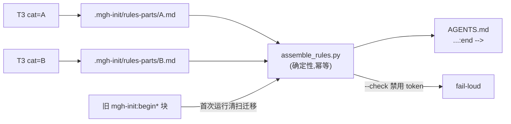

## Context

`/mgh-init` 的规则产物(opencode root `AGENTS.md` / claude `.claude/rules/security-*.md`)
当前会把**本工具内部信息**写进目标项目的根上下文:`mgh-init:` 品牌哨兵块、`discover_controls.py`
等脚本名、「T1/T2」流水线说明。opencode 只能用 root `AGENTS.md`(无 rules 目录、无 glob),
这些噪声直接削弱其唯一职责——引导安全编码 + 复用存量控制。

两个根因(详见 `proposal.md`):

1. **结构矛盾**:`rules-format-opencode.md` 约定**单块**,`init-rulewriter.md:33` 约定
   **per-category 块**,T3 又 per-category 并发 fan-out → 产出 N 个散落 `mgh-init:` 块。
2. **无纯净性护栏**:T1/scout/survey 提示词里的脚本名与层级身份,经 inventory 人读字段渗进
   T3 规则正文;全流水线无任何「输出不得含工具内部信息」的约束,也无确定性校验。

约束(承 AGENTS.md):R2 零运行时依赖;R5.2 编排器=宿主 agent、禁 `.py` 编排器但允许确定性
叶脚本(如 `merge_scout.py`);R5.3 确定性脚本稳定性契约;R5.7 能用确定性闭环不靠 agent 自觉;
R5.8 改动 bump 版本 + 回归测;R1 不碰溯源注释/上游锚点。

## Goals / Non-Goals

**Goals:**

- shipped rules(opencode + claude)**只含目标项目内容**:零工具名、零脚本名、零层级/路径泄漏。
- opencode 受管块收敛为**单个中性** `security-controls:` 块,去品牌、省 context、消竞态。
- 「纯净性」由**确定性 lint** 兜底(fail-loud),不依赖 agent 自觉。
- 解决 `rules-format-opencode.md` ↔ `init-rulewriter.md` 的结构矛盾。

**Non-Goals:**

- 不改 T1–T4 的隔离/聚类/role 选定逻辑(D8/D12 不变)。
- 不改 inventory 的结构字段(`name`/`kind`/`category`/`evidence`/`protects`/… 契约不变)。
- 不改 claude 的 per-file `security-<category>.md` + `paths:` frontmatter 结构(本就无标记问题)。
- 不评估控制「有效性」(CVE-2025-41248 边界不变)。
- 不引入 tree-sitter / 任何 pip 依赖。

## Decisions

### D1 — 防御纵深:inventory 字段 + 规则正文 双层纯净 + 确定性 lint

纯净性约束下放在三层 + 一道确定性闸:

| 层 | 位置 | 约束 |
|---|---|---|
| 源头 | T1 `init-induct` / S3 `init-scout` 产 record | `description`/`usage`/`gaps`/`notes` 只写目标项目内容 |
| 中游 | T2 `init-synthesis` | 综合时**剥离**记录里残留的工具内部引用 |
| 出口 | T3 `init-rulewriter` 规则正文 | 同上(recipe + `NEVER` 硬边界) |
| 兜底 | `assemble_rules.py --check` | 确定性扫描禁用 token,命中 fail-loud |

**为何不只防 T3**:LLM 非确定性,单点提示不够;且 inventory 一旦被污染,T3 忠实复刻即泄漏。
**为何还要 lint**:提示词是「软」约束,确定性闸给出可证伪闭环(承 R5.7)。

### D2 — opencode 单块 + T3 暂存 fragment + 确定性装配

opencode 受管块改为**单个** `<!-- security-controls:begin --> … <!-- security-controls:end -->`,
内含全部 category 小节。T3 每 category 产**暂存 fragment**
`<target>/.mgh-init/rules-parts/<category>.md`(中性、无外层哨兵),由确定性脚本
`assemble_rules.py` 合并进 `AGENTS.md` 的单受管块。

**为何单块**:root 上下文只多 2 行中性注释(替代 ~16 行品牌注释);符 fragment 原意。
**为何暂存 fragment + 脚本装配**:T3 per-category 并发,直接写同一 `AGENTS.md` 有竞态/交错;
暂存+确定性装配消除竞态,且装配+lint 可测。
**为何不交给 T4 装配**:T4 是 LLM(非确定),幂等替换脆弱;装配是机械活,归确定性脚本(单一职责)。
T4 仍做语义一致性(跨 category 命名/锚点),**不**做装配。

**否决方案**:(a) T4 LLM 装配——非确定、幂等脆弱;(b) 保留 per-category 仅去品牌——仍 ~16 行
根上下文注释噪声;(c) 彻底无标记按标题替换——用户改标题即脆(用户已选「单块+中性标记」)。

### D3 — 新增确定性叶脚本 `assemble_rules.py`(承 R5.2/R5.3)

性质同 `merge_scout.py`(**确定性叶脚本**,非编排器;R5.2 禁的是 `.py` 编排器,不禁叶脚本)。

- **CLI 契约**(`--help` 即契约面,承 R5.1):
  `--target <dir>` · `--format opencode|claude` · `--parts <dir>`(默认 `<target>/.mgh-init/rules-parts`)
  · `--out <path>`(opencode 默认 `<target>/AGENTS.md`)· `--check`(只 lint 不写)· `--dry-run`。
- **I/O 分流**:`stdout`=JSON 摘要(`{format, block, categories[], migrated_legacy_blocks, lint:{ok,violations[]}}`),
  `stderr`=进度,退出码 `0/1/2`。
- **幂等**:仅替换 `<!-- security-controls:begin --> … :end -->` 块;块不存在则追加;用户内容不动。
- **首次迁移**:扫到旧 `<!-- mgh-init:begin` 开头的块,先清出再写入新块(避免孤儿重复),记入
  `migrated_legacy_blocks`。
- **lint(`--check` 内置)**:对**受管块 + claude 规则文件**扫描禁用 token(见 D4)。
- **自包含**:`sys.path.insert(0, dir-of-__file__)`、`encoding="utf-8"`、任意 cwd 可 `py`、零依赖。

claude 格式**不需**装配脚本:每 category 独立文件,幂等=整文件覆写;但 lint 仍对
`.claude/rules/security-*.md` 跑(`--format claude --check`)。

### D4 — 禁用 token 集(lint,高精度优先)

lint 只匹配**高精度、近零误报**的工具内部 token:

| 类别 | token |
|---|---|
| 工具名 | `mgh-init`、`mgh_core`、`mgh-core`、`megahorn` |
| 脚本 basename | `discover_controls.py`、`chunk_sources.py`、`plan_scout.py`、`merge_scout.py`、`list_clusters.py`、`assemble_rules.py`、`emit_sarif.py`、`prefilter.py`、`expand_scope.py`、`dedup.py` |
| 内部路径 | `.mgh-init/`、`checkpoints/`、`rules-parts/` |

**不**把裸 `T1`/`T2`/`T3`/`scout` 纳入 lint(目标项目代码/类名极易误伤,如 `T1LineParser`)。
层级身份泄漏由 D1 的提示词护栏覆盖(低精度、不确定性可测)。**作用域**:仅扫 mgh-init 自身产物
(受管块 / `.claude/rules/security-*.md`),不扫目标项目任意源码 → 误报近零。

### D5 — claude 对等

claude 格式结构不变(per-file + `paths:`),仅:(1) 同享 D1 规则正文纯净护栏;(2) 同享 D4 lint
(`assemble_rules.py --format claude --check` 扫 `.claude/rules/security-*.md`)。无装配、无标记改动。

## Risks / Trade-offs

- **[LLM 仍泄漏]** → D4 确定性 lint fail-loud 兜底;提示词 + lint 双保险。
- **[lint 误伤目标代码]** → D4 高精度 token + 作用域仅限 mgh-init 产物;裸层级词不入 lint。
- **[BREAKING 旧块孤儿]** → `assemble_rules.py` 首次运行迁移清扫(记 `migrated_legacy_blocks`)。
- **[新脚本=新契约面(R5.1/R5.3)]** → `--help` 即契约;回归测(幂等/迁移/lint/零依赖 AST 扫描);
  bump 版本。
- **[T3 多一步写 fragment]** → 可接受:确定性装配廉价;换来单块目标 + 消竞态。
- **[纯层级词(T1/T2)非确定性可测]** → 明确降级为提示词护栏,文档披露此诚实边界(不谎称全确定性)。

## Migration Plan

1. 首次以新版重跑 `mgh-init --format opencode`:`assemble_rules.py` 清扫旧 `mgh-init:begin*` 块 →
   写入新 `security-controls:` 单块(用户内容不动)。
2. claude 用户:重跑后 `.claude/rules/security-*.md` 正文经 lint,泄漏被拦。
3. 回滚:还原提示词 + 删 `assemble_rules.py`;旧块可由旧版重跑重建(产物可重生,低风险)。
4. 版本 bump:命令壳 + 新脚本(承 R5.8);回归测覆盖 契约等价 / 幂等 / 迁移 / lint / 零依赖。

## Open Questions

- `assemble_rules.py` 是否承担跨 category 去重?→ **决定**:否。装配+lint 单一职责;跨 category
  语义去重归 T4。本变更不扩 T4 职责。
- lint 命中是 fail(退出 2)还是 warn?→ **决定**:fail-loud(退出 2,误用码)。禁用 token 近零误报,
  且泄漏工具内部违反核心契约,不应静默放行。
