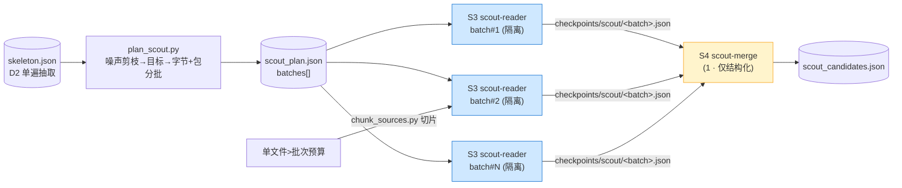

## Context

`/mgh-init` 现有发现层是**正则闸门**:`discover_controls.py` 单遍读每个文件,用
`_QUICK_RX`(`:118`,~120 个规范 token 的并集)做预过滤,不命中即 `continue`(`:296`),
该文件**永不进入任何 LLM**。`CATEGORY_PATTERNS`(`:67-110`)对自研控制覆盖极差——
authentication/authorization 几乎 100% Spring 类名,csrf 全 Spring,且大量模式是
`\bWord\w*`(规范词作前缀),自研**类名**(规范词在后)常被词边界挡掉。

后果:非 Spring / 自研封装安全组件的项目,i1 阶段结构性漏报;而 `init-survey`
提示词明令「NOT to re-scan from scratch」、其产出又「非 T1 输入」,LLM 理解力被
闸死在发现之外。这是 mgh-init 与 mgh-sast 的本质差异——mgh-sast 的 s4/s6 是 LLM
阶段、直接读代码、提示词要求「报告前查 upstream protection」;mgh-init 把发现
外包给了一道规则。

现状约束:

- `discover_controls.py` 已有**单遍 I/O**(FD3):walk 一次、read 一次、缓存文本,两遍
  调用图 + 候选扫描共用。还已算 `CLASS_RX`(`:133`,8 语言类名)、`JAVA_DEF`/`DEF_CALL`
  (方法签名)、reverse graph(`:273`,扇入)、`framework_files`(`:250`)。**骨架抽取
  所需原语几乎全部已存在**,只差一个 imports 正则。
- `chunk_sources.py` 已存在(D7 大文件切片),scout 的单超批文件直接复用。
- `list_clusters.py` 是「枚举 pending 工作单元供编排器 fan-out」的范本,scout 批次
  规划器照此模式。
- D12 隔离模式(T1 per-cluster 隔离 → T2 单点结构化综合)**是 scout fan-out 的同构
  蓝本**:scout-reader per-batch 隔离 → scout-merge 单点结构化综合。
- **R2 硬约束**:零运行时依赖。不引入 Semgrep/CodeQL/tree-sitter。
- **产品约束**:init 一次性任务,token 消费可接受 → 用 token 买「防漏」(自检采样),
  而非买「省」。

利益相关方:产物消费方不变(`mgh-sra`/`mgh-blst`/未来 mgh-sast 控制入口读
`controls_inventory.json`);scout 只往候选集加料,下游零感知。

## Goals / Non-Goals

**Goals:**

- **逃出规则闸门类别**:让 LLM 在发现阶段真正起作用——在读文件体之前,先在全仓
  **廉价元数据**(包/类名/签名/导入/扇入)上选「读谁」,而非让固定 token 表替它筛。
- **最大化「读了的文件数」且不爆 context**:并行 fan-out 多个隔离 subagent,每批字节
  有界、包内聚,既扩覆盖又避免长上下文导致的分析漂移。
- **可恢复、可局部**:scout 按 batch checkpoint,`--resume` 续跑;与既有 `--scope`/`--merge`
  兼容。
- **诚实覆盖披露**:不声称全仓覆盖,只声称「审视 X/Y 骨架、深读 Z、自检 K」+ 残留盲区。

**Non-Goals:**

- **不**改 `form_clusters`/T1/T2/T3/T4 的契约与隔离语义——scout 只产候选,merge 进
  既有候选集,簇的形成与下游归纳完全不变。
- **不**判定控制「有效」(仍只断言「存在」,承既有边界)。
- **不**消除不可约残留盲区(泛型包+泛型类名+泛型签名+无安全导入+低扇因的控制,
  规则与骨架都看不出)——只披露,不假装消除。
- **不**接入 tree-sitter 调用链后端(与 mgh-sast 一致,规划中)。
- **不**改 `controls_inventory.json` 对外 schema(只加候选级 `source`,inventory 不变)。

## Decisions

### D1 — regex 降级为 fast-path hint;发现改为双源并集

i1 正则仍运行,产出**高置信规范 token 命中**(Spring/JCA/通用英文词),作为:
(a) 稳定的 `file:class:method` 锚点供 T1 grounding;(b) scout 的「已知控制」提示
(避免 scout 重复报)。但它**不再是闸门**——`_QUICK_RX` 不命中的文件**仍进入
skeleton.json**,对 scout 可见。

候选集 = `regex_candidates ∪ scout_candidates`,每条带 `source`。`form_clusters`
对两源一视同仁(簇级 `source` 取多数,或同时含则 `source: regex+scout`)。

**替代(否决)**:① 删掉 regex 全交 LLM——丢失稳定锚点 + 高 token;② regex 仍当闸门
只让 scout enrich——等于没解(自研控制仍进不了候选域)。并集是唯一既保稳定锚点又
补自研覆盖的形态。

### D2 — 无损骨架抽取:搭 i1 单遍顺风车(非新遍历)

`discover_controls.py` 已单遍 read 每个文件并算 class/方法/reverse graph。**在同一次
遍历里**追加:每文件抽取 `imports[]`(新加一条 `import`/`#include`/`require`/`from…import`
正则,按 `lang` 分派),与已有的 `pkg`(从 rel path 推)、`classes`、`method_sigs`、
`fan_in`(reverse graph size)、`bytes` 一起,emit `skeleton.json`。

```
skeleton.json = [ {file, lang, pkg, classes[], imports[], method_sigs[], fan_in, bytes}, ... ]
```

**为何并入 discover 而非新脚本**:保 FD3「每文件至多读一次」的单遍契约(`:Bounded
single-pass scan performance` requirement);新增遍历会翻倍 I/O 并与既有性能边界冲突。
骨架是 regex 与 scout 共用的「全仓地图」,一次抽取双消费。

**替代(否决/备选)**:独立 `extract_skeleton.py`——解耦更干净,但要么重走一遍 I/O
(违 FD3),要么从 discover 内部 import 复用(等于还是耦合)。并入 discover 是性能
最优解;若 discover 体量过大难维护,**Open Question** 留抽 `_skeleton.py` 共享模块。

> **无损性是本设计的核心**:skeleton 抽取**只做机械提取,不做语义判断**。「这是不是
> 控制由谁说了算」从「规则」转交「LLM 在廉价元数据上判断」。这是与既有 regex 闸门
> 的质变——闸门是确定性地漏一整类;LLM 选择是可能在极端泛型代码上漏个别(见 D6 残留)。

### D3 — LLM scout 在廉价元数据上做语义选择(上游选择)

scout-reader subagent 拿到分给它的那批 skeleton 行 + repo root,**自适应地** Glob 包
结构 / Grep 它根据所见发明的词 / Read 可疑文件体,像 mgh-sast s1-survey 找 sink 那样
找 control。无固定词表——看到自研框架就发明新 grep。对「确实像个正则漏掉的安全控制」
的文件,按 Candidate schema 子集吐锚点:

```json
{"file","line","category","kind","anchor","shape","evidence_snippet","confidence","source":"scout"}
```

硬约束(承 R5.5):每条必须 ground 在真 Read 过的 `file:line`;允许「这批没控制」;
**精度优先于召回**(假阳浪费 T1 token)。`source:"scout"` 让 T2 canonicality 加权可
对 scout 来源适度降权或单列。

### D4 — Scout fan-out 策略:字节预算 + 包内聚 + 批数涌现(本变更核心)

> 评审输入:init 一次性、token 可接受;但 **context 窗口**是硬约束——多文件/大文件
> 不可能一个 subagent 读完,长上下文还会稀释注意力致分析漂移。故须并行 fan-out,
> 既扩「读了多少」又压「每上下文压力」。批数与每批大小由数据涌现,非拍脑袋。

**四阶段 mini-pipeline(复刻 T1→T2 隔离同构):**

| 阶段 | 执行 | 输入 | 产出 | 隔离度 |
|---|---|---|---|---|
| S1 抽取 | **脚本**(D2,并入 discover 单遍) | 全仓 | `skeleton.json` | — · 无损机械 |
| S2 规划 | **脚本** `plan_scout.py` | skeleton + 预算 | `scout_plan.json`(batches[]) | — · 确定性 |
| S3 深读 | **subagent per-batch 扇出** | 该批 skeleton 行 + repo root | `checkpoints/scout/<batch>.json`(候选锚点) | 高 · 只读本批 |
| S4 merge | **1 subagent** | 全部 S3 结构化记录(无原始码) | `scout_candidates.json`(去重/归一/定 provisional source) | 中 · 只读结构化 |

S3 是 context 压力所在,扇出策略全部围绕它:

**(a) 按「字节」分批,不按「文件数」。** 一批 = 累计 `bytes ≤ --scout-batch-bytes`
(默认 96KB)的目标文件。理由:文件大小分布长尾,按数分批会让一个 250KB 文件 + 39
个小文件挤爆一批;按字节分批**自适应**——小文件多打包、大文件少打包甚至独占一批。

**(b) 包内聚(package co-location)。** 分批前先按 `pkg`(目录)排序再按字节切块,
让**同包/同目录的相关文件落同一批**。理由:scout 看到一个 filter + 它的兄弟类 +
它的 config,归纳质量远高于把同包文件撒到不同 subagent。这是用「相关文件共享上下文」
换更高准确率,直接回应「分析结果缺漏错误」。

**(c) 每批文件数硬上限。** 即便未触字节预算,每批 ≤ `--scout-batch-cap`(默认 40),
防止 subagent 为赶进度对每文件草率(承 s4 的 coverage expectation 思路)。

**(d) 单个超批文件走切片。** 单文件 `bytes > --scout-batch-bytes` → 经既有
`chunk_sources.py`(D7)切成函数切片,切片入批;**绝不整文件塞 LLM**。

**(e) 批数涌现 + 并行波次。** `num_batches = ceil(Σtarget_bytes / batch_bytes)`;
编排器以 `max_concurrent`(默认 8,承 init.yaml `fanout.max_concurrent`)并行起
subagent,跑完一波起下一波,直到 `pending[]` 空(同 `list_clusters.py` 的 fan-out
范式)。**没有「固定 N 个 subagent」**——小仓 1–2 批即 1–2 个 subagent;大仓数百批
分波跑完。

**数值算例:** 800 个 scout 目标,均 12KB → Σ≈9.6MB → 96KB/批 ≈ **100 批** →
8 并行 → ~13 波。每 subagent 读 ~8 个相关文件(96KB ÷ 12KB),上下文从容、分析
扎实;100 批串行不可接受,并行 13 波可接受。

**(f) 谁是 scout 目标(S2 输入)?** skeleton 经**确定性噪声剪枝**(test/build/
generated/vendor,复用 `EXCLUDE_DIR`)+ 去掉 regex 已命中文件(它们已在候选里,
scout 不重复),余者为 scout 目标;再受 `--scout-budget`(默认全量,大仓可限)
封顶。目标过多时 S2 在 `scout_plan.json` 标 truncated 并建议 `--scope`+`--merge`
(R5.4 无静默)。



**为何如此(否决替代):**
- ① 一个 subagent 读全部目标 → 爆 context + lost-in-the-middle(评审明确反对)。
- ② 固定 N 个 subagent 均分 → 大小文件分布不均时有的批爆、有的批空;字节预算自适应
  才均衡。
- ③ 纯并行不 merge → 同一 filter 被相邻批各报一次、命名不一;S4 结构化 merge(对标 T2)
  消除重复 + 归一。

**隔离单元 = checkpoint 单元(D9 同构):** S3 每 batch 落
`checkpoints/scout/<batch_id>.json.done`;`--resume` 跳过已 done 批次。S1/S2 是脚本
(幂等,免 checkpoint);S4 整体一个 `.done`。

### D5 — 自检采样:false-negative hunt(拿 token 买防漏)

S3 完成后,**随机抽 `--scout-audit-pct`(默认 15%)个「scout 判定无控制」的目标**,
交 `init-scout-audit` subagent(怀疑论偏置,对标 s6「assume WRONG until confirmed」)
复核:是否真无控制?若审计发现漏报,回灌 S3 该目标的 batch 重跑(或直接补候选)。

理由:scout 的 soft gate 是「LLM 没觉得它像控制」——概率性漏。既然 token 可接受,
就拿预算去**质疑 scout 自己的拒绝决定**,把概率性漏的尾巴压低。审计抽样是确定性的
(脚本选样),故审计了哪些、发现几个漏,都进披露。

**替代(否决):** 100% 复核全部拒绝项——token 爆炸且边际收益陡降;15% 抽样 + 披露
是成本/收益拐点(参数可调)。

### D6 — source 溯源 + 覆盖披露(诚实边界)

- `Candidate`/`Cluster` 加可选 `source ∈ {regex, scout, regex+scout}`(additive)。
  T2 canonicality 加权时可参考(regex 来源 = 规范背书,略加权;scout 来源 = 语义推断,
  默认等权但 `confidence` 由 scout 自填)。
- `init_manifest.json` 增 `scout` 段:`{skeleton_total, scout_targets, batches,
  deep_read_files, audit_sampled, audit_found, truncated}`;`boundaries[]` 增一条:
  「LLM 审视了 X/Y 骨架、深度 Read Z 个、自检 K 个发现 J 个漏报;scout 非确定,
  簇数 run-to-run 可能变化;泛型包+泛型类名+低扇因控制仍可能漏。」
- **不声称全仓覆盖**(R5.4):只声称审视/深读/自检的真实数字。

### D7 — 与既有流水线的接缝(零下游改动)

scout 是 i1 与 T1 之间的**纯加法插入**:

```
i1 discover (+skeleton.json) → [NEW] S1-S4 scout → merge 候选(regex∪scout)
  → form_clusters(加 source)→ clusters.json → T1 → T2 → T3 → T4(全不变)
```

`list_clusters.py` 不改(它枚举 `clusters[]`,不管来源)。T1 提示词不改(它读本簇
evidence_files,候选来自 regex 还是 scout 对它透明)。T2 仅「可选参考 source 加权」
(提示词加一句,非契约变更)。

## Pipeline

```mermaid
flowchart LR
  T["--target --format"] --> I0["i0 解析+自检+大仓阈值建议"]
  I0 --> I1["i1 discover_controls.py<br/>(+skeleton.json · D2)"]
  I1 -->|controls_candidates.json<br/>+ skeleton.json| SC["scout 层(D4)"]
  SC -->|scout_candidates.json| MG["候选 merge<br/>(regex∪scout · D1)"]
  I1 -->|regex 命中| MG
  MG --> CF["form_clusters<br/>(+source)"]
  CF -->|clusters.json| T1["T1 per-cluster 归纳"]
  T1 --> T2["T2 综合"]
  T2 --> T3["T3 per-category 出 rules"]
  T3 --> T4["T4 一致性"]
  style SC fill:#cfe8ff,stroke:#1976d2
  style MG fill:#d7ffd9,stroke:#388e3c
```



## Risks / Trade-offs

| 风险 | 缓解 |
|---|---|
| scout 增加一次 LLM 层,token 上升 | init 一次性任务,用户已接受;`--no-scout` 完整保留旧行为;`--scout-budget`/`audit_pct` 可调 |
| scout 非确定 → 簇数 run-to-run 变化,`total` 不再纯确定 | manifest 显式披露「scout 非确定」;regex 来源簇仍确定;`--no-scout` 给确定性路径 |
| scout 仍漏泛型控制(不可约残留) | D6 披露;调用链 fan_in + 自检采样(D5)压低尾巴;mgh-sast s6 是 opaque 控制的下游安全网 |
| 批次规划在大仓产出过多批 → fan-out 时间长 | 字节预算自适应批数;`max_concurrent` 并行波次;大仓建议 `--scope`+`--merge`(D4-f) |
| scout-reader 跨批重复报同一控制 / 命名不一 | S4 结构化 merge(对标 T2)去重 + 归一 |
| 骨架 imports 正则跨语言不准 | 按 `lang` 分派;非 AST 语言回退宽松匹配 + scout 深读兜底(骨架只供 triage,不供断言) |
| 并入 discover 使该脚本体量/职责膨胀 | Open Question 留抽 `_skeleton.py`;现有 `tests/test_init_*` + 新 `test_skeleton.py` 双保护 |
| scout 假阳浪费 T1 token | 精度优先于召回(D3 硬约束);S4 merge 降级低置信候选 |

## Migration Plan

1. 按 tasks 落地:`plan_scout.py` + discover 增 skeleton/`source` → scout 三提示词 +
   三 subagent(双 shell)→ 命令壳插 scout 段 + 参数 → `init.yaml` scout 块 → 契约 +
   单测 → install.sh 清单。
2. `./install.sh --claude .` 与 `--opencode .` 验证 scout 资产就位。
3. 零依赖自检 + `py tests/test_scout_plan.py` + `tests/test_skeleton.py` +
   既有 `tests/test_init_*.py` 全绿(回归)。
4. **对照验证**:构造一个含**自研鉴权 `PermGuard`(零规范 token)** 的样例仓——
   `--no-scout` 应**漏报**(回归旧行为),默认(开 scout)应**发现**它并标
   `source: scout`。
5. **fan-out 验证**:对 ~800 目标文件样例仓,确认 `scout_plan.json` 批数≈算例、
   每批字节≤预算且包内聚、`checkpoints/scout/<batch>.done` 可 `--resume`。
6. 回滚:纯加法 + 参数门控;`--no-scout` 即时回到旧行为,删 scout 资产无数据迁移。

## Open Questions

- **骨架抽取并入 discover vs 抽 `_skeleton.py` 共享模块**:倾向并入(保 FD3 单遍);
  若 review 认为职责膨胀,抽 `core/scripts/_skeleton.py` 由 discover 与未来
  `plan_scout.py` 共同 import(同 D2 的 expand_scope 复用模式)。tasks 阶段定。
- **scout 默认开还是关**:倾向**默认开**(本变更目的就是补自研覆盖);`--no-scout`
  留确定性逃生口。若担心首版稳定性,可先默认关、`--scout` opt-in,稳定后翻默认。
  tasks 阶段定。
- **`--scout-batch-bytes`/`--scout-batch-cap`/`--scout-audit-pct` 默认值**:96KB/40/15%
  是设计起点,需在真实仓实测调(承 R5.7 评估驱动:先 baseline 再 blind A/B)。
- **scout 是否也产 `unresolved[]`**:scout 发现的 DI/AOP-only 控制同样进 `unresolved[]`
  披露(与 regex 一致),还是单列 `scout_unresolved`?倾向并入既有 `unresolved[]` +
  `source` 标记。
