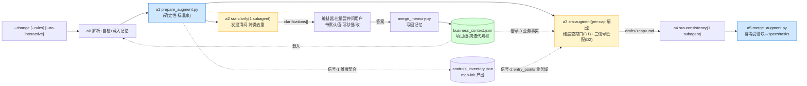

# Design — add-mgh-sra

> 承 `proposal.md`。给关键决策的**选择 / 理由 / 备选(否决)**,可证伪。R3 简练:不贴长代码,
> 用 `文件:行号` / 符号索引。面向人读非代码内容用简体中文。
>
> **本设计的重心是「分析脑子 + 交互记忆」,不是又一条流水线。** D1–D3 是分析脑子(查缺漏 +
> 三信号匹配),D4–D6 是交互记忆(澄清问答 + 跨迭代业务记忆),D7–D10 是工程纪律。

## Context

`/mgh-sra` 接在 openspec `propose` 之后、`apply` 之前。它要回答的真问题是:

> **这个变更的 specs/tasks 里,安全维度上漏了什么?每个漏缺该接哪个存量设计?**
> 而接存量设计的关键——「这个接口哪些角色用 / 以前类似接口怎么处理越权」——**已超出代码
> 控制层、进入业务理解**,且这部分知识常不在代码里(在 DB / 业务文档 / 人脑),工具运行期
> 拿不到。

现状约束:

- `releases/{claude-code/commands,opencode/command}/mgh-sra.md` 仅为 TODO 骨架。
- 上游产物已就位:`/mgh-init` 产 `controls_inventory.json`(`core/contracts/init/inventory.md`:
  `controls[]` 每条 `name/kind/category/description/usage/evidence[]/entry_points[]/protects[]/
  gaps[]/cluster_id/role/confidence` + 顶层 `repo/format`)。**`entry_points` + `protects` 是
  「该控制守护哪些接口」的语义来源——信号-2 业务域相似匹配就靠它**。
- 编排纪律范式已建立(R5.2/R5.3):编排器 = 宿主 agent,确定性叶脚本经 Bash,LLM 经 subagent
  扇出,扇出即脚本枚举(`list_*` 产 pending 清单 + 绝对输出路径),hook
  `releases/claude-code/hooks/block_adhoc_scripts.py:45-99` 治 #1 违例(微脚本内省 + 子树外写)。
- openspec 变更 specs delta:每 `specs/<cap>/spec.md` 用 `## ADDED|MODIFIED Requirements` 分节;
  archive 后 requirements 同步进 `openspec/specs/<cap>/spec.md` 成永久能力要求。

约束:R2(零依赖)、R3(简练)、R5.2–R5.10(编排纪律 / 确定性经脚本 / 扇出即枚举 + 绝对路径 /
边界 `--check` / 分发纯净性)。

利益相关方:产物消费方 = 该变更本身(specs/tasks 被增补)+ 业务记忆(跨迭代,未来 mgh-blst 消费);
输入方 = `/mgh-init`(可选 inventory)。

## Goals / Non-Goals

**Goals:**
- **维度驱动的缺口分析**:用安全维度目录系统化发现变更各 capability 的安全缺漏(敏感数据 /
  注入 / 横纵越权 等),产出**具体、可锚定**的缺口而非泛泛清单。
- **三信号语义匹配存量控制**:维度契合(确定性)+ 业务域相似(语义)+ 业务事实(记忆/问答)
  → 准确接「该用哪个既有设计」,含业务理解层。
- **交互式业务记忆**:判不出的业务事实经批量澄清问答沉淀为项目级、跨迭代累积的
  `business_context.json`,后续迭代复用。
- 全程零运行时依赖;非破坏性幂等合并;产物带诚实边界;双壳镜像;回归测 + CLI lint。

**Non-Goals:**
- **不**做完整威胁建模(STRIDE / 数据流图)——sra 是**设计阶段缺口快扫**,比 SAST 早、比
  全量威胁建模轻;聚焦「该声明而未声明的安全要求」。
- **不**验证控制「有效性」(存在≠有效,承 CVE-2025-41248;只引用锚点)。
- **不**改 mgh-init inventory schema / sast `load_controls.py`(消费侧独立,不反向依赖)。
- **不**做 `--resume`/sharding/scout/scope/merge(作用于单个小变更,体量小,见 D9)。
- **不**生成可执行测试案例(那是 `/mgh-blst`);sra 只产 specs/tasks 的安全维度 + 业务记忆。

## Decisions

### D1 — 分析脑子①:安全维度目录驱动的缺口发现

**选择**:新增 `core/prompts/fragments/security-dimensions.md`,9 维度 × (检查什么 + 典型缺口),
`sra-augment` 对每 capability 的 requirements **逐维度过一遍**,产出**具体缺口**(锚定到具体
requirement / 接口 / 字段)。维度(对齐用户举例 + 高价值维度,可扩):

| 维度        | 检查                                                                           | 典型缺口                        |
| --------- | ---------------------------------------------------------------------------- | --------------------------- |
| 敏感数据      | 触及 PII/凭据/金融(身份证/银行卡/手机/邮箱/密码/token)?at-rest·in-transit·log·response 是否声明屏蔽? | 返回体含银行卡号未脱敏                 |
| 注入        | 外部输入入口是否声明校验?SQLi/XSS/命令注入/路径穿越/SSRF/反序列化/XXE                                | 动态 `ORDER BY` 拼接            |
| 横向越权·IDOR | 按 id/key 访问的资源是否校验**归属/租户**?                                                 | `GET /order/{id}` 未校验 id 归属 |
| 纵向越权      | 是否暴露管理员级操作?角色校验?                                                             | 普通用户可调管理接口                  |
| 认证        | 新端点/资源是否在鉴权之后?session/token?                                                 | 新增公开端点暴露内部数据                |
| 完整性·关键操作  | 金融状态变更/状态机/幂等/防重放?                                                           | 退款无幂等键                      |
| 审计        | 安全相关操作是否记录(且不记敏感数据)?                                                         | 登录失败未审计                     |
| 限流·滥用     | 高价值端点(登录/OTP/支付)是否限流?                                                        | 短信验证码无频控                    |
| 密钥·配置     | 硬编码密钥/密钥轮换?                                                                  | 配置文件硬编码 API key             |

**理由**:无目录则 LLM 增补是「想起什么写什么」(漏维度、漂移);目录 = 系统化、可测、对齐
真实高频缺口(越权 / 敏感数据是用户点名的高价值项)。每条缺口强制锚定具体 requirement(否则
丢弃),杜绝泛泛 OWASP 清单。
**备选(否决)**:① 纯 LLM 自由发挥——漏维度、不可测。② 照搬完整威胁建模(STRIDE/DFD)——
设计阶段过重,与 sra「快扫」定位冲突。

### D2 — 分析脑子②:三信号语义匹配存量控制(非文件重叠)

**选择**:对每个缺口(如「`POST /refund` 无越权校验」),`sra-augment` 用**三个信号**找该用的
存量设计:

| 信号      | 性质          | 来源                                                                        | 作用                                         |
| ------- | ----------- | ------------------------------------------------------------------------- | ------------------------------------------ |
| ① 维度契合  | **确定性**     | inventory `category`(`authorization` 治越权)                                 | `prepare_augment` 预筛候选(cheap narrowing)    |
| ② 业务域相似 | **语义(LLM)** | inventory `entry_points`/`protects` + 记忆 `domains[]`                      | 「该控制守护的是不是**同业务域类似接口**」——直接答「以前类似接口怎么处理越权」 |
| ③ 业务事实  | **记忆 / 问答** | `business_context.json`(`roles[]`/`interface_authz[]`/`business_rules[]`) | 「这个接口**哪些角色用** / 资源归属模型」——常不在代码,需记忆或问用户    |

匹配产物 = 推荐控制(带 `evidence` 锚点 + 「复用勿重造」措辞)+ 若 ③ 缺失则触发澄清(D4)。

**理由**:用户核心诉求正是「匹配要进业务理解层」。文件重叠(我原稿误当成匹配)只是 ① 的弱
近似;真正的匹配是 ②(同域类似接口)+ ③(角色/归属)。① 确定性预筛把候选收窄,② ③ 语义
判定交给 LLM(读 `entry_points` + 记忆)。三信号分离 = 机械化预筛 + 语义匹配,可测可披露。
**备选(否决)**:① 只用文件重叠——漏掉同域不同文件的控制,匹配不准(原稿缺陷)。② 纯语义
无预筛——大 inventory 噪声大、成本高。

### D3 — 缺口→增补:锚定 requirement + 控制锚点,非破坏性落位

**选择**:每条增补(安全 requirement / task)MUST 锚定 (a) 一条**具体**变更 requirement / 接口 /
字段(它保护什么);若 `--rules` 提供控制,再锚定 (b) D2 匹配到的控制 `evidence`
(`file:class:method`)+ 派生规则文件路径(claude `.claude/rules/security-<cat>.md` / opencode
`AGENTS.md` 节)。落位:`merge_augment.py` 以受管块 `<!-- mgh-sra:begin --> … <!-- mgh-sra:end -->`
**幂等追加**进各 `specs/<cap>/spec.md`(在 `## ADDED Requirements` 下)+ `tasks.md`;无 capability
specs 时创建 `specs/security-augmentation/spec.md`。块外用户内容字节不变。
**理由**:task.260630.md 硬约束「增量、非破坏性、给具体路径锚点」。按 capability 落位让安全要求
与所保护能力同处,archive 后成该能力永久安全要求(语义正确)。
**备选(否决)**:① 单文件收全部——丢失同处关系、concern 混。② 无哨兵直接 Edit——破坏性、不可重跑。

### D4 — 交互记忆①:澄清问答(批量收集-暂停-一次问-续跑)

**选择**:新增 `sra-clarify` subagent(**单上下文扫全变更**,跨类去重),据维度目录找「分析必需
但代码/proposal/inventory/记忆都判不出」的业务事实,发结构化 `clarification`
(`{id, capability, dimension, question, why_it_matters, default_guess, fact_key}`)。编排器
**批量收集**全部 `clarifications[]` → **暂停、一次性**呈现给用户(每条带 `default_guess`,可
秒批 / 改 / `--no-interactive` 跳过用默认)→ 答案经 `merge_memory.py` 写回记忆 → 用增补记忆跑
augment。**记忆缺失或用户跳过时,以 `default_guess` 继续(advisory,不阻断)**。
**理由**:用户决策(批量暂停问)——少打断、可批量决策、带默认值不卡死。单上下文扫全变更做
clarify(而非 per-capacity)是因为角色/域类问题**跨类重复**(一份 roles 答案多个接口用),
单上下文天然去重。
**备选(否决)**:① 同步逐问——打断频繁。② per-capacity clarify——角色问题跨类重复问、噪声大。

### D5 — 交互记忆②:项目级 `business_context.json`,跨迭代累积

**选择**:新增项目级持久记忆 `<project>/.mgh-sra/business_context.json`(项目根 = 含 `openspec/`
的目录;**不在**任一变更内,跨变更存活),shape: `roles[]`(角色+能力边界)、`domains[]`
(业务域→代表接口,供 D2 信号-2 相似匹配)、`sensitive_fields[]`(业务定制必屏蔽字段)、
`interface_authz[]`(已知接口→越权处理范式,**直接答「以前类似接口怎么做」**)、
`business_rules[]`、`clarifications[]`(问答日志)。`merge_memory.py` 按 `fact_key` **幂等累积**
(已答事实不重复问)。sra 起步即载入;首轮记忆空→问得多,后续迭代累积→问得少、匹配准。
**理由**:用户建议——业务语义(角色/域/必屏蔽字段)常不在代码,需沉淀复用;与 mgh-init 把
代码控制沉淀成 inventory **同构**(一个记控制、一个记业务语义)。`interface_authz[]` 直接喂
D2 信号-2/3,且为未来 mgh-blst(越权测试)预留消费口。
**备选(否决)**:① 记忆进变更目录——变更 archive 后丢、无法跨迭代。② 不沉淀、每轮重问——
用户疲劳、复用为零。

### D6 — 记忆是用户断言,非代码真相(诚实边界)

**选择**:`business_context.json` 每条记忆标 `source: user-asserted`(人输入),sra 匹配时:
**显式代码/proposal 声明 > 用户记忆 > 默认猜测**(代码为准)。manifest 披露「记忆为用户断言、
非代码真相;推荐依赖已记业务事实 + 变更声明」。记忆不覆盖代码既有声明。
**理由**:记忆是问出来的、可能过期或错;若当成真相会**漏报**(误信过期角色边界)。
**备选(否决)**:记忆即真相——过期/错误记忆直接变漏报,违诚实边界。

### D7 — 两层 spine + clarify 前置(确定解析/合并 + LLM 隔离扇出)

`a0 解析+自检+载入记忆 → a1 prepare_augment(确定性:解析变更 + 信号-1 预筛 + 载记忆 + 枚举
draft 路径)→ a2 sra-clarify(1 subagent 全变更,发澄清问)→ [编排器批量暂停问 + 写记忆] →
a3 sra-augment(per-capacity 扇出:逐维度查缺口 + 三信号匹配)→ a4 sra-consistency(1 subagent
跨类去重)→ a5 merge_augment(确定性幂等合并)`。a2→a3 之间记忆已增补,augment 从始即 grounded
(无需 augment 重跑)。

| 层 | 做什么 | 为什么 |
|---|---|---|
| a1 确定性 | 解析变更 + 信号-1 预筛 + 载记忆 + 枚举 draft | 纯 LLM 漏结构化锚点;与 mgh-init D1 同构 |
| a2 clarify(单上下文) | 找缺失业务事实、跨类去重发问 | 隔离 augment 于「已知事实」之外;角色问题跨类,单上下文去重 |
| a3 augment(per-cap 扇出) | 维度查缺口 + 三信号匹配 | 每 capability 独立上下文做语义分析(mgh-init D12 隔离优先) |
| a4 consistency | 跨类去重、消冲突 | 隔离单元看不到别类 |
| a5 合并(确定性) | 幂等受管块 | 非破坏性是硬要求,须确定性保证 |

**备选(否决)**:① augment 内嵌澄清(augment 跑两遍)——成本翻倍、流程糊。② 单上下文吞全部
capability——隔离不足、准确率低。

### D8 — 扇出即脚本枚举 + 绝对路径;扩 hook 到 sra 域(`MGH_TARGET`=项目根)

**选择**:`prepare_augment.py` 输出 `pending[]`(每 capability 一项,`draft_path` 绝对 +
`done_marker`),编排器逐字透传(承 mgh-init fanout 路径纪律 R5.3b)。`MGH_TARGET` = **项目根**
(含 `openspec/` 的目录)——覆盖变更子树(`<project>/openspec/changes/<change>/`)**与**项目记忆
(`<project>/.mgh-sra/`)两类写入。扩 `block_adhoc_scripts.py`:加运行域 `MGH_SRA_ACTIVE` +
`_is_out_of_tree` 子树守卫对 sra 域生效(防 draft/记忆/合并路径漂到非项目目录)。
**理由**:mgh-init 真机失败形状之一是「输出路径漂到盘符根」(承 `harden-mgh-init-fanout-output-paths`);
sra 写两类路径(draft + 记忆),须以项目根为树覆盖全部。运行域 env 与 init/sast 同机制。
**备选(否决)**:① `MGH_TARGET`=变更根——写项目记忆时被判子树外误拦。② subagent 自拼路径——
命中真实失败(占位符/相对漂移)。

### D9 — `--rules` 消费结构化 inventory;刻意收窄(sra 无 resume/sharding/scout)

**选择**:`--rules <path>` 接受 `controls_inventory.json` 文件**或** `.mgh-init/` 目录(自动发现);
sra 读其 `controls[]` 的 `category`(信号-1)/`entry_points`+`protects`(信号-2)/`evidence`(锚点),
**不 import** `load_controls`/`validate_inventory`(自持轻量读)。sra 作用于单个小变更,**不**实现
mgh-init 的 `--resume`/`chunk_sources`/scout/`--scope`/`--merge`(无超大仓适配需求)。
**理由**:inventory 锚点机器可读、可索引;渲染 rules 是 format 特定散文难解析。sra 体量小,超大仓
适配是 mgh-init 的事,加它们违 R5.6(壳 ≤500 行)且无收益。
**备选(否决)**:① 解析渲染 rules prose——format 分裂、锚点不稳。② 照搬 mgh-init 全套 checkpoint/
sharding——过度工程、壳膨胀。

### D10 — 诚实边界 + `--check` 边界校验

**选择**:`sra_manifest.json` 记 `boundaries[]`:① 增补为 **LLM 候选,需人工复核**;② 覆盖**取决于
变更声明 + 已记业务事实**(未声明 / 未记的看不到);③ 引用控制**断言存在不断言有效**(CVE-2025-41248);
④ 记忆为**用户断言非代码真相**(D6)。`prepare_augment`/`merge_augment`/`merge_memory` 各暴露
`--check`(R5.9),编排器每步后跑、失败退出码 2 回退。
**理由**:增补进用户变更 specs/tasks(影响 apply)+ 记忆跨迭代复用,必须诚实标注来源与边界。
**备选(否决)**:静默增补 / 静默记忆——用户误当确定论要求或代码真相。

## Risks / Trade-offs

| 风险 | 缓解 |
|---|---|
| 维度目录漏某高价值维度(如新框架特有) | D1 目录可扩(独立 fragment);缺口的"维度外"项由 augment 标 `dimension: other` 保留、不丢 |
| 三信号匹配误接控制(把不相关控制当该复用) | D2:三信号都要命中(维度契合是必要条件);推荐带 `evidence` + 业务域相似理由,供人工复核;D6 记忆不覆盖代码声明 |
| 澄清问答疲劳(问太多) | D4:批量一次问 + 默认值可秒批 + `--no-interactive` 跳过;D5 记忆 `fact_key` 幂等,已答不重问(后续迭代递减) |
| 记忆过期(角色边界变了) | D6:`source: user-asserted` 标注 + 代码声明优先;manifest 披露;`merge_memory --check` 校验 shape |
| 非破坏性被破坏(重写用户 specs) | D3:确定性受管块幂等合并,哨兵隔离;`merge_augment --check` 校验仅动受管块 |
| draft/记忆路径漂到非项目目录 | D8:`MGH_TARGET`=项目根 + hook 子树守卫扩到 sra 域,漂移 fail-loud |
| 分发纯净性(R5.10) | 命令壳/提示词/契约操作性内容,不含研发铁律编号/失败 ID;install 前经 `check_distributed_purity.py` |
| 壳超 token 预算(R5.6) | D9 收窄;sra 壳 ≤500 行;详情移 `core/prompts/` 只深一级 |

## Migration Plan

- **无 schema/数据迁移**:全新命令 + 全新能力;不传 `--rules` / 无记忆时 sra 仍跑(通用增补)。
- **版本号**:任一 `.md`/脚本改动 bump(承 R5.8)。
- **回滚**:还原两份 `mgh-sra.md` 骨架 + 删 sra 资产 + 从 `block_adhoc_scripts.py`/`install.sh`
  移除 sra 域;`business_context.json` 是用户数据,回滚不删(用户保留)。

## Open Questions

- 澄清问答用宿主 agent 原生交互(Claude Code `AskUserQuestion` / opencode 等价)还是产
  `clarifications.md` 等用户回填?倾向**原生交互优先**(claude),opencode 回退产文件(`--no-interactive`
  恒真)。tasks 阶段定。
- 记忆 schema 是否需 `version` 字段做向前兼容?倾向**加**(`merge_memory --check` 按版本校验)。
- `interface_authz[]` 的「以前类似接口怎么做」是手填还是从历史 sra 增补自动回灌?倾向**自动回灌**
  (a4/a5 把已确认的越权 task 摘要回写记忆,下轮相似接口直接复用)。
