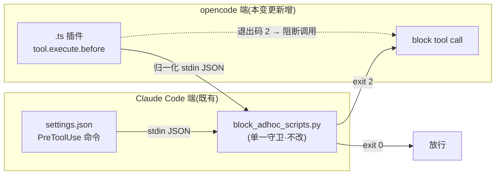

## Context

`add-mgh-telemetry-seam` 的调研核实(2026-07,opencode 官方 plugins/tools 文档):**opencode 有 hook**——
形态为 JS/TS 插件(`.opencode/plugins/*.ts`),事件含 `tool.execute.before`(pre-tool,可阻断,等价
Claude Code `PreToolUse`)/ `tool.execute.after`(post-tool,等价 `PostToolUse`)。本仓此前误判 opencode
「无 hook 能力」,故运行时纪律守卫 `block_adhoc_scripts.py` 只在 Claude Code 端注入:

- **守卫现状**(单一来源、零漂移):`releases/claude-code/hooks/block_adhoc_scripts.py` 是无状态 Python
  标准库脚本,环境门控(`MGH_{INIT,SAST,SRA}_ACTIVE`),读 Claude PreToolUse stdin
  `{tool_name, tool_input::{command|file_path}}`,命中 → 退出码 2(stderr recipe)、否则 0。
- **注入现状**:`tools/install_hook.py` 幂等把 PreToolUse 命令 hook 合并进 `.claude/settings.json`;
  `install.sh` 的 opencode 分支仅 `warn+跳过`,纪律降级为「命令壳明线 + `--check`」(R5.9)。
- **误判足迹(待改)**:install.sh 注释/消息、`control-discovery` spec(requirement+scenario)、
  3 份 opencode 命令壳,均含「opencode 无 PreToolUse 能力 / capability unsupported」错误前提。

约束:R2(零运行时依赖)· R5.7(hook 交付物)· R5.10(分发纯净性)· fail-soft 哲学(R5.8)。利益相关方:
opencode 用户(当前缺运行时强制)· 维护者(不得破 R2/R5)· sast-orchestration-discipline(复用同一 hook,
本变更覆盖其 opencode 端,无需单独 delta)。

## Goals / Non-Goals

**Goals:**
- opencode 获得与 claude 对等的运行时纪律 hook(`tool.execute.before` `.ts` 插件 → **同一** Python 守卫)。
- 守卫逻辑**单一来源**:Python `block_adhoc_scripts.py` 不改;`.ts` 仅做事件归一化 + 管道 + 据退出码阻断。
- 全仓删除「opencode 无 hook 能力」错误前提,改为准确表述(移植缺口,本变更即补)。
- README + AGENTS.md 收口(R5.7 补 opencode 插件形态 + `.ts` 的 R2 定性;README 目录/安装双端对等)。

**Non-Goals:**
- 不用 TS 重写守卫逻辑(避免漂移、丢既有测试覆盖)。
- 不做采集/上传/埋点(那是 `add-mgh-telemetry-seam` 的范围;本变更只复用其「opencode 有 hook」结论)。
- 不移除命令壳明线 / `--check`(移植后仍作为 defense-in-depth 保留,承 R5.9)。
- 不移植 `tool.execute.after`/PostToolUse(本变更只管 pre-tool 阻断对等)。

## Decisions

| ID  | 决策                                                                                                                                                          | 理由(备选与为何不选)                                                                                                      |
| --- | ----------------------------------------------------------------------------------------------------------------------------------------------------------- | ---------------------------------------------------------------------------------------------------------------- |
| D1  | opencode hook = `tool.execute.before` `.ts` **薄 shim**;把 opencode 事件归一化为 Claude PreToolUse stdin 形态,管道喂给**不改**的 `block_adhoc_scripts.py`,据退出码 2 阻断          | 单一守卫逻辑、零漂移、复用既有单测。备选 A「TS 重写守卫」→ 双份逻辑易漂移、丢覆盖,否决。备选 B「仅改文档不移植」→ 用户已明确「不够」、且 opencode 仍无强制,否决                      |
| D2  | `.ts` 插件是 **opencode 原生胶水**,非 Python `pip` 依赖(Bun 由 opencode 自带);守卫逻辑仍在 Python 标准库脚本                                                                        | R2「零运行时依赖」字面不变;与 `add-mgh-telemetry-seam` 已立的「`.ts` shim 调 Python」模式一致。claude 的 `settings.json` hook 配置同理是宿主原生胶水 |
| D3  | 新增 `tools/install_opencode_plugin.py`(幂等落 `.ts` 进 `.opencode/plugins/`,合并不覆盖用户既有插件),镜像 `install_hook.py` 契约(`stdout`=JSON/`stderr`=诊断/退出码 0-1-2/`--remove`) | 与 claude 端注入对称、可单测;`install.sh` opencode 分支由 `warn+跳过` 改为调它                                                      |
| D4  | **fail-soft + defense-in-depth 不变**:移植后命令壳明线 + `--check` 仍保留                                                                                                | hook 可被 opt-out/核验失败;明线 + R5.9 才是真后盾。「能 hook 就别靠自觉」≠ hook 是唯一防线                                                  |
| D5  | 守卫 `block_adhoc_scripts.py` **不改**(shim 负责归一化到其既有 stdin 契约)                                                                                                 | 避免改动已测守卫;归一化层独立可测。若 opencode 输入字段差异大,归一化在 shim 内吸收,守卫契约不动                                                        |
| D6  | 纯净性/R2 自检**不受影响**:`.ts` 不在零依赖 AST 扫描集(只扫 `*.py`)、不在纯净性 lint 集(只扫既定 `*.md` 目录)                                                                               | 新增 `.ts` 与新路径 `releases/opencode/plugins/` 均不触发既有自检失败;CI 无需改扫描器                                                  |
| D7  | shim **仅处理 bash/write/edit 三类工具**(廉价 `input.tool` 判断,或 opencode 插件 tool-filter),镜像 Claude 的 `Bash\|Write\|Edit` matcher;非这三类直接放行、**不**管道守卫 | 维持双端**触发对等**:opencode `tool.execute.before` 默认对所有工具触发,不收窄会对每个 Read/Grep/Glob 多走一遍守卫、反而比 claude 多触发。仅收窄**工具范围**,判定策略仍单一来源在守卫(非 TS hardcode) |

## Risks / Trade-offs

- **[opencode `tool.execute.before` 阻断 API]** — **已源码核验**(`C:/DEV/opencode` v1.17.15):阻断 = hook 内
  `throw new Error(...)`。`plugin.trigger`(`packages/opencode/src/plugin/index.ts:280`)把每个 hook 包进
  `yield* Effect.promise(async () => fn(input, output))`;throw → effect 失败 → `yield*` 上抛 → `tools.ts:111`
  的 `item.execute` **被跳过** = 调用阻断,错误消息回灌。官方 `.env` 示例即 throw。**阻断可行 → 全量插件(非 best-effort)。**
- **[社区 issue #1706:`tool.execute.before` 某些版本不触发]** → 可靠版本下限:**已核验存在于 v1.17.15**;更早版本
  未覆盖,文档标注下限;插件加载失败时 fail-soft warn;defense-in-depth(明线 + `--check`)为真后盾。
- **[opencode 插件发现/注册机制]** — **已核验**(`packages/web/.../plugins.mdx`):`.opencode/plugins/*.{js,ts}`(项目级)
  与 `~/.config/opencode/plugins/`(全局)**启动时自动加载**,本地文件 **NEVER** 需 config 注册(仅 npm 插件需 config)。
  → `install_opencode_plugin.py` 只幂等落 `.ts`,无 config 写入。
- **[opencode 与 claude 输入形态差异]** — **已核验**:`tool.execute.before` 形态 = `input{tool,sessionID,callID}` /
  `output{args}`;工具 id 小写(`bash`/`write`/`edit`/`read`/`apply_patch`);args:`bash→command`、`write|edit→filePath`(camelCase)。
  归一化映射 → Claude `{tool_name,tool_input}`:`bash→{Bash,{command}}`、`write→{Write,{file_path:filePath}}`、
  `edit→{Edit,{file_path:filePath}}`(守卫读 `tool_input.command` / `tool_input.file_path`)。归一化层单测断言同 claude 端判定。
- **[关键新发现:opencode 插件进程不继承 bash 导出的环境变量]** → `shell.ts:416-426` 的 `shellEnv = {...process.env, ...extra.env}`;
  bash 调用是 `spawner.spawn`(`shell.ts:484`),其内 `export MGH_*_ACTIVE=1` **只影响该子进程,NEVER 回写** opencode 主进程
  `process.env`。故编排器 `bash: export MGH_INIT_ACTIVE=1` **不会** 到达插件进程 / shim 派生的 `py` 子进程 → 守卫的运行域
  env 门控可能不激活。**缓解**:① shim 继承 `process.env`(若 opencode 启动时即带该 env——如 `MGH_*_ACTIVE=1 opencode run`,
  或未来 opencode 版本回灌——则门控生效,阻断对等);② **明线 + `--check`(R5.9)仍是真后盾**(D4 既定);③ 本变更的**首要交付
  仍成立**:纠正「opencode 无 hook 能力」错误前提 + 落一个**机制正确**的 shim(激活时即阻断,经同一守卫)。本条写进「诚实边界」+ AGENTS/README。
- **[R2 观感:发行 `.ts` 文件]** → 文档明示 `.ts` = opencode 宿主胶水(类比 claude 的 `settings.json` hook 配置),
  阻断逻辑单一来源在 Python 标准库脚本;零依赖自检与 AST 扫描均只覆盖 Python,结论不变。

## Migration Plan

- **纯增量、无破坏**:新增 `.ts` 插件 + `install_opencode_plugin.py` + `install.sh` opencode 分支改注入 +
  全仓文档纠错 + 单测 + 版本 bump。无现有产物路径/I/O 契约变更;守卫 `.py` 不动。
- **回滚**:`install.sh --no-enforce-hook`(claude)/ 删 `.opencode/plugins/block_adhoc_scripts.ts`(opencode);
  守卫逻辑未改,移除干净。用户重跑 `install.sh --opencode` 即获插件。
- **核验关卡**:实施期在真实 opencode 上验证 `tool.execute.before` 阻断 + 触发可靠性,回灌到「诚实边界」与本设计风险项。

## Open Questions

- ~~opencode `tool.execute.before` 的**确切阻断 API**(throw / error 形态 / result 改写)~~ → **已核验**:
  `throw new Error(...)`(见 Risks)。
- ~~opencode 是否**自动发现** `.opencode/plugins/*.ts`,还是需 config 注册~~ → **已核验**:本地文件自动加载,无需 config。
- ~~可靠触发 `tool.execute.before` 的 **opencode 版本下限**(对齐 issue #1706)~~ → **已核验存在于 v1.17.15**;更早版本未覆盖,文档标下限。

## 实施期决策(实施时浮现,回灌本设计)

- **守卫 `.py` 的部署位置**:它是**平台中立**的 stdin-JSON 守卫,但其规范仓内位置是 `releases/claude-code/hooks/`
  (历史;`block_adhoc_scripts.py 不改` 锁定该位置 + 既有单测指向它)。opencode 侧需让 shim 能 `py` 到它。选 **自包含 + 字节级 parity 守卫**:
  新增 `releases/opencode/hooks/block_adhoc_scripts.py`(与 claude 端**字节相同**)+ `tests/test_opencode_hook_parity.py` 断言两份字节一致(CI 必 fail,R5.8)。
  理由〔每个 `releases/<platform>/` 自包含可独立部署 + 「单一逻辑」由 parity 测试机械化守卫(同仓内 contract/purity lint 风格)+ 不动既有守卫/单测/claude 安装路径〕优于「opencode 安装回读 claude-code 目录」(引入跨 release 耦合,install.sh 现无此模式)。
  shim 解析守卫路径用**插件自身位置相对**(`../hooks/block_adhoc_scripts.py`,经 `import.meta.url`),对任意 cwd 安全(承 R5.3「对 subagent 任意 cwd 安全」精神)。
- **shim 的运行域信号 = 继承 `process.env`**(见 Risks「关键新发现」):mid-session `bash export` 不达插件进程,故门控仅在
  env 于 opencode 启动时已就绪才激活;否则 shim 放行(fail-soft),明线 + `--check` 兜底。NEVER 在 shim 重写守卫判定逻辑。
