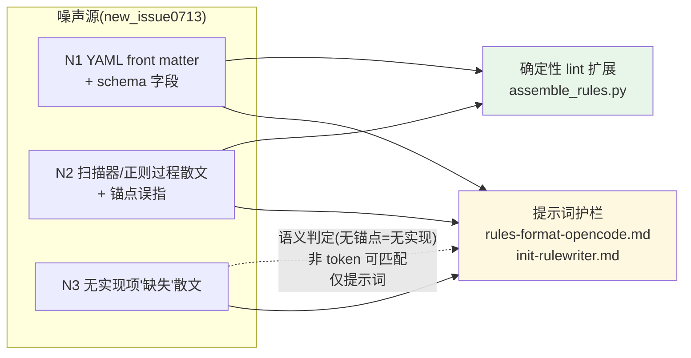

## Context

`/mgh-init --format opencode` 的唯一运行时输出是目标项目根 `AGENTS.md` 的单个中性受管块
(`<!-- security-controls:begin --> … :end -->`),由 T3 `init-rulewriter` 写暂存 fragment、
`assemble_rules.py` 装配。opencode 没有 rules 目录、没有 path glob —— 这块受管块就是它**全部**
的安全编码上下文。任何噪声都直接消耗目标项目 AI 编码任务的根上下文。

前序 `fix-mgh-init-rules-purity`(archive `2026-07-03`)收口了**工具内部标识符**泄漏(工具名 /
脚本 basename / 流水线层级 / 内部路径),建立了「提示词护栏 + 确定性 lint」双层防御与 D4 高精度
token 哲学(裸层级词不入 lint,误伤近零;诚实边界明示非确定性部分)。

但用户 `new_issue0713.txt` 实测暴露了**该层未覆盖的三类新噪声**,根因不同:

| # | 噪声形状 | 根因 | 现状 |
|---|---|---|---|
| N1 | YAML front matter `---\ncategory:\nfound_controls:\nevidence_count:\n---` | T3 把 `controls_inventory.json` 的**结构字段名**当 front matter 抄进 fragment;opencode 模板无 front matter,提示词从未显式禁止 → AI 填真空 | 提示词无禁令;lint token 集无 `found_controls`/`evidence_count`/围栏检测 |
| N2 | `C-*-001(扫描器模式定义)`、`锚点：扫描器内部正则定义`、`扫描器定义了@RateLimit*` | T3 把「扫描器/正则的定义」写进正文,`锚点:` 字段被误指向扫描器内部 | 现有 spec 已禁「过程描述」但提示词只举工具名/脚本名/层级词,**未点名此形状**;lint 无此短语 |
| N3 | `C-ABS-001（缺失）: 未发现……缺口：……` | 某 category 在目标项目**无具体实现**;spec 与提示词对「无实现项」**完全无指引**,T3 默认补「缺失」散文 | 提示词无「无实现则省略」规则;spec 无此要求 |

约束(承 AGENTS.md):R2 零运行时依赖;R5.5①②③(recipe + `NEVER` 硬边界 + RFC-2119,无豁免子句);
R5.7 能确定性闭环不靠 agent 自觉;R5.8 改动 bump 版本 + 回归测;R5.9 lint fail-loud 退出码 2 回退重跑;
R5.10 运行时产物纯净性(与 install 分发纯净性同精神);D4 高精度 lint 哲学(误伤近零,裸通用词不入集)。

## Goals / Non-Goals

**Goals:**
- opencode 受管块正文**零 YAML front matter、零 inventory schema 字段泄漏**(N1)。
- 规则正文**零「扫描器/正则定义」过程散文**,`锚点:` 字段**只**指向目标项目源码(N2)。
- **无具体源码实现**的控制**不出现在规则里**(N3);整 category 无实现 → 不产 fragment。
- N1/N2 的高精度形状由**确定性 lint** 兜底(fail-loud 退出码 2),不靠 agent 自觉(承 R5.7)。
- 保持 D4 高精度哲学:新增 token/检查**误伤近零**;claude 合法 `paths:` frontmatter 不误报。

**Non-Goals:**
- 不改 `controls_inventory.json` schema(无实现项的判定复用现有 `evidence`/`role`/锚点字段,不新增)。
- 不改 T1 `init-induct`/T2 `init-synthesis` 的归纳聚类逻辑(源头护栏已由前序变更建立,本变更收口出口)。
- 不改 claude 的 `paths:` frontmatter 结构(claude 合法用;仅同步「锚点=源码」「无实现则省略」护栏)。
- 不把裸 `category`/`缺失`/泛指 `锚点` 入 lint(误伤风险,违 D4);这些由提示词覆盖、非确定性可测。
- 不评估控制「有效性」(CVE-2025-41248 边界不变);「无实现」≠「无效」,本变更只管「不写无锚点规则」。
- 不新增 CLI flag、不新增脚本、不引入 pip 依赖。

## Decisions

### D1 — 三类噪声 × 两层防御的落点矩阵

每类噪声落到「提示词护栏(软、非确定性)」与「确定性 lint(硬、可证伪)」的合适层:

- **N1 全覆盖(提示词 + lint)**:front matter 是结构化、可 token 化的高精度形状(`found_controls`/
  `evidence_count` 是 mgh-init 自有 schema 字段名;`---` 围栏在 opencode 受管块内是特征结构)→ 双层。
- **N2 部分覆盖**:特征短语(`扫描器模式定义`/`扫描器内部正则`/`锚点:扫描器`)是高精度 token → lint;
  泛指过程散文(换种说法绕开短语)→ 仅提示词(诚实边界)。
- **N3 仅提示词**:「无实现」是**语义判定**(读 inventory 看有无源码锚点),不是 token 模式 → 无法
  确定性匹配而不误伤(合法规则也含「缺口」「未覆盖」等措辞)→ 仅提示词,lint 不碰。

**为何不全交提示词**:R5.7——能确定性闭环的不靠 agent 自觉;N1/N2 的高精度形状值得确定性闸。
**为何不全交 lint**:N3 的语义判定与泛指散文入 lint 必误伤(D4 哲学)。

### D2 — opencode fragment 显式禁 front matter(治 N1)

`rules-format-opencode.md` 加硬边界:fragment **SHALL** 以 `### <Category>` 起;**NEVER** 带 YAML
`---` 围栏;**NEVER** 出现 inventory schema 字段名(`found_controls`/`evidence_count`/`category:`/
`source:`/`evidence:` 作 front matter 键)。与 `rules-format-claude.md` 对齐声明:opencode 无
front matter,claude 仅 `paths:`。

**否决方案**:(a) 让 opencode 也用 `paths:` front matter —— opencode 不支持 path-scoping(前序
`fix-mgh-init-rules-purity` 已确认),front matter 对它无语义,纯耗上下文;(b) 允许 front matter 但
lint 剥离 —— 把语义判定塞进确定性脚本,脆弱且违「装配只做机械合并」单一职责。

### D3 — 「无实现则省略」+ 锚点=源码 + 以实现名起头(治 N2/N3,两格式共享)

`init-rulewriter.md`(两格式共享 core/,双端对等)加三条:

1. **无实现则省略**:一条规则 SHALL 对应 inventory 里**有具体源码锚点**(`file:class:method` /
   `file:line`)的存量可复用实现。某控制**无源码锚点**(扫描器/正则期望但源码无实现)→ **emit no rule**;
   整 category 全无实现 → **不产 fragment**(该 category 不进受管块,不留「缺失」散文)。
   - 判据复用现有字段:`evidence[]` 为空 / `role:"possibly-dead"` 且无锚点 / 仅有「期望未命中」notes。
2. **锚点=源码**:`锚点:`/Anchor SHALL 指向目标项目源码位置;**NEVER** 指向扫描器内部/正则定义/「如何发现」。
3. **以实现名起头**:规则以目标项目**实际使用的类/方法/配置名**起头(如 `AuthConfig` /
   `TokenAuthenticationService`);控制 ID(`C-*-001`)可选,带则**无** `(缺失)`/`(扫描器…)` 后缀。

**为何不改 inventory schema**:无实现项的信号已存在(`evidence`/`role`/锚点);T3 读之判定即可,
无需新增字段(承 Non-Goal)。
**为何「整 category 无实现则不产 fragment」而非「产空 fragment」**:空 fragment 经 `assemble_rules.py`
会产出空 `### <Category>` 标题,仍是噪声;不产 fragment 则该 category 干脆不进受管块(最干净)。
`list_rule_jobs.py` 仍按 inventory 的 category 枚举 T3 job;T3 产空 fragment 时由装配自然丢弃
(`_read_fragments` 读到空内容 fragment 仍会拼一个空标题——**需在 D5 约束:T3 宁可不写 fragment 文件
也不写空 fragment**,或装配跳过空 fragment。见 Open Questions)。

### D4 — lint 高精度扩展(承前序 D4 哲学)

`assemble_rules.py` 的 `FORBIDDEN_TOKENS` 与 lint 增量,**全部高精度、近零误伤**:

| 类别 | 新增 token / 检查 | 为何高精度(近零 FP) |
|---|---|---|
| schema 字段 | `found_controls`、`evidence_count` | mgh-init 自有 `controls_inventory.json` 派生字段名;目标项目规则正文几乎不可能出现 |
| 过程散文短语 | `扫描器模式定义`、`扫描器内部正则`、`扫描器定义`、`锚点:扫描器`、`锚点：扫描器` | mgh-init 发现方法的特征措辞;短语级(非裸词),目标项目罕见 |
| 结构(opencode) | 受管块内任意 `---` 围栏行 | opencode 模板无围栏;受管块内出现即 front matter 泄漏 |

**不**入 lint(误伤风险,违 D4):裸 `category`(目标项目常见词)、裸 `缺失`(中文常用词)、泛指
`锚点`(模板合法字段,指向源码时正确)、`source:`/`evidence:` 单独作键(误伤面大)—— 这些由提示词
护栏覆盖、非确定性可测(诚实边界下移)。

**claude 围栏豁免**:`---` 围栏结构检查**仅对 opencode 受管块**生效;claude `.claude/rules/security-*.md`
合法使用 `paths:` frontmatter,lint 对 claude 文件**不**跑围栏检查(只跑 token 检查)。

### D5 — T3 空 fragment 处理(承 D3)

`init-rulewriter.md` 指令:整 category 无实现 → T3 **不写 fragment 文件**(而非写空文件)+ 仍 touch
`done_marker`(宣告该 category 已处理,防 `--resume` 重跑)。`assemble_rules.py` 的 `_read_fragments`
天然跳过不存在的文件 → 该 category 不进受管块。无需改装配逻辑。

**否决方案**:T3 写空 fragment + 装配跳过空文件 —— 多一层「空文件」语义,且 `_compose_block` 目前
不跳过空文本 fragment(会拼空标题);改 T3 直接不写更简单、更符合「无实现=无输出」语义。

## Risks / Trade-offs

- **[LLM 绕过短语 lint(N2 泛指散文)]** → 换措辞绕过 `扫描器模式定义` 等短语 → lint 漏;**缓解**:提示词
  护栏以 recipe + `NEVER` 硬边界覆盖「过程描述」语义(不限具体短语);诚实边界明示此非确定性部分。
- **[lint 新 token 误伤目标项目]** → 目标项目代码/注释含 `found_controls`/`扫描器模式定义` → 误报;
  **缓解**:作用域仅限 mgh-init 自身产物(受管块正文 / `.claude/rules/security-*.md`),不扫目标源码;
  且这些是 mgh-init 特征字段/措辞,目标项目正文出现概率极低。
- **[`---` 围栏检查误伤 opencode 用户水平线]** → 用户在受管块内用 `---` 作水平线 → 误报;**缓解**:受管块
  是 mgh-init 拼装的 category 小节,结构固定(标题+列表),用户不应在其中插水平线;误伤面极小,可接受。
  (用户自由内容在受管块外,不受此检查影响。)
- **[「无实现则省略」漏判]** → T3 误把有锚点的控制当无实现而省略 → 丢规则;**缓解**:判据明确(有
  `file:class:method` 锚点即视为有实现);`report.md`/manifest 仍含完整 inventory(含无实现项),人不丢信息。
- **[整 category 无实现时受管块变小]** → 用户可能期望看到「全貌」;**缓解**:`report.md` 是面向人的全量
  报告(含缺失),`AGENTS.md` 受管块只承载**可执行复用指引**——职责分离,符合 mgh-init 定位。

## Migration Plan

1. 提示词 + lint 改完后,以新版重跑 `mgh-init --format opencode` on 样例仓:T3 不再产 front matter /
   过程散文 / 缺失散文;`assemble_rules.py --check` 对历史产物(若含旧噪声)会 fail-loud → 据诊断回 T3 修正。
2. claude 用户:重跑后 `.claude/rules/security-*.md` 经扩展 lint,新 token 泄漏被拦;`paths:` 不误报。
3. 回滚:还原提示词 + `assemble_rules.py` `FORBIDDEN_TOKENS`/围栏检查;产物可重生,低风险。
4. VERSION bump:两命令壳 + 受影响脚本(承 R5.8);回归测覆盖 新 token / 围栏 fail / claude `paths:` 不误报 / 幂等不退化。

## Open Questions

- **空 fragment:T3 不写文件 vs 写空文件?** → **决定(D5)**:T3 不写 fragment 文件 + 仍 touch `done_marker`。
  装配天然跳过;最简、最符合「无实现=无输出」。不改 `_compose_block`。
- **lint 命中新 token 是 fail(退出 2)还是 warn?** → **决定**:fail-loud(退出 2,误用码),与前序
  `fix-mgh-init-rules-purity` D4/Open Question 一致——禁用 token 近零误报,泄漏违核心契约,不静默放行。
- **`锚点:扫描器` 是否要同时覆盖全角/半角冒号 + 空格变体?** → **决定**:lint 同时列 `锚点:扫描器`(半角)
  与 `锚点：扫描器`(全角);带空格变体(`锚点: 扫描器`)由 `扫描器` 裸词不入集而漏,提示词护栏覆盖(诚实边界)。
