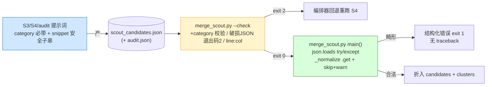

## Context

`/mgh-init` 的 scout→merge 折入由 `core/scripts/merge_scout.py` 承担:S3 `init-scout` per-batch 产
`checkpoints/scout/<batch_id>.json` → S4 `init-scout-merge` 产 `scout_candidates.json` →
`merge_scout.py --check` 边界校验 → `merge_scout.py main()` 折入 `controls_candidates.json` +
追加 scout 簇到 `clusters.json`(复用 `discover_controls.form_clusters`)。整条 scout 产物的
**生产者全是 LLM**(S3/S4/audit),消费侧是确定性 `merge_scout.py`。

两起真机崩溃(用户实跑命中,产 `scout_candidates_fixed.json` 手修绕过):

| 缺陷 | 生产侧形状 | `--check` | `main()` | 崩溃点 |
|---|---|---|---|---|
| 缺 `category` | S4 合并偶发丢弃 | 只校验 `source/file/line`,**漏 category** → 过闸 | `_normalize:35` `c["category"]` 直索引 | `KeyError` traceback |
| 非法 JSON | `evidence_snippet` 内嵌代码,引号/反斜杠转义错 | 捕获但**退出码 1**(非 2)→ 编排器不回退,放行 | `main():106` `json.loads` 无 try/except | `JSONDecodeError` traceback |

约束:`merge_scout.py` 是 R5.3 确定性稳定脚本(零依赖、stdout=JSON/stderr=诊断、退出码 0-1-2、
`--check` 即 R5.9 边界闸门);`form_clusters` 是 `discover_controls.py` 的共享逻辑(regex + scout
两源共用,改它 blast radius 扩到 discover 路径);提示词在 `core/prompts/stages/`,双 shell 共享 core/
一次改双端。编排器闸门语义:`mgh-init.md:89`「退出码 2 → 回退重跑」,**只认 2**。

## Goals / Non-Goals

**Goals:**
- `merge_scout.py` 在畸形 `scout_candidates.json`(缺 category / 非法 JSON)下**不崩 traceback**,
  出结构化错误 + 可操作诊断,退出码符合契约。
- `--check` 边界闸门**真正把住**两类畸形(退出码 2 → 编排器回退重跑 S4),补齐 category 校验 +
  退出码对齐 + line:col 诊断。
- 生产侧提示词**结构性消除**非法 JSON 脚枪(snippet 安全子串)+ 强制 category 必带。
- audit 路径(`audit_found[]`不经 `--check`)也有消费侧兜底。

**Non-Goals:**
- **不**加 JSON salvage/恢复解析器(从半畸形文件抢救合法 candidate)——违 R5.9「不带着破损产物继续」。
- **不**改 `scout_candidates.json`/`controls_candidates.json`/`clusters.json` schema。
- **不**改 `discover_controls.form_clusters` 或 T1–T4。
- **不**新增 CLI flag(`tools/check_contracts.py` 不变)。
- **不**保证 LLM 100% 不产畸形(非确定);目标是「崩溃→结构化错误 + 重跑/手修有据」。

## Decisions

### D1 — 三层收口,非单点

边界校验(`--check`)+ 消费防御(`main()`)+ 生产提示词(S3/S4/audit)同时改。

**否决替代:** ① 仅修 `--check`——audit 路径(`audit_found[]`不经 `--check`)仍裸奔,直调 `main()`
仍崩;② 仅修 `main()`——破损产物过闸进下游,T1/T2 拿到缺 category 候选,污染更远;③ 仅改提示词——
LLM 非确定,无法保证。三层叠加才闭环(防御纵深)。

### D2 — 破损 JSON 退出码 `1`→`2`

`--check` 破损 JSON 由 `return 1` 改 `return 2`。理由:编排器闸门**只认 2**(退出码 1 被当通用错放行
→ main() 崩,正是 Defect 2 路径)。且现状 `--check` 返 1 已**违既有 spec**「失败 MUST fail-loud(退出码 2)」
(实现与 spec 不符的 bug),本变更顺带修正。

**否决替代:** 改编排器把 1 也当回退——动命令壳闸门语义、影响**所有 stage** 的 `--check`,blast radius
远大于改一个脚本的退出码。

### D3 — 缺 `category` 在 `main()` 跳过+告警(非补默认值)

`_normalize` 改 `c.get("category")`;缺失则**跳过该 candidate** + stderr warn + stdout `skipped` 计数。
理由:`category` 是 8 枚举之一,补 `"uncategorized"` 会污染下游——`form_clusters` 簇键
`{category}::{pattern}`(`discover_controls.py:465/469`)出现 `uncategorized` 簇,且
`validate_inventory.py` 的 `category→kind` 归一可能拒未知 category。跳过对 LLM 候选可接受(本就是
待复核候选、非确认漏洞,承诚实边界),`skipped` 计数显式披露无静默丢。`--check` 先把住(退出码 2 →
重跑 S4);`main()` 跳过仅兜底 audit 路径(`audit.json` 不经 `--check`)与直调场景。

**否决替代:** ① 补默认 category——污染下游簇键 + 归一;② 仍 `c["category"]` 崩 traceback——违 R5.3b。

### D4 — `evidence_snippet` 结构化安全子串

提示词要求 `evidence_snippet` SHALL 是**单行、`"`→`'`、去 `\`** 的安全子串——结构上不可能含破坏
JSON 字符串的字符。理由:根因是 LLM **手转义**原始代码文本里的引号/反斜杠,非确定出错;要求「正确
转义 `\"`/`\\`」仍靠 LLM 自觉,复发率高。「结构上不可能含破坏字符」消除脚枪。证据保真损失可接受:
T1 读真实 `evidence_files`(非 snippet),snippet 只是 ≤120 字符 grounding 提示。

**否决替代:** ① 要求正确转义——非确定,复发;② subagent 调 `json.dumps` 序列化——subagent 只有
`Write`/`Edit`,无脚本序列化能力(且 R5.2 禁 `py -c`)。

### D5 — 不加 salvage 解析器

**不**实现「从半畸形 JSON 流式抢救合法 candidate」(如 `json.JSONDecoder().raw_decode()` 逐对象扫描)。
理由:R5.9「不带着破损产物继续」;salvage 丢畸形 candidate 即静默继续(即便报告 `skipped`,被丢的
candidate 是因** parse 失败**而非 schema 缺字段,语义更险)。改为 fail-loud + line:col 诊断 + 生产预防
+ 回退重跑;重跑无效时用户据 line:col 手修(已验证可行)。

**备选(留未来):** `--salvage` opt-in flag,极端场景(重跑 N 次仍畸形)抢救合法多数。倾向否(违 R5.9
默认纪律),列为 Open Question。

### D6 — 不改 `discover_controls.form_clusters`

regex 候选总带 category(`discover_controls.py:389` 设);scout 候选经 `_normalize` **跳过缺 category 者**
后进 `form_clusters`,故 `form_clusters` 不再见缺 category 候选——无需改。改它 = blast radius 扩到
discover 路径 + 动共享稳定逻辑(R1 风险)。

**否决替代:** `form_clusters` 也改 `.get("category")`——过度,且 `category:None` 会产 `None::pattern`
簇键,污染更隐蔽。

## Risks / Trade-offs

| 风险 | 缓解 |
|---|---|
| `--check` 退出码 1→2 可能让既有测试/调用方假设 1 | 现状返 1 是 bug(违 spec);无测试断言 1;新 `test_merge_scout.py` 显式断言 2 |
| snippet 语义收紧(单行/去引号),既存 checkpoint 不兼容 | snippet 是运行期产物、不跨运行持久;新规则只约束未来产出;`--check`+`main()` 防御兜底旧产物 |
| 跳过缺 category candidate = 数据丢失 | LLM 候选非确认漏洞(诚实边界);`skipped` 计数 stdout 披露;`--check` 先把住重跑 S4 补回 |
| LLM 仍可能产非法 JSON | `main()` 结构化错误 + `--check` line:col 诊断 + D4 结构化 snippet 三重压低;极端手修 |
| audit.json 路径无 `--check` | `main()` 跳过+告警兜底;audit 本是 best-effort(既有 `try/except` 吞 OSError/ValueError,`:109-113`) |
| `category` 枚举校验过严拒合法变体 | `--check` 只断言**非空**(不断言枚举内),枚举归一交给 `validate_inventory.py` 既有逻辑 |

## Migration Plan

1. 按 tasks 落地:`merge_scout.py`(`--check` + `_normalize` + `main()`)→ 三提示词 → `test_merge_scout.py`
   → VERSION bump。
2. `py tests/test_merge_scout.py` + 既有 `tests/test_scout_plan.py`/`test_list_scout_batches.py`/`test_init_*`
   全绿(回归)。
3. 零依赖自检 + `tools/check_contracts.py`(无新 flag,应不变)+ `tools/check_distributed_purity.py`
   (提示词改动只加操作性约束,无 dev-meta 泄漏)。
4. **对照验证**:构造缺 category 的 `scout_candidates.json` → `--check` 退出码 2 + 诊断;构造非法 JSON
   → `--check` 退出码 2 + line:col;`main()` 两者均不崩 traceback。
5. 回滚:纯加固,无数据迁移;还原 `merge_scout.py` + 三提示词即回旧行为。

## Open Questions

- **`--salvage` opt-in 是否值得加**:倾向否(违 R5.9 默认纪律);若用户反馈「重跑 S4 仍反复畸形」
  频率高,再考虑加 opt-in salvage(抢救合法多数 + 显式 `skipped` 诊断)。tasks 阶段不加。
