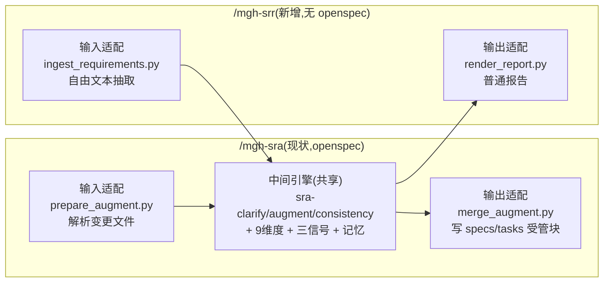

## Context

`/mgh-sra` 的整条流水线可分为三层:

| 层 | 组件 | 是否 openspec 耦合 |
|---|---|---|
| 输入适配 | `prepare_augment.py`(正则解析变更文件 + 按 `specs/<cap>/` 拆模块 + 抽接口/字段/角色) | **是** |
| 中间引擎 | `sra-clarify/augment/consistency.md` + `security-dimensions.md` + `codegraph-hint.md` + `merge_memory.py` + `business_context.json` 契约 | **否**(操作抽象 `{capabilities, requirements, endpoints, fields, roles, candidate_controls, memory}`) |
| 输出适配 | `merge_augment.py`(写回 `specs/<cap>/spec.md` 受管块 + `tasks.md`) | **是** |

用户观察准确:耦合只在**两个接缝**。中间引擎 openspec 无关——SRR 换两个适配器即解锁「纯文字需求 → 普通报告」新场景。约束:`AGENTS.md` R1–R5.10(零运行时依赖 R2、薄壳 R5.6、编排纪律 R5.2、fan-out=脚本枚举 R5.3、边界校验 R5.9、hook 双端 parity R5.7、分发纯净 R5.10)。

## Goals / Non-Goals

**Goals:**
- 让无 openspec 的项目、纯文字需求(word/txt/md/excel/透传)也能做 9 维度安全需求识别 + 部分安全设计提醒。
- 中间引擎**逐字复用**(零复制提示词、零新增 subagent),只新写 2 个确定性适配器 + 1 个薄壳。
- 产物 = 普通、简要的报告(`security_review_report.md` + `srr_manifest.json`),**NEVER 触 openspec**。
- 守 R2(零 pip;docx/xlsx 走 stdlib)、R5 全条目(薄壳 / 编排纪律 / fan-out=枚举 / 边界校验 / hook 双端 / 分发纯净)。
- `business_context.json` 跨 sra/srr 共享同一份,累积复用。

**Non-Goals:**
- 不替换 `/mgh-sra`(openspec 场景仍走 sra;SRR 是并列新入口)。
- 不把报告写进 openspec / 不产出 openspec 变更。
- 不追求 docx/xlsx 抽取达到 python-docx/openpyxl 级保真(降级如实披露 + 透传兜底)。
- 不接入 tree-sitter / 不解析框架路由(沿用 sra 诚实边界;codegraph 仅可选 advisory)。

## Decisions

### D1 — 端口-适配器:复用 sra 中间引擎,而非旗标 / 而非复制
- **选**:新命令 `/mgh-srr` + 两新适配器,中间引擎逐字复用。
- **否 `mgh-sra --freeform`**:mgh-sra 壳已 openspec 强耦合(变更解析 + spec 合并),内部分支撑厚薄壳(R5.6 ≤500 行),两套 I/O 契约混一壳。
- **否「复制提示词建独立流水线」**:违反单一真相源,双份维度目录会漂移。
- **理由**:中间引擎 openspec 无关(已验证操作抽象),换接缝即解锁,代价最小。

### D2 — 复用 sra 的 `change_context.json` 同 shape(契约复用)
- `ingest_requirements.py` 产出与 `prepare_augment.py` **同 schema**:`change`=文档名、`capabilities=[1]`、
  `requirements[]`=段落标题作锚、`endpoints/data_fields/role_hints`=可选 hint(可空)、`candidate_controls`(若有 `--rules`)、
  `pending=[1]`(或 `--split` 多项)、`memory`。
- **理由**:subagent 提示词按此 shape 写,同 shape 才能**零改动**复用——这是「复用」的物理基础。

### D3 — 混合三层格式接入(text-native + stdlib 尽力抽 + `--text` 透传)
- ① `.txt/.md/.csv/.json` 原生读(完美);② `.docx`/`.xlsx` 用 stdlib `zipfile`+`xml.etree` 尽力抽 + **降级标注**;
  ③ **永远留 `--text`/stdin 透传口**。
- **否「仅文本 + 要求导出」**:把转换推用户,违背「支持 word/excel」初衷。**否 python-docx/openpyxl**:R2 禁 pip。
- **已知降级**(产物显式标注):Word 跨 run 断词→**按 `<w:p>` 拼接所有 `<w:t>`** 防 token 碎;Excel 日期→序列号、格式/单位丢;列表编号丢;嵌入对象/文本框/图表抽不到;`.doc`/`.xls`/扫描 PDF 不支持→报错给 recipe;`xml.etree` XXE 理论风险(可信内部文档实操低,不引 `defusedxml`)。
- **关键缓解**:SRR 里正则抽取是**非承重 hint**(LLM 直接读全文),降级抽取不伤主流程。

### D4 — 默认单 capability + section-heading 作 requirements 锚;`--split` 可选标题分块扇出
- 默认整篇 = 1 个 review scope,段落标题进 `requirements[]` 作锚点(缺口仍锚到具体 section)。
- `--split` 时按 markdown 标题(`#`/`##`)确定性切分 → 每 section 一 `pending` → 扇出。
- **扇出仍 = 脚本枚举**(`ingest` 产 `pending[]`,守 R5.3)。自由文本无 capability 结构,单单元最简。

### D5 — 接口/字段/角色抽取降级为可选 hint(非承重)
- openspec-sra 里正则抽 `endpoints/fields/roles` 是承重地基;SRR 里它们降级为可选 hint(用户明示输入可能根本没有)。
- a3 找缺口主要靠 LLM 语义读全文,缺口锚到 `requirement`(section)/ 偶尔 endpoint/field;锚点稀疏时产「应满足的安全属性」类缺口(无控制锚点),仍有效。
- **理由**:匹配用户场景「可能不包含任何具体接口、字段信息」;无锚点的泛化缺口仍按 sra 规则丢弃。

### D6 — 普通报告输出 + `srr_manifest`;NEVER 触 openspec
- `render_report.py` 读定稿 draft + 可选记忆 → `security_review_report.md`(简体中文·简要·面向人读:按维度 / 锚点列缺口
  + 可选复用建议 + 澄清过的问 + 边界)+ `srr_manifest.json`(counts + boundaries)。
- 输出落 `<out-dir>`(默认 `<项目>/.mgh-srr/`,或 `--out` 指定),**NEVER** 写 `openspec/`。
- **否「复用 merge_augment 写 specs」**:用户明确「不要求写到 openspec」。

### D7 — `business_context.json` 跨 sra/srr 共享同一份
- SRR 写 `<project>/.mgh-sra/business_context.json`(与 sra 同文件同 shape);跨 sra/srr 累积一份业务记忆。
- **理由**:引擎共享→记忆共享;为 `/mgh-blst` 留单一消费口;不改契约(proposal Modified=空)。
- **否「独立 .mgh-srr 记忆」**:割裂累积价值。

### D8 — subagent 提示词逐字复用(零复制)
- `sra-clarify/augment/consistency.md` + `security-dimensions.md` + `codegraph-hint.md` 不动,SRR 命令壳直接引用同一路径。
- **理由**:单一真相源,避免双份漂移;这些提示词本就按抽象 shape 写、openspec 无关。

### D9 — `MGH_SRR_ACTIVE` 运行域 + 子树守卫(双端 parity)
- `block-adhoc-scripts.py` 加 `MGH_SRR_ACTIVE`(平行 `MGH_SRA_ACTIVE`);`MGH_TARGET`=项目根判树(覆盖报告输出 + 项目记忆)。
- 双端:claude `PreToolUse` + opencode `.ts` 插件,**同一守卫不改**。治 R5.7 #1 违例(微脚本内省 / 越权 `*.py` / 子树外写)。

## Risks / Trade-offs

| 风险 | 缓解 |
|---|---|
| `.docx`/`.xlsx` stdlib 抽取有降级(日期 / 格式 / 列表) | 降级标注 + `--text` 透传兜底 + D5(抽取非承重) |
| 纯文字无接口/字段 → 缺口锚点稀疏 | 锚到 section 标题;泛化缺口(无任何锚点)按 sra 规则丢弃 |
| 简要报告可能漏点 | 9 维度系统化扫描 + 边界披露「覆盖取决于输入完整度」 |
| sra/srr 同写 `business_context.json` | `merge_memory` 已按 `fact_key` 幂等累积,无冲突 |
| `xml.etree` XXE / 实体膨胀 DoS | OOXML 实操不用自定义实体 + 可信内部文档;注一句;不引 `defusedxml`(R2) |
| 大文档超 token | D4 `--split` 分块扇出 + 截断显式告警(R5.4) |

## Migration Plan

- **部署**:`install.sh` 纳入 srr 资产(命令壳双端 / 两新脚本 / profile / 契约;**复用 sra subagent 与提示词不重复分发**)+ 校验族同目录共存自检 + version bump。
- **顺序**:契约 → 两适配器脚本(+ `--check`)→ 命令壳双端 → `MGH_SRR_ACTIVE` hook 域 → `install.sh` → 单测 / 契约 lint / purity → 文档 → 版本号。
- **回滚**:删 `/mgh-srr` 命令壳 + 两脚本 + profile + 契约 + 移除 `MGH_SRR_ACTIVE`;`/mgh-sra`/`/mgh-sast`/`/mgh-init` 零交叉、不受影响。

## Open Questions

- `--split` 分块阈值(多大文档建议分?)→ 实现期据基线定,先默认单单元。
- 报告语言 / 排版细节 → 默认简体中文·简要,实现期按 sra 报告风格打磨。
