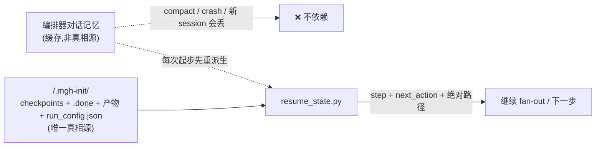

## Context

`/mgh-init` 是 8 步 agentic 流水线(discover → [survey] → scout → [resolve] → T1 → T2 → T3 → assemble → [T4]),
编排器 = 宿主 agent 本身。它**已有很厚的上下文韧性底子**:per-tier `list_*` 的 done/pending、`.done` resume gating、
discover cache/续点/`partial:true` 干净早退、`--max-unit-bytes`/`--orch-budget-bytes`/`--max-aggregate-bytes` 三档字节预算、
subagent per-unit 隔离、per-call `timeout`。

但在**不确定上下文上限**的宿主上仍偶发「上下文过大 → 任务停止」。全面审计(含对 9 份 stage 提示词的回传大小审计)
定位到**四条底子未覆盖的缝隙**(见 proposal 「Why」)。用户当前恢复手段 = 人工 `/compact` + 手输「继续」,这违反工具
使用设想,且 `/compact`/opencode 自动压缩是**模型摘要**,可能丢命令壳灌入的编排纪律提示词 → 续跑执行路径偏离。

本设计的核心洞察:**三种中断(compact / crash / 新 session)在「状态磁盘化」前提下坍缩为同一种恢复路径——
「读磁盘状态 → 继续」**。系统提示词由新 session 重灌、进度由磁盘重派生,从结构上绕开「compact 丢提示词」根因。

参考既有规约:`harden-mgh-init-orchestration-discipline`(编排器=宿主、禁微脚本)、`harden-mgh-init-fanout-output-paths`
(路径钉死为绝对值)、`control-discovery` 既有「Resumable, checkpointed execution」「Long-running deterministic Bash calls
carry a per-call timeout」「Discover soft time-budget clean exit」。本变更为 **additive**(无既有磁盘 schema 迁移)。

## Goals / Non-Goals

**Goals:**
- **治本**:让 `/mgh-init` 在任意节点异常停止后,新 session 用 `/mgh-init --resume` **纯从磁盘**恢复,无需人工
  `/compact`、无需重输 flag、不丢编排纪律(用户 1.1)。
- **治标(少溢出)**:subagent 回传有界(不随 fan-out 膨胀编排器)(用户 1.2 + 审计发现);聚合节点(T2/scout-merge)
  超预算时**硬阈值 + map-reduce**,消灭剩余的单请求溢出风险(兑现 shell 已自认的 P0 软边界 TODO)。
- **compaction-aware**:声明状态磁盘化,压缩/续跑先 `resume_state.py`,上下文吃紧时「干净停止 + 新 session resume」
  优于人工 `/compact`(用户 1.3 + 直击 compact 丢提示词恐惧)。

**Non-Goals:**
- **不改 discover 的 cache/续点/`partial:true`/原子写**(已完备)。
- **不引入 per-tier runner subagent(子 agent 再扇出子 agent)**以进一步压缩编排器上下文——见 D6(留后续 change)。
- **不改任何既有磁盘产物 schema**;不改 `vvah` 兼容 inventory 字段;不改 rules 纯净性 lint。
- **不试图「让 compact 保留系统提示词」**(不可控)——改让状态磁盘可重派生,使 compact 是否丢提示词**无关紧要**。
- **不覆盖 sast/sra/srr**(用户明示「暂时只针对 mgh-init」);本变更的 resume_state/ack/compaction 模式可后续移植。

## Decisions

### D1 — 新增 `resume_state.py` 作为跨 tier 状态机出口(而非扩 `describe_artifact` / 某个 `list_*`)

`resume_state.py` 读 `.mgh-init/` 全产物 + 跨 tier `.done` + `run_config.json`,吐极简 `{step, tiers, next_action,
resumable}`。`next_action.absolute_paths` 复用 `list_*`/`describe_artifact` 既有的 `Path.resolve()` 绝对值,**不自拼、
不模板 `<target>`**(承 `harden-mgh-init-fanout-output-paths` 的逐字绝对路径铁律)。

**为何新脚本**:`describe_artifact` 是单产物结构窥探;`list_*` 是单 tier 枚举;跨 tier「步骤机 + 下一步」是**新职责**
(要同时判定 optional/codepath 分支:scout/survey/resolve/t4/--merge 是否启用)。新脚本遵循 R5.3(runtime 自包含 + CLI I/O
契约),并经 `tools/check_contracts.py` 学其 flag(双壳镜像,R5.1)。`resume_state.py` 是**只读**脚本(无 `--check` 需要,
但保留 `0/1/2` 退出码 + `--help` 契约)。

**为何不靠编排器对话记忆判步骤**:这正是 compact/crash/新 session 会丢的东西。把「我在哪」下沉为磁盘查询 = 结构性免疫。

### D2 — `run_config.json` 作起始态意图文件(而非 resume 时重输 flag / 扩 `init_manifest.json`)

step 0 原子写 `<target>/.mgh-init/run_config.json`,记决定步骤图的 flag(`format`/`scope`/`no_scout`/`no_codegraph`/
`skip_consistency`/`merge`/预算/scout 参数/绝对 `target`)。`resume_state.py` 据它解析 optional 分支。

- **vs resume 时重输 flag**:用户诉求是「新 session 检查历史进度、重新开始」——应**免重输**。`run_config` 使
  `/mgh-init --resume` 真正 stateless。
- **vs 扩 `init_manifest.json`**:`init_manifest` 是**终态**(step 8 写,版本/计数/出处);`run_config` 是**起始态意图**。
  二者生命周期不同,不可合并。`run_config` 随 `.mgh-init/` gitignore。
- **缺失/破损 → fail-loud(退出码 2)+ recipe**(重跑 `/mgh-init --<flags>` 重建),**NEVER 静默猜步骤图**(猜错 = 执行路径偏离,正是用户痛点)。

### D3 — 回传统一为「单条有界 ack」(而非依赖编排器「不读」)

9 份 stage 提示词此前**对回传消息集体沉默**(审计确认),仅规约「写哪个文件 + touch `.done`」。于是 subagent 可能回显
整份记录体;聚合节点(T2/scout-merge)的 checkpoint 文件**就是全量聚合记录**,被编排器内联读回则上下文单调膨胀。

- **ack 契约**:最终消息 = 单条 `ok <abs path> <count>` / `oversize <abs path>` / `failed <reason>`(聚合加 `total`/`merged`)。
  NEVER 回显记录体/源码。ack 是**存活信号**,非数据载体。
- **编排器侧**:仅据 ack 判单元成败 + 探 `.done`;**MUST NOT** 为继续而内联 `Read` checkpoint。聚合产物经
  `resume_state.py`/`describe_artifact` 有界摘要接触。
- **为何不只靠「编排器自觉不读」**:agent 无法选择性遗忘已进入上下文的内容;ack 是**唯一**能从源头限流的杠杆。
  这条是提示词护栏(非确定性),由 `.done` 标记 + `resume_state.py` 作确定性兜底。

### D4 — 聚合硬阈值:**仅超预算时**两段 map-reduce(而非总是 / 而非保持软边界)

`--max-aggregate-bytes` 从「披露 + 建议 `--scope`/`--merge`」升级为**硬闸门**:
- **≤ 预算**:逐字不变(单一综合 subagent,承既有 single-context 综合语义)。**小仓零行为变化**。
- **> 预算**:确定性 `plan_aggregate.py` 分桶(T2 按 `category`、scout-merge 按 batch 簇)→ 每桶 ≤ 预算的有界 shard →
  每 shard 一个 partial-synthesis subagent(有界输入、ack 回传)→ 单一 rollup subagent **仅吞各 shard 摘要**(有界)产终态。
  **每个大模型请求 ≤ 预算**。

**为何仅超预算触发**:消灭真实溢出风险的同时,**不改变小仓行为**(零回归)。`plan_aggregate.py` 复用 `list_*` 的
`--materialize`/`--offset`/`--limit`/`--orch-budget-bytes` 翻页语义。T4(rules-consistency)审计确认**已**「short diff-list 回传」
(safe-by-design),**不需** map-reduce。

### D5 — compaction-aware = 状态磁盘化 + resume-first + 干净停止优于人工 compact

两份 `mgh-init.md` 增 Re-entrancy & compaction 段(主谓措辞 + recipe,R5.5①):
1. 可恢复状态在磁盘,对话记忆非真相源;
2. `/compact`/opencode 自动压缩是模型摘要、**可能丢编排纪律提示词**,故续跑 NEVER 靠「记得第几步」;
3. `--resume` 或任何压缩事件后,**第一步 SHALL 调 `resume_state.py`**;
4. 上下文吃紧 **MAY** 干净停止(跑完当前 fan-out 波次、落 `.done`)→ 新 session `/mgh-init --resume` 续,**优于**人工 `/compact`;
5. per-call `timeout` + discover `partial:true` 纪律不变。

**关键**:不试图「让 compact 保留提示词」(不可控);改让状态磁盘可重派生 → compact 是否丢提示词**无关紧要**(新 session
重灌命令壳 = 完整提示词)。这**直接化解**用户「compact 丢 mgh-init 系统提示词导致路径偏离」的恐惧。

## Risks / Trade-offs

- **[map-reduce 拆分可能影响 T2 跨 category canonical 判定质量]** → 缓解:rollup subagent **见所有 shard 摘要**(跨
  category 视图保留);canonical/competing 归并在 rollup 完成;≤ 预算(常见)逐字不变;触发与 shard 数入 `boundaries[]`
  披露。**关键质量风险点**(见 Open Questions Q3),需 R5.7 段 A blind A/B 评估。
- **[resume_state 步骤判定分支复杂]** → 缓解:由 `run_config.json` 驱动 optional 分支;每分支 deterministic 单测
  (not-started/discover/scout/t1/t2/t3/t4/done/merge + survey/resolve skipped);`run_config` 缺失 fail-loud。
- **[ack 契约靠提示词自觉(非确定性)]** → 缓解:ack 是编排器**建议性**信号,`.done` 标记 + `resume_state.py` 是
  **确定性**进度闸门;与既有提示词护栏(纯净性/sanctioned-tools)同等性质,由 R5.7 评估 + R5.9 边界校验兜底。
- **[`run_config.json` 与用户中途改意图漂移]** → 缓解:它记录**创建该 run** 的调用;在已 resume 的 run 上换 flag 是
  用户错误(披露)。新 run(`.mgh-init/` 不存在或被清)重写 `run_config`。
- **[新脚本增契约面(R5.1)]** → 缓解:`check_contracts.py` 学 `resume_state.py`/`plan_aggregate.py` 的 flag;双壳镜像;
  `tests/test_resume_state.py`/`test_plan_aggregate.py` 覆盖。
- **[opencode 自动压缩 ~95% 触发可能在单次大 fan-out 波次中途发生]** → 缓解:per-unit `.done` 使任何中途压缩都留下
  已完成单元;压缩后 `resume_state.py` 重派生 → 续。`run_config` + `.done` 是幂等恢复基础。

## Migration Plan

- **纯 additive**:新脚本(`resume_state.py`/`plan_aggregate.py`)、新提示词段(Return-to-orchestrator)、新命令壳段
  (Re-entrancy & compaction + resume 首步)、新契约(`resume-state.md`/`aggregate-sharding.md`)。**无既有磁盘 schema 迁移**。
- **存量进行中 run 的兼容**(本变更前创建、无 `run_config.json`):`resume_state.py` **fail-loud**(退出码 2)+ recipe
  「重跑 `/mgh-init --<flags>` 重建 run_config」,**NEVER 静默猜**。权衡:用户对极少数存量 in-flight run 需重跑一次(可接受,
  优于猜步骤图导致路径偏离)。design 认此为正确取舍。
- **回滚**:`git revert` 即整体回退(新脚本未被依赖即为 dead code;提示词/壳段 revertible;无数据迁移)。hook 运行域
  **无扩展**(新脚本是既有 `core/scripts` 白名单内叶子)。VERSION bump + CHANGELOG(R5.8)。
- **交付顺序**(见 tasks):L1 枚举/状态脚本(最低风险、纯 additive)→ 契约 → L2 提示词 ack + 路径绝对化 → L4 命令壳
  resume 流 + compaction 段 → L3 聚合 map-reduce(最重、最后)→ AGENTS.md 措辞 → 回归 + 端到端。

## Open Questions

- **Q1(per-tier runner subagent)**:是否在本变更引入「每 tier 一个 runner subagent 拥有整个 fan-out 循环、只回 tier 摘要」
  以进一步压缩编排器上下文?**建议延后**(D6):子 agent 再扇出子 agent 增加 nesting 复杂度 + opencode 嵌套 Agent 支持未验证;
  本变更的 resume_state + ack 已把编排器上下文压到「极简状态 + 有界 ack」,runner 是进一步优化,留后续 change。
- **Q2(T2 map-reduce 的 canonical 质量)**:per-category 分桶后,跨 category 的 competing/canonical 归并全靠 rollup
  subagent 见所有 shard 摘要——确认 rollup 输入(per-category 摘要)足以支撑既有「Cluster competing controls and designate
  canonical」的判定?**设计答案**:是(rollup 跨 category 视图保留),但这是**关键质量风险**,须 R5.7 段 A baseline +
  blind A/B 对比 pass rate/质量,新失败模式回灌。若 rollup 质量不达标,fallback = 超预算时退回「披露 + `--scope`/`--merge`」
  (即保留软边界)+ 仅对 scout-merge 启用硬阈值。
- **Q3(ack 格式)**:单行 `ok <path> <count>` vs 微型 JSON?**建议**单行(编排器最易忽略/解析);细节留 impl,spec 仅
  约束「单条有界 ack、NEVER 回显记录体」。
- **Q4(是否给 `resume_state.py` 加 `--validate`)**:校验磁盘状态自洽(如 t2 `.done` 存在但 inventory 缺失 = 不自洽)?
  **建议**:作为 `--check` 等价模式加(承 R5.9),编排器在 resume 起步可调以早发现破损产物。留 impl 决策。
