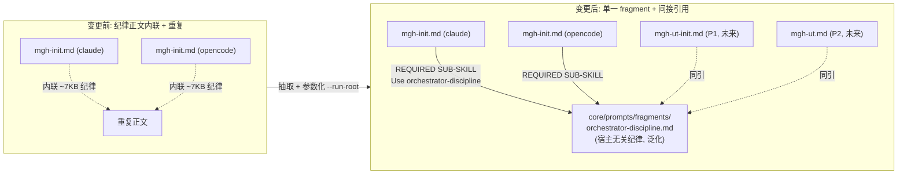

## Context

`mgh-init` 的编排纪律正文目前**内联**在两份壳里(`releases/claude-code/commands/mgh-init.md` 与
`releases/opencode/command/mgh-init.md`,各 ~7KB、近乎逐字相同):「Orchestrator discipline(铁律)」+
「Re-entrancy & compaction」两段。这部分正文是**宿主无关的通用纪律**(编排器即宿主 agent、三条 `NEVER`
硬边界、fan-out 刚性三元组、resume recipe、`.failed` 终态、长跑 Bash 超时),却 (a) 在两壳间重复、
(b) 没有任何 spec 捕获为规约、(c) 即将到来的 `mgh-ut-init`/`mgh-ut`(`task.260805.md` P1/P2)照搬会
再复制两份 → 正文 drift(决策 C3-lite 已点此风险)。

并行地,`resume_state.py` / `write_runconfig.py` 把运行目录名硬编码为 `.mgh-init`(虽已有 `--init-dir`
全路径覆盖,但「目录名」这一概念未参数化),ut 族需要 `.mgh-ut-init` / `.mgh-ut`。

利益相关方:① 维护者(要消重、要 spec 化、要为 P1/P2 铺路,不得破坏 mgh-init 行为);② mgh-init
既有使用者(零感知——行为字节级一致);③ P1/P2 实现者(要一个可引用的共享基座)。

**行为保持边界(诚实)**:把纪律正文从壳移进 fragment 是**载体变更**(内联 → `REQUIRED SUB-SKILL` 按需
加载),R5.6 明认可此间接机制为 `@` 强制内联的替代。纪律的**实质内容**不变;真正防 compact 丢失纪律
的兜底是 resume-from-disk(`resume_state.py` 读磁盘重派生步骤),与正文载体无关 → 抽取不降低 compact
韧性(见 Risks)。

## Goals / Non-Goals

**Goals:**
- 单一 fragment `orchestration-discipline.md` 持有宿主无关纪律正文;mgh-init 两壳经 `REQUIRED SUB-SKILL`
  引用而非内联。
- fragment 正文**泛化**(抽象名词指代脚本),使其能被 ut 族同引;init 专属脚本名/产物名留壳内。
- `resume_state.py` / `write_runconfig.py` 加 `--run-root`(默认 `.mgh-init`,行为字节级一致)。
- 新能力 `orchestration-substrate` spec 把上述捕获为可证伪规约。
- 既有回归测 + 三项 lint(契约 / 纯净 / 零依赖)全绿;版本号 bump。

**Non-Goals:**
- **不**改 mgh-init 流水线的可观测行为(产物 / 退出码 / 路径 / stage 流)。
- **不**泛化 `resume_state.py` 的 tier 逻辑(discover/scout/t1–t4、`controls_candidates.json` 等 init
  专属);`--run-root` 仅泛化目录名。ut 族 resume 脚本是 copy 还是 generalize = P1 决策(C3-lite)。
- **不**触 sast(纪律由 `sast-orchestration-discipline` 治理;sast 是否将来同引此 fragment 是后续独立变更)。
- **不**新增任何 pip 依赖(承 R2)。

## Decisions

### D1 — 抽到 `core/prompts/fragments/` 下的单一 fragment(而非 spec 正文 / 保留内联)

- **选择**:新建 `core/prompts/fragments/orchestrator-discipline.md`,与既有 `controls-context.md` /
  `rules-format-*.md` 同位(都是「按需加载、可被多壳/subagent 引用」的碎片)。
- **理由**:fragment 正是本仓既有的「宿主无关 + 可被多消费方引用」载体;install 已镜像 `core/` →
  `.claude/mgh-core/`,零分发改动。spec(`orchestration-substrate`)治规约、fragment 治正文,职责分明。
- **备选**:
  - 把正文写进 spec.md —— 否决:spec 是机器可检的 requirement/scenario 契约,不是给 agent 读的纪律
    正文;混在一起破坏 spec 可读性(承 R3)。
  - 保留两壳内联、只加 spec —— 否决:不消重,P1/P2 仍会复制(drift 未治)。

### D2 — fragment 正文泛化(抽象名词),init 专属名留壳内

- **选择**:fragment 用「该命令的 `list_*` 枚举脚本」「resume-state 脚本」等抽象名词表述 recipe;具体
  脚本名(`list_clusters.py`/`resume_state.py`/`discover_controls.py`)与产物名(`controls_candidates.json`
  等)留在各壳 stage 流。
- **理由**:这是「共享基座」的核心——同一份 recipe 适配 init/ut-init/ut 的不同脚本族;泛化后 ut 族
  同引零重写。壳的 stage 流已用确切调用行钉死 init 的具体实例,fragment 给 pattern、壳给 instance,
  二者合起来覆盖完整。
- **备选**:fragment 直接写死 `list_clusters.py` —— 否决:ut 族无法直接同引(其枚举脚本叫
  `list_test_clusters.py` 等),退化为「init 专属 fragment」,失去共享意义。

### D3 — `REQUIRED SUB-SKILL` 间接引用(R5.6),不 `@`-inline

- **选择**:壳顶部以 `REQUIRED SUB-SKILL: Use orchestrator-discipline` 标记引用 fragment(R5.6 认可的
  间接机制,替代被禁的 `@` 强制内联)。
- **理由**:R5.6 明文「禁 `@` 强制内联(改用 `REQUIRED SUB-SKILL: Use X` 标记)」;且本仓此前零处用
  `REQUIRED SUB-SKILL`(已确认),本变更是首个落地此模式的变更。
- **备选**:`@orchestrator-discipline.md` —— 否决:R5.6 明禁 `@` 强制内联。

### D4 — `--run-root` 优先级:`--init-dir` > `--run-root` > 默认 `.mgh-init`

- **选择**:新增 `--run-root <name>`(目录**名**,默认 `.mgh-init`);既有 `--init-dir`(全路径)保持
  最高优先级,二者同传时 `--init-dir` 胜出(无歧义)。
- **理由**:`--init-dir` 已存在且测过,不动它 = 零回归风险;`--run-root` 补的是「目录名」这一缺失
  概念(ut 族 step 0 写哨兵/`run_config` 时用 `.mgh-ut-init` 名而非拼全路径)。优先级链清晰、可测。
- **备选**:废弃 `--init-dir` 只留 `--run-root` —— 否决:破坏既有调用方与测试,违背行为保持。

### D5 — `resume_state.py` 仍 init 专属;`--run-root` 只泛化目录名

- **选择**:`resume_state.py` 的 tier 推断(discover/scout/t1–t4)、产物名(`controls_candidates.json`/
  `clusters.json`/`controls_inventory.json`/`init_manifest.json`)、`--check` 自洽校验**全部保留 init 专属**;
  本变更只把目录名参数化。
- **理由**:`resume_state.py` 的状态机深度耦合 init 的 stage 图;泛化它 = 重写状态机,远超 P0「行为保持」
  边界。ut 族需要自己的状态机(不同 tier 名),其 resume 脚本是 copy-后改 tier 还是 generalize 出
  `resume_state(<tier-graph>)` 属决策 C3-lite,**留给 P1**。P0 只交付「目录名不硬编码」这一最小解耦。
- **备选**:把 `resume_state.py` 重构成接受 tier-graph 参数的通用机 —— 否决:超 P0 范围、风险大、
  无既有 ut 消费方验证。

## Risks / Trade-offs

- **[载体变更可能被误读为「纪律弱化」]** → 壳顶部保留一句显式指引「编排器 = 宿主 agent;完整纪律见
  orchestrator-discipline fragment」,且 `REQUIRED SUB-SKILL` 标 REQUIRED(非可选);spec R2 场景断言
  壳含该标记 + 不再内联被覆盖正文块。
- **[compact 丢 fragment 内容的风险]** → 与内联时同量级(compact 丢的是上下文,不分内联/fragment);
  真正兜底是 resume-from-disk(`resume_state.py` 读磁盘重派生),与正文载体无关。抽取不增风险。
- **[泛化措辞漏掉 init 某个具体边界]** → fragment 给 pattern,壳 stage 流保留 init 确切调用行/产物名;
  既有 `test_init_runtime.py` 等回归测兜底 init 行为不漂。spec R1 场景要求 fragment 用抽象名词(不绑死
  init 脚本名)。
- **[`--run-root` 暂无 ut 消费方,看似 YAGNI]** → 是 P0 的有意铺路(承 `task.260805.md` P0 明列);
  默认 `.mgh-init` = 零行为变化,成本仅 ~10 行/脚本 + 几个测试用例,远低于 P1 再回头改。
- **[首个 `REQUIRED SUB-SKILL` 落地,模式生疏]** → 实现时壳引用措辞与 fragment 顶部「如何被消费」
  说明对齐;install 自检 + 契约 lint 不直接覆盖 `REQUIRED SUB-SKILL` 标记(它是提示词层约定,非 CLI
  契约),由 spec R2 场景 + 人工评审覆盖(诚实边界)。

## Migration Plan

1. 新建 `core/prompts/fragments/orchestrator-discipline.md`(泛化正文,从两壳现有纪律段抽取 + 改写
   抽象名词;保留 `<!-- … -->` 顶部用途注释,对齐既有 fragment 体例)。
2. 改两壳:删被 fragment 覆盖的纪律正文块,加 `REQUIRED SUB-SKILL: Use orchestrator-discipline` +
   一句指引;stage 流 / 调用行 / 哨兵 / 边界披露不动。
3. 改两脚本:加 `--run-root` flag + 优先级解析(`--init-dir` > `--run-root` > 默认);更新 `--help`
   docstring(= CLI 契约,R5.1)。
4. 扩测:`test_resume_state.py` / `test_write_runconfig.py` 加默认等价 / 命名目录 / `--init-dir` 优先 三类用例。
5. bump 涉事 `.md`/脚本版本号;跑全套回归 + 三项 lint;`install.sh` 自检 fail-soft。
6. **回滚策略**:纯文本 + flag 默认值变更,git revert 单变更即可;无数据/产物 schema 变化。

## Open Questions

- `REQUIRED SUB-SKILL` 标记的**确切措辞**(`Use orchestrator-discipline` vs `Load orchestrator-discipline
  fragment`):P0 实现时定,以「宿主 agent 能据之找到并加载 `.claude/mgh-core/prompts/fragments/
  orchestrator-discipline.md`」为准。
- fragment 是否同时收录**两壳共有的 host-specific 超时披露**(opencode `OPENCODE_EXPERIMENTAL_BASH_DEFAULT_TIMEOUT_MS`
  段):倾向收录(它也是宿主无关的「跨宿主公共杠杆 + opencode 边界」纪律);claude 专属的 per-call
  `timeout` 上限值留壳。实现时 pin。
- 未来 sast 是否同引此 fragment:本变更**不决定**(sast 有自己的 `sast-orchestration-discipline` spec);
  列此为后续可能独立的「迁移 sast 同引 substrate」变更的入口。
