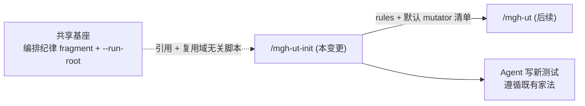

## Context

`/mgh-ut-init` 是 mgh-族的**第二纵向(测试质量)**第一条命令:扫描项目存量测试代码 + 构建配置,
提炼团队真正在用的**测试约定**,写成 Agent rules,让 Agent 写新测试时遵循既有家法,且**不把应付式
弱测试学成家法**。

仓库里已有一条同形命令 `/mgh-init`(安全控制发现 → rules),它的流水线很重:regex/AST 发现器 →
scout 补盲 → 逐簇归纳 → 综合 → 逐类写规则 → 一致性,共 5+ 层、十几个脚本。**ut-init 不照搬它**——
理由见决策 1(测试代码面小 + 词法密,mgh-init 那套规模理由不成立)。

共享基座已就位(上一个变更「抽共享基座」交付):一份宿主无关的「编排纪律」提示词 fragment(各命令
经 `REQUIRED SUB-SKILL` 引用,不重复内联)、以及可参数化的运行目录(`--run-root`,默认 `.mgh-init`,
ut-init 用 `.mgh-ut-init`)。ut-init 是这套基座的第二个消费方。

利益相关方:① 维护者(要第二纵向、复用基座、不破坏既有命令);② 既有命令使用者(零感知);③ 后续
`/mgh-ut`(diff 测试质量门)的实现者(消费 ut-init 的 rules + mutator 清单)。

## 工作流(逐步:每一步干啥)

跑一遍 `/mgh-ut-init`,编排器(= 宿主 agent)按下面的顺序执行。**确定性脚本**经 `Bash` 跑、**LLM 归纳**
经 subagent 跑。每个 stage 产物跑完做一次 `--check` 边界校验(失败回退重跑该步,不带着破损产物继续)。

**Step 0 起步(声明运行域 + 落盘恢复意图)**
- `export MGH_UT_INIT_ACTIVE=1` + 写磁盘哨兵 `<target>/.mgh-ut-init/.active`(env 或哨兵任一激活 hook;
  opencode 的插件进程不继承会话中途 export 的 env,故哨兵是 opencode 上的可靠兜底)。
- 原子写 `<target>/.mgh-ut-init/run_config.json`(`write_ut_runconfig.py`;记录本次 flag,使 `--resume`
  免重输)。
- 取 `MGH_TARGET`(绝对项目根)供 hook 判「写是否落在受信子树」。

**Step 1 归类(确定性脚本 `classify_tests.py`)**
- 扫测试源码树,把测试文件按**被测层 / SUT 类型**分桶:controller / service / repository / config / util …
  判定依据 = 实际注解 + import + 包路径 + 文件名(不靠名字猜)。
- 一组内若检测到混合子风格(`@WebMvcTest` vs `@SpringBootTest`)→ 拆子组。
- 输出每组:成员清单 + 均匀度提示(同注解主导=均匀 / 混杂=异质)+ 组内断言密度 → `test_groups.json`。
- `classify_tests.py --check` 校验(每个文件恰好进一组、清单与磁盘一致)。

**Step 2 逐组抽样提炼(fan-out:`list_test_groups.py` + ut-extract subagent)**
- `list_test_groups.py` 产 fan-out 工作清单:每组一项,含**样本物化路径**(`input_path`,均匀组 3–5 个文件、
  异质组更多/子分)+ 输出 `checkpoint_path`(绝对)。
- 每组 spawn 一个 **ut-extract** subagent:读该组样本,提炼该层测试约定(框架 / mock / 断言 / 夹具 / 命名 /
  依赖组件);**识别样本里的应付式弱测试、不把它的模式当约定**(弱测试标记不删)→ 每组产观察 JSON。
- `.done`/`.failed` = 终态;`--resume` 跳过终态单元,崩溃无 ack → 仍 pending → 重派。

**Step 3 汇总去重(ut-synthesize subagent;大仓可经 `plan_aggregate.py` 分片)**
- 跨组观察归并去重 → 规则草案:每层 / 每条约定一条规则 + **provenance**(从哪组样本归纳、强/弱信号计数)。
- 弱信号主导的约定标低置信 + 进 `boundaries[]` → `test_rules_inventory.json`。
- `validate_test_rules.py --inventory <test_rules_inventory.json>` 校验规则 schema(该脚本本身即 synthesize 边界校验器,退出码 0/1/2;非 `--check` 子模式)。

**Step 4 出 rules(ut-rulewriter subagent + 确定性组装 `assemble_test_rules.py`)**
- 按 `--format` 渲染且仅渲染对应结构:claude → `<target>/.claude/rules/test-*.md`;opencode →
  `<target>/AGENTS.md` 惰性索引块 + `<target>/docs/test-conventions/<cat>.md` 详述(结构不混)。
- `assemble_test_rules.py --check` 做纯净 lint(规则正文不得泄漏内部 token / schema 字段 / 无源码锚点约定)。
- (可选)ut-rules-consistency 一致性 pass。

**Step 5 收尾(确定性)**
- `derive_mutators.py` 解析 pitest 配置 → `<target>/.mgh-ut-init/default_mutators.json`(留后续 `/mgh-ut` 消费;
  无配置 → 内置标准集 + 披露)。
- 写 `ut_manifest.json` + `report.md`(含失败披露 / 边界);移除哨兵(run 完成)。

**恢复入口**:压缩 / 崩溃 / 新会话后 `--resume`,第一步永远读 `resume_ut_init_state.py` stdout 的
`step`/`next_action`(纯从磁盘重派生,不靠对话记忆),据 `next_action` 续跑对应步骤。

## Goals / Non-Goals

**Goals:**

- `/mgh-ut-init`(claude + opencode 双壳)交付「归类 → 抽样提炼 → 汇总 → rules」精简流水线。
- **fan-out 单元 = 层组**(非逐文件),用代表性样本提炼,消模板冗余。
- 弱测试在提炼时被识别、不学成家法(主要靠 LLM 上下文判)。
- 确定性脚本只做便宜的预处理(归类)+ 收尾(组装/lint/校验/mutator 派生);发现与归纳交 LLM。
- 最大复用共享基座与域无关脚本;新增脚本面最小化。
- 第 5 个 hook 运行域,双端对等 + 测试覆盖。
- 既有回归测全绿;新产物过三项检查(CLI 契约 / 分发纯净 / 零依赖);版本号 bump。

**Non-Goals:**

- **不**改 `/mgh-init` 或 sast/sra/srr 的任何既有行为(resume/intent 脚本是**拷贝**而非改原文件)。
- **不**实现 `/mgh-ut`(后续变更)。
- **不**实跑 pitest 验证变异杀死(后续 opt-in)。
- **不**支持 JVM 以外语言(本版只 JVM)。
- **不**新增任何 pip 依赖。
- **不**追求 rules 穷尽完备(诚实边界:rules 是提示,后续 `/mgh-ut` 的 LLM 会自适应)。

## Decisions

### 决策 1 — 精简、LLM 为主;不照搬 mgh-init 的重流水线

- **选择**:ut-init 用 `归类 → 逐组抽样提炼 → 汇总去重 → 出 rules` 的精简流水线。**不**做 mgh-init
  那套 regex/AST 发现器 + scout + 逐簇归纳 + 多层级。
- **理由**:mgh-init 的发现器 + scout 是被**规模**逼出来的——它扫百万行**生产源码**,必须先用 regex
  廉价预筛、再用 scout 补 regex 漏掉的长尾。ut-init 只扫**测试代码**(体量小得多),且测试约定**逐文件
  词法特征极密**(`@Test`/`@WebMvcTest`/`@MockBean`/AssertJ 一眼可见)——LLM 读文件即能发现,不需要 regex
  预筛,scout 也冗余(LLM 逐文件本就看得见自定义基建)。多层级归纳对小测试面是过度。弱测试识别里的语义
  类信号(「这测试 flip 个运算符还会过吗」「mock 没覆盖真实依赖」)本来就不是确定性脚本能做的,交给
  LLM 在上下文里判更合适。
- **备选(否决)**:照搬 mgh-init 5 层 + 发现器 + scout。否决理由:对测试小测试面过度设计,新脚本多、
  评估慢;且发现器/scout 的规模理由在此不成立。

### 决策 2 — fan-out 单元 =「层组」;按实际注解/import 归类,不靠名字猜

- **选择**:先把测试文件按**被测层 / SUT 类型**分桶(controller / service / repository / config /
  util / …),**每组**作为一个 fan-out 单元读代表性样本提炼。归类信号 = 包路径 + 实际注解
  (`@WebMvcTest`/`@DataJpaTest`/`@ExtendWith(MockitoExtension)`…)+ import(`MockMvc`/`AssertJ`…)+
  文件名(`*ControllerTest`)。归类器输出每组的成员清单 + **均匀度提示**(同一种注解主导 = 均匀;
  混杂 = 异质)。
- **「Controller 一个风格、Service 一个风格、Util 更杂」成立吗?**——**典型项目里成立**:Controller
  测试(`@WebMvcTest`+`MockMvc`+`@MockBean`)、Service 测试(`@MockitoExtension`+`@InjectMocks`)高度
  模板化;Util/Common 测试(纯函数参数化、mock 静态方法、mock 时间、属性式断言)真异质。**但归类器以
  「检测到的实际注解/import」为准、不以名字猜**:同一个「Controller 测试」若有混合子风格(`@WebMvcTest`
  切片 vs `@SpringBootTest`+`TestRestTemplate` 全量),就**分成不同子组**各自抽样——这样对「不一致的
  项目」也稳。
- **理由**:测试代码高度模板化 → 逐文件 fan-out 冗余(第 50 个 ControllerTest 相比第 1 个几乎不增信息)。
  按层组分桶把单元数从 N 个测试文件降到 K 个层组(K 小),样本又给 LLM 足够证据看清模板,提炼质量更高、
  成本更低。
- **备选(否决)**:逐文件 fan-out。否决理由:模板冗余、单元数大、单文件证据不足以判断「这是约定还是
  个例」。

### 决策 3 — 抽样提炼 + 汇总;gap 可接受(诚实边界)

- **选择**:每组读**代表性样本**提炼——均匀组读少几个(如 3–5 个文件),异质组读多一些或按子风格再分。
  汇总阶段跨组去重归并成 rules(每层 / 每条约定一条 rule)。**抽样提炼必有遗漏**,这是**可接受的诚实
  边界**:ut-init 的 rules 是**提示、不是完备规约**;后续 `/mgh-ut` 的 LLM 在写测试时会看到真实测试、
  自适应,即便 rules 不全也能贴合项目家法。故 ut-init 优化目标 = 「廉价捕获主导的高价值约定」,非穷尽。
- **理由**:测试约定高度趋同,样本足以捕获主导模式;穷尽(逐文件读全部)成本高、边际收益低,且与
  「rules 是提示」的产品定位不符。
- **备选(否决)**:逐文件全读。否决理由:成本高、与「rules 是提示」定位矛盾。

### 决策 4 — 弱测试处理:提炼 prompt 为主,不设独立确定性打分 stage

- **选择**:弱测试识别主要靠**提炼 subagent 的 prompt**——读样本时识别应付式弱测试(零断言、
  `assertEquals(a,a)` 同义反复、mock 被测对象本身、只跑 happy-path、近重复模板……),**不把弱测试的
  模式当约定**;弱测试只标记不删;弱信号主导的约定标低置信 + 提示需人评。**不**单设一个确定性弱测试
  打分 stage。
- **可顺带的便宜提示(非独立 stage)**:归类器在分桶时**顺带**统计每组的断言密度等极廉价信号,作为
  「该组样本质量」提示喂给提炼 prompt(不是独立产物、不是 stage,只是归类 stdout 的一个字段)。
- **理由**:语义类弱信号(mutator 透镜 / mock 不足)本质要 LLM 判断,AST 做不了 → 单设确定性打分器既
  过度又欠力。把弱测试判断放进提炼 prompt,LLM 在读样本的上下文里一次判完,更准更省。
- **备选(否决)**:独立确定性弱测试打分器 stage。否决理由:做不了语义信号(过度又欠力);额外 stage
  + 脚本 + 契约,过度。

### 决策 5 — resume / 起始态意图 / step 枚举:拷贝,不改 init 的

- **选择**:新建 `resume_ut_init_state.py`(拷贝自 init 的 `resume_state.py`,改 ut 的步骤图——无 init
  的 codegraph 解析步骤、加「归类」前置步骤、ut 产物名)、`write_ut_runconfig.py`(拷贝,持久化 ut 的
  flag)、`list_ut_steps.py`(ut 的 step 枚举 + 绝对脚本路径派生)。**init 的原文件零改动**。
- **理由**:`resume_state.py` 是「压缩/崩溃/新会话后靠磁盘恢复进度」的最后兜底——最该安全的脚本。拷贝
  = 把新命令的 bug 爆炸半径隔离在新命令内,init 的恢复兜底零回归风险(由 init 既有测试兜底)。ut 的
  步骤图与 init 实质不同(无 codegraph 解析步骤、加归类步骤),硬要泛化 init 的脚本 = 重写它的核心状态
  机,跨命令回归风险,且本版只有 1 个 ut 消费者、过早。
- **演进路径(留待后续)**:等后续 `/mgh-ut` 出现第 2 个 ut 的 resume 消费者时,再评估把「点 marker /
  终态校验 / 起始态文件不变量」这些通用算法抽成共享 helper(届时形状已被两个消费者验证)。本变更不预抽。
- **备选(否决)**:把 init 的 `resume_state.py` 泛化成「通用核心 + 各命令步骤图描述」。否决理由:改 init
  的恢复兜底、回归面跨两命令、过早。

### 决策 6 — 第 5 个 hook 域 + 写入受信子树:类比 init 的正向允许清单

- **选择**:运行时守卫 `block_adhoc_scripts.py` 的域表加 `("mgh-ut-init", "MGH_UT_INIT_ACTIVE",
  ".mgh-ut-init")`;该域的写入受信子树用**正向允许清单**(`.mgh-ut-init`/`.claude/rules`/
  `docs/test-conventions`/`AGENTS.md` ∪ 哨兵的自定义产物根),而非「仅拦越出项目树的写」。
- **理由**:ut-init 和 init**同形**——都把 rules 写进这些受信子树(claude 的 `.claude/rules/test-*.md`、
  opencode 的 `AGENTS.md` + `docs/test-conventions/<cat>.md`),都有「在项目根写临时文件污染」的风险。
  init 的正向允许清单正是治这个;ut-init 同形状 → 同治理,复用同一段判定逻辑(受信子树集参数化)。
- **备选(否决)**:仅拦越树写(像 sast/sra/srr)。否决理由:ut-init 写 rules 到项目根的能力 = init,
  需要正向允许清单才拦得住树内根污染。

### 决策 7 — pitest mutator 默认清单:确定性派生,留 P2 消费口

- **选择**:`derive_mutators.py` 确定性解析 `pom.xml`/`build.gradle`/`build.gradle.kts` 的 pitest 配置 →
  `<target>/.mgh-ut-init/default_mutators.json`(`{source, mutators[], parser_notes[]}`);没配 pitest →
  用内置 pitest 标准集(`source:"builtin-fallback"`)+ 在报告/边界披露「未发现 pitest 配置」。留给后续
  `/mgh-ut --mutators` 默认消费。
- **理由**:mutator 集是 pitest 既定词汇表,确定性事实(非 LLM 候选);后续 `/mgh-ut` 需要它做变异硬化。
  现在确定性派生 = 零依赖、可回归、一次到位。
- **备选(否决)**:LLM 归纳 mutator。否决理由:mutator 集是既定词汇表,不是 LLM 该猜的。

## Risks / Trade-offs

- **[归类误分桶]** → 归类器以「实际注解/import」为准(非纯名字);混合子风格自动分桶;异质组多样本 /
  子分。归类结果进产物审计 trail,可人评纠正。
- **[样本不足以代表异质组]** → 异质组(Util/Common)多样本或按子风格再分;且诚实边界已声明「rules 是
  提示非完备」,后续 `/mgh-ut` LLM 会自适应补。
- **[LLM 提炼非确定,run-to-run 漂移]** → 这是 LLM 归纳的固有性质(与 mgh-init 的归纳层同);rules 需
  人评;产物带 provenance(从哪组样本归纳)便于追溯。
- **[resume 拷贝 ~480 行重复 → drift]** → `resume_ut_init_state.py` 配独立单测覆盖步骤图 / `.failed` 终态 /
  `--check` 自洽;演进路径见决策 5。drift 风险由 ut 侧单测兜底,init 恢复兜底零风险(优于泛化跨域回归)。
- **[首个 ut 命令上共享基座,形状仍在摸索]** → 复用判定严格(域无关、path-driven 才复用);领域逻辑全
  隔离。复用脚本前跑「ut 路径透传」冒烟测确认无名字绑定。
- **[弱测试识别漏报]** → 诚实边界已声明(弱信号测试标记不删、弱信号主导约定需人评);信号清单做成可证伪
  checklist(放进提炼 prompt),非散文。

## Migration Plan

1. **新脚本**:`classify_tests.py`、`list_test_groups.py`、`assemble_test_rules.py`、
   `validate_test_rules.py`、`derive_mutators.py`、`resume_ut_init_state.py`、`write_ut_runconfig.py`、
   `list_ut_steps.py`(全标准库,自包含:自定位兄弟导入、utf-8 读写、任意目录可直接 `py` 跑)。
2. **复用冒烟**:对域无关脚本(`plan_aggregate.py`/`chunk_sources.py`/`describe_artifact.py`)跑「ut 路径
   透传」测,确认零改动复用、输出落 `.mgh-ut-init/`。
3. **新壳**(claude + opencode):薄壳,`REQUIRED SUB-SKILL` 引用编排纪律 fragment;壳内只放 ut 步骤流 +
   确切脚本调用行 + `MGH_UT_INIT_ACTIVE`/哨兵步骤 + 边界披露。
4. **ut stage subagent 提示词**:`core/prompts/stages/ut-{extract,synthesize,rulewriter,consistency}.md`
   (提炼 prompt 含弱测试识别 + 不学成家法;汇总;写规则;一致性)。
5. **契约**:`core/contracts/ut-init/*.md`(分组清单 / 样本输入 / rules / mutators / resume-state 等)。
6. **第 5 hook 域**:双端守卫加域表行 + recipe + 受信子树集;扩 `test_block_adhoc_scripts.py` +
   `test_opencode_hook_parity.py`。
7. **工具 + 自检**:`tools/check_contracts.py` 加 ut 断言;`install.sh` 共定位自检清单加 ut 脚本族。
8. **测试**:`test_classify_tests.py`、`test_ut_init_runtime.py`、`test_resume_ut_init_state.py`、
   `test_ut_init_ack_contract.py`、`test_test_rules_purity.py`;扩分发纯净测(新壳 + 新 stage 提示词)。
9. **bump** 版本号;跑全套回归 + 三项检查;`install.sh` 自检 fail-soft。
10. **回滚**:纯新增文件 + 守卫域表一行 + 自检清单一行;git revert 单变更即可,无数据/产物 schema 变化。

## Open Questions

- **归类分桶的桶集 + 均匀度阈值**:确切分哪几桶(controller/service/repository/config/util/…)、「均匀
  vs 异质」的判定阈值(同注解占比 ≥多少算均匀)——实现 step 1 pin。
- **抽样数默认**:均匀组默认读几个文件、异质组读几个 / 何时触发子分——实现 step 3 pin(可与预算 flag
  联动)。
- **Util 异质组的子分策略**:按什么信号再分(纯函数 vs 需 mock 静态 vs 需 mock 时间)——实现 step 1 pin。
- **mutator fallback 集成员**:内置 pitest 标准集的确切成员——实现时取 pitest 官方默认组 pin。
- **是否保留一个可选的「审计型 survey」步骤**:类比 init 的可选 survey(整体审计、非阻断)——倾向不保留
  (精简),实现时按价值裁剪。

## 评审修复(docs/review-add-mgh-ut-init.md,2026-08-06)

> 承接 `docs/review-add-mgh-ut-init.md` 评审结论:**无运行时破坏,10 条 spec/契约/壳与实现漂移**。
> F1–F9 本次修;F10(共享 `write_runconfig` 去重)暂缓(见末)。全部失败形状已对源码逐条核实。

### 决策

- **载体 = 原地修订本 change**(非新建 `fix-mgh-ut-init-*`):`test-convention-discovery` 尚非 main spec,
  新建 change 无法对它写 MODIFIED delta → 会退化成「正经 delta + 跨 change 改 delta 文件」混合结构。原地改则
  F1/F2/F3/F4/F8/F9 天然落进本 change 的 ADDED delta、F5/F7 落进 MODIFIED delta,单次 apply 最干净。
- **F3/F4 = 删悬空声明**(R5.5「删或嫁接」首选删):`--language`→classify、`--config ut-init` 均无 backing
  flag/profile,删壳与 spec 的广告;不补 backing(精简)。`--language` 在 `write_ut_runconfig.py` 保留为
  reserved 默认 JVM(不广告=不构成契约面、不破 `check_contracts` 的 write_ut_runconfig flag 断言)。
- **F9 = resume 回读抽样预算**(实现修),非「壳声明 resume 不保预算」的 doc-disclaim 退路——壳已明确承诺
  「`--resume` 免重输 flag」,静默丢抽样预算违背该承诺。
- **F10 暂缓**:review 标可选;且实测共享 `write_runconfig.py`(193 行,已带 `--run-root`/`--language`/
  `--rules-dir`)不带 ut 抽样 flag,真换需把抽样 flag 上提到共享脚本(碰 init、跨命令回归)或丢抽样持久化
  (与 F9 冲突),比 review 述更难。保留 `write_ut_runconfig.py`(173 行)拷贝,符决策 5 演进路径。

### 逐条(F1–F9)

| # | 失败形状(已对源码核实) | 修复 | 落点 |
| --- | --- | --- | --- |
| F1 | `validate_test_rules.py` 实际仅 `--inventory`(退出码 0 ok / 1 用法·IO / 2 违例,无 `--check`);design/tasks 误称 `--check`;capability delta 无其 Requirement/Scenario | (a) delta 补「Synthesize-boundary inventory 校验」Requirement(`--inventory`、退出码 0/1/2、每条 category/name/anchor/evidence/provenance/confidence∈[0,1]/weak_dominated);(b) design 工作流 Step 3 + tasks 4.2 的 `--check` → `--inventory` | spec delta + design + tasks |
| F2 | 「Re-entrant resume」阻塞序列写「归类→提炼→汇总→出规则→(一致性)→完成」,漏 assemble+mutators;实现(`resume_ut_init_state.py` 步骤枚举 + 壳 Resume/cache:146)实为 classify→extract→synthesize→rules→assemble→consistency→mutators→done | 序列改与实现逐字一致 | spec delta |
| F3 | 壳称 `--language` 透传给 `classify`,但 classify `--help` 无此 flag;仅 `write_ut_runconfig` 声明、无下游消费者 | 删双壳 Parse-args 的 `--language`(step-0 本就未传);`write_ut_runconfig.py` 保留 `--language`(默认 JVM、reserved) | spec delta + 双壳(impl) |
| F4 | `--config <profile>` 默认 `ut-init` 指向不存在的 `core/profiles/ut-init.yaml`,无脚本声明 `--config`(ut 无 profile 概念) | 删双壳 Parse-args 的 `--config` | spec delta + 双壳(impl) |
| F5 | runtime-hook-enforcement MODIFIED delta 只改 Requirements,Purpose 仍「跨四命令」→ apply 后自相矛盾(`openspec show` 读 baseline,显四域) | (a) MODIFIED delta 补 `## Purpose`(五域);(b) baseline `openspec/specs/runtime-hook-enforcement/spec.md` Purpose 同步五域(belt-and-suspenders:保 `show` 即时一致 + 不依赖 archive 是否携 delta Purpose) | spec delta + baseline(impl) |
| F6 | 契约 `core/contracts/hooks/runtime-enforcement.md` 把 `out_roots[]` 标「init only」,但守卫与 ut 壳均对 ut-init 生效(ut 受信表 line 97 亦列 out_roots) | 「init only」→「init & ut-init」 | 契约(impl) |
| F7 | spec 称 MGH_TARGET 优先级末位 `cwd`,守卫/契约实为 `degrade`(皆缺则放行、明确不用 cwd 硬拦) | delta「Run-domain activation」Requirement `cwd` → `degrade(pass;cwd 非硬拦目标,避 over-block)` + 补「active but no pinned target → degrade」Scenario | spec delta |
| F8 | spec Parse-arguments 列 `--out` 漏 `--rules-dir`(双壳广告 line 32/84、哨兵 out_roots 亦依赖) | Parse-arguments Requirement 补 `--rules-dir` | spec delta |
| F9 | `write_ut_runconfig` 持久化 `uniform_sample`/`hetero_sample`/`subsplit_threshold`/`language`,`resume_ut_init_state.resolve()` 只回读 target/format/skip_consistency → `--resume` 抽样预算静默回默认(违壳「免重输 flag」承诺) | `resume_ut_init_state.py` 回读三抽样字段,extract next_action 携带 `--sample-uniform`/`--sample-hetero` + state 增 `sampling` 字段;spec「Re-entrant resume」补回读契约 + 场景;扩 `test_resume_ut_init_state.py` | spec delta + 脚本 + 测试(impl) |

### F10(暂缓,记入 risk)

`write_ut_runconfig.py`(173 行)拷贝共享 `write_runconfig.py`(193 行,已带 `--run-root`/`--language`/
`--rules-dir`)。差异 = ut run_config schema 带抽样 flag、不带 init 的 scout/codegraph/scope-mode。真去重需把
抽样 flag 上提共享脚本(跨命令回归)或丢持久化(冲突 F9)。**本版不做**,符决策 5「拷贝隔离、等第 2 个 ut
消费者再抽共享」;drift 风险由 `test_resume_ut_init_state.py`/`test_ut_init_runtime.py` 兜底。待 `/mgh-ut` 出现时
连同 `resume_ut_init_state.py`、`assemble_test_rules.py`(review 称 72% 重复 `assemble_rules`)一并评估抽共享 helper。
