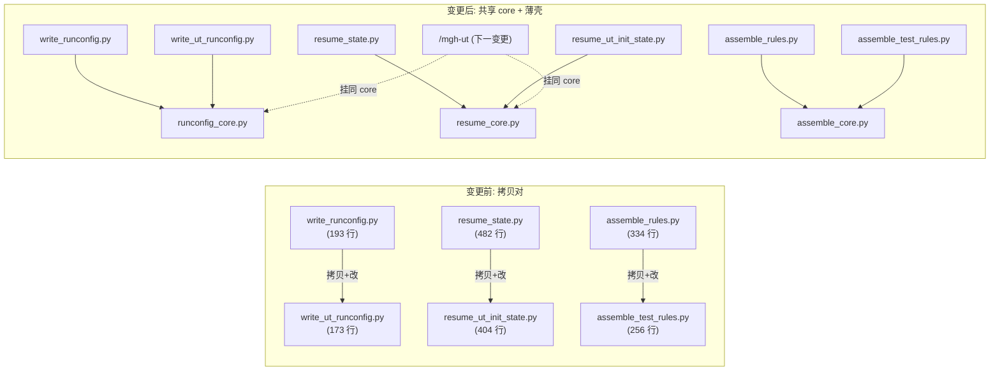

## Context

`mgh-init` / `mgh-ut-init` 三对叶脚本是**拷贝关系**:ut-init 版拷贝 init 版后改 flag/schema/step-graph,
既有 ~40–70% 逐字重复(`assemble_test_rules` 经 review 称 72% 重复 `assemble_rules`)。P1 的 F10 把「抽
共享 helper」暂缓,明示「待 `/mgh-ut` 出现第 2 个 ut 消费者时再评估」——因为抽共享必然**行为保持地碰
init 脚本**(跨命令回归面),而当时只有 1 个 ut 消费者、时机未到。

本变更实现 F10:抽 3 个共享 helper 模块,`mgh-init` 与 `mgh-ut-init` 行为**字节级一致**(`--help` 契约面、
stdout JSON、退出码、产物路径不变),并让 `/mgh-ut`(下一个变更)能挂同一批 core 做第 3 个消费者。

利益相关方:① 维护者(要消重复、要行为保持、要为新命令铺路);② `mgh-init` 既有使用者(零感知);
③ `mgh-ut-init` 使用者(零感知);④ `/mgh-ut` 实现者(要能挂 `runconfig_core`/`resume_core`)。

**共享 vs 命令专属边界**(抽什么、留什么)——每个叶脚本保留**argparse 定义**(`--help` = CLI 契约面,
R5.1 逐字不变)、**run_config/schema 装配**、**step-graph 推断**(resume 的 `resolve()`)、**BLOCK 标记 +
FORBIDDEN_TOKENS + 惰性文案**(assemble);core 只收**纯函数**:字节解析 / 原子写 / UTF-8 reconfigure /
run-dir 解析 / marker 计数 / 终态判定 / 索引块组装 / 纯净 lint 骨架。这让 core 对第 3 消费者(ut 的
`.mgh-ut` run-dir)中立,且行为保持是「结构性」的(纯函数移动不改契约面)。

## Goals / Non-Goals

**Goals:**
- 3 个共享 helper 模块(`runconfig_core.py`/`resume_core.py`/`assemble_core.py`),sibling-import 复用。
- 六个叶脚本改导 core,`--help` 逐字不变(stdout/退出码/产物路径不变)。
- 既有回归测 + 三项 lint(契约/纯净/零依赖)全绿;新增共享-归属回归测。
- `runconfig_core`/`resume_core` 签名对第 3 消费者(`.mgh-ut`)中立(不绑定 init/ut-init 专属 flag 名)。
- 版本号 bump。

**Non-Goals:**
- **不**改 mgh-init / mgh-ut-init 的可观测行为(产物 / 退出码 / 路径 / 输出 schema)。
- **不**合并两命令(不把 `write_ut_runconfig` 并进 `write_runconfig`;命令专属 flag/schema 留各脚本)。
- **不**预抽 `list_*` 枚举脚本族 / ack 契约 / hook 守卫(它们已足够薄,且 `list_*` 脚本间差异大)。
- **不**实现 `/mgh-ut`(下一变更;本变更只保证 core 可挂)。
- **不**新增任何 pip 依赖。

## Decisions

### D1 — 抽 3 个「纯函数 core」,叶脚本保留 argparse/schema/step-graph(行为保持的结构性来源)

- **选择**:按「run-config / resume / assemble」三个领域各建一个共享模块,只收**纯函数**;六个叶脚本
  import core、删除各自重复实现。argparse 定义(含 `--help` 文案)、run_config schema 装配、resume 的
  `resolve()` step-graph、assemble 的 BLOCK/FORBIDDEN_TOKENS 文案 **全部留在叶脚本**。
- **理由**:`--help` 是 R5.1 契约面——把 argparse 移进 core = 契约面漂移,违反行为保持;纯函数移动是
  「结构性」行为保持(core 是叶脚本的内部实现细节,调用方只看 `--help`/stdout/退出码)。按领域分 3 个
  core 而非 1 个大杂烩,命中「按域分文件」纪律、安装/镜像零分发改动(承 R4/R5.6)。
- **备选(否决)**:
  - 把两个 write_*runconfig 合并成一个参数化脚本(加 flag 开关选 schema)——否决:argparse 契约面会混
    两个命令的 flag,`--help` 漂移;且 run_config schema 差异大,合并=加塞分支、不消重。
  - 只抽一个 `atomic_write_json` 之类最小 helper——否决:治标不治本,F10 要的是三对消重复。

### D2 — sibling-import 复用(core 模块与叶脚本同目录,`sys.path.insert` 前例)

- **选择**:core 模块放 `core/scripts/` 与叶脚本同目录;叶脚本顶部已惯用
  `sys.path.insert(0, str(Path(__file__).resolve().parent))`(自包含,任意 cwd 可跑),直接 `from
  runconfig_core import ...`。core 模块自身也是自包含纯函数(无兄弟 import 或仅标准库)。
- **理由**:已有先例(`merge_scout → discover_controls`、`chunk_sources → expand_scope`),零依赖 AST 扫描
  已允许兄弟导入(`tests/test_zero_deps.py` 显式放行 sibling)。镜像(`install.sh` 拷 `core/scripts/` →
  `.claude/mgh-core/scripts/`)整目录走,core 自动随镜,无分发改动。
- **备选(否决)**:core 模块放 `core/` 上层目录——否决:破坏叶脚本「单目录自包含」,`sys.path` 更复杂,
  镜像规则要改。

### D3 — 共享归属回归测 + 漂移防线

- **选择**:新增 `tests/test_shared_helpers.py` 或扩既有测试,断言:① 六个叶脚本 `--help` 含各自
  既有 flag(契约面未漂);② core 模块函数确实被 import(如 `write_runconfig`/`write_ut_runconfig`
  均 `from runconfig_core import atomic_write_json` 而非各自定义);③ 既有回归测全绿。
- **理由**:抽共享后最怕「core 与叶脚本内部逻辑不一致」或「又退化成内联」。显式断言 import 归属 +
  行为保持,把 F10 的「drift 风险」从单测兜底升级为结构兜底。
- **备选(否决)**:只靠既有单测——否决:既有测断言行为、不断言归属,drift 风险仍在。

### D4 — core 签名对第 3 消费者(`.mgh-ut`)中立

- **选择**:`runconfig_core` 的 run-dir 解析、`resume_core` 的 marker/终态判定**不绑定** `.mgh-init`/
  `.mgh-ut-init` 名字(接收 `run_root`/`checkpoints_dir` 参数);`assemble_core` 的索引块/ lint 接收
  BLOCK 标记 + FORBIDDEN_TOKENS + 惰性文案参数。
- **理由**:`/mgh-ut`(下一变更)需要 `.mgh-ut` run-dir 的同款 run-config 写 + resume 推断 + 可能的
  产物组装;core 中立 = 新命令零重写。若 core 绑死 init/ut-init 名字,第 3 消费者又要拷贝,消重复落空。
- **备选(否决)**:core 绑定 init 专名——否决:第 3 消费者无法复用,抽共享失去意义。

## Risks / Trade-offs

- **[抽共享碰 init 脚本,回归面跨命令]** → 行为保持是结构性(argparse/契约面不动);既有回归测
  (`test_write_runconfig.py`/`test_resume_state.py`/`test_assemble_rules.py`)+ `test_init_runtime.py` 兜底;
  新 `test_shared_helpers.py` 断言 `--help` 契约面未漂。
- **[core 与叶脚本内部逻辑 drift]** → 共享归属回归测(import 断言)+ 叶脚本只 import、不再内联;core
  改动要过全部消费方测试。
- **[core 命名与既有 `list_*`/`*_core` 无冲突]** → 仓库暂无 `*_core.py`;命名冲突在 CI(零依赖 glob
  扫全部 `core/scripts/*.py`)即爆。
- **[过度抽取 / 空 core]** → 每个 core 至少被 2 个叶脚本消费(F10 的消重复目标),无孤儿 core;`--check`
  等一次性片段留在叶脚本。
- **[`/mgh-ut` 尚未实现,core 中立性只有 spec 无实消费]** → 本变更是 P0→P1 式的「先铺路」;core 接口
  按「第 3 消费者需求」(`.mgh-ut` run-dir、diff-unit 的 checkpoint/marker)显式设计,spec 场景断言签名
  中立。

## Migration Plan

1. 建 `core/scripts/runconfig_core.py`:移入 `_parse_bytes`/`_atomic_write_json`/UTF-8 reconfigure/run-dir
   解析(签名接收 `run_root` 参数);`write_runconfig.py`/`write_ut_runconfig.py` 改 `from runconfig_core
   import ...`,删除本地重复定义。
2. 建 `core/scripts/resume_core.py`:移入 marker 计数/终态判定/`_both_marker_violations`/`_next`/
   `_empty_tiers`/`_load_json`/`_run_config`(接收 `checkpoints_dir`/`run_root`);`resume_state.py`/
   `resume_ut_init_state.py` 改 import,step-graph `resolve()` 留各脚本。
3. 建 `core/scripts/assemble_core.py`:移入索引块组装/纯净 lint/legacy-block 清理(接收 BLOCK 标记 +
   FORBIDDEN_TOKENS + 惰性文案);`assemble_rules.py`/`assemble_test_rules.py` 改 import。
4. 改壳/README 若涉及内部路径则核对(一般不动,`--help`/调用行不变)。
5. 扩测:共享归属断言 + 契约 lint(双壳调用 flag 仍在 `--help`);跑全套回归 + 三项 lint;bump 版本号;
   `install.sh` 自检 fail-soft。
6. **回滚**:core 模块是纯新增、叶脚本是「删重复定义 + 加 import」;git revert 单变更即可,产物 schema
   无变化;core 文件删除后叶脚本回退原状。

## Open Questions

- `assemble_core` 的 BLOCK 标记/FORBIDDEN_TOKENS 参数化边界:迁移多少个内联段进 core(索引块组装 vs
  完整 `_opencode`/`_claude` main)——实现 step 3 按「行为保持 + 消重复最大」裁剪。
- `runconfig_core` 是否连 ack 发射(print JSON)一起抽——倾向抽(两脚本 ack 形状仅字段略异),实现时以
  `--help`/stdout 逐字不变为准。
- `resume_core` 的 `_run_config`(读 run_config.json)与 `_load_json` 是否合并——实现时按两脚本当前签名
  对齐。
