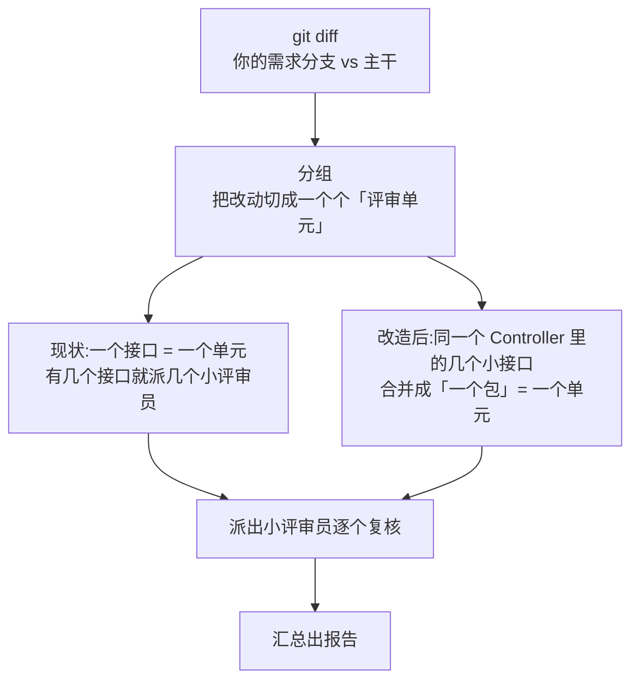

# 实验手册:数一数「打包」到底能省多少调用

> **受众:人类。** 这份手册假设你**完全没有**本项目背景,也不需要懂任何内部机制。
> 你只负责**照着做 + 把原始数据交回来**;所有算术由我(执行这个改造的人)来做。
> 你不需要自己算 `M`、`P`、`U`、`T`,也不需要判断该不该做。

---

## 1. 先讲清楚:这个实验在回答什么问题

### 1.1 一个比喻:小巴接人

想象你开一辆小巴,专门接送检查员去各个办公楼查安全。

- **每接一趟,不管接几个人,都要先发动、热车、开到楼下** —— 这块钱省不掉。
- 现在的做法是「**一个人也叫一趟车**」。检查员一多,油全烧在发动和路上了,真正查东西的时间没多少。
- 想改成「**拼车**」:同一栋楼里的几个检查员,一趟车全接走,发动一次就够了。

改拼车要动调度表、要改流程,是有代价的。所以先算清楚:**到底能省多少油?省得少就不值得改。**

### 1.2 换成这个项目里的话

我们要派「小评审员」(AI)去逐个检查代码改动。每派一个,他都要走一遍**固定流程**:

```
上车(开一次对话) → 领任务单 → 看材料 → 写结论 → 交回执
```

这 5 步每一步都要向 AI 问一次话,**每次问话都算 1 次调用**。

- **现状**:改动里有几个接口,就派几个小评审员。接口往往很小,于是大部分调用都烧在
  「上车 / 领任务单 / 交回执」这些**和接口大小无关的固定动作**上。
- **想做的改造**:把**同一个 Java 文件(同一个 Controller)**里的几个小接口,一趟派一个人全看完,
  固定动作只付一次。

### 1.3 为什么不能靠「同时多开几路」解决

你们内网的 AI 网关是**按调用次数限流**的(实测背景:每 10 分钟 100 次)。

同时多派几个人**不会让配额变大**,只会让大家一起撞墙然后集体失败重来。
所以唯一的办法是**少派几趟**——这正是「拼车」要干的事。

### 1.4 一张图:这次改造长什么样



上图里每个环节都对应一个要量的数:

| 量 | 看图中的哪一步 | 怎么得到 |
| --- | --- | --- |
| **M** | 「分组」之后有几个单元 | 你跑完评审,我读产物文件得到 |
| **P** | 「改造后」变成几个包 | **我离线复算**(不需要额外跑评审) |
| **U** | 「派出小评审员」这一步,一个人烧几次调用 | 从网关记录里数 |
| **T** | 整条链路一共烧几次调用 | 从网关记录里数 |

### 1.5 四个数字是什么意思

| 记号 | 名字 | 大白话 | 谁提供 |
| --- | --- | --- | --- |
| **M** | 单元数 | 一场评审平均要派出几个「小评审员」 | 你跑完评审后我读文件得到 |
| **P** | 包数 | 改成拼车后,一场评审变成几趟车 | **我算**(拿 M 那次的数据离线复算) |
| **U** | 单趟固定开销 | 一个小评审员从头到尾烧几次调用 | 从网关记录里数 |
| **T** | 总调用数 | 一场评审从头到尾一共烧几次调用 | 从网关记录里数 |

### 1.6 裁判标准

```
          (M − P) × U
          ───────────  ≥  20%
                T
```

**人话**:`(能少派的趟数) × (每趟省下的固定开销) ÷ (一场评审总共烧的调用)`
= **打包能省下的调用,占全部调用的比例**。

- **≥ 20%** → 值得做,我继续把这个改造实现出来。
- **< 20%** → 不值得,我只写一份结论记录,然后把这个改动方案整个归档,**一行代码都不改**。

> 为什么定 20% 而不是「接口数超过 10 个就做」?
> 因为**接口数本身不是收益**。一场只有 6 个接口、但每个接口都要反复读大文件的评审,
> 可能比一场 30 个接口的评审省得更多。用**比例**才反映真实收益。

---

## 2. 动手之前,你要准备什么

| # | 要准备的东西 | 说明 |
| --- | --- | --- |
| 1 | 一台能连**你们公司 AI 网关**的电脑 | 评审过程要反复问 AI,断网/用不了网关就没法做 |
| 2 | **3 个真实的业务仓库** | 不要用演示仓、示例仓、玩具项目。必须是真在业务的代码库 |
| 3 | 每个仓库上一个**真实的需求分支** | 分支里**必须有 Java 接口(Controller)的改动**。纯配置/纯 SQL 改动的分支做不了这个实验 |
| 4 | 网关后台的**查看或导出权限** | 能看到「哪段时间调用了多少次 AI」的界面 |
| 5 | 把工具装进这 3 个仓库 | 一次性操作,见 3.1 |

> **3 次怎么凑**:3 个不同的仓库各跑一次,或者同一个仓库的 3 个不同需求分支各跑一次。
> 都可以。关键是「真实的业务代码 + 真实的需求分支」。

---

## 3. 实验步骤

### 3.1 一次性:把工具装进业务仓库

在**这个工具仓库**(m3g4horness 所在的目录)里执行:

```bash
./install.sh --claude <业务仓库A的绝对路径>
```

> 如果你们用的是 opencode 而不是 Claude Code,把 `--claude` 换成 `--opencode`。

装完,`<业务仓库A>/.claude/` 目录下会多出 `mgh-core/` 等一堆东西(opencode 则是 `.opencode/`)。
**这一步不改你的任何业务代码。**

三个仓库都要装一遍(第 2、3 次把路径换掉即可)。

### 3.2 跑之前:记下开始时间

看表,**记到一个能分辨分钟的格式**,例如:

```
开始时间:2026-09-18 14:05
```

> 为什么要记时间?因为等下要去网关后台,**按这段时间**把调用记录捞出来。
> 记不准就多留点余量(前后各多算 5 分钟),我拿到数据后会自己判断。

### 3.3 跑评审

```bash
py <业务仓库A>/.claude/mgh-core/scripts/mgh_sdr_launch.py --repo <业务仓库A的绝对路径> --base master
```

三个参数怎么填:

| 参数 | 填什么 |
| --- | --- |
| `--repo` | 业务仓库的**绝对路径**,例如 `C:\work\order-service` |
| `--base` | 主干分支名。默认 `master`;你们叫 `main` 或 `develop` 就换成对应的 |
| `--branch` | **不用填**。不填 = 用你当前所在的那个需求分支 |

> opencode 用户路径同形,把 `.claude` 换成 `.opencode`。
>
> **跑起来会花多久?** 接口多的分支,**以小时计是正常的**。跑的过程中屏幕上会持续打印心跳行
> (`inflight=... unit=... done=...`)—— **有心跳就说明在跑,不是卡死**,别中断它。
>
> **中途能不能停?** 不行就重跑同一条命令即可,已经跑完的单元会自动跳过,不会白烧调用。

### 3.4 跑完:记下结束时间,并留下产物

```
结束时间:2026-09-18 16:40
```

跑完后,这个目录下会有一个文件:

```
<业务仓库A>/.mgh-sdr/runs/<时间戳>/grouping.json
```

**把这个 `grouping.json` 整个复制出来**(复制到你自己的一个文件夹里,三个仓库分别命名,
例如 `A-grouping.json`、`B-grouping.json`、`C-grouping.json`)。

> 你可能还会在**业务仓库根目录**看到一个 `mgh-sdr-<分支名>-<时间戳>.md` 的人读报告。
> 那个**不用交**,交 `grouping.json` 就行。

### 3.5 去网关后台,把这段时间的调用记录捞出来

打开你们内网 AI 网关的后台/控制台,找到「调用记录 / 请求日志 / 用量统计」这类页面,
把**开始时间 ~ 结束时间**这段的记录捞出来。

按能力从高到低,三选一:

| 情况 | 你要做的 | 交付物 |
| --- | --- | --- |
| **能导出** | 导出成 Excel / CSV | 直接发我导出文件 |
| **能翻页看到明细** | 翻到底,数总条数;再随便挑**一小段连续记录**数条数 | 填第 5 节的表 |
| **只能看到总数** | 记下这段时间的总调用条数(或者跑前跑后各看一次,取差值) | 填第 5 节的表 |

> 「**调用记录**」指的是每次向 AI 发一次请求就产生一条的那种记录。
> 网关的界面五花八门叫法不同,常见的有:请求日志、调用明细、API 日志、Tokens 用量明细。
> 只要一条记录对应一次 AI 请求,就是我要的那个。

### 3.6 把第 3.2 ~ 3.5 步重复 3 遍

换仓库 B、仓库 C 再来一遍(装工具、记时间、跑评审、交 `grouping.json`、捞网关记录)。

**3 次是最低要求。** 多跑几次更好(结果更稳),但**别少于 3 次**。

---

## 4. 如果网关那边卡住了

### 4.1 完全没有查看权限

找网关的管理员,要一段时间的「请求日志导出」。把你记的起止时间给他就行。

### 4.2 有明细,但不知道「一个单元烧了几次调用」怎么数

**情况 A:记录里有「会话 ID / Conversation ID / Thread ID」这一列** —— 最简单。
同一个 ID 归成一组,**数一组的条数**就是一次小评审的开销。

**情况 B:只有时间戳** —— 用「时间空档」切:

1. 把这段记录按时间排序。
2. 相邻两条之间如果**隔了一大段**(比如超过 30 秒),通常就是换了一个小评审员。
3. 数其中一小簇有几条。

> 判断依据:一个小评审员的调用是**连续快速**发生的(几秒到十几秒一条);
> 两个小评审员之间,中间通常有一段空档(上一个写完了、下一个才开出来)。

### 4.3 连明细都看不到,只能看到总数

那也行 —— 把 `T`(一场评审的总调用数)给我就行,`U` 我另有办法估。
**但请在做记录时标注一句「只有总数,没有明细」**,我会在结论里如实写明这个数据的可靠性打了折。

### 4.4 网关这段时间还有别的项目在用

尽量选**只有这次评审在跑**的时间段(比如下班后、或者提前跟同事打招呼)。
如果实在避不开,把「同时还有谁在用」记一句,我一并在结论里标注。

---

## 5. 要交回来的东西

### 5.1 清单一览

| # | 东西 | 形式 |
| --- | --- | --- |
| 1 | 3 个 `grouping.json` | 文件(从各次 run 目录里复制出来) |
| 2 | 3 组「起止时间 + 网关调用记录」 | 导出的 Excel/CSV,或填下面的表 |
| 3 | 一句备注 | 见 5.3 |

### 5.2 填空表(每组一次,共 3 组)

```
──────────────────────  第 1 组  ──────────────────────
仓库名:                  
需求分支名:              
主干分支名(base):        
开始时间:                (YYYY-MM-DD HH:MM)
结束时间:                (YYYY-MM-DD HH:MM)
网关这段时间的总调用条数(T):
网关记录里数出的「一个小评审员的调用条数」(U):
这一段的明细我能不能导出:  能 / 不能(只能看到总数)
grouping.json 文件名:     

──────────────────────  第 2 组  ──────────────────────
(同上)

──────────────────────  第 3 组  ──────────────────────
(同上)
```

### 5.3 另外给我一句备注

- 跑的时候,你们网关**是不是还有别的项目在同时用**?
- 跑的过程中有没有**中断过 / 报错过 / 你手动重跑过**?
- 这个仓库**之前跑过安全控制扫描**吗(业务仓库根目录下有没有 `.mgh-init/` 目录)?
  —— 有的话评审质量更接近真实场景,没有也能做这个实验。

---

## 6. 常见坑

| 坑 | 后果 | 怎么办 |
| --- | --- | --- |
| 用了演示仓 / 临时造的分支 | 数据不真实,做不了判断 | 必须是真业务仓 + 真需求分支 |
| 分支里没有 Java 接口改动 | 切不出接口单元,实验做不了 | 换一个改了 Controller 的分支 |
| 忘记录开始时间 | 捞不出这段时间的网关记录 | 宁可多记,前后各留 5 分钟余量 |
| 看跑太久就中断了 | 这一趟白跑 | 有心跳就说明在跑;中断了就重跑同一条命令,已完成的会自动跳过 |
| 网关里混进了别人的调用 | `T` 偏大,省的比例被低估 | 尽量挑没人用的时段;避不开就记一句备注 |
| 只跑 1~2 次就交 | 样本太少,判据不稳 | 最少 3 次 |

---

## 7. 收到数据后我会做什么(你不用做)

1. 从 3 份 `grouping.json` 里读出各次的**接口单元数**,取**中位数**当 `M`。
2. 挑**最接近中位数**的那一次,把它每个单元的大小拿出来,**离线复算**改成拼车后会有几个包 `P`。
3. 用你给的 `U`、`T`,套 1.6 节的公式算出比例。
4. 裁决:
   - **≥ 20%** → 我把这个改造实现出来(打包功能默认关闭,不传参数时行为零变化),
     之后再拿**同一份改动**在「关 / 开」两种配置下各跑一遍,核对报告覆盖面一致、
     并对比两次的实际调用数,回收实测节省比例。
   - **< 20%** → 我写一份结论记录(样本、四个数字、算式、结论),**不改任何代码**,
     这个改造方案归档。
   - **如果 3 次里有 1~2 次数据缺失 / 明显被污染** → 我会在结论里标出来,并告诉你还缺什么。

> **诚实提醒**:这场实验测的是「**调用次数**」,不是「评审质量」。
> 拼车会让一个小评审员一次看到更多内容,**复核的细致程度有可能下降**。
> 这一点我会在最终报告里如实披露,并且做成**默认关闭的开关** —— 不用就不受影响。
